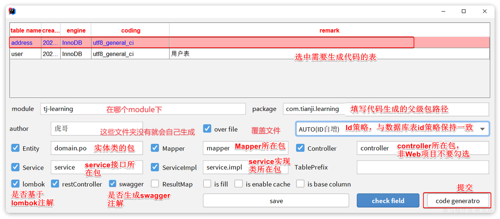

MybatisPlus插件，直接从数据库生成po类、mapper、service、controller



## CRUD UserController

- 增 `saveUser`
- 删 `deleteUserById`
- 查 `queryUserById`
- 查所有 `queryUserByIds`
- 改 `updateUser`
- 带条件查询 `queryUsersByCondition`
- 带条件更新 `deductBalance`
- 批量操作 `addUsers` 
- 自定义sql + 多表关联 `querySelfDefined`
- 循环依赖 `queryUserWithAddressById`

## 逻辑删除 AddressController

在表中添加一个字段标记数据是否被删除，从而不删记录
- 当删除数据时把标记置为true 
- 查询时过滤掉标记为true的数据 

```sql
alter table address add deleted bit default b'0' null comment '逻辑删除';
update address set deleted = 1 where id = ? and deleted = 0
select * from address where deleted = 0
```

缺点：不如把数据迁移到其它表的办法
- 会导致数据库表垃圾数据越来越多，从而影响查询效率
- SQL中全都需要对逻辑删除字段做判断，影响查询效率

mybatis-plus提供简化操作：
1. 给Address实体添加deleted字段 `private Boolean deleted;` 对应数据库字段`deleted`
2. 开启配置
    ```yml
    mybatis-plus:
      global-config:
        db-config:
          logic-delete-field: deleted # 全局逻辑删除的实体字段名
          # logic-delete-value: 1 # 逻辑已删除值(默认为 1)
          # logic-not-delete-value: 0 # 逻辑未删除值(默认为 0)
    ```
3. 正常操作crud，就像没有一样，由mp自动处理底层sql逻辑。`addressService.removeById(59L);`

