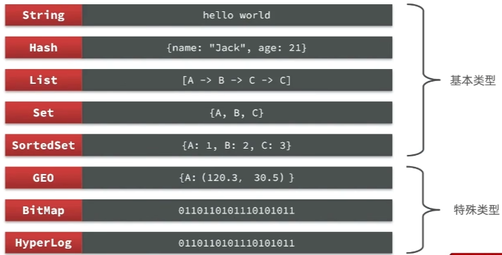

- [1. Jedis和Lettuce](#1-jedis和lettuce)
  - [1.1. 直接创建Jedis](#11-直接创建jedis)
  - [1.2. 连接池](#12-连接池)
- [2. SpringDataRedis客户端](#2-springdataredis客户端)
  - [依赖配置](#依赖配置)
  - [2.1. 默认序列化 RedisTemplate](#21-默认序列化-redistemplate)
  - [2.2. 自定义序列化 RedisTemplate](#22-自定义序列化-redistemplate)
  - [2.3. StringRedisTemplate](#23-stringredistemplate)

---

Jedis的官网地址： https://github.com/redis/jedis

在Redis官网中提供了各种语言的客户端，地址：https://redis.io/docs/clients/

其中Java客户端也包含很多：



- Jedis和Lettuce：这两个主要是提供了Redis命令对应的API，方便我们操作Redis
- SpringDataRedis又对这两种做了抽象和封装，因此我们后期会直接以SpringDataRedis来学习。
- Redisson：是在Redis基础上实现了分布式的可伸缩的java数据结构，例如Map、Queue等，而且支持跨进程的同步机制：Lock、Semaphore等待，比较适合用来实现特殊的功能需求。

## 1. Jedis和Lettuce

引入依赖：

```xml
<!--jedis-->
<dependency>
    <groupId>redis.clients</groupId>
    <artifactId>jedis</artifactId>
    <version>3.7.0</version>
</dependency>
```

两种方式：
- 直接创建Jedis：Jedis本身是线程不安全的，并且频繁的创建和销毁连接会有性能损耗
- 推荐使用Jedis连接池代替Jedis的直连方式。

### 1.1. 直接创建Jedis

[JedisDirectConnection](../jedis/src/main/java/com/sword/jedis/JedisDirectConnection.java)
### 1.2. 连接池

[JedisPoolConnection](../jedis/src/main/java/com/sword/jedis/JedisPoolConnection.java)
## 2. SpringDataRedis客户端

SpringDataRedis中提供了RedisTemplate工具类，其中封装了各种对Redis的操作。并且将不同数据类型的操作API封装到了不同的类型中：官网地址：https://spring.io/projects/spring-data-redis
- 提供了对不同Redis客户端的整合（Lettuce和Jedis）
- 提供了RedisTemplate统一API来操作Redis
- 支持Redis的发布订阅模型
- 支持Redis哨兵和Redis集群
- 支持基于Lettuce的响应式编程
- 支持基于JDK、JSON、字符串、Spring对象的数据序列化及反序列化
- 支持基于Redis的JDKCollection实现


|序列化方式|特点|string|hash|
|-|-|-|-|
|默认序列化 RedisTemplate|JDK序列化|多余|多余|
|自定义序列化 RedisTemplate|将User通过Jackson序列化自动解析为json字符串|好|多余|
|StringRedisTemplate|将User手动解析为json字符串|好|好|


### 依赖配置

1. 引入依赖

    ```xml
    <!-- 公有 -->
    <!--redis依赖-->
    <dependency>
        <groupId>org.springframework.boot</groupId>
        <artifactId>spring-boot-starter-data-redis</artifactId>
    </dependency>
    <!--连接池依赖，jedis和lettuce的连接池都需要-->
    <dependency>
        <groupId>org.apache.commons</groupId>
        <artifactId>commons-pool2</artifactId>
    </dependency>
    ```
    ```xml
    <!-- 自定义序列化 -->
    <!--Jackson依赖: GenericJackson2JsonRedisSerializer内部要引入com.fasterxml.jackson-->
    <dependency>
        <groupId>com.fasterxml.jackson.core</groupId>
        <artifactId>jackson-databind</artifactId>
    </dependency>
    ```
    ```xml
    <!--Jackson依赖: ObjectMapper要用-->
    <dependency>
        <groupId>com.fasterxml.jackson.core</groupId>
        <artifactId>jackson-databind</artifactId>
    </dependency>
    ```

2. 设置redis配置文件。spring-boot-starter-data-redis 默认使用lettuce，如果想要使用jedis，还要额外引入jedis的依赖。

    ```yaml
    spring:
      redis:
        host: 192.168.101.65
        port: 6379
        password: redis
        # 默认0号数据库
        database: 13
        # 想要使用连接池，就必须在配置中指定，否则无效
        lettuce:
          pool:
            max-active: 8
            max-idle: 8
            min-idle: 0
            max-wait: 1000ms
    ```

3. 注入RedisTemplate。因为有了SpringBoot的自动装配，会根据yaml配置文件自动连接，我们可以拿来就用：

    ```java
    @Autowired
    RedisTemplate redisTemplate;
    ```
    ```java
    @Autowired
    StringRedisTemplate stringRedisTemplate;
    ```
### 2.1. 默认序列化 RedisTemplate

`ops.set("name", "Jackson")`中将`"name"`当成Object序列化（不止key，还有hashKey, value, hashValue），都使用`JdkSerializationRedisSerializer`，底层是jdk默认序列化`ObjectOutputStream`。

> 可读性差，内存占用较大
```
centos7:13>keys *
1) "name"
2) "\xAC\xED\x00\x05t\x00\x04name"

centos7:13>get \xAC\xED\x00\x05t\x00\x04name
"\xAC\xED\x00\x05t\x00\x07Jackson"
```

```
redis_hmdp:5>keys *
1) "\xAC\xED\x00\x05t\x00\x07person0"

redis_hmdp:5>get \xAC\xED\x00\x05t\x00\x07person0
"\xAC\xED\x00\x05sr\x00#com.sword.defalutserialization.User\x9E\xBDCA?\xE2\x08\xFE\x02\x00\x02L\x00\x03aget\x00\x13Ljava/lang/Integer;L\x00\x04namet\x00\x12Ljava/lang/String;xpsr\x00\x11java.lang.Integer\x12\xE2\xA0\xA4\xF7\x81\x878\x02\x00\x01I\x00\x05valuexr\x00\x10java.lang.Number\x86\xAC\x95\x1D\x0B\x94\xE0\x8B\x02\x00\x00xp\x00\x00\x00\x0Ct\x00\x04Anki"
```

虽然通过Java代码去修改，会序列化到正确的key名，但是会让控制台命令手动修改出现歧义。本来是修改redis中的`name` key，结果java修改的是 `\xAC\xED\x00\x05t\x00\x04name` key。

> 记录了序列化时对应的class名称，内存占用较大

`com.sword.defalutserialization.User`

> hash类型，还得修改对象代码

因为是用JDK序列化，所以还得实现序列化接口，`public class User implements Serializable`

### 2.2. 自定义序列化 RedisTemplate

1. 写config，自定义RedisTemplate Bean。
2. 使用重写的 redisTemplate。
    

整体可读性有了很大提升，并且能将Java对象自动的序列化为JSON字符串，并且查询时能自动把JSON反序列化为Java对象。

```
centos7:13>get name
""Jackson""
centos7:13>get person
"{"@class":"com.sword.selfdefinedserialization.User","name":"Tom","age":18}"
```
不过，其中记录了序列化时对应的class名称，目的是为了查询时实现自动反序列化。这会带来额外的内存开销。

### 2.3. StringRedisTemplate

统一使用String序列化器。当需要存储Java对象时，手动完成对象的序列化和反序列化，将其转化为Json字符串。

这种用法比较普遍，因此SpringDataRedis就提供了RedisTemplate的子类：StringRedisTemplate，它的key和value的序列化方式默认就是String方式。

```
centos7:13>get name
"Jackson"

centos7:13>get person
"{"name":"Tom","age":18}"
```

