- [1. 有哪些常见的 IO 模型?](#1-有哪些常见的-io-模型)
- [2. 阻塞 IO（BIO）](#2-阻塞-iobio)
- [3. 非阻塞IO](#3-非阻塞io)
- [4. IO 多路复用模型](#4-io-多路复用模型)
  - [4.1. select](#41-select)
  - [4.2. poll](#42-poll)
  - [4.3. epoll](#43-epoll)
  - [4.4. 调用总结](#44-调用总结)
- [5. 信号驱动](#5-信号驱动)
- [6. 异步IO（AIO）](#6-异步ioaio)

---
应用程序都是运行在用户空间。

只有内核空间才能进行**系统态**级别的资源有关的操作，比如文件管理、进程通信、内存管理等等。

用户进程通过 **系统调用** 来间接访问内核空间。

一切皆文件，文件就有文件描述符FD。设备是文件，socket是文件。

当应用程序发起 I/O 调用后，会经历两个步骤：
- 内核等待 I/O 设备准备好数据
- 内核将数据从内核空间拷贝的buff到用户空间的buff。

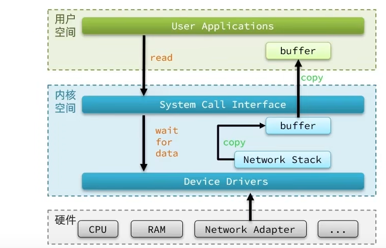

两阶段：
1. 等待内核从文件中读取数据，文件上数据迟迟没有到来（网络波动）。
2. 数据到达内核缓冲区，等待从内核缓冲拷贝到用户缓冲区。

## 1. 有哪些常见的 IO 模型?

UNIX 系统下， IO 模型一共有 5 种：阻塞 IO、非阻塞 IO、IO 多路复用、信号驱动 IO 和异步 IO。

前四种都是同步，只有最后一种是异步。判断标准是第二阶段是否阻塞的。

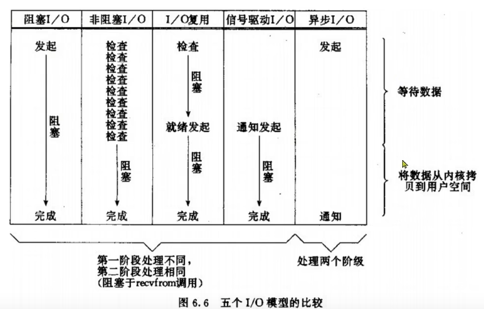

Java 中 3 种常见 IO 模型：
- BIO (Blocking I/O):阻塞 IO 模型 。
- NIO (Non-blocking/New I/O):IO 多路复用模型。
- AIO (Asynchronous I/O):异步 IO 模型

## 2. 阻塞 IO（BIO）

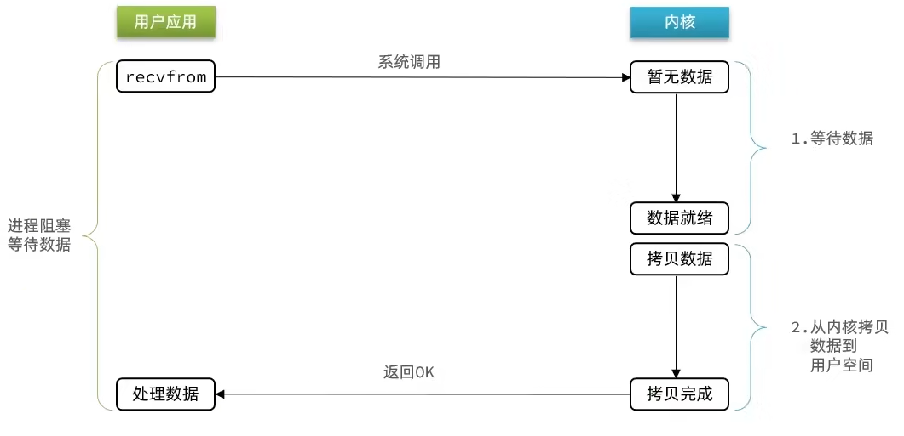

阻塞 IO 模型中，应用程序发起 read 调用后，会一直阻塞，直到内核把数据拷贝到用户空间。

低并发：在客户端连接数量不高的情况下，是没问题的。

## 3. 非阻塞IO

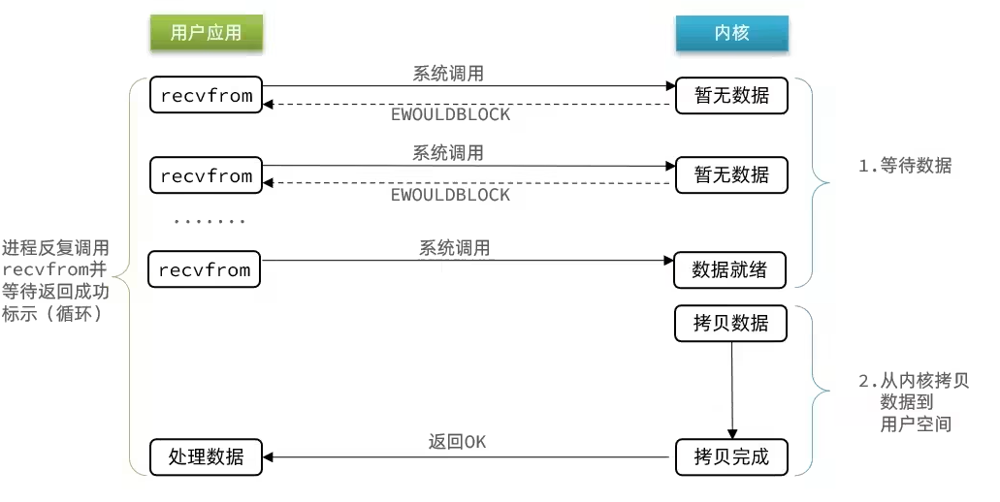

非阻塞IO的recvfrom操作会立即返回结果而不是阻塞用户进程，但会通过**轮询操作**一直发起 read 调用。当数据就绪，进入阻塞状态，等待数据从内核空间拷贝到用户空间。

区别：差别在于无数据时的处理方案
- 如果调用recvfrom时，恰好有数据，则用户进程可以直接进入第二阶段，读取并处理数据。两者都一样。
- 如果调用recvfrom时，恰好没有数据，阻塞IO会使CPU阻塞，非阻塞IO使CPU空转，都不能充分发挥CPU的作用。

存在问题：**轮询操作**十分消耗 CPU 资源的。

## 4. IO 多路复用模型

阻塞IO和非阻塞IO都是针对单个FD，而IO 多路复用模型监听多个FD，并在某个FD可读、可写时得到通知，从而避免无效的等待，充分利用CPU资源。

IO 多路复用模型中，线程首先发起 select/poll/epoll 调用，询问内核数据是否准备就绪，等内核把数据准备好了，用户线程再发起 read 调用。

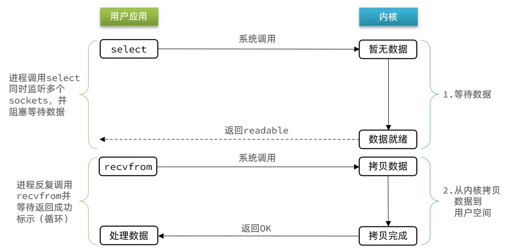

### 4.1. select

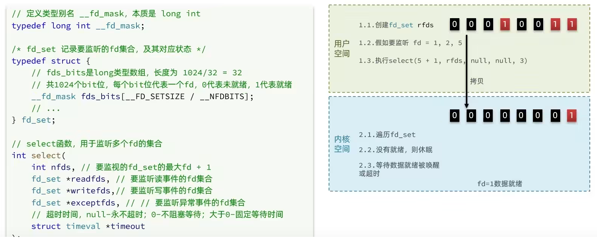

1. 用户空间中，要多个FD被封装入fd_set（每个bit位表示一个FD，最大有1024个bit），将监听的fd标注为1.
2. 执行select函数：将fd_set拷贝入内核空间；遍历fd_set；无就绪则休眠、就绪则唤醒、唤醒再遍历哪个就绪、将其他未就绪的清理为0；拷贝fd_set到用户空间。
3. 用户态只知道有fd好了，具体哪个还需要遍历fd。找到对应fd后发起read调用。

### 4.2. poll

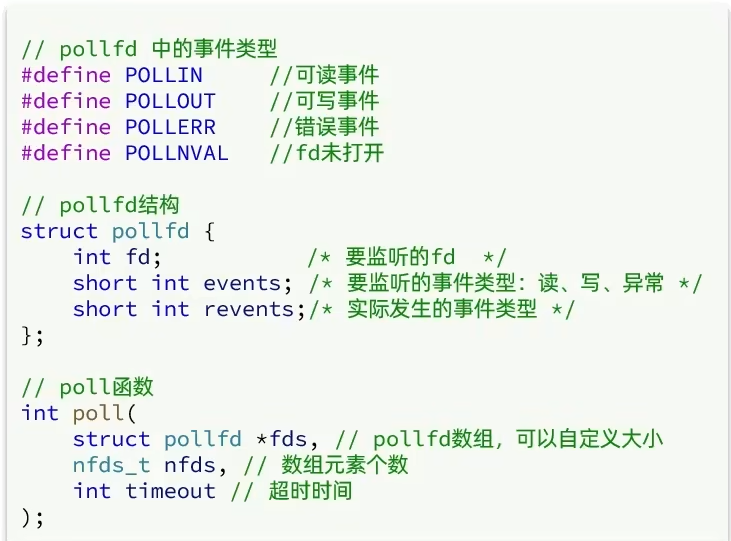

IO流程：

* 创建pollfd数组，向其中添加关注的fd信息，数组大小自定义
* 调用poll函数，将pollfd数组拷贝到内核空间，转链表存储，无上限
* 内核遍历fd，判断是否就绪
* 数据就绪或超时后，拷贝pollfd数组到用户空间，返回就绪fd数量n
* 用户进程判断n是否大于0,大于0则遍历pollfd数组，找到就绪的fd
### 4.3. epoll

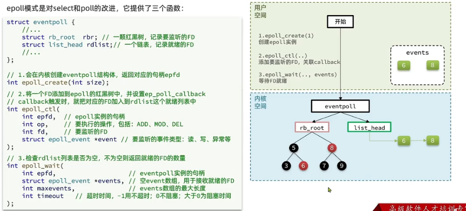

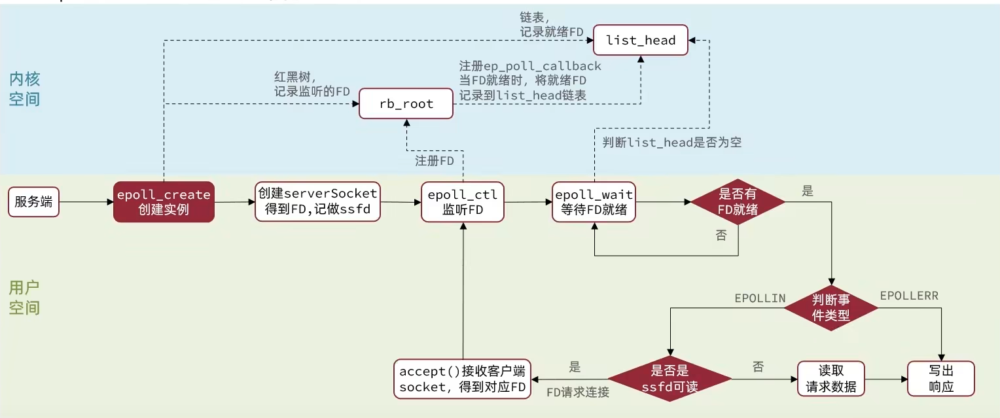
1. 服务端会去调用epoll_create，创建一个epoll实例，epoll实例中包含两个数据

    - 红黑树（为空）：rb_root 用来去记录需要被监听的FD
    - 链表（为空）：list_head，用来存放已经就绪的FD

2. 调用epoll_ctl函数，此函数会会将需要监听的数据添加到rb_root中去，并且对当前这些存在于红黑树的节点设置回调函数，当这些被监听的数据一旦准备完成，就会被调用，而调用的结果就是将红黑树的fd添加到list_head中去(但是此时并没有完成)

3. 调用epoll_wait函数，这个函数会去校验是否有数据准备完毕，在等待了一段时间后，如果有数据就绪，则进一步判断当前是什么事件，如果是建立连接事件，则调用accept() 接受客户端socket，拿到建立连接的socket，然后建立起来连接，如果是其他事件，则把数据进行写出。如果等够了超时时间，则返回没有数据。

### 4.4. 调用总结

- 可移植性
    
    几乎所有的操作系统都支持select，部分Unix系统支持poll，只有Linux操作系统支持epoll（linux 2.6 内核引入）

- 文件描述符的最大数量限制

    select受单个进程/线程可以打开的文件描述符数量限制，默认是1024个文件描述符。

    poll使用链表结构存储文件描述符，没有了select的文件描述符的最大数量限制，但还是有上限。

    epoll更是可以接入成千上万。

- 内存开销

    每次select调用时，文件描述符从用户区拷贝到内核区，遍历所有来检查就绪的文件描述符；select调用结束后，又从内核区拷贝到用户区。

    epoll只需要拷贝进内核区一次。使用一个epoll文件描述符管理多个被监听的文件描述符，将就绪的文件描述符拷贝到内核的就绪事件链表中。

- 时间复杂度

    epoll只会遍历就绪事件链表，而不是像select/poll一样遍历所有的O(n)。

- 内核态检测文件描述符就绪状态的方式：
   
   select、poll采用轮询方式，遍历所有的文件描述符状态是否就绪。而epoll采用回调方式，对文件描述符注册了回调函数，当文件描述符就绪时，会主动调用回调函数来放入就绪事件链表中。

- 其他

    select 对于超时时间提供了更好的精度：微秒，而 poll 和 epoll 都是毫秒级。

    poll相比select，优化编程接口，参数少了。

    select和poll的性能可能比epoll要好，epoll回调开销大。

适用场景：
- select、poll：适合在连接数少并且连接都十分活跃的情况下。
- epoll：适用在连接数很多，活跃连接较少的情况下。

---

JDK4引入。

支持面向缓冲的，基于通道的 I/O 操作方法。

对于高负载、高并发的（网络）应用，应使用 NIO。

Java 中的 NIO ，有一个非常重要的选择器 ( Selector ) 的概念，也可以被称为 多路复用器。通过它，只需要一个线程便可以管理多个客户端连接。当客户端数据到了之后，才会为其服务。

## 5. 信号驱动

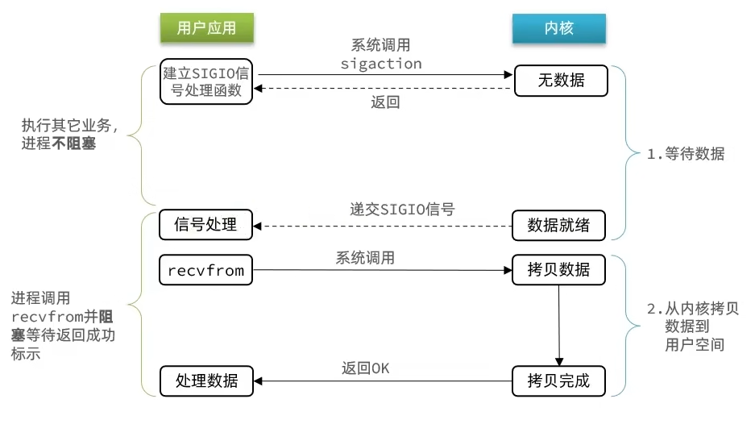

信号驱动IO是与内核建立SIGIO的信号关联并设置回调，当内核有FD就绪时，会发出SIGIO信号通知用户发read调用，期间用户应用可以执行其它业务，无需阻塞等待。

当有大量IO操作时，信号较多，SIGIO处理函数不能及时处理可能导致信号队列溢出，而且内核空间与用户空间的频繁信号交互性能也较低。
## 6. 异步IO（AIO）

异步 IO 是基于**事件和回调机制**实现的。
- 应用发起aio_read，之后会直接返回，不会堵塞在那里。
- 数据就绪后，内核自己拷贝数据到用户空间，然后直接通知相应的线程进行回调处理已拷贝好的数据。

用户进程在两个阶段都是非阻塞状态。

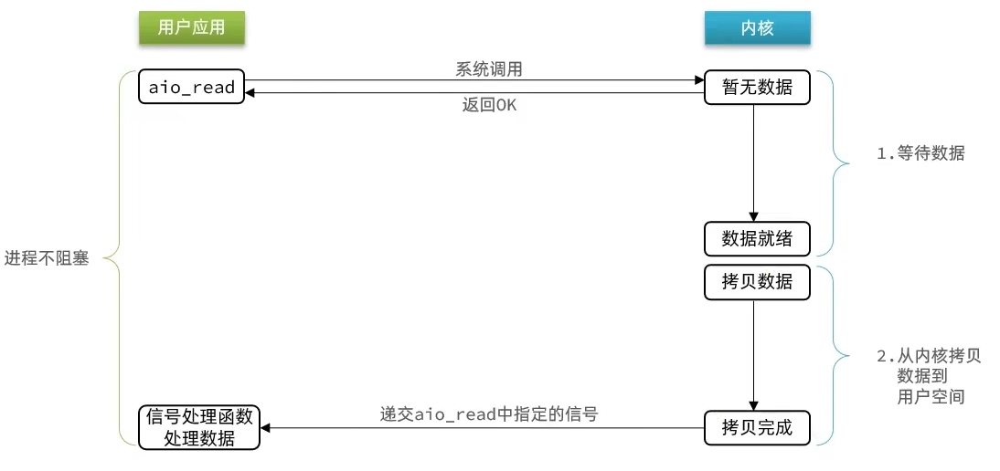

JDK7引入。