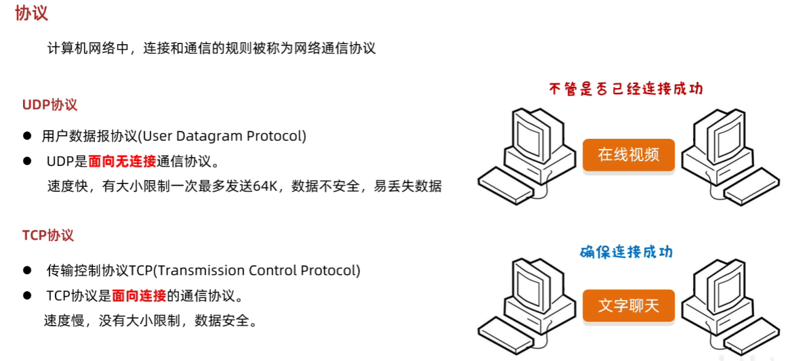
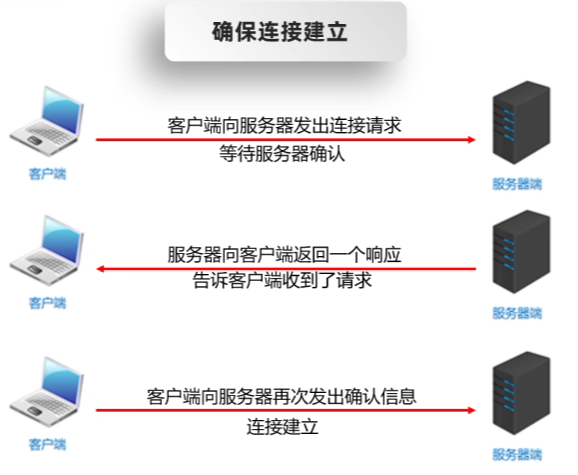
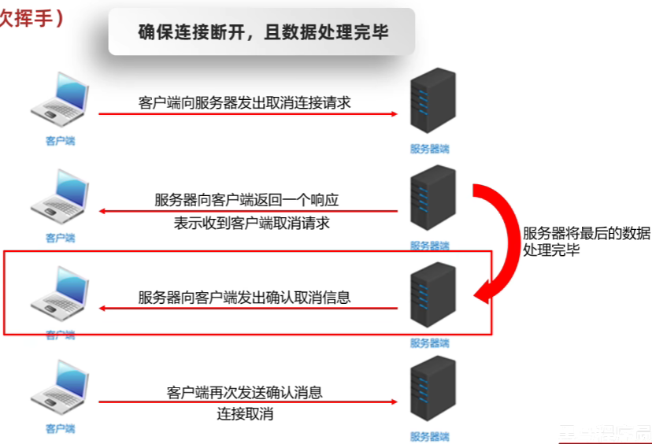

## 1. 协议

计算机网络中，连接和通信的规则被称为网络通信协议

### 1.3. 传输层协议

- UDP协议

  - 用户数据报协议(User Datagram Protocol)
  - UDP是**无连接**通信协议，即在数据传输时，数据的发送端和接收端不建立逻辑连接。简单来说，当一台计算机向另外一台计算机发送数据时，发送端不会确认接收端是否存在，就会发出数据，同样接收端在收到数据时，也不会向发送端反馈是否收到数据。
  - 由于使用UDP协议消耗系统资源小，**通信效率高**，所以通常都会用于音频、视频和普通数据的传输
  - 应用：不用保证数据的完整性，偶尔丢失一两个数据包也不影响。在线视频、视频会议、直播、语音通话。

- TCP协议

  - 传输控制协议 (Transmission Control Protocol)

  - TCP协议是**面向连接**的通信协议，即传输数据之前，在发送端和接收端建立逻辑连接，然后再传输数据，它提供了两台计算机之间可靠无差错的数据传输。在TCP连接中必须要明确客户端与服务器端，由客户端向服务端发出连接请求，每次连接的创建都需要经过“三次握手”

  - 三次握手。
  
    
    
    TCP协议中，在发送数据的准备阶段，客户端与服务器之间的三次交互，以保证连接的可靠

    第一次握手，客户端向服务器端发出连接请求，等待服务器确认

    第二次握手，服务器端向客户端回送一个响应，通知客户端收到了连接请求

    第三次握手，客户端再次向服务器端发送确认信息，确认连接

    完成三次握手，连接建立后，客户端和服务器就可以开始进行数据传输了。由于这种面向连接的特性，TCP协议可以**保证传输数据的安全**。
  - 四次挥手。
  
    

  - 应用：保证数据的完整性。下载软件、文字聊天、邮件、浏览网页
### 传播

- 单播

  单播用于两个主机之间的端对端通信

- 组播

  组播用于对一组特定的主机进行通信

  `224.0.0.0~239.255.255.255`，其中`224.0.0.0~255`为预留的组播地址。

- 广播

  广播用于一个主机对整个局域网上所有主机上的数据通信。

  广播地址`255.255.255.255`