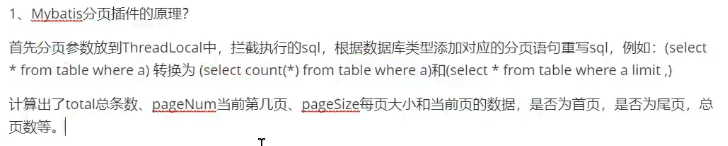
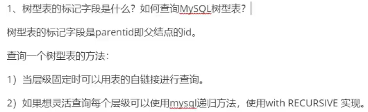
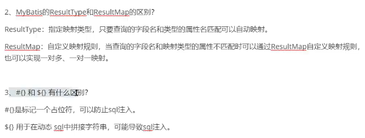
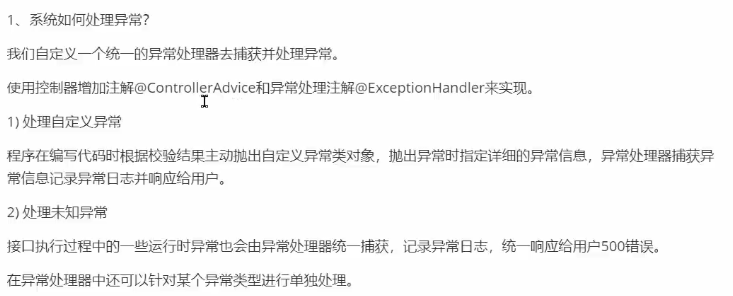
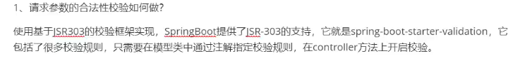
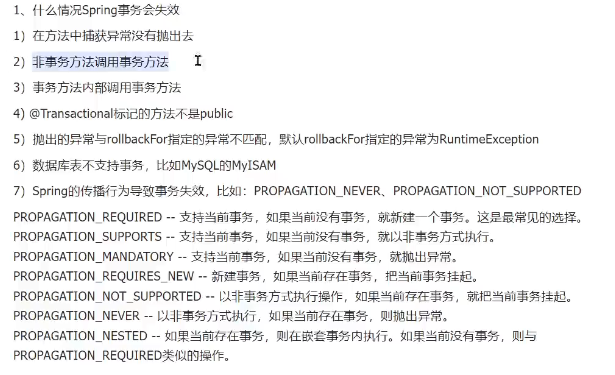
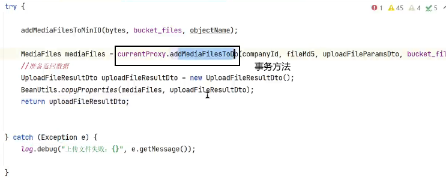
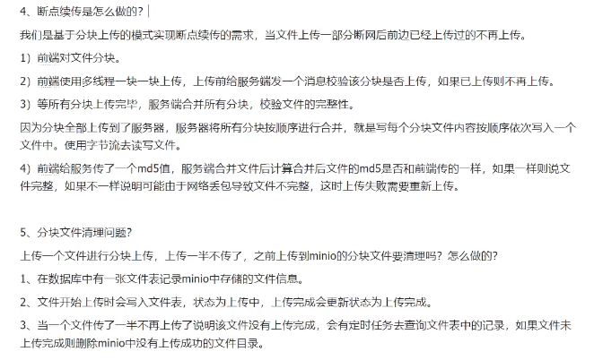

add as maven project

IDEA中把package包展开，取消列表下的Compact Middle Packages 

分页接口三个模型：
base：分页查询模型类（PageParams），响应模型类（分页结果 PageResult）
content-model：查询条件模型类（QueryCourseParamsDto）


控制Controller-业务Service-持久DAO

resources: bootstrap.yml log4j2-dev.xml

bootstrap.yml 和 application.yml?


mp的xml和selectPage

接口测试：swagger、postman、httpclient


跨域：协议、主机、端口。三种方法，jsonp、响应头、nginx

mp的config放在service包下，cors和时间的config放在api包下。
- 【时间的config：有的在base下，有的在api下】

@TableName, @TableId, @TableField


mp的xml查询
- id关联方法名，parameterType关联方法参数和$#，resultType/resultMap

1. 带条件 + 分页查询：课程查询
2. 树状结构分级的查询：添加课程之课程分类查询
3. 新增课程：
   - 营销表中存courseId的外键？还是主键相同？
   - Dto转Po的拷贝：BeanUtils.copyProperties()
   - 为什么不能设置数据库的默认值？
   - 怎么不用枚举？ 
4. 表单校验






```
CourseBase courseBaseNew = new CourseBase();
BeanUtils.copyProperties(dto, courseBaseNew);
courseBaseNew.setCompanyId(companyId);
courseBaseNew.setCreateDate(LocalDateTime.now());
// 审核状态默认为未提交
courseBaseNew.setAuditStatus("202002");
// 发布状态为未发布
courseBaseNew.setStatus("203001");


// 返回1表示成功，小于等于0表示失败
int insert = courseBaseMapper.insert(courseBaseNew);
if(insert <= 0){
    throw new RuntimeException("添加课程失败");
}
// 会更新传入的对象，可以获取插入的自增主键
// 【但是TableField多会更新？】
Long id = courseBaseNew.getId();
```
```
// select
CourseMarket courseMarket = courseMarketMapper.selectById(id);
if(courseMarket == null){
    
}else{
    
}
```

```
courseMarketNew.getPrice().floatValue()    【Float】
```






`@Transactional`，select查询不加？create加，但被create调用的this的方法就不加，因为都算在事务区间内。本质是创建一个代理对象，代理对象是原对象的包了层壳，AOP头尾执行事务的开启关闭、中间是原对象的方法。







## RESTful API

-   GET（SELECT）：从服务器取出资源（一项或多项）。
-   POST（CREATE）：在服务器新建一个资源。
-   PUT（UPDATE）：在服务器更新资源（客户端提供完整资源数据）。
-   PATCH（UPDATE）：在服务器更新资源（客户端提供需要修改的资源数据）。
-   DELETE（DELETE）：从服务器删除资源。

```
GET /dogs：从服务器查询资源的列表（数组）
GET /dogs/{dogId}：从服务器查询单个资源

POST /dogs：在服务器创建新的资源

PUT /dogs/{dogId}：更新服务器资源

DELETE /dogs/{dogId}：从服务器删除资源
```

200 `OK - [GET]`：服务器成功返回用户请求的数据，该操作是幂等的（Idempotent）。  
201 `CREATED - [POST/PUT/PATCH]`：用户新建或修改数据成功。  
202 `Accepted - [*]`：表示一个请求已经进入后台排队（异步任务）  
204 `NO CONTENT - [DELETE]`：用户删除数据成功。  
400 `INVALID REQUEST - [POST/PUT/PATCH]`：用户发出的请求有错误，服务器没有进行新建或修改数据的操作，该操作是幂等的。  
401 `Unauthorized - [*]`：表示用户没有权限（令牌、用户名、密码错误）。  
403 `Forbidden - [*]` 表示用户得到授权（与401错误相对），但是访问是被禁止的。  
404 `NOT FOUND - [*]`：用户发出的请求针对的是不存在的记录，服务器没有进行操作，该操作是幂等的。  
406 `Not Acceptable - [GET]`：用户请求的格式不可得（比如用户请求JSON格式，但是只有XML格式）。  
410 `Gone -[GET]`：用户请求的资源被永久删除，且不会再得到的。  
422 `Unprocesable entity - [POST/PUT/PATCH]` 当创建一个对象时，发生一个验证错误。  
500 `INTERNAL SERVER ERROR - [*]`：服务器发生错误，用户将无法判断发出的请求是否成功。


---


## 业务

修改课程信息：查询接口+修改接口。*为什么要查一遍用户信息，而不是用前端页面列表里的展示的用户信息？缓存过期，数据库已被更新。*

content.service.CourseBaseInfoServiceImpl: updateCourseBase
- courseBaseInfoDto由courseBase和courseMarket两个po而选取部分信息拼成。
- 本机构只能修改本机构的（比较传入的表示当前登录用户所属的companyId和courseBase的companyId）。*为什么还要校验字段合法性，前段展示只展示自己公司的不行吗？防止前端请求注入。*


两张表是一对一关系，每个课程计划只能在teachplan_media表中存在一个视频。


- [ ] teachplan新增的orderby，教程用count，我觉得应该用max。
- [ ] PUT更新并不是RESTful格式。
- [ ] minio的md5校验，直接网络流校验不行，但是上传了再下载、然后和原文件比较md5，也太蠢了
- [ ] 数据库表，md5作为主键，FiledId也是md5值，重复？多个用户不能存同一个图片？