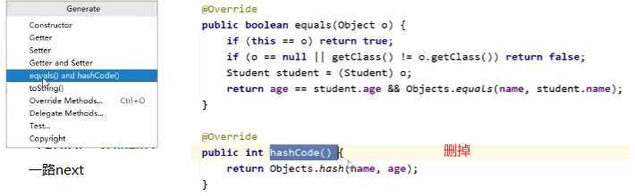
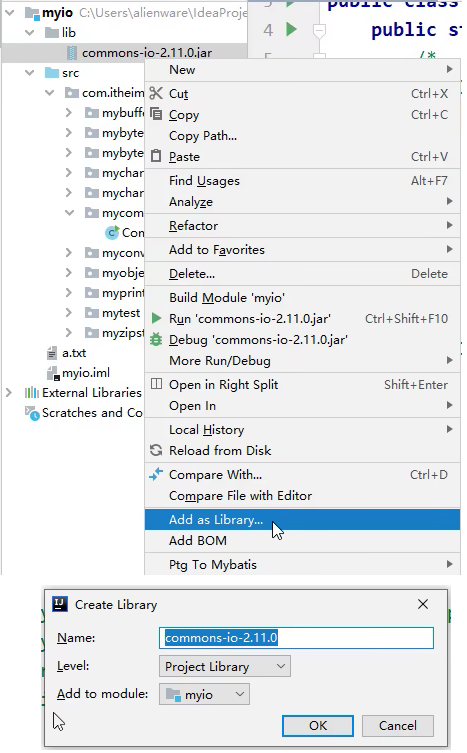
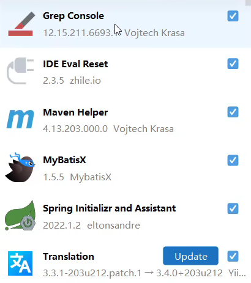
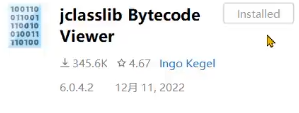

IDEA自动重写: alt + insert 

Java Bean生成： IDEA自动重写
- constructor: 'Select None' 和 全选
- Getters and Setters

利用插件ptg生成JavaBean

alt+7: 函数大纲

ctrl+f12：查找函数

ctrl+r : 替换，可以选择区域。

shift+f6: 直接全部替换

ctrl+shift+u: 单词全大写

鼠标滚轮：矩阵选中

ctrl+alt+l: 格式化

alt+enter: 修复报错

ctrl+alt+v: 自动生成左边的类型和变量名。`new Integer(1).var`打上`.var`也会自动生成。

ctrl+alt+b: 实现方法。接口类跳转实现类

ctrl+alt+d：surround with。try是6.

ctrl+alt+t: try-catch捕获

导入jar包：

- 第一个函数是自己的。
- 第二个函数是`→`，表示继承自`Map`中。
- 第三个函数是`↑`，表示继承并重写自`Map`中。

## jar包

## 插件

MyBatisX: mybatis的sql之xml配置

Grep Console: console 高亮某个字段

编译

- 选中文件，View->show Bytecode With Jclasslib
- 如果更改后，需要重新编译。直接Run 或者 Build-> Recompile xxx.java