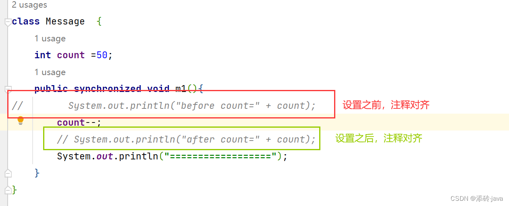

## 编码配置

## 自动导包


## 提示忽略大小写


## 字体


## 注释对齐




## 修改SDK


[IntelliJ IDEA创建springboot项目时不能选择java8的问题解决方案](https://blog.csdn.net/heyl163_/article/details/134746862)

修改项目所用JDK版本、项目所用JDK编译版本，都变成JDK11

修改maven控制的JDK
```java
<properties>
    <java.version>1.8</java.version>
    <project.build.sourceEncoding>UTF-8</project.build.sourceEncoding>
    <project.reporting.outputEncoding>UTF-8</project.reporting.outputEncoding>
    <spring-boot.version>2.6.13</spring-boot.version>
</properties>
```


## Git


