- [1. IDEA中层级结构介绍](#1-idea中层级结构介绍)
  - [1.1. 结构分类](#11-结构分类)
  - [1.2. 结构介绍](#12-结构介绍)
    - [1.2.1. project（项目、工程）](#121-project项目工程)
    - [1.2.2. module（模块）](#122-module模块)
    - [1.2.3. package（包）](#123-package包)
    - [1.2.4. class（类）](#124-class类)
  - [1.3. 小结](#13-小结)
- [2. IDEA中的第一个代码](#2-idea中的第一个代码)
    - [2.0.1. 操作步骤](#201-操作步骤)
    - [2.0.2. 分步图解](#202-分步图解)
- [3. IDEA中类的相关操作](#3-idea中类的相关操作)
  - [3.1. 类的相关操作](#31-类的相关操作)
  - [3.2. 新建类文件](#32-新建类文件)
  - [3.3. 修改类名](#33-修改类名)
  - [3.4. 删除类文件](#34-删除类文件)
- [4. IDEA中模块的相关操作](#4-idea中模块的相关操作)
  - [4.1. 模块的相关操作](#41-模块的相关操作)
  - [4.2. 新建模块](#42-新建模块)
  - [4.3. 删除模块](#43-删除模块)
  - [4.4. 修改模块](#44-修改模块)
  - [4.5. 导入模块](#45-导入模块)
- [5. IDEA中项目的相关操作](#5-idea中项目的相关操作)
  - [5.1. 项目的相关操作](#51-项目的相关操作)
  - [5.2. 关闭项目](#52-关闭项目)
  - [5.3. 打开项目](#53-打开项目)
  - [5.4. 修改项目](#54-修改项目)
    - [5.4.1. 修改SDK](#541-修改sdk)
    - [5.4.2. 修改项目名](#542-修改项目名)
  - [5.5. 新建项目](#55-新建项目)

---
## 1. IDEA中层级结构介绍

### 1.1. 结构分类

- project（项目、工程）
- module（模块）
- package（包）
- class（类）

### 1.2. 结构介绍

​	为了让大家更好的吸收，package这一层级，我们后面再学习，先学习最基础的project、module、class。

#### 1.2.1. project（项目、工程）

​	淘宝、京东、黑马程序员网站都属于一个个项目，IDEA中就是一个个的Project。

#### 1.2.2. module（模块）

​	在一个项目中，可以存放多个模块，不同的模块可以存放项目中不同的业务功能代码。在黑马程序员的官方网站中，至少包含了以下模块：

- 论坛模块
- 报名、咨询模块

为了更好的管理代码，我们会把代码分别放在两个模块中存放。

#### 1.2.3. package（包）

​	一个模块中又有很多的业务，以黑马程序员官方网站的论坛模块为例，至少包含了以下不同的业务。

- 发帖
- 评论

为了把这些业务区分的更加清楚，就会用包来管理这些不同的业务。

#### 1.2.4. class（类）

​	就是真正写代码的地方。

### 1.3. 小结

- 层级关系

  ​	project - module - package - class

- 包含数量

  ​	project中可以创建多个module
  ​	module中可以创建多个package
  ​	package中可以创建多个class

  ​	这些结构的划分，是为了方便管理类文件的。

## 2. IDEA中的第一个代码

#### 2.0.1. 操作步骤

- 创建Project 项目
- 创建Module 模块
- 创建class   类
- 在类中编写代码
- 完成编译运行

#### 2.0.2. 分步图解

- 双击启动图标

  

- 首先要新建一个项目

  点击creat new project

  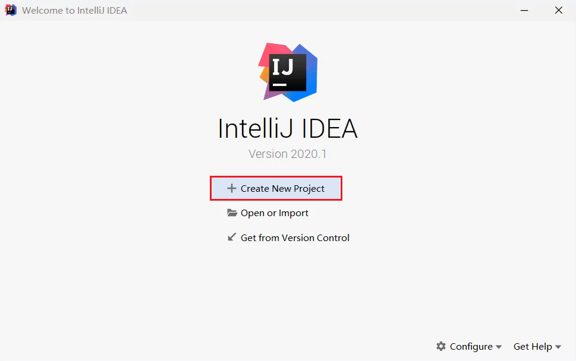

- 我们要从0开始写代码，所以新建一个空的什么都没有的项目。

  点击左下方的Empty Project

  再点击右下角的next

- 输入项目的名称

  输入项目的存放路径

- 点击ok。idea会帮助我们在本地创建一个项目文件夹

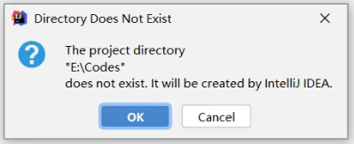

- 点击Module，准备新建一个模块

- 点击+

  再点击New Module

- 我们要编写Java代码，所以要新建一个Java模块。

  点击Java

  再点击右下角的next

- 输入模块的名称

  再点击右下角的Next

- 成功新建一个模块之后，中间就会出现刚刚新建的模块

  点击右下角的OK

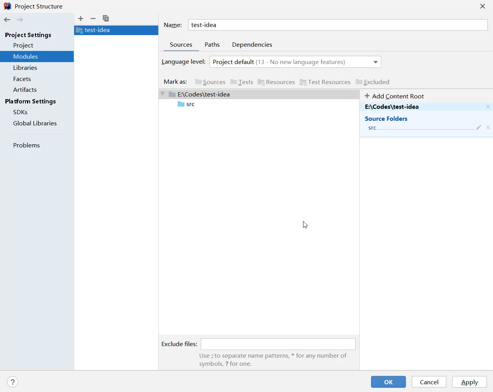

- 回到主界面

  展开刚刚新建的模块

  右键点击src，选择New，选择Java Class

- 输入类名

  再按回车

- 编写代码

- 运行代码

  右键空白处，点击Run

- 最下面会弹出控制台。

  所有输出语句中的内容，都会在控制台上展示。

## 3. IDEA中类的相关操作

### 3.1. 类的相关操作
- 新建类文件
- 删除类文件
- 修改类文件

### 3.2. 新建类文件

- 所有的Java代码都会写在src文件夹当中。

  所以，右键点击src，选择new，点击Java Class

  

- 输入类名，再按回车

  

- 新建完毕

### 3.3. 修改类名

- 右键点击想要修改的文件

  点击Refactor

  再点击Rename

- 输入想要修改的名字

  输入完毕点击下面的Refactor

- 文件名和类名均已修改成功

  

### 3.4. 删除类文件

- 想要删除哪个文件，就右键点击该文件

  选择Delete即可

- 在弹出的界面中点击OK，确定删除

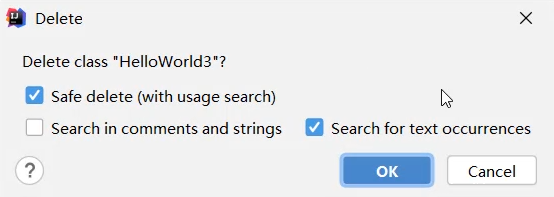

> 小贴士：
>
> 此时删除是不走回收站的，直接从硬盘中删掉了。

## 4. IDEA中模块的相关操作

### 4.1. 模块的相关操作

- 新建模块
- 删除模块
- 修改模块
- 导入模块

### 4.2. 新建模块

- 点击File，选择Project Structure

- 选择Module

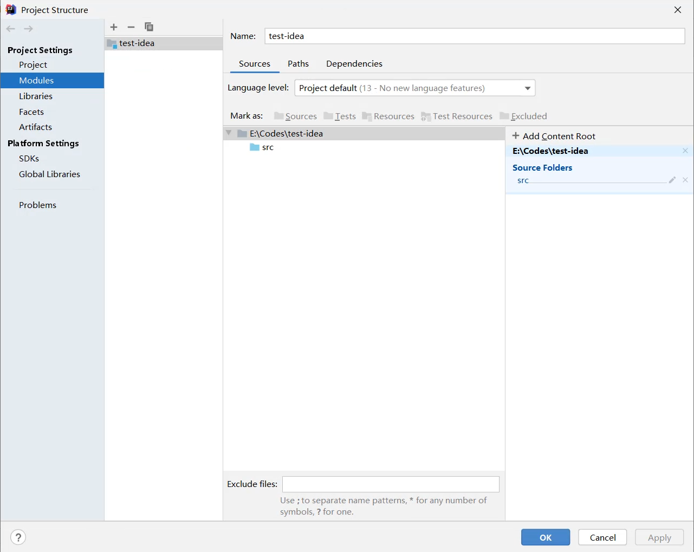

- 点击+

  选择New Module

- 要创建一个Java模块，所以选择第一个Java

  点击右下角的Next

- 输入模块的名称

  点击右下角的Finish

- 成功新建完毕之后，在中间空白区域就出现了刚刚新建的模块

  点击右下角的OK

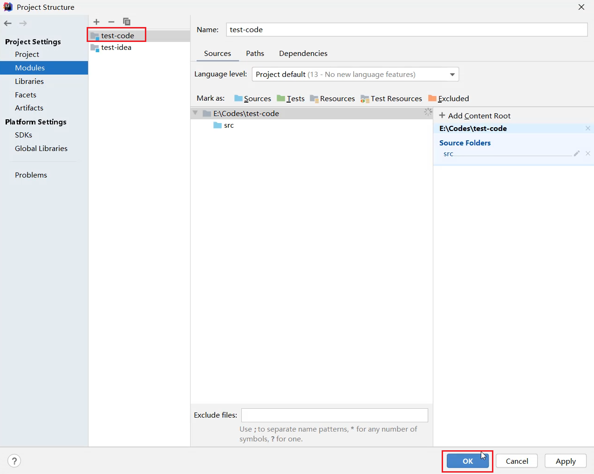

- 在主界面中，也会出现刚刚新建的模块

### 4.3. 删除模块

- 右键点击模块

  选择Remove Module

- 选择Remove，表示确定删除

- 此时发现，在IDEA列表页面，删除的模块已经不在了。

> 小贴士：
>
> 此时删除仅仅是从IDEA列表中的删除，在本地硬盘中还是存在的。

### 4.4. 修改模块

- 右键点击模块名

  选择Refactor

  再选择Rename

- 选择第三个修改模块名和本地文件夹名

  点击OK

- 输入要修改的新的模块名

  输入完毕点击Refactor

- 回到主界面，就发现模块名和文件夹名都已经修改完毕

### 4.5. 导入模块

- 点击File，选择Project Structure

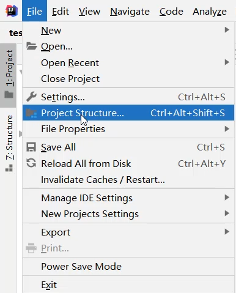

- 选择Module

  点击+

  选择Import Module

- 从本地硬盘中选择要导入的模块

  再点击OK

- 不断点击Next

- 如果中间出现提示框，则点击Overwrite

  然后继续点击右下角的Next

- 一直点到finish为止

- 成功导入后，在中间位置就会出现导入的模块信息

- 在主界面中也会出现导入的模块信息

- 展开模块点击模块中的Java文件，会发现代码报错。

  是因为导入模块跟JDK没有关联导致。

- 可以点击右上角的Setup SDK

  再选择已经安装的JDK版本即可

- 导入完毕之后，代码就恢复正常不会报错了

## 5. IDEA中项目的相关操作

### 5.1. 项目的相关操作

- 关闭项目
- 打开项目
- 修改项目
- 新建项目

### 5.2. 关闭项目

- 点击File，选择Close Project即可

- 刚刚操作的项目就已经关闭了

  左侧是项目列表，如果要再次打开该项目，直接点击即可。

  右侧有create new project，可以再建一个新的项目

- 鼠标放在项目上，后面会出现一个叉。

  如果点击了这里的叉，会在IDEA的列表中删除。不会删除本地硬盘上的项目。

### 5.3. 打开项目

- 在本界面还可以打开本地已经存在的项目

  点击Open or Import

- 选择要打开的项目

  点击OK

- 项目就被打开了。

### 5.4. 修改项目

- 点击File，选择Project Structure

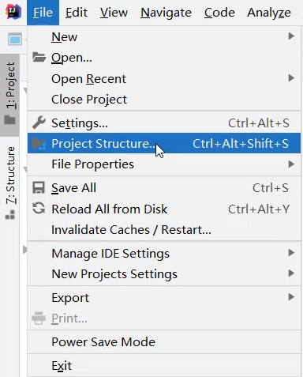

#### 5.4.1. 修改SDK

修改项目所用JDK版本、项目所用JDK编译版本，都变成JDK11

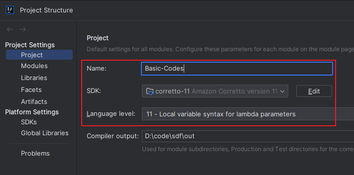

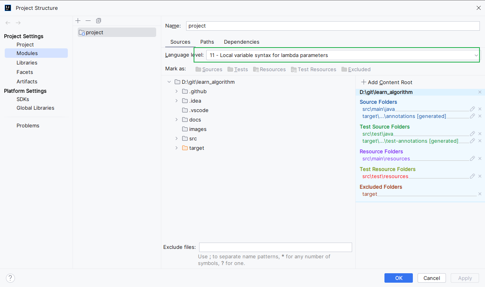

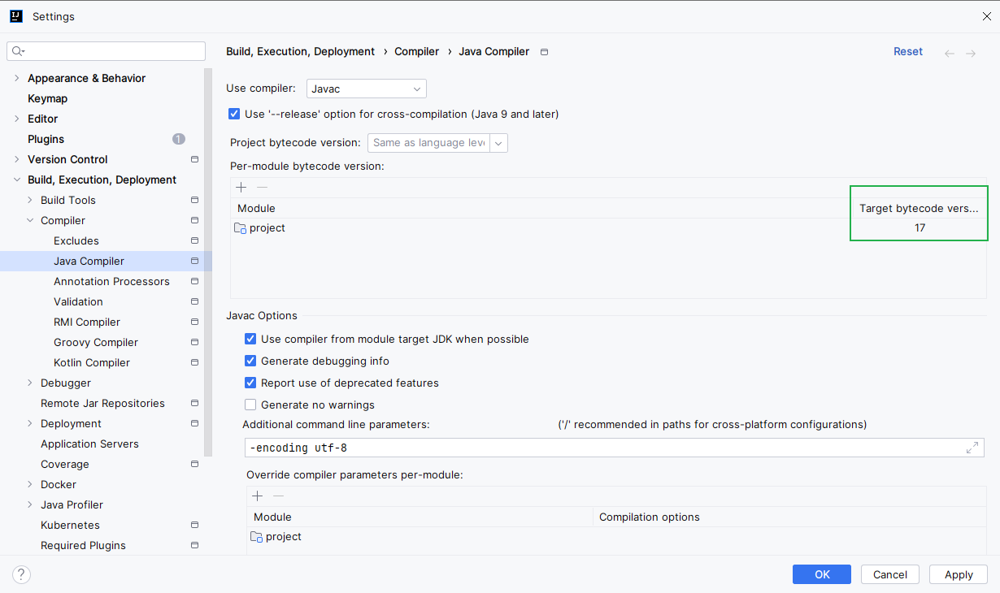
#### 5.4.2. 修改项目名

- 修改项目Name

- 但是本地文件夹的名字还没有修改

- 需要先关闭当前项目

- 点击项目后面的叉，从列表中移除项目

- 到本地硬盘中手动修改文件夹的名称

- 点击Open or Import重新打开项目

- 选择修改之后的项目

  点击OK

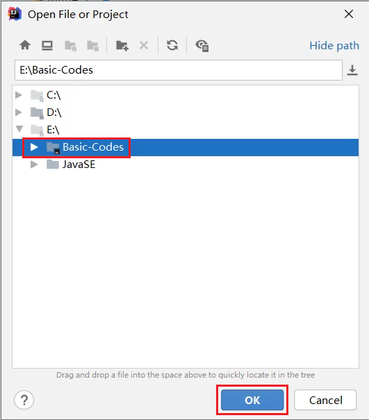

- 此时会发现，项目名称和本地硬盘文件夹的名称都已经修改完毕了

### 5.5. 新建项目

- 点击File

  选择New

  点击Project

- 同样还是创建一个什么都没有的空项目

- 输入项目的名称

  点击右下角的finish

- IDEA循环是否需要帮我们在本地创建一个新的文件夹

  点击OK

- 询问是在本窗口打开还是在一个新的窗口打开。

  可以点击New Window，在一个新的窗口打开。

- 此时就出现了两个窗口，在一个新的窗口打开了新的项目

