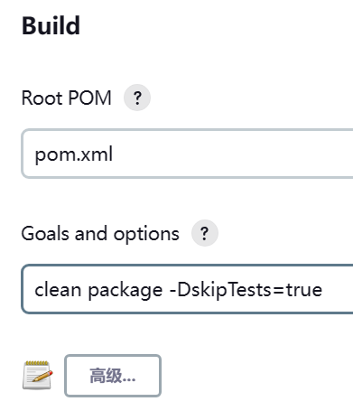

# Gogs


# jenkins的 tjxt-dev-build


## 源码管理

远程仓库地址和分支


## Build



```
clean package -DskipTests=true
```

# 总结


tjxt-dev-build是拉远程代码。

之后具体的微服务任务，会构建docker镜像


```bash
#! /bin/sh
cd /usr/local/src/script || exit 1
BASE_PATH='/usr/local/src/jenkins/workspace/tjxt-dev-build'
PROJECT_NAME=""
PROJECT_PATH=''
CONTAINER_NAME=""
JAVA_OPTS="-Xms300m -Xmx300m"
PORT=8080
DEBUG_PORT=0
while getopts "c:n:d:p:o:a:" opt; do
    case $opt in
         c)
            CONTAINER_NAME=$OPTARG
          ;;
         n)
            PROJECT_NAME=$OPTARG
          ;;
         d)
            PROJECT_PATH=$OPTARG
          ;;
         p)
            PORT=$OPTARG
          ;;
         o)
            [ -n "$OPTARG" ] && JAVA_OPTS=$OPTARG
          ;;
         a)
            [ -n "$OPTARG" ] && DEBUG_PORT=$OPTARG
          ;;
         ?)
            echo "unkonw argument"
            exit 1
          ;;
    esac
done
if [ "$DEBUG_PORT" = "0" ]; then
  JAVA_OPTS=$JAVA_OPTS
else
  JAVA_OPTS="-agentlib:jdwp=transport=dt_socket,server=y,suspend=n,address=*:5005"
fi
IMAGE_NAME="${CONTAINER_NAME}:latest"
echo "copy xx.jar from ${BASE_PATH}/${PROJECT_PATH}"
rm -f app.jar
cp ${BASE_PATH}/${PROJECT_PATH}/target/${PROJECT_NAME}.jar ./app.jar ||  exit 1

echo "begin to build ${PROJECT_NAME} image ！！"

[ -n "`docker ps -a | grep ${CONTAINER_NAME}`" ] && docker rm -f ${CONTAINER_NAME}
[ -n "`docker images | grep ${CONTAINER_NAME}`" ] && docker rmi ${IMAGE_NAME}

docker build -t ${IMAGE_NAME} . || exit 1
echo "${PROJECT_NAME} image build success，java_opts = $JAVA_OPTS ！！^_^"

echo "begin to create container ${CONTAINER_NAME}，port: ${PORT} ！！"

if [ "$DEBUG_PORT" = "0" ]; then
  echo "run in normal mode"
  docker run -d --name ${CONTAINER_NAME} \
   -p "${PORT}:${PORT}" \
   -e JAVA_OPTS="${JAVA_OPTS}" \
   --memory 300m --memory-swap -1 \
   --network heima-net ${IMAGE_NAME} \
  || exit 1
else
  echo "run in debug mode"
  docker run -d --name ${CONTAINER_NAME} \
   -p "${PORT}:${PORT}" \
   -p ${DEBUG_PORT}:5005 \
   -e JAVA_OPTS="${JAVA_OPTS}" \
   --network heima-net ${IMAGE_NAME} \
  || exit 1
fi
echo "container is running now !! ^_^"
```
```bash
FROM openjdk:11.0-jre-buster
LABEL maintainer="研究院研发组 <research-maint@itcast.cn>"
ENV JAVA_OPTS=""
# 设定时区
ENV TZ=Asia/Shanghai
RUN ln -snf /usr/share/zoneinfo/$TZ /etc/localtime && echo $TZ > /etc/timezone

WORKDIR /app
ADD app.jar /app/app.jar

ENTRYPOINT ["sh","-c","java  -jar $JAVA_OPTS /app/app.jar"]
```