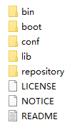

https://maven.apache.org/download.cgi



config中的setting.xml

```xml
<?xml version="1.0" encoding="UTF-8"?>
<settings xmlns="http://maven.apache.org/SETTINGS/1.2.0"
          xmlns:xsi="http://www.w3.org/2001/XMLSchema-instance"
          xsi:schemaLocation="http://maven.apache.org/SETTINGS/1.2.0 https://maven.apache.org/xsd/settings-1.2.0.xsd">
  <!-- 本地仓库 -->
  <localRepository>D:\Applications\apache-maven-3.9.6\repository</localRepository>
  <pluginGroups>
  </pluginGroups>
  <proxies>
  </proxies>
  <servers>
  </servers>
  <!-- 远程仓库 -->
  <mirrors>
    <mirror>
        <id>aliyunmaven</id>
        <mirrorOf>*</mirrorOf>
        <name>阿里云公共仓库</name>
        <url>https://maven.aliyun.com/repository/public</url>
    </mirror>
  </mirrors>
  <!-- 默认JDK -->
  <profiles>
    <profile>     
      <id>JDK-1.8</id>       
      <activation>       
          <activeByDefault>true</activeByDefault>       
          <jdk>1.8</jdk>       
      </activation>       
      <properties>       
          <maven.compiler.source>1.8</maven.compiler.source>       
          <maven.compiler.target>1.8</maven.compiler.target>       
          <maven.compiler.compilerVersion>1.8</maven.compiler.compilerVersion>       
      </properties>       
  </profile>
  </profiles>
</settings>
```
## idea

