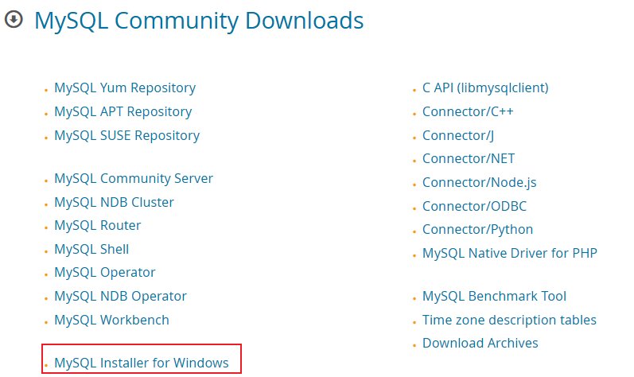
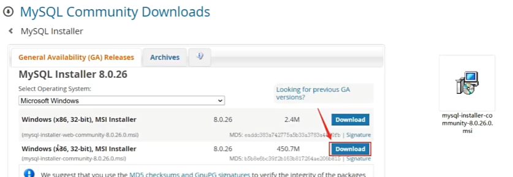
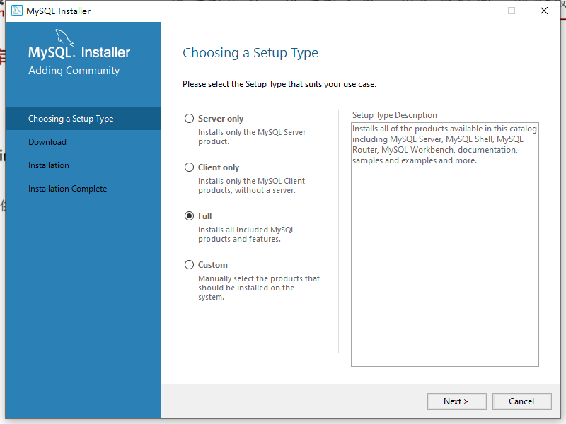
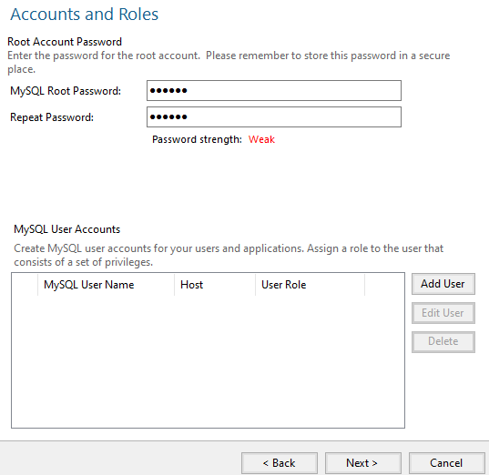
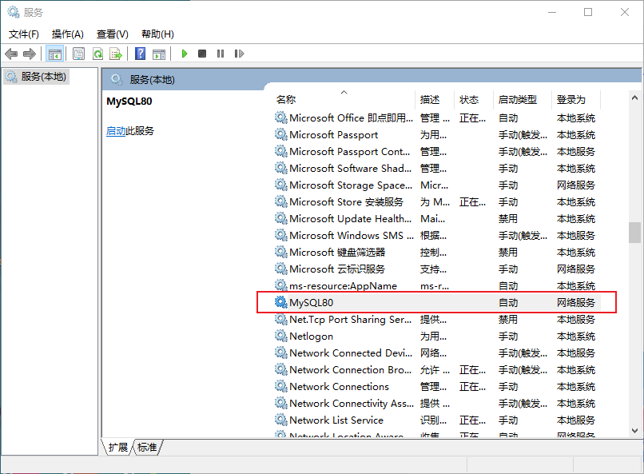
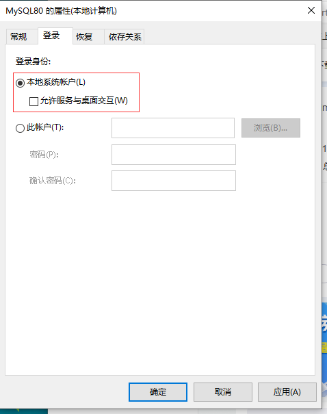
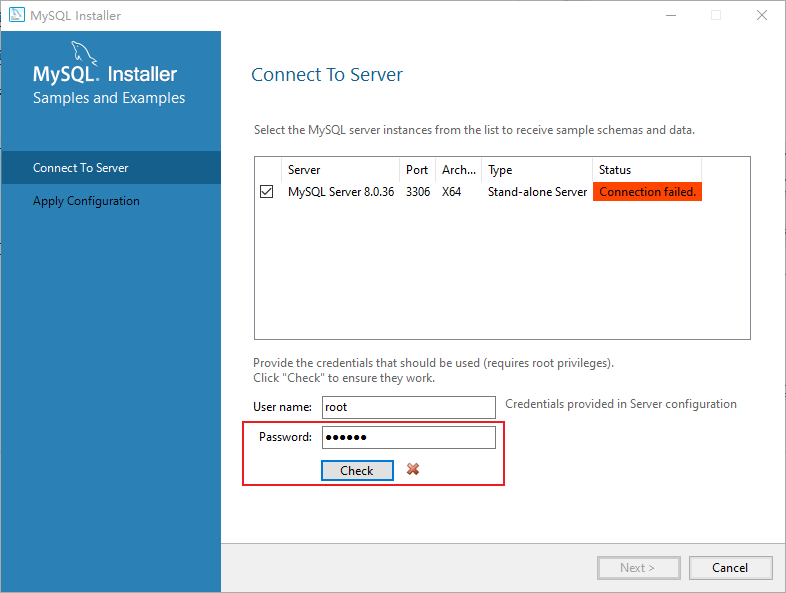
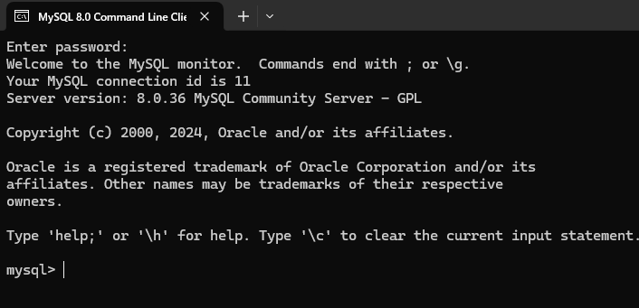
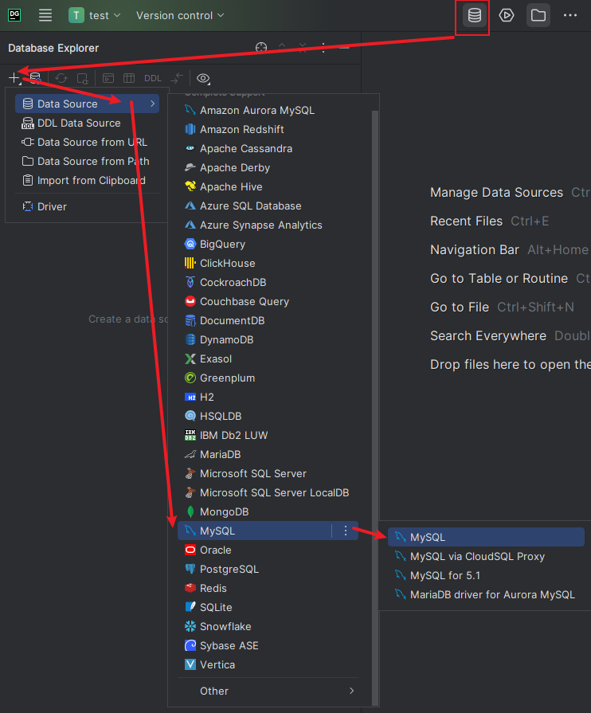
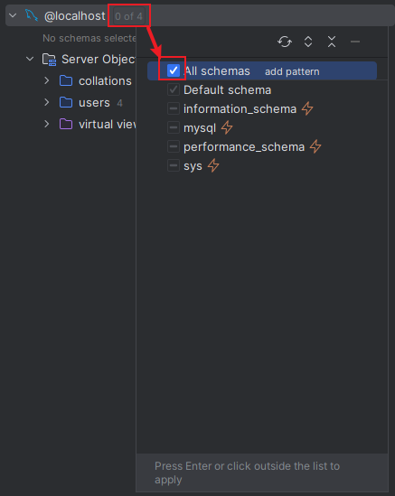

- [1. mysql](#1-mysql)
  - [1.1. 启动指令](#11-启动指令)
  - [1.2. 客户端连接](#12-客户端连接)
- [2. DataGrip](#2-datagrip)

---

## 1. mysql

1. 下载链接：[mysql-installer-community-8.0.36.0.msi](https://dev.mysql.com/downloads/installer)

    

    

2. 没有Custom type，就选Full type吧。

    

3. Type and Networking：就用默认端口3306，直接next

4. Accounts and Roles：设置密码123456（后面来讲，其实不用设置）

    
5. 安装失败
    > Attempting to start service MySQL80...
    > Failed to start service MySQL80.
    > 只有在任务处于完成状态(RanToCompletion、Faulted 或 Canceled)时才能释放它。
    > Ended configuration step: Starting the server
    > ....
    > 
    搜索“服务”。
    
    “服务” → 在里面找到 “mysqlXX” → 右键 “属性” → 点击“登录”选项卡。选择 本地统账> 户后 点击确定 ，然后再 右键 启动 就可以了。
    
    
    
    
    
    接着安装 execute 就没问题了

6. MySQL Router Configuration：finish

7. Connect To Server：密码123456失败，不管直接next。
   
    因为“本地系统账户”这种方式登录应该是没有密码的，因为默认windows管理员账户是没密码的，因此也就不可能进行connect to server的测试，所以点“Cancel”取消这一步即可。

    

    虽然可以登录`mysql -u root -p`或`mysql-cli`直接回车登录MySQL，但是DataGrip配置空密码就链接不上。
    
    所以必须修改密码：`ALTER USER 'root'@'localhost' IDENTIFIED BY '123456';`
8. next，finish。
### 1.1. 启动指令

- `net start mysql80`
- `net stop mysql80`

```
net stop mysql80
发生系统错误 5。

拒绝访问。
```
答案不是名字大小写，而是要用管理员权限的cmd。

### 1.2. 客户端连接
1. `C:\Program Files\MySQL\MySQL Server 8.0\bin`有mysql.exe，可选配置环境变量。

    ```bash
    mysql [-h 127.0.0.1] [-P 3306] -u root -p
    ```

2. MySQL COmmand Line Client

    


## 2. DataGrip

<https://www.jetbrains.com/datagrip/download/#section=windows>



