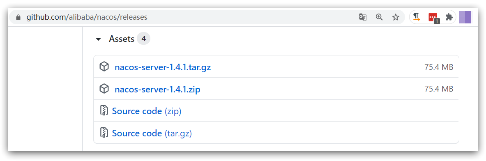
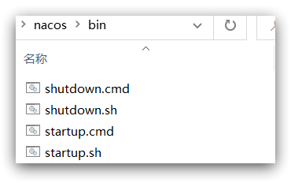
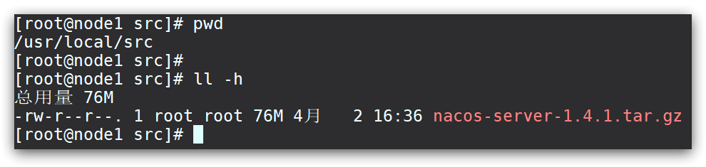
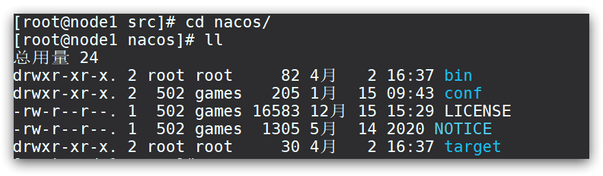

- [安装](#安装)
  - [docker](#docker)
    - [nacos + 自带数据库](#nacos--自带数据库)
    - [nacos + mysql : 还是失败no datasource set](#nacos--mysql--还是失败no-datasource-set)
  - [Windows安装](#windows安装)
    - [下载安装包](#下载安装包)
    - [解压](#解压)
    - [端口配置](#端口配置)
    - [启动](#启动)
    - [访问](#访问)
  - [Linux安装](#linux安装)
    - [安装JDK](#安装jdk)
    - [上传安装包](#上传安装包)
    - [解压](#解压-1)
    - [端口配置](#端口配置-1)
    - [启动](#启动-1)

---

# 安装

## docker
### nacos + 自带数据库

```bash
docker run -d \
  --name nacos \
  -p 8848:8848 \
  -e MODE=standalone \
  nacos/nacos-server:v2.1.0-slim
```

成功！

`http://192.168.150.3:8848` 是404，但起码证明启动成功了，否则连打开都没有。

`http://192.168.150.3:8848/nacos` 是登录界面。
### nacos + mysql : 还是失败no datasource set

```bash
mkdir -p /mydata/nacos/conf/             # 新建nacos的logs目录
mkdir -p /mydata/nacos/logs/         
vim /mydata/nacos/conf/application.properties   # 新建并修改nacos的配置文件
```

修改db相关配置：ip、用户名、密码
```properties
server.contextPath=/nacos
server.servlet.contextPath=/nacos
server.port=8848

# 核心配置就这5个
spring.datasource.platform=mysql
db.num=1
db.url.0=jdbc:mysql://192.168.150.3:3306/nacos?characterEncoding=utf8mb4&connectTimeout=1000&socketTimeout=3000&autoReconnect=true&useSSL=false&serverTimezone=UTC
serverTimezone=UTC
db.user=root
db.password=123

nacos.cmdb.dumpTaskInterval=3600
nacos.cmdb.eventTaskInterval=10
nacos.cmdb.labelTaskInterval=300
nacos.cmdb.loadDataAtStart=false

management.metrics.export.elastic.enabled=false

management.metrics.export.influx.enabled=false


server.tomcat.accesslog.enabled=true
server.tomcat.accesslog.pattern=%h %l %u %t "%r" %s %b %D %{User-Agent}i


nacos.security.ignore.urls=/,/**/*.css,/**/*.js,/**/*.html,/**/*.map,/**/*.svg,/**/*.png,/**/*.ico,/console-fe/public/**,/v1/auth/login,/v1/console/health/**,/v1/cs/**,/v1/ns/**,/v1/cmdb/**,/actuator/**,/v1/console/server/**
nacos.naming.distro.taskDispatchThreadCount=1
nacos.naming.distro.taskDispatchPeriod=200
nacos.naming.distro.batchSyncKeyCount=1000
nacos.naming.distro.initDataRatio=0.9
nacos.naming.distro.syncRetryDelay=5000
nacos.naming.data.warmup=true
nacos.naming.expireInstance=true
```
```bash
docker run -d \
  --name nacos \
  --restart=always \
  -p 8848:8848 \
  -e MODE=standalone \
  -e JVM_XMS=512m \
  -e JVM_XMX=512m \
  -e MYSQL_SERVICE_HOST=192.168.150.3 \
  -e MYSQL_SERVICE_USER=root \
  -e MYSQL_SERVICE_PASSWORD=123 \
  -e MYSQL_SERVICE_DB_NAME=nacos \
  -e SPRING_DATASOURCE_PLATFORM=mysql \
  -v /mydata/nacos/logs:/home/nacos/logs \
  nacos/nacos-server:v2.1.0-slim


docker run -d \
  --name nacos \
  --restart=always \
  -p 8848:8848 \
  -e MODE=standalone \
  -e JVM_XMS=512m \
  -e JVM_XMX=512m \
  -v /mydata/nacos/conf/application.properties:/home/nacos/conf/application.properties \
  -v /mydata/nacos/logs:/home/nacos/logs \
  nacos/nacos-server:v2.1.0-slim
```


## Windows安装


### 下载安装包

在Nacos的GitHub页面，提供有下载链接，可以下载编译好的Nacos服务端或者源代码：

GitHub主页：https://github.com/alibaba/nacos

GitHub的Release下载页：https://github.com/alibaba/nacos/releases

如图：




本课程采用1.4.1.版本的Nacos，课前资料已经准备了安装包：


windows版本使用`nacos-server-1.4.1.zip`包即可。


### 解压

将这个包解压到任意非中文目录下，如图：


目录说明：

- bin：启动脚本
- conf：配置文件


### 端口配置

Nacos的默认端口是8848，如果你电脑上的其它进程占用了8848端口，请先尝试关闭该进程。

**如果无法关闭占用8848端口的进程**，也可以进入nacos的conf目录，修改配置文件中的端口：


修改其中的内容：


### 启动

启动非常简单，进入bin目录，结构如下：



然后执行命令即可：

- windows命令：

  ```
  startup.cmd -m standalone
  ```


执行后的效果如图：


### 访问

在浏览器输入地址：http://127.0.0.1:8848/nacos即可：


默认的账号和密码都是nacos，进入后：


## Linux安装

Linux或者Mac安装方式与Windows类似。

### 安装JDK

Nacos依赖于JDK运行，索引Linux上也需要安装JDK才行。

上传jdk安装包：


上传到某个目录，例如：`/usr/local/`


然后解压缩：

```sh
tar -xvf jdk-8u144-linux-x64.tar.gz
```

然后重命名为java


配置环境变量：

```sh
export JAVA_HOME=/usr/local/java
export PATH=$PATH:$JAVA_HOME/bin
```

设置环境变量：

```sh
source /etc/profile
```


### 上传安装包

如图：


也可以直接使用课前资料中的tar.gz：


上传到Linux服务器的某个目录，例如`/usr/local/src`目录下：




### 解压

命令解压缩安装包：

```sh
tar -xvf nacos-server-1.4.1.tar.gz
```

然后删除安装包：

```sh
rm -rf nacos-server-1.4.1.tar.gz
```

目录中最终样式：


目录内部：




### 端口配置

与windows中类似


### 启动

在nacos/bin目录中，输入命令启动Nacos：

```sh
sh startup.sh -m standalone
```