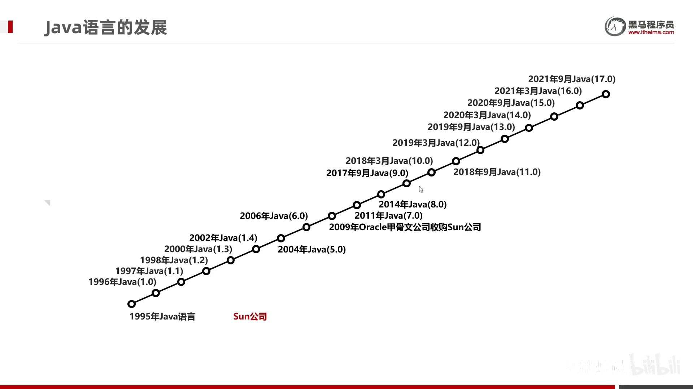
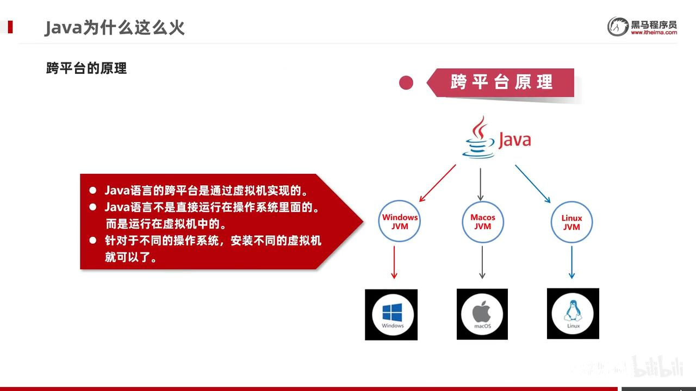
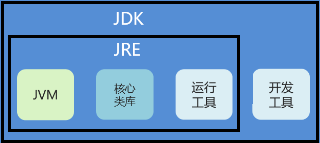

- [Java语言的发展](#java语言的发展)
- [Java语言和C语言有哪些区别？](#java语言和c语言有哪些区别)
- [环境变量](#环境变量)
  - [win10的bug](#win10的bug)
---

## Java语言的发展

- 版本号：1.4之后就直接5-17
- Java5.0：这是Java的第一个大版本更新。
- Java8.0：这个是目前绝大数公司正在使用的版本。因为这个版本最为稳定。
- 长期支持LTS：8、11、17

> Java的三大平台

在SE（标准版）的基础上，有EE（企业版）和ME（小型版）。

java跨平台靠JVM，java程序运行在JVM里，而不是直接运行在计算机上。

> Java的主要特性

- 面向对象
- 安全性
- 多线程
- 简单易用
- 开源
- 跨平台

> JDK, JRE, JVM

JDK（java开发工具包）：JVM，核心类库，开发工具（javac,java,jhat等）

JRE（java运行环境）：JVM，核心类库，运行工具（javac,java,jhat等），但是精简掉开发的东西。

JDK包含了JRE，JRE包含了JVM。

## Java语言和C语言有哪些区别？

-   编程范式：C语言是一种过程式编程语言，而Java语言是一种面向对象编程语言。Java语言基于类和对象的概念，支持封装、继承和多态等面向对象的特性。
-   内存管理：C语言需要手动管理内存，包括分配和释放内存。而Java语言使用垃圾回收机制，自动管理内存，开发者不需要显式地进行内存管理。
-   平台依赖性：C语言是一种编译型语言，编写的程序需要针对特定的操作系统和硬件平台进行编译。而Java语言是一种跨平台的语言，通过Java虚拟机（JVM）实现了平台无关性，Java程序可以在不同的操作系统上运行。
-   异常处理：C语言使用错误码来处理异常情况，开发者需要手动检查错误码并进行相应的处理。Java语言引入了异常处理机制，通过try-catch-finally语句块来捕获和处理异常，使得代码更加清晰和可读。
-   标准库和生态系统：C语言的标准库相对较小，提供了基本的输入输出、字符串处理等功能。Java语言拥有丰富的标准库和第三方库，提供了大量的API和工具，涵盖了各种领域，方便开发者进行开发。
-   编译和执行方式：C语言通过编译器将源代码编译成机器码，然后直接执行。而Java语言通过编译器将源代码编译成字节码，然后在JVM上执行字节码。

## 环境变量

> 重配

1. 以前下载的老版本的JDK是没有自动配置的，
2. 自动配置的环境变量不行。
    
    现在最新从官网上下载的JDK安装时会自动配置javac、java命令的路径到Path环境变量中去 ，所以javac、java可以直接使用。而且自动配置的也只包含了4个工具而已，所以我们需要删掉已经配置完毕的，**再次重新配置Path环境变量**。

> 配置

①**JAVA_HOME**：告诉操作系统JDK安装在了哪个位置（未来其他技术要通过这个找JDK）

②**Path**：告诉操作系统JDK提供的javac(编译)、java(执行)命令安装到了哪个位置

### win10的bug

当电脑重启之后，环境变量失效了。因为`Path`中引用了`JAVA_HOME`，有些win10不支持自定义的环境变量。

步骤：

- 还是要配置`JAVA_HOME`给以后的相关软件去使用

- `Path`中不引用`JAVA_HOME`了，而是直接`E:\develop\JDK\bin`。