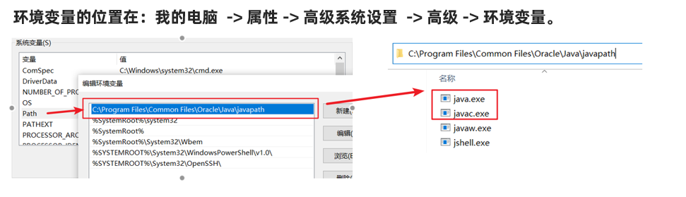

- [Java语言的发展](#java语言的发展)
- [环境变量](#环境变量)
  - [win10的bug](#win10的bug)
---

## Java语言的发展

- 版本号：1.4之后就直接5-17
- Java5.0：这是Java的第一个大版本更新。
- Java8.0：这个是目前绝大数公司正在使用的版本。因为这个版本最为稳定。
- 长期支持LTS：8、11、17

> Java的三大平台

在SE（标准版）的基础上，有EE（企业版）和ME（小型版）。

java跨平台靠JVM，java程序运行在JVM里，而不是直接运行在计算机上。

> Java的主要特性

- 面向对象
- 安全性
- 多线程
- 简单易用
- 开源
- 跨平台

> JDK, JRE, JVM

JDK（java开发工具包）：JVM，核心类库，开发工具（javac,java,jhat等）

JRE（java运行环境）：JVM，核心类库，运行工具（javac,java,jhat等），但是精简掉开发的东西。

JDK包含了JRE，JRE包含了JVM。

## 环境变量

> 重配

1. 以前下载的老版本的JDK是没有自动配置的，
2. 自动配置的环境变量不行。
    
    现在最新从官网上下载的JDK安装时会自动配置javac、java命令的路径到Path环境变量中去 ，所以javac、java可以直接使用。而且自动配置的也只包含了4个工具而已，所以我们需要删掉已经配置完毕的，**再次重新配置Path环境变量**。

> 配置

①**JAVA_HOME**：告诉操作系统JDK安装在了哪个位置（未来其他技术要通过这个找JDK）

②**Path**：告诉操作系统JDK提供的javac(编译)、java(执行)命令安装到了哪个位置

### win10的bug

当电脑重启之后，环境变量失效了。因为`Path`中引用了`JAVA_HOME`，有些win10不支持自定义的环境变量。

步骤：

- 还是要配置`JAVA_HOME`给以后的相关软件去使用

- `Path`中不引用`JAVA_HOME`了，而是直接`E:\develop\JDK\bin`。