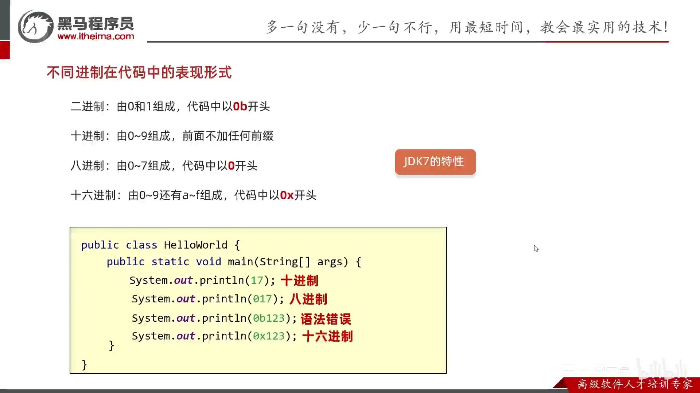

- [1. 字面量](#1-字面量)
- [2. Java的数据类型](#2-java的数据类型)
  - [2.1. 基本数据类型和引用数据类型](#21-基本数据类型和引用数据类型)
  - [2.2. 隐式转换](#22-隐式转换)
  - [2.3. 为什么像 byte、short、int、long能表示的最大正数都减 1 了](#23-为什么像-byteshortintlong能表示的最大正数都减-1-了)
  - [2.4. 为什么浮点数运算的时候会有精度丢失的风险？](#24-为什么浮点数运算的时候会有精度丢失的风险)
  - [2.5. 如何解决浮点数运算的精度丢失问题？](#25-如何解决浮点数运算的精度丢失问题)
  - [2.6. 超过 long 整型的数据应该如何表示？](#26-超过-long-整型的数据应该如何表示)
  - [2.7. 字符型常量和字符串常量的区别?](#27-字符型常量和字符串常量的区别)
  - [强制类型转换比运算符优先级更高](#强制类型转换比运算符优先级更高)
- [3. 包装类](#3-包装类)
  - [3.1. 基本类型和包装类型的区别？](#31-基本类型和包装类型的区别)
  - [3.2. 包装类型的缓存机制了解么？](#32-包装类型的缓存机制了解么)
  - [3.3. 自动装箱与拆箱了解吗？原理是什么？](#33-自动装箱与拆箱了解吗原理是什么)
  - [3.4. 习题：自动装箱与自动类型转换](#34-习题自动装箱与自动类型转换)


---
## 1. 字面量

字面量（4类基本数据类型、一个字符串类型、一个null类型）

作用：告诉程序员，数据在程序中的书写格式。

| **字面量类型** | **说明**                                  | **程序中的写法**           |
| -------------- | ----------------------------------------- | -------------------------- |
| 整数           | 不带小数的数字                            | 666，-88                   |
| 小数           | 带小数的数字                              | 13.14，-5.21               |
| 字符           | 必须使用单引号，有且仅能一个字符          | ‘A’，‘0’，   ‘我’          |
| 字符串         | 必须使用双引号，内容可有可无              | “HelloWorld”，“黑马程序员” |
| 布尔值         | 布尔值，表示真假，只有两个值：true，false | true 、false               |
| 空值           | 一个特殊的值，空值                        | 值是：null                 |

- 字符类型，个数必须是一个。`''`和`'ABC'`都不行，`'中'`可以。
- null不能打印，`System.out.println(null); // error`
~~~java
public class Demo {
    public static void main(String[] args) {
        System.out.println(10); // 输出一个整数
        System.out.println(5.5); // 输出一个小数
        System.out.println('a'); // 输出一个字符
        System.out.println(true); // 输出boolean值true
        System.out.println("欢迎来到黑马程序员"); // 输出字符串
    }
}
~~~




## 2. Java的数据类型

Java语言的数据类型分为: 基本数据类型(4类8种)，引用数据类型（类、接口、数组、String）

注意：`String`不是基本数据类型，而是引用数据类型。

基本数据类型(4类8种)：
-   6 种数字类型：
    -   4 种整数型：`byte`、`short`、`int`、`long`
    -   2 种浮点型：`float`、`double`
-   1 种字符类型：`char`
-   1 种布尔型：`boolean`。


| 数据类型 | 关键字  | 内存字节 | 取值范围 | 默认值|
| :------: | :-----: | :------: | :---: | :---: |
|   整数   |  byte   |    1     |    $[-2^{7}, 2^{7}-1]$ (-128~127)    | 0 |
|          |  short  |    2     | $[-2^{15}, 2^{15}-1]$ (-32768~32767) |0 |
|          |   int   |    4     |        $[-2^{31}, 2^{31}-1]$ （21亿，0 |10位数）       |
|          |  long   |    8     |        $[-2^{63}, 2^{63}-1]$         |0L |
|   布尔   | boolean |    1bit     | true，false | false|
|   字符   |  char   |    2     | $[0, 2^{16}-1]$（0-65535）                  | `\u0000`|
|  浮点数  |  float  |    4     |        1.401298e-45 ~ 3.402823e+38        |0f |
|          | double  |    8     |      4.9000000e-324 ~ 1.797693e+308       |0d |

细节：
- 内存字节：1248、1248。其中**char是2字节**！
- ​在java中整数默认是int类型 `int a = 3;`，浮点数默认是double类型 `double b=3.1;`。
- `lL`, `fF`, `dD` 大小写均可。
    
    ```java
    System.out.println(9223372036854775807);    // error. 默认是 int
    System.out.println(9223372036854775807L);   // 加L才是 long

    float f = 10.1F;
    double d = 20.3;    // 默认double，可不写dD
    ```
- e+38表示是乘以10的38次方，同样，e-45表示乘以10的负45次方
- char字符必定是一个字符。`// char a = '';   //error`
- `true/false`小写


### 2.1. 基本数据类型和引用数据类型

- 基本数据类型。栈中存变量名和数据值。

- 引用数据类型。栈中存变量名和地址值，堆中存new的数据值。

### 2.2. 隐式转换

把一个取值范围小的数值，转成取值范围大的数据。

也叫自动类型提升。不需要我们额外写代码单独实现，是程序自动帮我们完成的。

* 取值范围小的，和取值范围大的进行运算，小的会先提升为大的，再进行运算。
    
    整型和浮点型：byte → short → int → long → float → double
* byte、short、char三种类型的数据在运算的时候，都会直接先提升为int，然后再进行运算。
  * char类型，
    ```java
    int a = 'a'; // 97

    char c = 'a';
    int result = c + 0;
    System.out.println(result);//97
    ```
  * byte类型
    ```java
    // 转换规则2的例子：byte类型时会自动转化为 int类型
    byte a = 10;
    byte b = 20;
    int c = a * b;      
    // byte d = a * b; // error，故而不能向下转
    byte d = (byte)(a * b); // 强制就行
    ```
- 没有布尔型，`int a = true; // error`。
- 
### 2.3. 为什么像 byte、short、int、long能表示的最大正数都减 1 了

因为数字类型在计算机中用二进制补码表示，最高位是符号位（0 表示正数，1 表示负数），其余位才表示数值部分。

所以，如果我们要表示最大的正数，我们需要把除了最高位之外的所有位都设为 1。如果我们再加 1，就会导致溢出，变成最小的负数。

```java
int a = Integer.MAX_VALUE;
System.out.println((a+1) == Integer.MIN_VALUE);     // true
```


### 2.4. 为什么浮点数运算的时候会有精度丢失的风险？

计算机是用二进制数保存浮点数。小数存储在计算机时，宽度是有限的，超出的部分只能被截断，所以就会导致小数精度发生损失的情况。

就比如 0.2 就没办法精确转换成二进制小数

### 2.5. 如何解决浮点数运算的精度丢失问题？

`BigDecimal` 可以实现对浮点数的运算，不会造成精度丢失。通常情况下，大部分需要浮点数精确运算结果的业务场景（比如涉及到钱的场景）都是通过 `BigDecimal` 来做的。

### 2.6. 超过 long 整型的数据应该如何表示？

`BigInteger` 内部使用 `int[]` 数组来存储任意大小的整形数据。

相对于常规整数类型的运算来说，BigInteger 运算的效率会相对较低。

### 2.7. 字符型常量和字符串常量的区别?

- 形式: 字符常量是单引号引起的一个字符，字符串常量是双引号引起的 0 个或若干个字符。- 含义: 字符常量相当于一个整型值( ASCII 值),可以参加表达式运算; 字符串常量代表一个地址值(该字符串在内存中存放位置)。
- 占内存大小：字符常量只占 2 个字节; 字符串常量占若干个字节。

### 强制类型转换比运算符优先级更高

```java
int a = Integer.MAX_VALUE;

// 强制类型转换比+1更优先
long b = (long)a + 1;
System.out.println(b);

long c = a + 1;
System.out.println(c);
```

## 3. 包装类

包装类：基本数据类型对应的引用类型。

Byte、Short、Integer、Long、Float、Double、Character、Boolean：两个特殊 `char`→`Character`,`int`→`Integer`

```java
Integer i = 1;      // 装箱

Integer i1 = new Integer(1);    // 构造
Integer i2 = new Integer("1");

Integer i3 = Integer.valueOf(1);    // 静态方法valueOf
Integer i4 = Integer.valueOf("1");
Integer i5 = Integer.valueOf("01", 8);
```

```java
// 整数转化进制，String表示结果
String s1 = Integer.toBinaryString(100);    // 1100100
String s2 = Integer.toOctalString(100);     // 144
String s3 = Integer.toHexString(100);       // 64

// String进制数转化为整数，直接返回int
// 当需要int时，比用 Integer.valueOf(i)少了自动拆箱。
int i1 = Integer.parseInt("100");
int i2 = Integer.parseInt("64", 16);
```

```java
// 除了Character都有对应的parseXxx的方法。

int i = Integer.parseInt("100");
```

### 3.1. 基本类型和包装类型的区别？

- 默认值
    
    成员变量包装类型不赋值就是 null ，而基本类型有默认值且不是 null。
- 存储方式
    
    基本数据类型的存储位置取决于它们的作用域和声明方式。如果是局部变量，那么它们会存放在虚拟机栈中的局部变量表中；如果它们是成员变量，那么它们会存放在堆中。
    
    包装类型属于对象类型，几乎所有对象实例都存在于堆中（几乎指逃逸的）。

- 占用空间
  
    相比于包装类型（对象类型）， 基本数据类型占用的空间往往非常小。
    
- 比较方式
  
    对于基本数据类型来说，== 比较的是值。
    
    对于包装数据类型来说，== 比较的是对象的内存地址。所有整型包装类对象之间值的比较，全部使用 equals() 方法。

- 用途
    
    泛型和集合需要使用包装类型，不能使用基本类型。

    方法参数的Object多态。可以传入包装类 `Integer a = 1;`，但不能传入 int b = 2;`

    ```java
    public void f(Object o){}
    ```

### 3.2. 包装类型的缓存机制了解么？

- 整数类（Byte,Short,Integer,Long） 这 4 种包装类默认创建了数值 **[-128，127]** 的相应类型的缓存数据
- Character 创建了数值在 [0,127] 范围的缓存数据
- Boolean 有缓存！但不像之前的内部类的缓存数组，而是直接缓存两个`TRUE`,`FALSE`对象。
- 浮点数没有。

如果超出对应范围仍然会去创建新的对象，缓存的范围区间的大小只是在性能和资源之间的权衡。

```java
Integer i1 = 33;    // 装箱，相当于 Integer.valueOf(33);
Integer i2 = 33;
Integer i3 = Integer.valueOf(33);   // valueOf 的缓存
Integer i4 = Integer.valueOf(33);
Integer i5 = new Integer(33);   // new 的不缓存，创建新对象
Integer i6 = new Integer(33);
System.out.println(i1 == i2);   // true
System.out.println(i3 == i4);   // true
System.out.println(i5 == i6);   // false
System.out.println(i1 == i3);   // true
System.out.println(i3 == i5);   // false
System.out.println(i1 == i5);   // false


// 超出缓存的就是new Integer
Integer out_1 = 128;
Integer out_2 = 128;
System.out.println(out_1 == out_2); // false
Integer out_3 = Integer.valueOf(128);
Integer out_4 = Integer.valueOf(128);
System.out.println(out_3 == out_4); // false
```
```java
// public static final Boolean TRUE = new Boolean(true);
// public static final Boolean FALSE = new Boolean(false);

Boolean a = true; // 自动装箱，调用Boolean.valueOf(true)
Boolean b = Boolean.valueOf(true);
Boolean c = Boolean.valueOf("TRuE");    // equalsIgnoreCase
Boolean d = Boolean.TRUE;       // 直接使用缓存的静态变量
System.out.println(a == b); // true
System.out.println(a == c); // true
System.out.println(a == d); // true

Boolean n1 = new Boolean(true);
Boolean n2 = new Boolean(true);
System.out.println(n1 == n2); // false
System.out.println(a == n1); // false
```
### 3.3. 自动装箱与拆箱了解吗？原理是什么？

JDK5引入，
- 自动装箱：将基本类型自动转化为包装类。底层是调用 `Integer.valueOf()` 方法。
- 自动拆箱：将包装类型自动转换为基本数据类型。底层是调用了 `xxxValue()`方法。

```java
Integer i = 10;  // 装箱，等价于 Integer i = Integer.valueOf(10)
int n = i;   // 拆箱，等价于 int n = i.intValue();
```

如果频繁拆装箱的话，也会严重影响系统的性能。我们应该尽量避免不必要的拆装箱操作。
```java
Integer sum = 0;
for(int i = 0; i < 10; i++){ sum += i;}
```

### 3.4. 习题：自动装箱与自动类型转换

```java
Double a=100;   // 不行，因为 Integer a = 100; 但Integer类型和Double之间没有自动类型转化

Object b = 'a'; // 可以，因为 Character b = 'a'; Character继承Object。
```

```java
// String error = new String(Integer.valueOf(1));   // error
String a = new String(Integer.valueOf(1)+"");   // 拆箱，再转化字符串
String b = String.valueOf(Integer.valueOf(0));  // 拆箱，再转化字符串
```