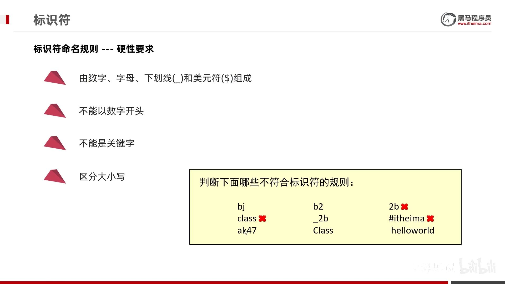

---

tags: bilibili_note

url: https://www.bilibili.com/video/BV17F411T7Ao

down_time: 2024-1-6 19:55:40

---
- [1. 字面量](#1-字面量)
- [2. 数据类型](#2-数据类型)
  - [2.1. 隐式转换](#21-隐式转换)
- [3. 运算符](#3-运算符)
  - [3.1. 算术运算符](#31-算术运算符)
    - [3.1.1. 字符的+](#311-字符的)
    - [3.1.2. 字符串的+](#312-字符串的)
  - [3.2. 自增自减运算符](#32-自增自减运算符)
  - [3.3. 逻辑运算符](#33-逻辑运算符)
  - [3.4. 赋值运算符](#34-赋值运算符)
  - [3.5. 扩展赋值运算符](#35-扩展赋值运算符)
  - [3.6. 移位运算符](#36-移位运算符)
  - [3.7. 关系运算符](#37-关系运算符)
  - [3.8. 三元运算符](#38-三元运算符)
- [4. 标识符](#4-标识符)
- [5. 流程控制语句](#5-流程控制语句)
  - [5.1. 判断语句if](#51-判断语句if)
  - [5.2. 选择语句swith](#52-选择语句swith)
  - [5.3. 循环结构](#53-循环结构)
    - [5.3.1. for](#531-for)
    - [5.3.2. while](#532-while)
    - [5.3.3. do while](#533-do-while)

---

## 1. 字面量

字面量（4类基本数据类型、一个字符串类型、一个null类型）

作用：告诉程序员，数据在程序中的书写格式。

| **字面量类型** | **说明**                                  | **程序中的写法**           |
| -------------- | ----------------------------------------- | -------------------------- |
| 整数           | 不带小数的数字                            | 666，-88                   |
| 小数           | 带小数的数字                              | 13.14，-5.21               |
| 字符           | 必须使用单引号，有且仅能一个字符          | ‘A’，‘0’，   ‘我’          |
| 字符串         | 必须使用双引号，内容可有可无              | “HelloWorld”，“黑马程序员” |
| 布尔值         | 布尔值，表示真假，只有两个值：true，false | true 、false               |
| 空值           | 一个特殊的值，空值                        | 值是：null                 |

- 字符类型，个数必须是一个。`''`和`'ABC'`都不行，`'中'`可以。
- null不能打印，`System.out.println(null); // error`
~~~java
public class Demo {
    public static void main(String[] args) {
        System.out.println(10); // 输出一个整数
        System.out.println(5.5); // 输出一个小数
        System.out.println('a'); // 输出一个字符
        System.out.println(true); // 输出boolean值true
        System.out.println("欢迎来到黑马程序员"); // 输出字符串
    }
}
~~~


## 2. 数据类型

Java语言的数据类型分为: 基本数据类型(4类8种)，引用数据类型（数组、类、String、接口）

注意：`String`不是基本数据类型，而是引用数据类型。

| 数据类型 | 关键字  | 内存字节 |                 取值范围                  |
| :------: | :-----: | :------: | :---------------------------------------: |
|   整数   |  byte   |    1     |    $[-2^{7}, 2^{7}-1]$ (-128~127)    |
|          |  short  |    2     | $[-2^{15}, 2^{15}-1]$ (-32768~32767) |
|          |   int   |    4     |        $[-2^{31}, 2^{31}-1]$ （21亿，10位数）       |
|          |  long   |    8     |        $[-2^{63}, 2^{63}-1]$         |
|  浮点数  |  float  |    4     |        1.401298e-45 ~ 3.402823e+38        |
|          | double  |    8     |      4.9000000e-324 ~ 1.797693e+308       |
|   字符   |  char   |    2     |                  $[0, 2^{16}-1]$（0-65535）                  |
|   布尔   | boolean |    1     |                true，false                |
细节：

- ​在java中整数默认是int类型 `int a = 3;`，浮点数默认是double类型 `double b=3.1;`。
- `lL`, `fF` 大小写均可。
    
    ```java
    System.out.println(9223372036854775807);    // error. 默认是 int
    System.out.println(9223372036854775807L);   // 加L才是 long

    float e = 10.1F;
    double f = 20.3;
    ```
- e+38表示是乘以10的38次方，同样，e-45表示乘以10的负45次方


基本数据类型和引用数据类型

- 基本数据类型，栈中存变量名和数据值。

- 引用数据类型。栈中存变量名和地址值，堆中存new的数据值。
### 2.1. 隐式转换

把一个取值范围小的数值，转成取值范围大的数据。

也叫自动类型提升。不需要我们额外写代码单独实现，是程序自动帮我们完成的。

* 取值范围小的，和取值范围大的进行运算，小的会先提升为大的，再进行运算。
    
    整型和浮点型：byte → short → int → long → float → double
* byte、short、char三种类型的数据在运算的时候，都会直接先提升为int，然后再进行运算。
  * char类型，
    ```java
    int a = 'a'; // 97

    char c = 'a';
    int result = c + 0;
    System.out.println(result);//97
    ```
  * byte类型
    ```java
    // 转换规则2的例子：byte类型时会自动转化为 int类型
    byte a = 10;
    byte b = 20;
    int c = a * b;      
    // byte d = a * b; // error，故而不能向下转
    byte d = (byte)(a * b); // 强制就行
    ```
- 没有布尔型，`int a = true; // error`。


## 3. 运算符
### 3.1. 算术运算符
```java
+ - * / %
// 整数相除结果只能得到整除，如果结果想要是小数，必须要有小数参数。
System.out.println( 10 / 3);//3
System.out.println(10.0 / 3);//3.3333333333333335
```

#### 3.1.1. 字符的+
```java
System.out.println('中' + '文');  // 46004

System.out.println(1 + 2 + 'b' + 3 + 4);  // 108
```
#### 3.1.2. 字符串的+

```java
System.out.println('中' + "文");  // 中文

System.out.println("abc" + 123);    // abc123
System.out.println('a' + "bc");  // abc
System.out.println(1 + 2 + "abc" + 3 + 4);  // 3abc34

System.out.println("abc" + true + null);  // abctruenull
// System.out.println(null);  // 不允许输出null
```
### 3.2. 自增自减运算符

```java
++  自增运算符
--  自减运算符
```
### 3.3. 逻辑运算符

> 逻辑运算符：`&`,`|`,`!`,`^`

```java
System.out.println(1 & 2);
System.out.println(1 | 2);
System.out.println(1 ^ 2);
System.out.println(~1);

System.out.println(true & false);
System.out.println(true | false);
System.out.println(true ^ false);
System.out.println(!true);
```

> 短路逻辑运算符：`&&`,`||`

短路逻辑运算符，只要左边确定就不运算右边（`&&`左假则假，`||`左真则真）

​&& 和 & 、||和|的运行结果都是一模一样的。但是短路逻辑运算符可以提高程序的运行效率。

### 3.4. 赋值运算符

`=`

### 3.5. 扩展赋值运算符
```java
+=、-=、*=、/=、%=
```

扩展的赋值运算符中隐层还包含了一个强制转换：`a += b;`实际上相当于 `a = (byte)(a + b);`

```java
public class OperatorDemo8 {
    public static void main(String[] args) {
        byte a = 10;
        byte b = 20;
        a += b;
        a = (byte)(a + b);
        System.out.println(a);//30
    }
}
```
### 3.6. 移位运算符

作用于byte,short,int,long,char，都是补码形式。

1. `<<` 左移

    高位舍弃，低位补0。（正负数都可）

2. `>>` 右移

    低位舍弃，高位补符号位。（正负数都可）

3. `>>>` 无符号右移

    低位舍弃，高位补0。（正数ok，负数错误）

```java
System.out.println(2 << 1);     // 4
System.out.println(-2 << 1);    // -4
System.out.println(2 >> 1);     // 1
System.out.println(-2 >> 1);    // -1
System.out.println(2 >>> 1);    // 1
System.out.println(-2 >>> 1);   // 2147483647
```
### 3.7. 关系运算符

`==、!=、>、<、>=、<=`


### 3.8. 三元运算符

`关系表达式? 表达式1: 表达式2`

## 4. 标识符



java的**关键字**全部小写。
## 5. 流程控制语句
### 5.1. 判断语句if

```java
int a = 0;
// if a==0 System.out.println(a);  // 不行
if(a==0) System.out.println(a);
if(a==0) 
    System.out.println(a);
if(a==0) {
    System.out.println(a);
}
```
### 5.2. 选择语句swith 

```java
switch (表达式) {
	case 1:
		语句体1;
		break;
	case 2:
		语句体2;
		break;
	...
	default:
		语句体n+1;
		break;
}
```
格式说明:
- 表达式取值为byte、short, int, char。
    
    JDK5以后可以是枚举，
    
    JDK7以后可以是String。
- case
    
    case后面的值只能是字面量，不能是变量
    
    case给出的值不允许重复

    同样的case可以写在一起：
    ```java
    swith(week){
        case 1,2,3,4,5:
            System.out.println("工作日");
            break;
        case 6,7:
            System.out.println("周末");
            break;
        default:
            System.out.println("错误");
    }
    ```

    不写break会引发case穿透现象
- default可以放在任意位置，也可以省略

    放在最后的default可以不写break。


jdk12的特性：用箭头，简化break；还能接受case（包括default）返回的值。

```java
int number = 10;
switch (number) {
    case 1 -> System.out.println("一");
    case 2 -> System.out.println("二");
    case 3 -> System.out.println("三");
    default -> System.out.println("其他");
}
```
```java
int number = 1;
String r = switch (number) {
    case 1 -> "一";
    case 2 -> "二";
    case 3 -> "三";
    default -> "其他";
};  // 注意结尾的分号
System.out.println(r);
```
### 5.3. 循环结构

#### 5.3.1. for
```java
// 首尾处可以有多个表达式，但必须类型相同
for(int i = 0,  j = 0; i < 10; i++, j++, System.out.println(123)) {
    System.out.println("i = " + i + " j = " + j);
}

// for(int i = 0, char j = 0; i < 10; i++, j++)     // error
```
#### 5.3.2. while

#### 5.3.3. do while
