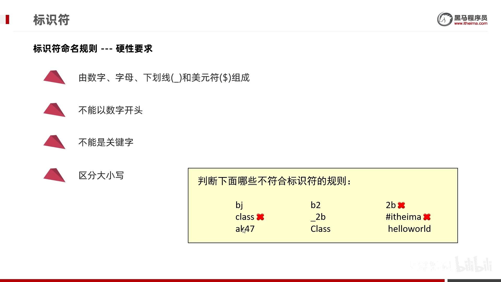
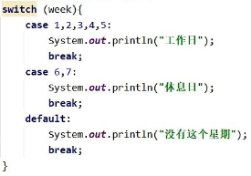

- [1. 运算符](#1-运算符)
  - [1.1. 算术运算符](#11-算术运算符)
    - [1.1.1. 字符的+](#111-字符的)
    - [1.1.2. 字符串的+](#112-字符串的)
  - [1.2. 自增自减运算符](#12-自增自减运算符)
  - [1.3. 逻辑运算符](#13-逻辑运算符)
  - [1.4. 赋值运算符](#14-赋值运算符)
  - [1.5. 扩展赋值运算符](#15-扩展赋值运算符)
  - [1.6. 移位运算符](#16-移位运算符)
  - [1.7. 关系运算符](#17-关系运算符)
  - [1.8. 三元运算符](#18-三元运算符)
- [2. 标识符](#2-标识符)
- [3. 流程控制语句](#3-流程控制语句)
  - [3.1. 判断语句if](#31-判断语句if)
  - [3.2. 选择语句swith](#32-选择语句swith)
  - [3.3. 循环结构](#33-循环结构)
    - [3.3.1. for](#331-for)
    - [3.3.2. while](#332-while)
    - [3.3.3. do while](#333-do-while)

---

## 1. 运算符
### 1.1. 算术运算符
```java
+ - * / %
// 整数相除结果只能得到整除，如果结果想要是小数，必须要有小数参数。
System.out.println( 10 / 3);//3
System.out.println(10.0 / 3);//3.3333333333333335
```

#### 1.1.1. 字符的+
```java
System.out.println('中' + '文');  // 46004

System.out.println(1 + 2 + 'b' + 3 + 4);  // 108
```
#### 1.1.2. 字符串的+

```java
System.out.println('中' + "文");  // 中文

System.out.println("abc" + 123);    // abc123
System.out.println('a' + "bc");  // abc
System.out.println(1 + 2 + "abc" + 3 + 4);  // 3abc34

System.out.println("abc" + true + null);  // abctruenull
// System.out.println(null);  // 不允许输出null
```
### 1.2. 自增自减运算符

```java
++  自增运算符
--  自减运算符
```
### 1.3. 逻辑运算符

> 逻辑运算符：`&`,`|`,`!`,`^`

```java
System.out.println(1 & 2);
System.out.println(1 | 2);
System.out.println(1 ^ 2);
System.out.println(~1);

System.out.println(true & false);
System.out.println(true | false);
System.out.println(true ^ false);
System.out.println(!true);
```

> 短路逻辑运算符：`&&`,`||`

短路逻辑运算符，只要左边确定就不运算右边（`&&`左假则假，`||`左真则真）

​&& 和 & 、||和|的运行结果都是一模一样的。但是短路逻辑运算符可以提高程序的运行效率。

### 1.4. 赋值运算符

`=`

### 1.5. 扩展赋值运算符
```java
+=、-=、*=、/=、%=
```

扩展的赋值运算符中隐层还包含了一个强制转换：`a += b;`实际上相当于 `a = (byte)(a + b);`

```java
public class OperatorDemo8 {
    public static void main(String[] args) {
        byte a = 10;
        byte b = 20;
        a += b;
        a = (byte)(a + b);
        System.out.println(a);//30
    }
}
```
### 1.6. 移位运算符

作用于byte,short,int,long,char，都是补码形式。

1. `<<` 左移

    高位舍弃，低位补0。（正负数都可）

2. `>>` 右移

    低位舍弃，高位补符号位。（正负数都可）

3. `>>>` 无符号右移

    低位舍弃，高位补0。（正数ok，负数错误）

```java
System.out.println(2 << 1);     // 4
System.out.println(-2 << 1);    // -4
System.out.println(2 >> 1);     // 1
System.out.println(-2 >> 1);    // -1
System.out.println(2 >>> 1);    // 1
System.out.println(-2 >>> 1);   // 2147483647
```
### 1.7. 关系运算符

`==、!=、>、<、>=、<=`


### 1.8. 三元运算符

`关系表达式? 表达式1: 表达式2`

## 2. 标识符



java的**关键字**全部小写。
## 3. 流程控制语句
### 3.1. 判断语句if

```java
int a = 0;
// if a==0 System.out.println(a);  // 不行
if(a==0) System.out.println(a);
if(a==0) 
    System.out.println(a);
if(a==0) {
    System.out.println(a);
}
```
### 3.2. 选择语句swith 

```java
switch (表达式) {
	case 1:
		语句体1;
		break;
	case 2:
		语句体2;
		break;
	...
	default:
		语句体n+1;
		break;
}
```
格式说明:
- 表达式取值为byte、short, int, char。long不行
    
    JDK5以后可以是枚举，
    
    JDK7以后可以是String。
- case
    
    case后面的值只能是字面量，不能是变量
    
    case给出的值不允许重复

    JDK14: 同样的case可以写在一起：
    ```java
    swith(week){
        case 1,2,3,4,5:
            System.out.println("工作日");
            break;
        case 6,7:
            System.out.println("周末");
            break;
        default:
            System.out.println("错误");
    }
    ```

    不写break会引发case穿透现象（穿透还好说，但是少了代码块，重复定义就会报错）
    ```java
    int a = 0;
    // switch (a) {
    //     case 1:
    //         int b = 0;
    //         break;
    //     case 2:
    //         int b = 0;  // Duplicate local variable b
    //         break;
    //     case 3: {
    //         int b = 0;  // Duplicate local variable b
    //         break;       // 外面已经有b了。所以要代码块全代码块
    //     }
    // }
    // ok
    switch (a) {
        case 1: {
            int b = 0;
            break;
        }
        default: {
            int b = 0;
            break;
        }
    }
    ```
- default可以放在任意位置，也可以省略

    放在最后的default可以不写break。




jdk12的特性：用箭头，简化break；还能接受case（包括default）返回的值。

```java
int number = 10;
switch (number) {
    case 1 -> System.out.println("一");
    case 2 -> System.out.println("二");
    case 3 -> System.out.println("三");
    default -> System.out.println("其他");
}
```
```java
int number = 1;
String r = switch (number) {
    case 1 -> "一";
    case 2 -> "二";
    case 3 -> "三";
    default -> "其他";
};  // 注意结尾的分号
System.out.println(r);
```
### 3.3. 循环结构

#### 3.3.1. for
```java
// 首尾处可以有多个表达式，但必须类型相同
for(int i = 0,  j = 0; i < 10; i++, j++, System.out.println(123)) {
    System.out.println("i = " + i + " j = " + j);
}

// for(int i = 0, char j = 0; i < 10; i++, j++)     // error
```
#### 3.3.2. while

#### 3.3.3. do while
