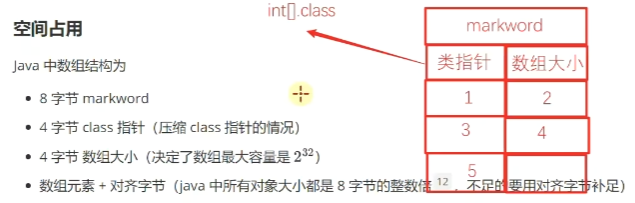
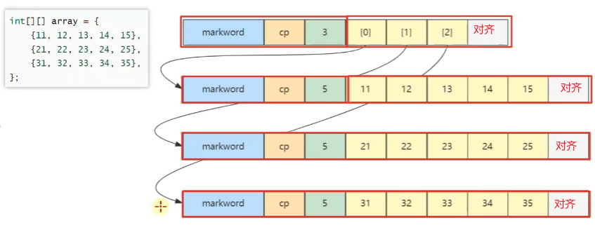
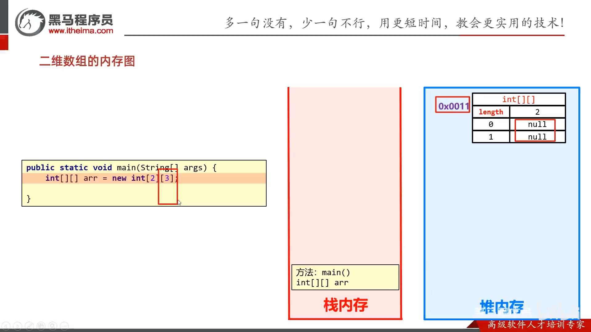
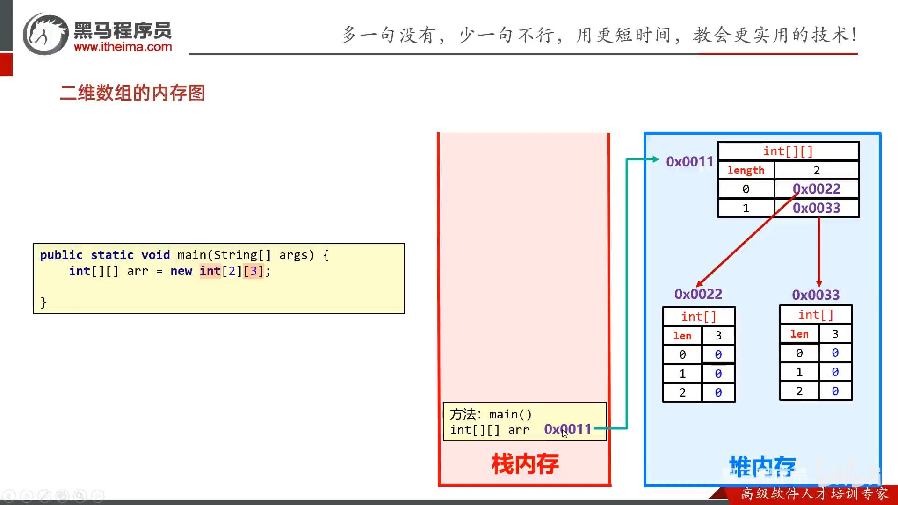
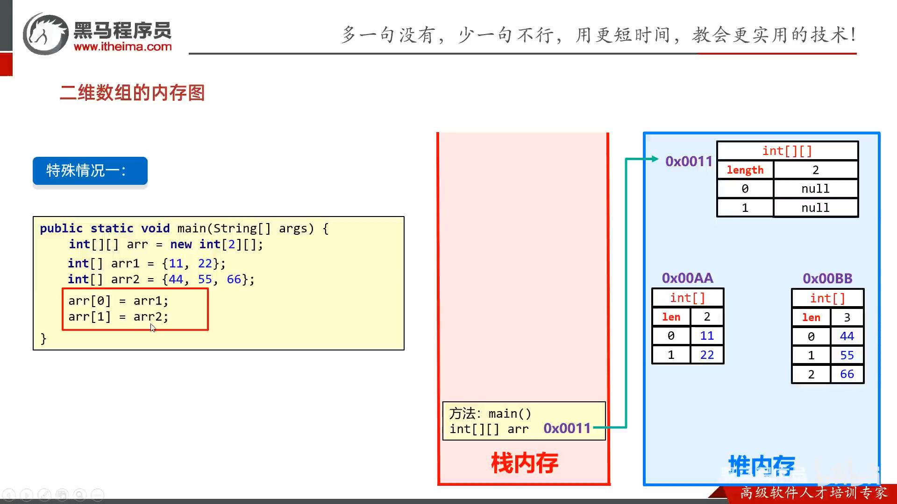
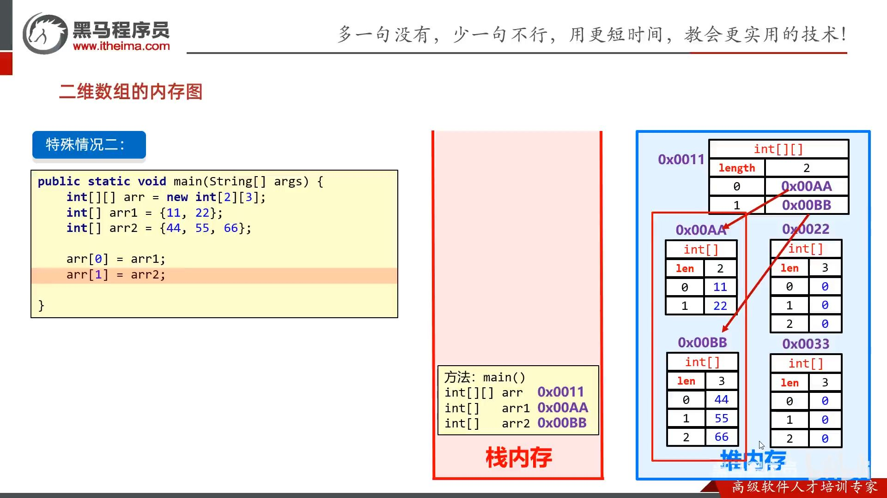
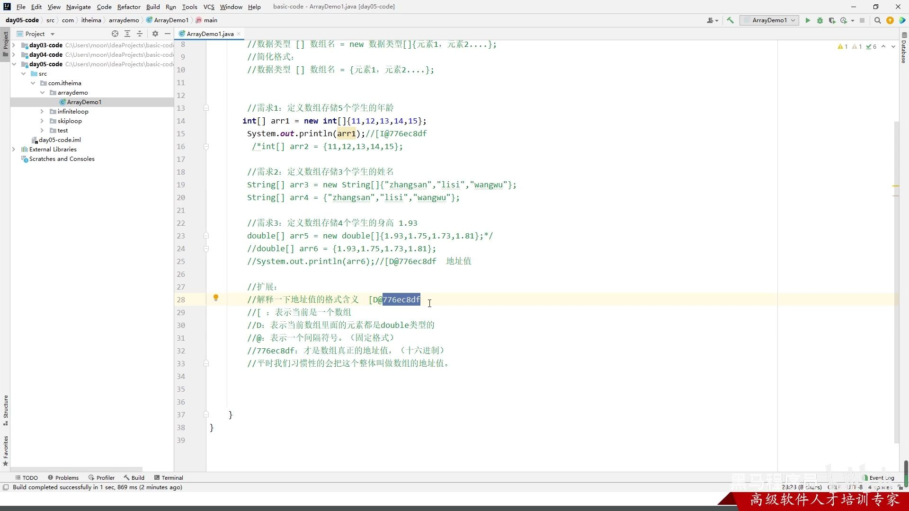

- [基本语法](#基本语法)
- [初始化](#初始化)
  - [1.1. 静态数组初始化](#11-静态数组初始化)
  - [1.2. 动态数组初始化](#12-动态数组初始化)
    - [1.2.1. 内存图](#121-内存图)
    - [1.2.2. 二维数组的动态初始化](#122-二维数组的动态初始化)

---

## 基本语法

数组名和`[]` 没有先后顺序
- `int a[]`, `int[] a`
- `int a[][]`, `int[][] a`

注意：
- 没有`// return {1, 2, 3};`，也不能是`// return int[]{1,2,3};`，java只能是`return new int[][]{1,2,3};`


可以存储的数据类型（考虑隐式转换）：
- `int[] a = {byte, short, int, char}`, 没有{boolean, float, double}

    `int[] a = {(byte)1, (short)2, 3, 'a'};`

- `double[] b = {byte, short, int, long, float, double, char}`, 没有{boolean}
- 这里可没有强制类型转化，`int[] a = new int[] {3.14};`报错

## 初始化
静态初始化：手动指定数组的元素，系统会根据元素的个数，计算出数组的长度。

动态初始化：手动指定数组长度，由系统给出默认初始化值。
### 1.1. 静态数组初始化

- `int[] a = {1,2,3};` 只是 `int[] a = new int[]{1,2,3};`的简写。
- `int[][] b = {{1,2},{3}};` 只是 `int[][] b = new int[][]{{1,2},{3}};` 的简写。

注意：
- 大括号`{}`。
- 没有`// int[3] a = {1, 2, 3};`，java不指定`[]`内的个数。

### 1.2. 动态数组初始化

动态数组初始化：`int[] b = new int[3];`

可动态变量来指定大小，`new int[n]`


动态数组的默认初始化值：
- 整数类型：`0`
- 小数类型：`0.0`
- 布尔类型：`false`
- 字符类型：`'\u0000'` 空格
- 引用类型：`null`

#### 1.2.1. 内存图






- 数组引用的数组：32 个字节，其中 array[0]，array[1]，array[2] 三个元素分别保存了指向三个一维数组的引用
- 三个实际元素的数组各占 40 个字节
- 它们在内层布局上是**连续**的

> 已知 array **对象**起始地址是 0x1000，那么 23 这个元素的地址是什么？
>
> ```java
> byte[][] array = {
>     {11, 12, 13, 14, 15},
>     {21, 22, 23, 24, 25},
>     {31, 32, 33, 34, 35},
> };
> ```
> 
>  答：
> * 起始地址 0x1000
> * 外层数组大小：16字节对象头 + 3元素 * 每个引用4字节 + 4 对齐字节 = 32 = 0x20
> * 第一个内层数组大小：16字节对象头 + 5元素 * 每个byte1字节 + 3 对齐字节 = 24 = > 0x18
> * 第二个内层数组，16字节对象头 = 0x10，待查找元素索引为 2
> * 最后结果 = 0x1000 + 0x20 + 0x18 + 0x10 + 2*1 = 0x104a


#### 1.2.2. 二维数组的动态初始化


- 初始化时：每行的地址先是null，null再自动被每列的地址所取代。





特殊情况一，不等长二维数组：每行先保存null，再被手动取代。




特殊情况二：取代原默认数组的地址。




数组的地址：



