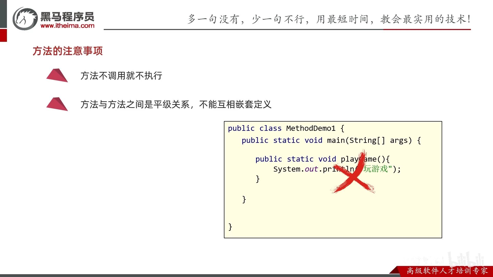
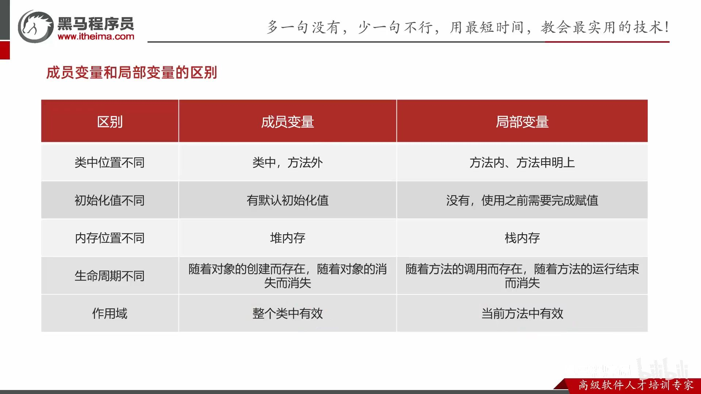
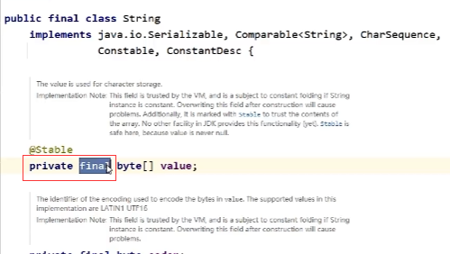
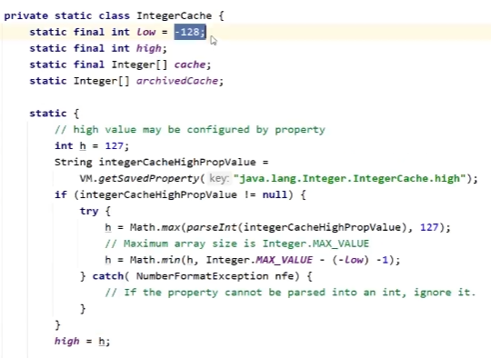

- [1. 方法](#1-方法)
  - [1.1. 方法重载 Overload、方法重写 Override、方法引用](#11-方法重载-overload方法重写-override方法引用)
  - [1.2. 可变参数](#12-可变参数)
- [2. 类](#2-类)
  - [2.1. 权限修饰符](#21-权限修饰符)
  - [2.2. 构造方法](#22-构造方法)
  - [2.3. JavaBean类](#23-javabean类)
  - [2.4. this](#24-this)
  - [2.5. 成员变量](#25-成员变量)
  - [2.6. static静态变量](#26-static静态变量)
  - [2.7. 内部类](#27-内部类)
    - [2.7.1. 成员内部类](#271-成员内部类)
    - [2.7.2. 静态内部类](#272-静态内部类)
    - [2.7.3. 局部内部类](#273-局部内部类)
    - [2.7.4. 匿名内部类](#274-匿名内部类)
- [3. 包](#3-包)
- [4. final](#4-final)
- [5. 代码块](#5-代码块)
  - [5.1. 局部代码块：用完之后立马回收，节省内存。](#51-局部代码块用完之后立马回收节省内存)
  - [5.2. 构造代码块：抽出构造方法中重复的部分。](#52-构造代码块抽出构造方法中重复的部分)
  - [5.3. 静态代码块](#53-静态代码块)
- [6. 对象克隆](#6-对象克隆)

---
## 1. 方法

1. 因为Java都是类，所以无所谓写的位置先后。

2. 方法必须绑定类，所以不能互相嵌套定义。



### 1.1. 方法重载 Overload、方法重写 Override、方法引用

|方法|函数名|类|形参|返回值|
|-|-|-|-|-|
|方法重载|同名|同一个类|形参不同|随便|
|方法重写|同名|父子类|形参相同|小于等于|
|方法引用|随便|随便|形参相同|返回值相同|


- 形参相同不同：个数，类型，类型顺序。**与参数具体名字无关**。

```java
// 方法重载
public class ArgsDemo3 {
    public static void main(String[] args) {
        load1(1, "a");
        load2("a", 1);
        System.out.println(load3());
    }

    public static void load1(int a, String b){
        System.out.println("load1" + a + b);
    }

    public static void load2(String a, int b){
        System.out.println("load2" + a + b);
    }

    // 与返回值无关，可以改变返回类型。
    public static String load3(){
        return "load3";
    }
}
```
 
```java
// 方法重写
public class Dog extends Animal {
    public static void main(String[] args) {
        Dog dog = new Dog();
        dog.load1(1, "2");
        dog.load2("1", 2);
        System.out.println(dog.load3());
    }

    // 与参数具体名字无关
    @Override
    public void load1(int a2, String b2){
        System.out.println("load1" + a2 + b2);
    }

    @Override
    public void load2(String a2, int b2){
        System.out.println("load2" + a2 + b2);
    }

    @Override
    public String load3(){
        return "load3";
    }
}

class Animal {
    public void load1(int a, String b){
        System.out.println("load1" + a + b);
    }

    public void load2(String a, int b){
        System.out.println("load2" + a + b);
    }

    public String load3(){
        return "load3";
    }
}
```

### 1.2. 可变参数

```java
public class ArgsDemo3 {
    public static void main(String[] args) {
        // 计算n个数据的和
        int[] arr = { 1, 2, 3, 4, 5, 6, 7, 8, 9, 10 };
        int sum = getSum1(arr);
        System.out.println(sum);

        int sum2 = getSum2(1, 2, 3, 4, 5, 6, 7, 8, 9, 10);
        System.out.println(sum2);
        
        // 也可以传入一个数组
        int sum3 = getSum2(arr);
        System.out.println(sum3);
    }

    public static int getSum1(int[] arr) {
        int sum = 0;
        for (int i : arr) {
            sum = sum + i;
        }
        return sum;
    }

    // 可变参数: JDK5
    // 格式：属性类型...名字
    // 底层：
    //    可变参数底层就是一个数组
    //    只不过不需要我们自己创建了，Java会帮我们创建好
    public static int getSum2(int... args) {
        // System.out.println(args);  //[I@119d7047
        System.out.println(args.length);
        int sum = 0;
        for (int i : args) {
            sum = sum + i;
        }
        return sum;
    }

    // 可变参数的小细节：
    // 1.在方法的形参中最多只能写一个可变参数
    // 2.在方法的形参当中，如果出了可变参数以外，还有其他的形参，那么可变参数要写在最后
    public static int getSum3(int a, int... args) {
        return 0;
    }
}
```

## 2. 类


### 2.1. 权限修饰符

`private, 缺省, protected, public`，修饰成员变量和成员方法。

private 成员变量 + public set/get方法

### 2.2. 构造方法
无参构造方法：

- 系统将给出一个默认的无参数构造方法

- 如果定义了构造方法（不管无参还是有参），系统将不再提供默认的构造方法

- 建议写了有参，也写上无参的。

### 2.3. JavaBean类


### 2.4. this


- 成员方法的参数列表有一个隐藏的this，写不写都行，实参由JVM传入。
    
    

- 而静态方法则没有this关键字。


### 2.5. 成员变量



### 2.6. static静态变量

[🚩面向对象进阶-01-static-静态变量 P121 - 17:53](https://www.bilibili.com/video/BV17F411T7Ao?p=121&t=1072)


static:

- 当.class字节码文件被加载到方法区后，并创建静态区（单独存放静态变量的空间。jdk7前，不管静态还是成员变量都在方法区；jdk7起，静态变量在堆内存。PS：静态方法还是在方法区）。静态区存放此类的所有静态变量，并默认初始化。

- 随着类的加载而加载，优先于对象存在。

- 静态方案只能访问静态（静态方法和静态变量）。

### 2.7. 内部类


#### 2.7.1. 成员内部类


获取成员内部类对象的两种方式


内部类访问重名的变量：内部类中有隐藏的this变量来记录外部类对象的地址值。


【内存图】

[🚩面向对象进阶-21-成员内部类 P141 - 32:13](https://www.bilibili.com/video/BV17F411T7Ao?p=141&t=1932)


#### 2.7.2. 静态内部类


#### 2.7.3. 局部内部类

同局部变量一样可修饰的(final)和不可修饰(public等)。


#### 2.7.4. 匿名内部类

编译后会有对应的字节码文件


类的多态：只用一次的类，就没必要创建一个类，用匿名内部类。


## 3. 包

包结构：模块/src/com.包名/类


import 冲突


只导一个：


建议：都用全类名。


## 4. final
常量必须要给初始值。


 String为什么不可改变？因为final固定字节数组value，而且private声明是私有，且没有提供setter方法。



## 5. 代码块

局部代码块、构造代码块、静态代码块。

### 5.1. 局部代码块：用完之后立马回收，节省内存。


### 5.2. 构造代码块：抽出构造方法中重复的部分。

每次创建对象时，优先于构造方法执行。


被取代：


### 5.3. 静态代码块

可以创建局部变量；只能修改静态变量的值。


10. 

## 6. 对象克隆


