---

tags: bilibili_note

url: https://www.bilibili.com/video/BV17F411T7Ao

down_time: 2024-1-6 19:55:40

---
- [1. Java语言的发展](#1-java语言的发展)
- [2. 环境变量的配置](#2-环境变量的配置)
- [3. main函数](#3-main函数)
- [4. System类](#4-system类)
  - [4.1. exit函数](#41-exit函数)
  - [4.2. 输出](#42-输出)
- [5. 字面量](#5-字面量)
- [6. 数据类型](#6-数据类型)
  - [6.1. 隐式转换](#61-隐式转换)
- [7. 运算符](#7-运算符)
  - [7.1. 算术运算符](#71-算术运算符)
  - [7.2. 逻辑运算符](#72-逻辑运算符)
- [8. 标识符](#8-标识符)
- [9. swith](#9-swith)
- [10. 数组](#10-数组)
  - [10.1. 静态数组初始化：](#101-静态数组初始化)
  - [10.2. 动态数组初始化](#102-动态数组初始化)
    - [10.2.1. 内存图](#1021-内存图)
    - [10.2.2. 二维数组的动态初始化](#1022-二维数组的动态初始化)
- [11. 方法](#11-方法)
  - [11.1. 方法重载 Overload、方法重写 Override、方法引用](#111-方法重载-overload方法重写-override方法引用)
  - [11.2. 可变参数](#112-可变参数)
- [12. 类](#12-类)
  - [12.1. 权限修饰符](#121-权限修饰符)
  - [12.2. 构造方法](#122-构造方法)
  - [12.3. JavaBean类](#123-javabean类)
  - [12.4. this](#124-this)
  - [12.5. 成员变量](#125-成员变量)
  - [12.6. static静态变量](#126-static静态变量)
  - [12.7. 内部类](#127-内部类)
    - [12.7.1. 成员内部类](#1271-成员内部类)
    - [12.7.2. 静态内部类](#1272-静态内部类)
    - [12.7.3. 局部内部类](#1273-局部内部类)
    - [12.7.4. 匿名内部类](#1274-匿名内部类)
- [13. 包](#13-包)
- [14. final](#14-final)
- [15. 代码块](#15-代码块)
  - [15.1. 局部代码块：用完之后立马回收，节省内存。](#151-局部代码块用完之后立马回收节省内存)
  - [15.2. 构造代码块：抽出构造方法中重复的部分。](#152-构造代码块抽出构造方法中重复的部分)
  - [15.3. 静态代码块](#153-静态代码块)
- [16. 对象克隆](#16-对象克隆)


## 1. Java语言的发展


1.4之后就直接5-17

长期支持LTS：8、11、17

在SE（标准版）的基础上，有EE（企业版）和ME（小型版）。


java跨平台靠JVM，java程序运行在JVM里，而不是直接运行在计算机上。

JDK（java开发工具包）：JVM，核心类库，运行工具（javac,java,jhat等）

JRE（java运行环境）：JVM，核心类库，运行工具（javac,java,jhat等），但是精简掉开发的东西。

JDK包含了JRE，JRE包含了JVM。

## 2. 环境变量的配置

[🚩Java入门-10-Java学习-环境变量 P10 - 02:21](https://www.bilibili.com/video/BV17F411T7Ao?p=10&t=140)

[🚩Java入门-10-Java学习-环境变量 P10 - 02:50](https://www.bilibili.com/video/BV17F411T7Ao?p=10&t=169)


可以直接 `java xxx.java`


`C:\Program Files\Common Files\Oracle\Java\javapath`

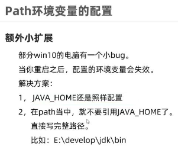

## 3. main函数


## 4. System类

### 4.1. exit函数


### 4.2. 输出


## 5. 字面量

字面量（4类基本数据类型和一个null类型）

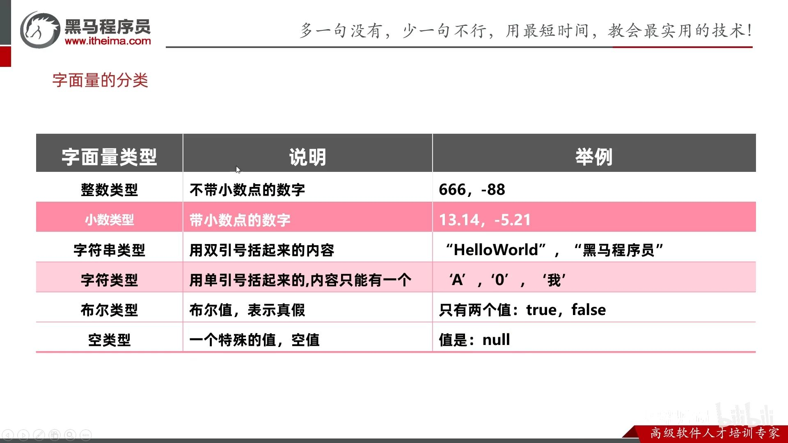

- 字符类型，个数必须是一个。`''`和`'ABC'`都不行，`'中'`可以。

- null不能打印，`System.out.println(null); // error`


## 6. 数据类型

Java语言的数据类型分为: 基本数据类型(4类8种)，引用数据类型（数组、类、String、接口）

注意：`String`不是基本数据类型，而是引用数据类型。


基本数据类型和引用数据类型

- 基本数据类型，栈中存变量名和数据值。

- 引用数据类型。栈中存变量名和地址值，堆中存new的数据值。

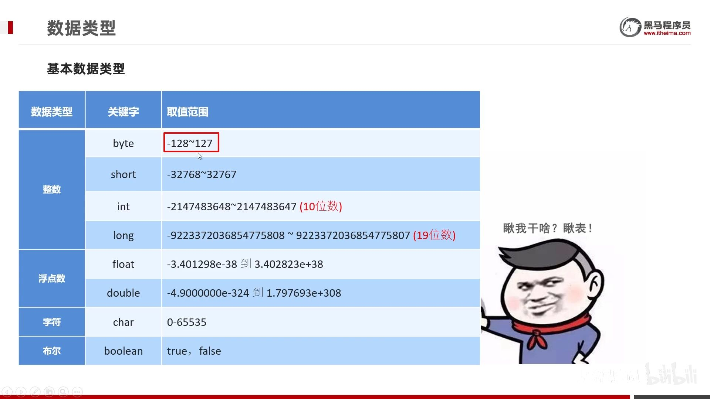

细节：

`lL`, `fF` 大小写均可。

```java
System.out.println(9223372036854775807);    // error. 默认是 int
System.out.println(9223372036854775807L);   // 加L才是 long
```
### 6.1. 隐式转换

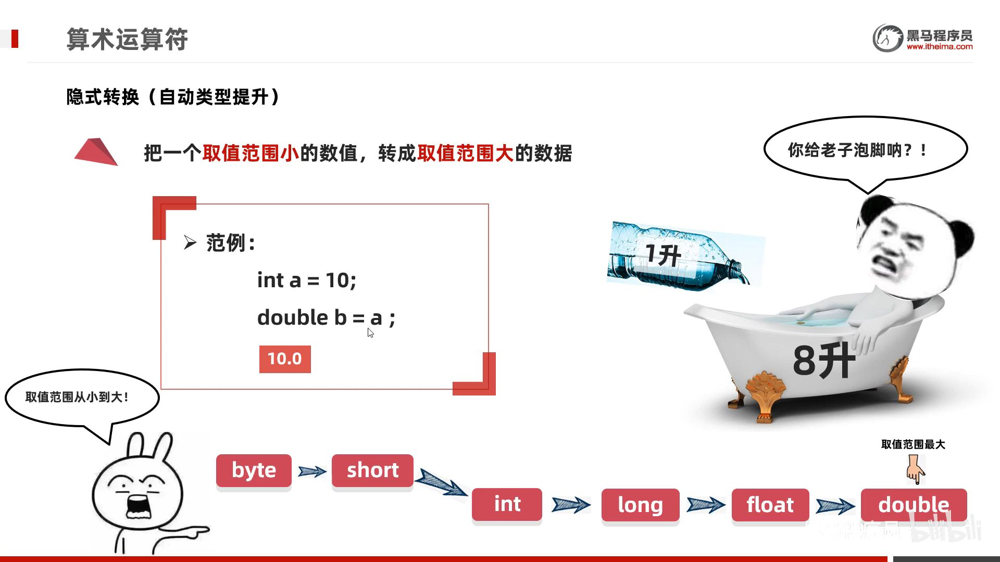

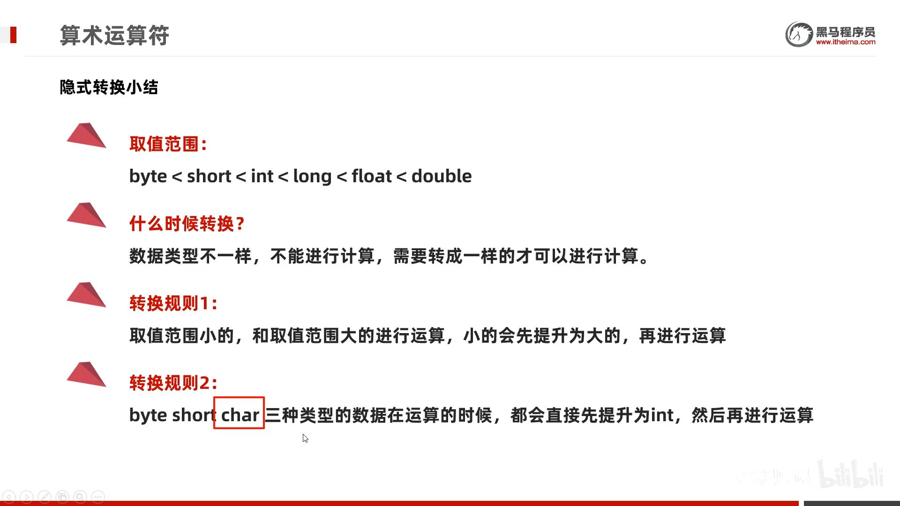

转换主要是，整型和浮点型。还有char类型，`int a = 'a'; // 97`

没有布尔型，`int a = true; // error`。

`10/3 = 3`, `10.0/3 = 3.3333333333333`

```java
// 转换规则2的例子：byte类型相加时会自动转化为 int类型
byte a = 10;
byte b = 20;
int c = a + b;      
// byte d = a + b; // error，故而不能向下转
byte d = (byte)(a + b); // 强制就行
```
## 7. 运算符
### 7.1. 算术运算符

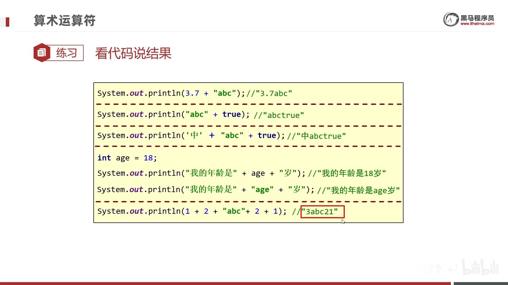

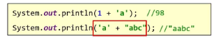

### 7.2. 逻辑运算符

逻辑运算符：`&`,`|`,`!`,`^`

短路逻辑运算符：`&&`,`||`

短路逻辑运算符，只要左边确定就不运算右边（`&&`左假则假，`||`左真则真）

## 8. 标识符


java的**关键字**全部小写。

## 9. swith 

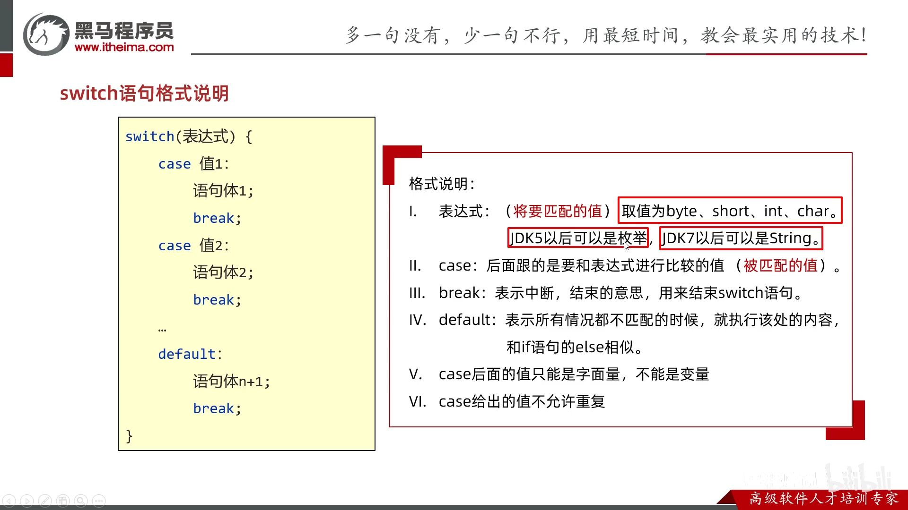

同样的case可以写在一起：


jdk12的特性：用箭头，简化break；还能接受case（包括default）返回的值。


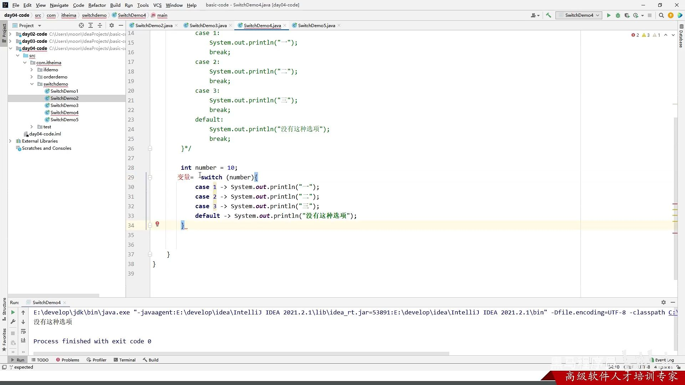

## 10. 数组

> 基本语法

数组名和`[]` 没有先后顺序
- `int a[]`, `int[] a`
- `int a[][]`, `int[][] a`

注意：
- 没有`// return {1, 2, 3};`，也不能是`// return int[]{1,2,3};`，java只能是`return new int[][]{1,2,3};`


可以存储的数据类型（考虑隐式转换）：
- `int[] a = {byte, short, int, char}`, 没有{boolean, float, double}

    `int[] a = {(byte)1, (short)2, 3, 'a'};`

- `double[] b = {byte, short, int, long, float, double, char}`, 没有{boolean}
- 这里可没有强制类型转化，`int[] a = new int[] {3.14};`报错
### 10.1. 静态数组初始化：
- `int[] a = {1,2,3};` 只是 `int[] a = new int[]{1,2,3};`的简写。
- `int[][] b = {{1,2},{3}};` 只是 `int[][] b = new int[][]{{1,2},{3}};` 的简写。

注意：
- 没有`// int[3] a = {1, 2, 3};`，java不指定`[]`内的个数。

### 10.2. 动态数组初始化

动态数组初始化：`int[] b = new int[3];`

可动态变量来指定大小，`new int[n]`


动态数组的默认初始化值：

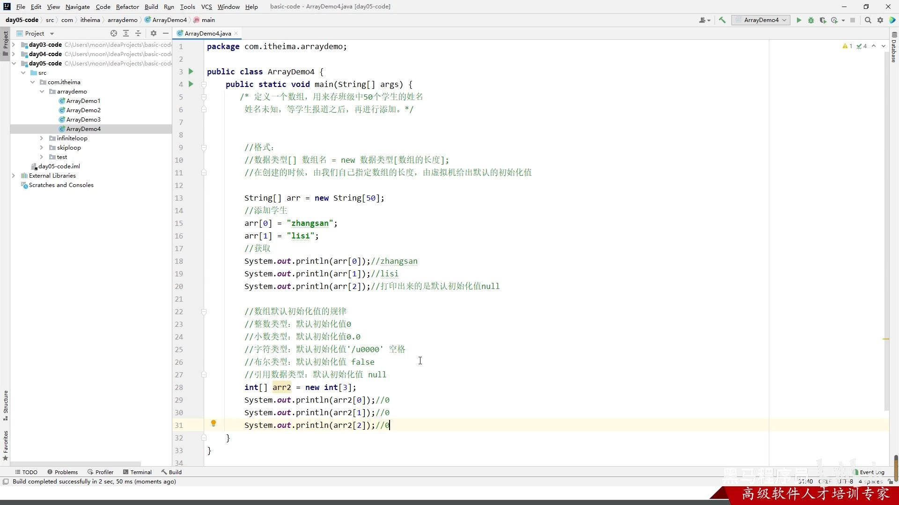

#### 10.2.1. 内存图

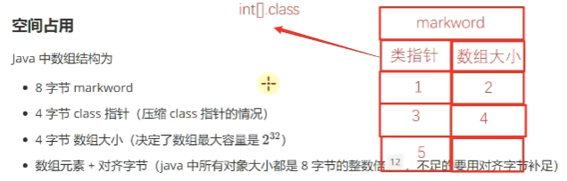

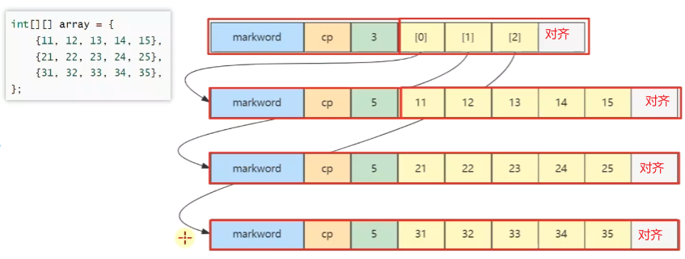


- 数组引用的数组：32 个字节，其中 array[0]，array[1]，array[2] 三个元素分别保存了指向三个一维数组的引用
- 三个实际元素的数组各占 40 个字节
- 它们在内层布局上是**连续**的

> 已知 array **对象**起始地址是 0x1000，那么 23 这个元素的地址是什么？
>
> ```java
> byte[][] array = {
>     {11, 12, 13, 14, 15},
>     {21, 22, 23, 24, 25},
>     {31, 32, 33, 34, 35},
> };
> ```
> 
>  答：
> * 起始地址 0x1000
> * 外层数组大小：16字节对象头 + 3元素 * 每个引用4字节 + 4 对齐字节 = 32 = 0x20
> * 第一个内层数组大小：16字节对象头 + 5元素 * 每个byte1字节 + 3 对齐字节 = 24 = > 0x18
> * 第二个内层数组，16字节对象头 = 0x10，待查找元素索引为 2
> * 最后结果 = 0x1000 + 0x20 + 0x18 + 0x10 + 2*1 = 0x104a


#### 10.2.2. 二维数组的动态初始化


- 初始化时：每行的地址先是null，null再自动被每列的地址所取代。

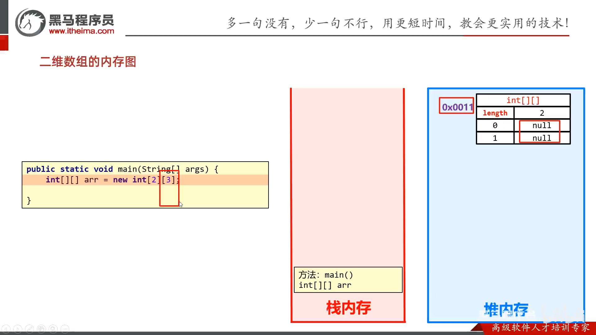

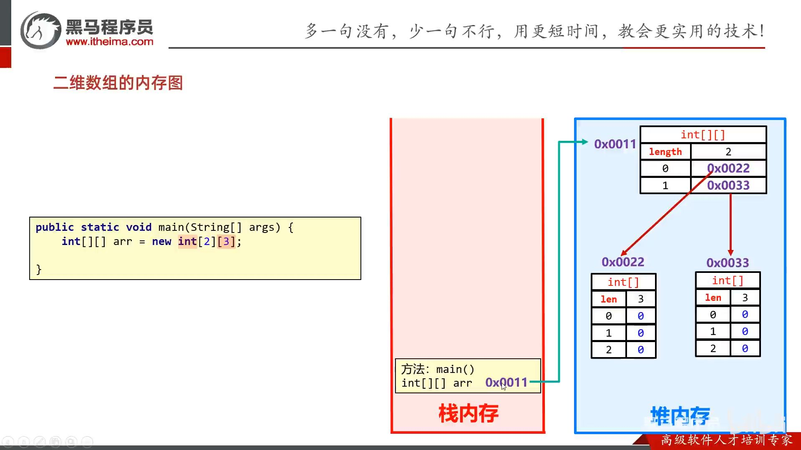

特殊情况一，不等长二维数组：每行先保存null，再被手动取代。


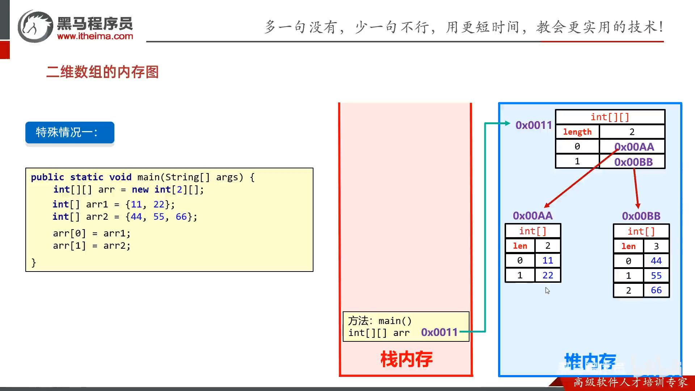

特殊情况二：取代原默认数组的地址。

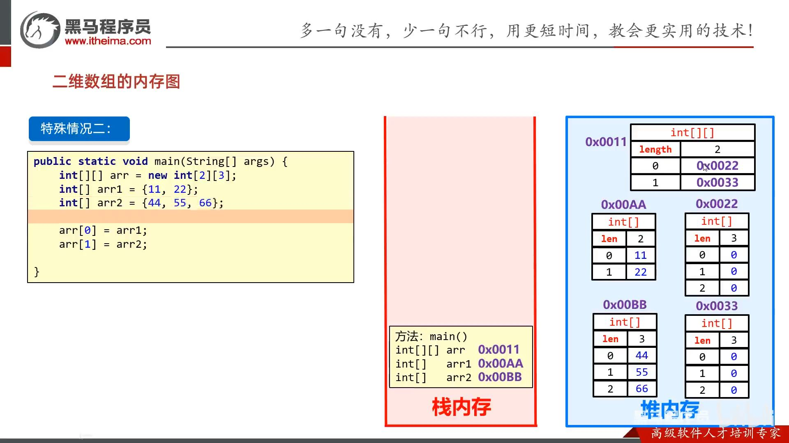

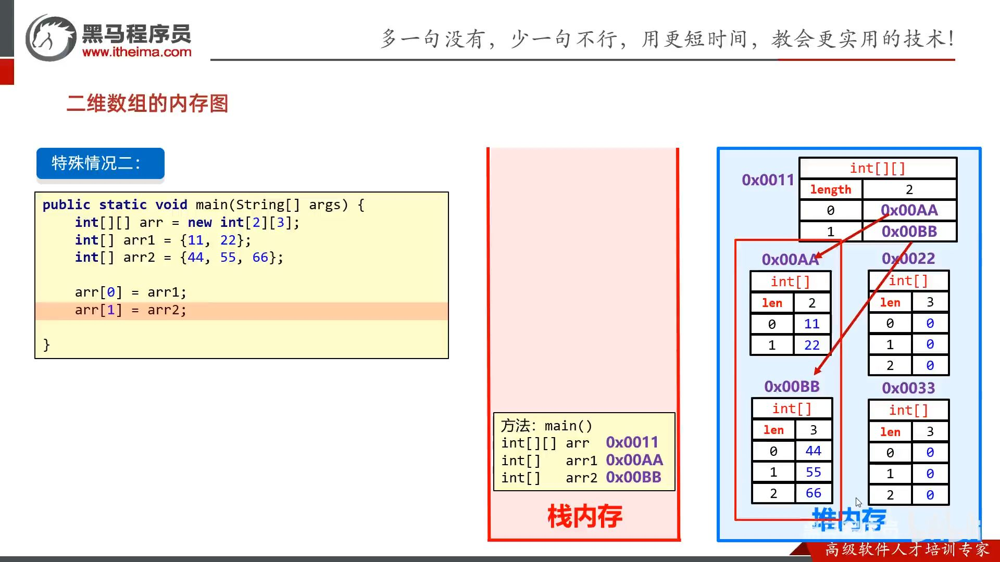

数组的地址：

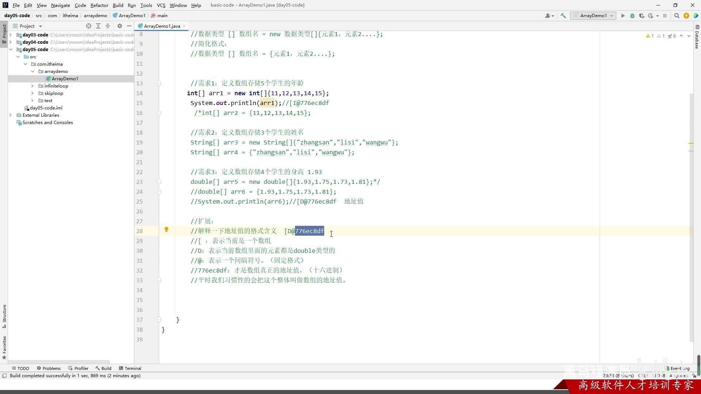


## 11. 方法

1. 因为Java都是类，所以无所谓写的位置先后。

2. 方法必须绑定类，所以不能互相嵌套定义。


### 11.1. 方法重载 Overload、方法重写 Override、方法引用

|方法|函数名|类|形参|返回值|
|-|-|-|-|-|
|方法重载|同名|同一个类|形参不同|随便|
|方法重写|同名|父子类|形参相同|小于等于|
|方法引用|随便|随便|形参相同|返回值相同|


- 形参相同不同：个数，类型，类型顺序。**与参数具体名字无关**。

```java
// 方法重载
public class ArgsDemo3 {
    public static void main(String[] args) {
        load1(1, "a");
        load2("a", 1);
        System.out.println(load3());
    }

    public static void load1(int a, String b){
        System.out.println("load1" + a + b);
    }

    public static void load2(String a, int b){
        System.out.println("load2" + a + b);
    }

    // 与返回值无关，可以改变返回类型。
    public static String load3(){
        return "load3";
    }
}
```
 
```java
// 方法重写
public class Dog extends Animal {
    public static void main(String[] args) {
        Dog dog = new Dog();
        dog.load1(1, "2");
        dog.load2("1", 2);
        System.out.println(dog.load3());
    }

    // 与参数具体名字无关
    @Override
    public void load1(int a2, String b2){
        System.out.println("load1" + a2 + b2);
    }

    @Override
    public void load2(String a2, int b2){
        System.out.println("load2" + a2 + b2);
    }

    @Override
    public String load3(){
        return "load3";
    }
}

class Animal {
    public void load1(int a, String b){
        System.out.println("load1" + a + b);
    }

    public void load2(String a, int b){
        System.out.println("load2" + a + b);
    }

    public String load3(){
        return "load3";
    }
}
```

### 11.2. 可变参数

```java
public class ArgsDemo3 {
    public static void main(String[] args) {
        // 计算n个数据的和
        int[] arr = { 1, 2, 3, 4, 5, 6, 7, 8, 9, 10 };
        int sum = getSum1(arr);
        System.out.println(sum);

        int sum2 = getSum2(1, 2, 3, 4, 5, 6, 7, 8, 9, 10);
        System.out.println(sum2);
        
        // 也可以传入一个数组
        int sum3 = getSum2(arr);
        System.out.println(sum3);
    }

    public static int getSum1(int[] arr) {
        int sum = 0;
        for (int i : arr) {
            sum = sum + i;
        }
        return sum;
    }

    // 可变参数: JDK5
    // 格式：属性类型...名字
    // 底层：
    //    可变参数底层就是一个数组
    //    只不过不需要我们自己创建了，Java会帮我们创建好
    public static int getSum2(int... args) {
        // System.out.println(args);  //[I@119d7047
        int sum = 0;
        for (int i : args) {
            sum = sum + i;
        }
        return sum;
    }

    // 可变参数的小细节：
    // 1.在方法的形参中最多只能写一个可变参数
    // 2.在方法的形参当中，如果出了可变参数以外，还有其他的形参，那么可变参数要写在最后
    public static int getSum3(int a, int... args) {
        return 0;
    }
}
```

## 12. 类


### 12.1. 权限修饰符

`private, 缺省, protected, public`，修饰成员变量和成员方法。

private 成员变量 + public set/get方法

### 12.2. 构造方法
无参构造方法：

- 系统将给出一个默认的无参数构造方法

- 如果定义了构造方法（不管无参还是有参），系统将不再提供默认的构造方法

- 建议写了有参，也写上无参的。

### 12.3. JavaBean类


### 12.4. this


- 成员方法的参数列表有一个隐藏的this，写不写都行，实参由JVM传入。
    
    

- 而静态方法则没有this关键字。


### 12.5. 成员变量


### 12.6. static静态变量

[🚩面向对象进阶-01-static-静态变量 P121 - 17:53](https://www.bilibili.com/video/BV17F411T7Ao?p=121&t=1072)


static:

- 当.class字节码文件被加载到方法区后，并创建静态区（单独存放静态变量的空间。jdk7前，不管静态还是成员变量都在方法区；jdk7起，静态变量在堆内存。PS：静态方法还是在方法区）。静态区存放此类的所有静态变量，并默认初始化。

- 随着类的加载而加载，优先于对象存在。

- 静态方案只能访问静态（静态方法和静态变量）。

### 12.7. 内部类


#### 12.7.1. 成员内部类


获取成员内部类对象的两种方式


内部类访问重名的变量：内部类中有隐藏的this变量来记录外部类对象的地址值。


【内存图】

[🚩面向对象进阶-21-成员内部类 P141 - 32:13](https://www.bilibili.com/video/BV17F411T7Ao?p=141&t=1932)


#### 12.7.2. 静态内部类


#### 12.7.3. 局部内部类

同局部变量一样可修饰的(final)和不可修饰(public等)。


#### 12.7.4. 匿名内部类

编译后会有对应的字节码文件


类的多态：只用一次的类，就没必要创建一个类，用匿名内部类。


## 13. 包

包结构：模块/src/com.包名/类


import 冲突


只导一个：


建议：都用全类名。


## 14. final
常量必须要给初始值。


 String为什么不可改变？因为final固定字节数组value，而且private声明是私有，且没有提供setter方法。


## 15. 代码块

局部代码块、构造代码块、静态代码块。

### 15.1. 局部代码块：用完之后立马回收，节省内存。


### 15.2. 构造代码块：抽出构造方法中重复的部分。

每次创建对象时，优先于构造方法执行。


被取代：


### 15.3. 静态代码块

可以创建局部变量；只能修改静态变量的值。


10. 

## 16. 对象克隆


