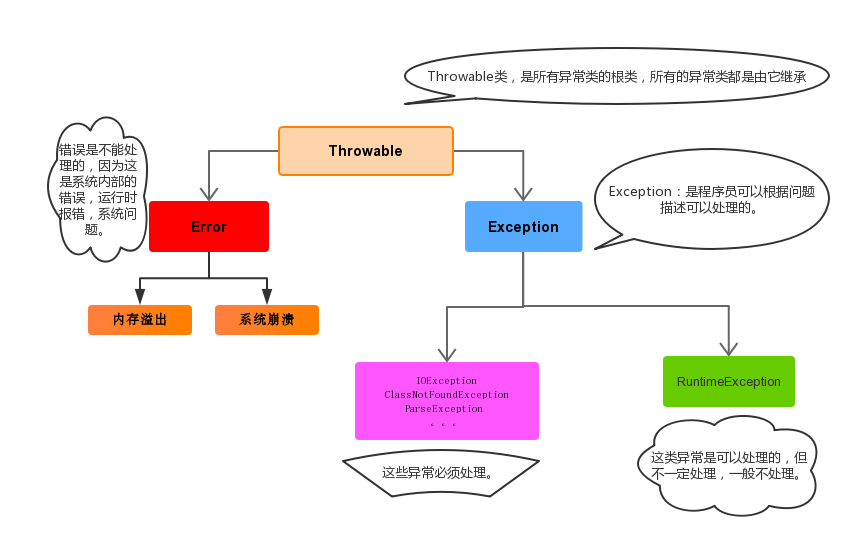
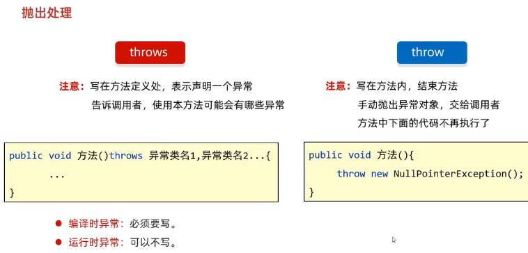

- [1. 概念](#1-概念)
- [2. 异常信息](#2-异常信息)
- [3. 抛出异常](#3-抛出异常)
- [4. 异常类如何定义](#4-异常类如何定义)

---
## 1. 概念

> 异常指的并不是语法错误，从而编译不通过，不会产生字节码文件，根本不能运行.

异常本身是一个类，产生异常就是创建异常对象并抛出了一个异常对象。Java处理异常的方式是中断处理，JVM的非正常停止。



异常的根类是`java.lang.Throwable`，其下有两个子类：`java.lang.Error`与`java.lang.Exception`，平常所说的异常指`java.lang.Exception`。

异常(Exception)的分类: 根据在编译时期还是运行时期去检查异常?

- 编译时异常: 直接继承于`Exception`的异常。
    
    在编译阶段就会提示错误，如果没有处理异常，则编译失败。(如日期格式化异常)

    意义：提醒程序员检查本地信息。比如，文件不存在 `FileNotFoundException`、数据库未初始化。

- 运行时异常: `RuntimeException`本身和子类。
    
    在编译阶段不报错，运行时才出现。(如数学异常)

    意义：参数错误而导致的问题。比如，输入不该是空指针 `NullPointerException`，算数不该除0 `ArithmeticException` 。


当多异常处理时，捕获处理，前边的类不能是后边类的父类。父类一定要写在下面
```java
// 子类
catch(NullPointerException e){
    System.out.println("空指针异常");
// 父类
}catch (Exception e){
    System.out.println("Exception");
}
```
JDK7特性：A异常或者B异常，中间用`|`进行隔开
```java
catch(ArrayIndexOutOfBoundsException | ArithmeticException e){}
```
- 在try-catch后可以追加finally代码块，其中的代码一定会被执行，通常用于资源回收。
## 2. 异常信息

Throwable类中定义了一些查看方法:

- `public String getMessage()`:获取异常的描述信息
- `public String toString()`:获取异常的类型、异常描述信息。
- `public void printStackTrace()`: 异常的类型、异常描述信息、栈信息，并直接输出到控制台。

```java
int[] arr = { 1, 2, 3 };
try {
    System.out.println(arr[10]);
} catch (ArrayIndexOutOfBoundsException e) {
    String message = e.getMessage();
    System.out.println(message);
    // Index 10 out of bounds for length 6

    String str = e.toString();
    System.out.println(str);
    // java.lang.ArrayIndexOutOfBoundsException: Index 10 out of bounds for length 6

    e.printStackTrace();
    // java.lang.ArrayIndexOutOfBoundsException: Index 10 out of bounds for length 3
    //         at MyStringDemo.main(MyStringDemo.java:9)
}
System.out.println("这三个方法都不打断程序的运行");
```

## 3. 抛出异常
- `throws`: 运用于**方法声明**之上
- `throw`: 用在**方法内**抛出异常

注意：
- 运行时异常 RuntimeException 可以不捕获 `throw`（被抛出可以不处理），也不声明抛出 `throws`。
- 如果父类抛出了 `throws` 多个异常，子类覆盖父类方法时，只能抛出 `throws` 相同的异常或者是他的子集。
- 父类方法没有抛出异常，子类覆盖父类该方法时也不可抛出异常。此时子类产生该异常，只能捕获处理，不能声明抛出 `throws`



```java
public class ExceptionDemo12 {
    public static void main(String[] args) {
        int[] arr = null;
        int max = 0;
        try {
            max = getMax(arr);
        } catch (NullPointerException e) {
            System.out.println("空指针异常");
        } catch (ArrayIndexOutOfBoundsException e) {
            System.out.println("索引越界异常");
        }
        System.out.println(max);
    }

    
    // 运行时异常 RuntimeException 可以不用写
    // public static int getMax(int[] arr) throws NullPointerException, ArrayIndexOutOfBoundsException {
    public static int getMax(int[] arr) {
        if (arr == null) {
            throw new NullPointerException();
        }

        if (arr.length == 0) {
            throw new ArrayIndexOutOfBoundsException();
        }

        System.out.println("看看我执行了吗？");
        int max = arr[0];
        for (int i = 1; i < arr.length; i++) {
            if (arr[i] > max) {
                max = arr[i];
            }
        }
        return max;
    }
}
```

## 4. 异常类如何定义

步骤：
1. 见名知意，定义异常类类名。
2. 决定继承哪种异常：
   - 编译期异常，继承于`java.lang.Exception`。
   - 运行时期的异常类，继承于`java.lang.RuntimeException`。
3. 两个构造函数
   - 空参构造
   - 带参构造。


```java
public class AgeOutOfBoundsException extends RuntimeException{

    public AgeOutOfBoundsException() {
    }

    public AgeOutOfBoundsException(String message) {
        super(message);
    }
}

```