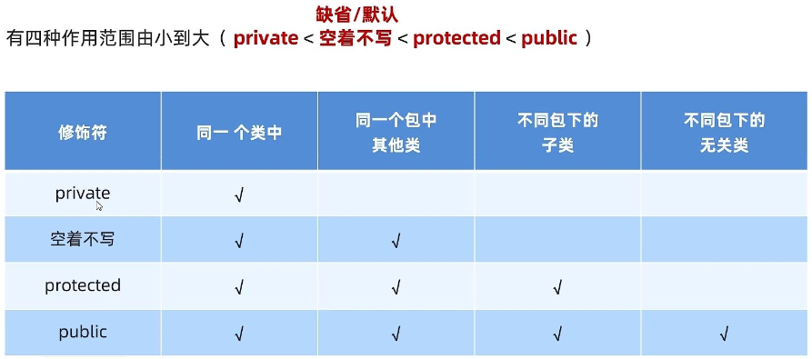
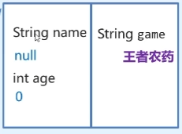

- [1. 成员访问](#1-成员访问)
- [2. 继承](#2-继承)
  - [2.1. 变量的分开存储。](#21-变量的分开存储)
  - [2.2. 方法的访问也是看权限修饰符是谁写的。](#22-方法的访问也是看权限修饰符是谁写的)
  - [2.3. 疑问：看不见的是不是就不能继承](#23-疑问看不见的是不是就不能继承)
- [3. clone()](#3-clone)

---

权限修饰符是控制访问，而能继承什么是另一套规则。

## 1. 成员访问

成员变量和成员方法都一样：




1. *同一个类中*、*同一个包中的其他类（子类和无关类）*、*不同包下的子类*、*不同包下的无关类*，是**创建对象的类的代码位置**。
2. *不同包下的子类*，是在子类中**创建子类对象**来调用父类的方法，而不是创建父类对象（属于*不同包下的无关类*）。

```java
/*
同一个包中的其他类（子类和无关类）：看得见default及其以上。
├── p1
│   ├── Animal.java
    └── Dog.java
*/
package p1;
public class Animal {
    protected void AnimalProtected() {    }
}

package p1;
public class Dog extends Animal{
    public static void main(String[] args) {
        // 实例化父类的对象
        Animal a = new Animal();
        // 调用方法：同一个包中无关类：看得见default及其以上。
        a.AnimalProtected();
        
        // 实例化子类的对象
        // Dog继承Animal，看得见default及其以上。
        Dog d = new Dog();
        // 调用方法：同一个包中子类：看得见default及其以上。
        d.AnimalProtected();
    }

    public void memberFuction(){
        AnimalProtected();      // 可以访问，因为Dog继承Animal，看得见default及其以上。
        
        // 实例化父类的对象
        Animal a = new Animal();
        a.AnimalProtected();
        
        // 实例化子类的对象
        Dog d = new Dog();
        d.AnimalProtected();    
    }
}

```
```java
/*
不同包下的子类、不同包下的无关类
├── p1
│   ├── Animal.java
└── p2
    ├── Cat.java
    └── P2Test.java
*/
package p1;
public class Animal {
    protected void AnimalProtected() {    }
}

// 这是不同包下的子类
package p2;
import p1.Animal;
public class Cat extends Animal{
    public static void main(String[] args) {
        // 实例化子类的对象
        // Cat继承Animal，看得见protected及其以上
        Cat c = new Cat();
        // 调用方法：不同包中子类：看得见protected及其以上
        c.AnimalProtected();    // 可以访问，是因为继承下来的

        // 而不是实例化父类的对象。
        Animal a = new Animal();
        // 调用方法：这就跟子类无关了，算是不同包下的无关类，看得见public
        a.AnimalProtected();    // error
    }

    public void memberFunction() {
        AnimalProtected();      // 可以访问，是因为继承下来的

        Cat c = new Cat();
        c.AnimalProtected();    // 同实例化子类的对象
        
        Animal a = new Animal();
        a.AnimalProtected();    // error. 同不是实例化父类的对象
    }
}
    
    
// 这是在不同包下的无关类
package p2;
import p1.Animal;
public class P2Test {
    public static void main(String[] args) {
        Animal animal = new Animal();
        // 调用方法：不同包下的无关类，看得见public
        animal.AnimalProtected();   // error

        // Cat继承Animal：不同包下的子类，看得见protected及其以上
        Cat cat = new Cat();
        // 调用方法：不同包下的无关类，看得见public
        cat.AnimalProtected();      // error
    }
}
```


## 2. 继承

权限修饰符，**哪些能继承**：

1. 子类不能继承父类的构造方法（因为子类和父类的构造方法名字都不一样），但如果可见就可以调用（访问）。

2. 子类可以继承父类的所有成员变量。

3. 子类可以继承父类的**非私有**成员方法，不能继承**私有**成员方法（因为私有的看不见，就不能被添加到虚方法表中）。

4. static、final修饰的方法都不能继承（因为不能被添加到虚方法表中）。

**继承父类的，并不是说就是子类的**。

【内存图】

[🚩面向对象进阶-06-子类到底能继承... P126 - 14:02](https://www.bilibili.com/video/BV17F411T7Ao?p=126&t=842)

内存分析工具：

[🚩面向对象进阶-06-子类到底能继承... P126 - 37:56](https://www.bilibili.com/video/BV17F411T7Ao?p=126&t=2276)

### 2.1. 变量的分开存储。

内存图是分开父类和子类的变量的存储空间的，而不是一整个。



意思是，子类可以继承父类的私有成员变量，但是不能像访问自己的私有变量一样直接访问，它还是属于父类的，所以需要通过父类的公有方法访问。

### 2.2. 方法的访问也是看权限修饰符是谁写的。

- 访问类自己的方法是看其类所处的位置，
- 访问类继承的方法是分重写与否。

    没重写，那方法的权限修饰符写在父类，就看的父类的位置。

    重写了，那方法的权限修饰符写在子类，就看的子类的位置。

    PS：重写并且pulibc，都行。
```java
/*
没重写
├── p1
│   ├── Animal.java
│   └── P1Test.java
└── p2
    ├── Cat.java
    └── P2Test.java
*/
package p1;
public class Animal {
    protected void AnimalProtected() {    }
}


package p2;
import p1.Animal;
public class Cat extends Animal{
    void CatDefault(){    }
}

package p1;
import p2.Cat;
public class P1Test {
    public static void main(String[] args) {
        Animal a = new Animal();
        // 调用方法：同一个包下的无关类，看得见default及其以上
        a.AnimalProtected();    // P1Test同父类Animal在一个包里
        
        // Cat继承Animal：不同包下的子类，看得见protected及其以上
        Cat c = new Cat();
        // 调用方法：同一个包下的无关类，看得见default及其以上
        c.AnimalProtected();    // 没重写看父类，看的是父类Animal的方法————处于同一个包下。
        // 调用方法：不同包下的无关类，看得见public
        c.CatProtected();       // error. 看的是子类Cat的方法————处于不同包下的无关类。
    }
}


package p2;
import p1.Animal;
public class P2Test {
    public static void main(String[] args) {
        Animal a = new Animal();
        // 调用方法：不同包下的无关类，看得见public
        a.AnimalProtected();    // error. P2Test同父类Animal处于不同包下的无关类。

        // Cat继承Animal：不同包下的子类，看得见protected及其以上
        Cat c = new Cat();
        // 调用方法：不同包下的无关类，看得见public
        c.AnimalProtected();    // error. 看的是继承的父类Animal的方法————处于不同包下的无关类。
        // 调用方法：同一个包下的无关类，看得见default及其以上
        c.CatDefault();       // 看的是子类Cat的方法————处于同一个包下。
    }
}
```
```java
/*
重写了
├── p1
│   ├── Animal.java
│   └── P1Test.java
└── p2
    ├── Cat.java
    └── P2Test.java
*/
package p1;
public class Animal {
    protected void AnimalProtected(){}
}


package p2;
import p1.Animal;
public class Cat extends Animal{
    protected void CatProtected(){}
    
    @Override
    protected void AnimalProtected(){}
}


package p1;
import p2.Cat;
public class P1Test {
    public static void main(String[] args) {
        Animal a = new Animal();
        // 调用方法：同一个包下的无关类，看得见default及其以上
        a.AnimalProtected();    // P1Test同父类Animal在一个包里
        
        // Cat继承Animal：不同包下的子类，看得见protected及其以上
        Cat c = new Cat();
        // 调用方法：重写了看Cat，不同包下的无关类，看得见public
        c.AnimalProtected();    // error. 看的是子类Cat的重写方法————处于不同包下的无关类。
        // 调用方法：Cat的，不同包下的无关类，看得见public
        c.CatProtected();       // error. 看的是子类Cat的方法————处于不同包下的无关类。
    }
}


package p2;
import p1.Animal;
public class P2Test {
    public static void main(String[] args) {
        Animal a = new Animal();
        // 调用方法：不同包下的无关类，看得见public
        a.AnimalProtected();    // error. P2Test同父类Animal处于不同包下的无关类。
        
        // Cat继承Animal：不同包下的子类，看得见protected及其以上
        Cat c = new Cat();
        // 调用方法：重写了看Cat，同一个包下的无关类，看得见default及其以上
        c.AnimalProtected();    // 看的是子类Cat的重写方法————处于同一个包下。
        // 调用方法：看Cat，同一个包下的无关类，看得见default及其以上
        c.CatProtected();       // 看的是子类Cat的方法————处于同一个包下。
    }
}
```
```java
/*
重写且pulibc，都行
├── p1
│   ├── Animal.java
└── p2
    ├── Cat.java
└── p3
    ├── P3Test.java
*/
package p1;
public class Animal {
    protected void AnimalProtected() {}
}


package p2;
import p1.Animal;
public class Cat extends Animal{
    protected void CatProtected(){}
    
    @Override
    public void AnimalProtected() {}
}

package p3;
import p2.Cat;
public class P3Test {
    public static void main(String[] args) {
        // Cat继承Animal：不同包下的子类，看得见protected及其以上
        Cat c = new Cat();
        // 调用方法：重写了看Cat，不同包下的无关类，看得见public
        c.AnimalProtected();
    }
}
```

### 2.3. 疑问：看不见的是不是就不能继承

> 继承规则3：子类可以继承父类的**非私有**成员方法，不能继承**私有**成员方法（因为私有的看不见，就不能被添加到虚方法表中）。

其实，是不是看不见的是不是就不能继承？

创建子类对象的双规则：
- 第一，调用方法：要看创建对象的类的位置与所调用方法所在的类的位置（没重写就是父类处，重写了就是子类处）。
- 第二，子类继承：要看子类继承父类，考虑子类和父类的位置，可以看得见哪些方法。
- 综上，取最高要求。

例子，所谓父访子："父类访问域大于子类，父类中可以访问子类实例（对象）继承的父类protected修饰的方法"。
```java
/*
子类自己的方法。属于是无关类。
没有特殊规则，只是基本情况而已。
├── p1
│   ├── Animal.java
    ├── Dog.java
└── p2
    ├── Cat.java
*/

package p1;
import p2.Cat;
public class Animal {
    public static void main(String[] args) {
        // Dog继承Animal：同一个包下的子类，看得见default及其以上
        Dog d = new Dog();
        // 调用方法：都是子类自己的，同一个包下的无关类，看得见default及其以上
        d.privateFunction();    // error，看不见
        d.defaultFunction();
        d.protectedFunction();
        d.publicFunction();

        // 不同包下的无关类
        // Cat继承Animal：不同包下的子类，看得见protected及其以上
        Cat c = new Cat();
        // 调用方法：都是子类自己的，不同包下的无关类，看得见public及其以上
        c.privateFunction();    // error，看不见
        c.defaultFunction();    // error，看不见
        c.protectedFunction();  // error，看不见
        c.publicFunction();
    }
}

package p1;
public class Dog extends Animal{
    private void privateFunction(){}
    void defaultFunction(){}
    protected void protectedFunction(){}
    public void publicFunction(){}
}

package p2;
import p1.Animal;
public class Cat extends Animal{
    private void privateFunction(){}
    void defaultFunction(){}
    protected void protectedFunction(){}
    public void publicFunction(){}
}
```

```java
/*
看谁 && 子类看不见而继承不了

├── p1
│   ├── Animal.java
│   ├── Dog.java   
│   └── P1Test.java
├── p2
│   ├── Cat.java   
│   └── P2Test.java
└── p3
    └── P3Test.java
*/

package p1;
public class Dog extends Animal{
    public static void main(String[] args) {
        // Dog继承Animal：同一个包下的子类，看得见default及其以上
        Dog d = new Dog();
        // 调用方法：看Animal的，同一个包下的子类，看得见default及其以上
        d.privateFunction();    // error，看不见
        d.defaultFunction();
        d.protectedFunction();
        d.publicFunction();
    }
}

package p2;
import p1.Animal;
public class Cat extends Animal{
    public static void main(String[] args) {
        // Cat继承Animal：不同包下的子类，看得见protected及其以上
        // 子类Cat是Animal不同包下的子类，所以子类Cat 看得见protected及其以上
        Cat c = new Cat();
        // 调用方法：看Animal的，不同包下的子类，看得见protected及其以上
        c.privateFunction();    // error，看不见
        c.defaultFunction();    // error，看不见
        c.protectedFunction();
        c.publicFunction();
    }
}

package p1;
import p2.Cat;
public class Animal {
    private void privateFunction(){}
    void defaultFunction(){}
    protected void protectedFunction(){}
    public void publicFunction(){}

    public static void main(String[] args) {
        Animal a = new Animal();
        // 调用方法：同一个包下的自己类，所以都可以看得见
        a.privateFunction();
        a.defaultFunction();    
        a.protectedFunction();
        a.publicFunction();

        // Dog继承Animal：同一个包下的子类，看得见default及其以上
        Dog d = new Dog();
        // 调用方法：看Animal，同一个包下的自己类，所以都可以看得见
        d.privateFunction();    // error
        d.defaultFunction();
        d.protectedFunction();
        d.publicFunction();

        // Cat继承Animal：不同包下的子类，看得见protected及其以上
        Cat c = new Cat();
        // 调用方法：看Animal，同一个包下的自己类，所以都可以看得见
        c.privateFunction();    // error
        c.defaultFunction();    // error
        c.protectedFunction();
        c.publicFunction();
    }
}


package p1;
import p2.Cat;
public class P1Test {
    public static void main(String[] args) throws CloneNotSupportedException {
        Animal a = new Animal();
        // 调用方法：同一个包下的无关类，所以看得见 defalut及其以上
        a.privateFunction();    // error
        a.defaultFunction();    
        a.protectedFunction();
        a.publicFunction();

        // Dog继承Animal：同一个包下的子类，看得见default及其以上
        Dog d = new Dog();
        // 调用方法：看Animal，同一个包下的无关类，所以default及其以上
        d.privateFunction();    // error
        d.defaultFunction();
        d.protectedFunction();
        d.publicFunction();

        // Cat继承Animal：不同包下的子类，看得见protected及其以上
        Cat c = new Cat();
        // 调用方法：看Animal， 同一个包下的无关类，所以default及其以上
        c.privateFunction();    // error
        c.defaultFunction();    // error
        c.protectedFunction();
        c.publicFunction();
    }
}

package p2;
import p1.Animal;
import p1.Dog;
public class P2Test {
    public static void main(String[] args) throws CloneNotSupportedException {
        Animal a = new Animal();
        // 调用方法：不同包下的无关类，所以看得见 public
        a.privateFunction();    // error
        a.defaultFunction();    // error
        a.protectedFunction();  // error
        a.publicFunction();

        // Dog继承Animal：同一个包下的子类，看得见default及其以上
        Dog d = new Dog();
        // 调用方法：看Animal，不同包下的无关类，所以看得见 public
        d.privateFunction();    // error
        d.defaultFunction();    // error
        d.protectedFunction();  // error
        d.publicFunction();

        // Cat继承Animal：不同包下的子类，看得见protected及其以上
        Cat c = new Cat();
        // 调用方法：看Animal，不同包下的无关类，所以看得见 public
        c.privateFunction();    // error
        c.defaultFunction();    // error
        c.protectedFunction();  // error
        c.publicFunction();
    }
}

package p3;
import p1.Animal;
import p1.Dog;
import p2.Cat;
public class P3Test {
    public static void main(String[] args) {
        Animal a = new Animal();
        // 调用方法：不同包下的无关类，所以看得见 public
        a.privateFunction();    // error
        a.defaultFunction();    // error
        a.protectedFunction();  // error
        a.publicFunction();

        // Dog继承Animal：同一个包下的子类，看得见default及其以上
        Dog d = new Dog();
        // 调用方法：看Animal，不同包下的无关类，所以看得见 public
        d.privateFunction();    // error
        d.defaultFunction();    // error
        d.protectedFunction();  // error
        d.publicFunction();

        // Cat继承Animal：不同包下的子类，看得见protected及其以上
        Cat c = new Cat();
        // 调用方法：看Animal，不同包下的无关类，所以看得见 public
        c.privateFunction();    // error
        c.defaultFunction();    // error
        c.protectedFunction();  // error
        c.publicFunction();
    }
}
```

## 3. clone()

```java
/*
不同包下的子类
*/
package p1;
public class Animal {
    public static void main(String[] args) throws CloneNotSupportedException {
        // Animal继承Object：不同包下的子类，所以看得见protected clone()
        Animal a = new Animal();
        // 调用方法：看Object的，不同包中的子类，看得见protected及其以上
        a.clone();
    }

    public void memberFuction() throws CloneNotSupportedException{
        clone();

        Animal a = new Animal();
        a.clone();
    }
}
```
```java
/*
不同包下的子类和无关类
*/
package p1;
public class Animal {
}

package p1;
public class P1Test {
    public static void main(String[] args) {
        // Animal继承Object：不同包下的子类，所以看得见protected clone()
        Animal a = new Animal();
        // 调用方法：看Object的，不同包中的无关类，看得见public
        a.clone();   // error
        // 看的是java.lang.Object的protected clone()方法
        // P1Test 与 java.lang.Object 属于不同的包下的无关类
        // 混淆点：P1Test虽然继承了java.lang.Object，但是这里创建的是Animal对象, 所以不属于不同包下的子类

        // P1Test继承Object：不同包下的子类，所以看得见protected clone()
        P1Test p1 = new P1Test();
        // 调用方法：看Object的，不同包中的子类，看得见protected及其以上
        p1.clone();
        // 这才是不同包下的子类
    }
}
```

```java
/*
重写，同一个包下的其他类，不同包下的子类，不同包下的无关类
*/
package p1;
public class Animal {
    @Override
    protected Object clone() throws CloneNotSupportedException {
        return super.clone();
    }
}

package p1;
public class P1Test {
    public static void main(String[] args) throws CloneNotSupportedException {
        // Animal继承Object：不同包下的子类，所以看得见protected clone()
        Animal a = new Animal();
        // 调用方法：重写看Animal的，同一个包中的无关类，看得见default及其以上
        a.clone(); 
    }
}

package p2;
import p1.Animal;
public class Cat extends Animal{
    public static void main(String[] args) {
        // 实例化子类的对象
        // Cat继承Animal：不同包下的子类，所以看得见protected及其以上
        Cat c = new Cat();
        // 调用方法：重写看Animal的，不同包下的子类，所以看得见protected及其以上
        c.clone();

        // 不是实例化父类的对象
        Animal a = new Animal();
        // 调用方法：重写看Animal的，不同包下的无关类，所以看得见public
        a.clone();      // error
    }
}

package p2;
import p1.Animal;
public class P2Test {
    public static void main(String[] args) {
        Animal a = new Animal();
        // 调用方法：重写看Animal的，不同包下的无关类，所以看得见public
        a.clone();  // error
    }
}
```
```java
/* 
重写并public，都可以
*/

package p1;
public class Animal {
    @Override
    public Object clone() throws CloneNotSupportedException {
        return super.clone();
    }
}

package p2;
import p1.Animal;
public class P2Test {
    public static void main(String[] args) throws CloneNotSupportedException {
        Animal a = new Animal();
        a.clone();
    }
}
```