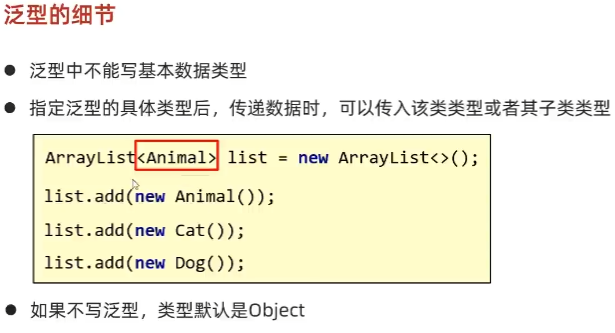
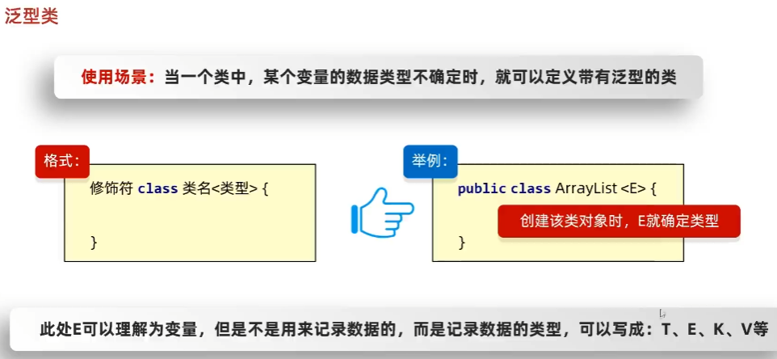
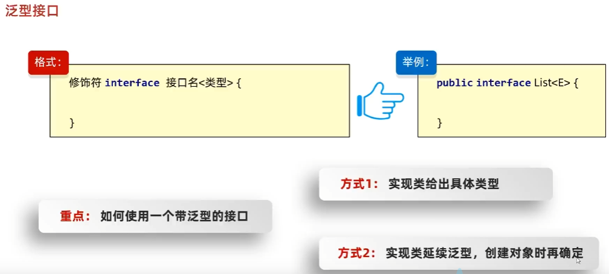
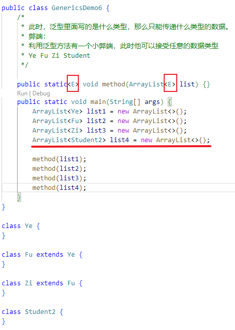
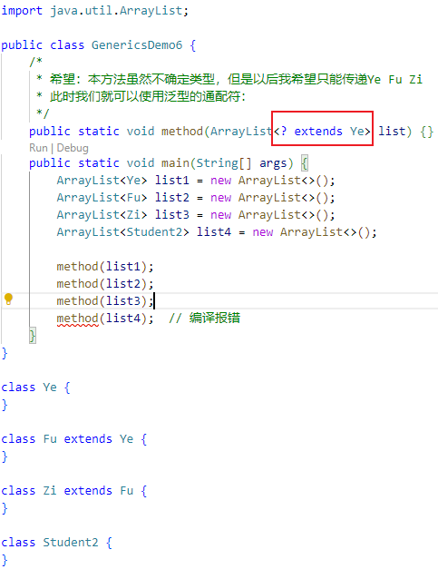

- [1. 哪些泛型](#1-哪些泛型)
  - [1.1. 泛型方法](#11-泛型方法)
  - [1.2. 泛型类](#12-泛型类)
  - [1.3. 泛型接口](#13-泛型接口)
- [2. 泛型通配符](#2-泛型通配符)


---




集合中的泛型只在java文件中存在，当编译成class文件之后，就没有泛型了。
## 1. 哪些泛型
### 1.1. 泛型方法

```java
// 修饰符之后，返回类型之前
public static <E> void addAll2(ArrayList<E> list, E...e){
    for (E element : e) {
        list.add(element);
    }
}

public <R, ID> R queryWithMutex(ID id, Class<R> type, Function<ID, R> dbFallback) {
```
### 1.2. 泛型类



```java
public class PageDTO<E>{
    List<E> list;
}
```

### 1.3. 泛型接口



`public interface List<E>{}`
```java
/* 方式1 */
// 实现类给出具体的类型
public class MyArrayList implements List<String>{}

// 创建对象时就不用
MyArrayList list = new MyArrayList();
```

```java
/* 方式2 */
// 实现类延续泛型
public class MyArrayList<E> implements List<E>{}

// 创建对象时给出具体的类型
MyArrayList<String> list = new MyArrayList<>();
```

## 2. 泛型通配符

泛型不具备继承性，但是数据具备继承性

```java
import java.util.ArrayList;

public class GenericsDemo5 {
    
    public static void method(ArrayList<Ye> list) {}

    public static void main(String[] args) {
        ArrayList<Ye> list1 = new ArrayList<>();
        ArrayList<Fu> list2 = new ArrayList<>();
        ArrayList<Zi> list3 = new ArrayList<>();

        // 泛型不具备继承性
        method(list1);
        method(list2);  // 编译报错
        method(list3);  // 编译报错

        // 数据具备继承性
        list1.add(new Ye());
        list1.add(new Fu());
        list1.add(new Zi());
    }
}

class Ye {
}

class Fu extends Ye {
}

class Zi extends Fu {
}
```
那么如何传递不同类型的 list呢？




`?` 同`E`也表示不确定的类型，可以限定类型的范围，只能传递某个继承体系中的。
- `<? extends E>`: 表示可以传递E及其所有的子类类型
- `<? super E>`: 表示可以传递E及其所有的父类类型



```java
public class User{
    private List<?> list;
    private String name;
}
```