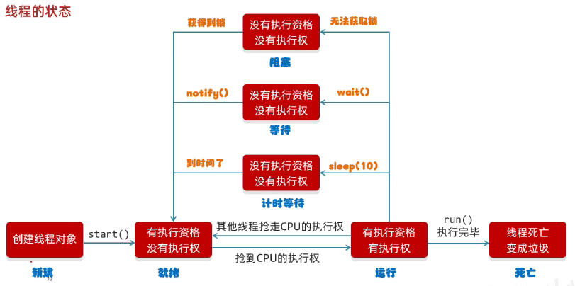
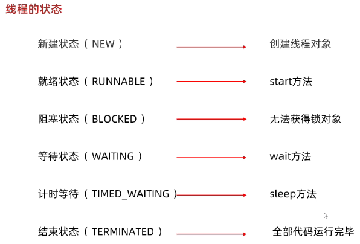
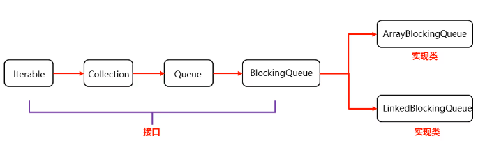

- [1. 实现多线程](#1-实现多线程)
  - [1.1. 继承Thread类](#11-继承thread类)
  - [1.2. 实现Runnable接口](#12-实现runnable接口)
  - [1.3. 实现Callable接口](#13-实现callable接口)
- [2. Thread类](#2-thread类)
  - [2.1. 状态](#21-状态)
  - [2.2. 方法](#22-方法)
- [3. 同步代码块](#3-同步代码块)
  - [3.1. 继承Thread类](#31-继承thread类)
  - [3.2. 实现Runable和Callable接口](#32-实现runable和callable接口)
- [4. 同步方法](#4-同步方法)
- [5. Lock锁](#5-lock锁)
- [6. 死锁](#6-死锁)
- [7. 生产者消费者](#7-生产者消费者)
- [8. 阻塞队列 BlockingQueue](#8-阻塞队列-blockingqueue)

---
## 1. 实现多线程
- 继承Thread类
- 实现Runnable接口
- 实现Callable接口

对比：
1. 继承Thread类和实现Runnable接口，重写`void run()`没有返回值，实现Callable接口则可以获取返回值。
2. 继承Thread类，直接使用Thread类的方法，但不能继承其他类；实现Runnable接口和实现Callable接口，则可以继承其他类，但不能直接使用Thread类的方法。

### 1.1. 继承Thread类

```java
public class ThreadDemo {
    public static void main(String[] args) {
        /*
         * 1. 自定义类继承Thread，并重写run()方法
         * 2. 创建自定义类，并start()启动线程，Java虚拟机会调用run方法()
         */

        MyThread t1 = new MyThread();
        MyThread t2 = new MyThread();

        t1.setName("线程1");
        t2.setName("线程2");

        t1.start();
        t2.start();
    }
}

class MyThread extends Thread {
    @Override
    public void run() {
        for (int i = 0; i < 100; i++) {
            System.out.println(getName() + "HelloWorld");
        }
    }
}
```

### 1.2. 实现Runnable接口

```java
package com.itheima.a02threadcase2;

public class ThreadDemo {
    public static void main(String[] args) {
        /*
         * 1. 自定义类实现Runnable接口，并重写里面的run方法
         * 2. 创建自定义类的对象
         * 3. 创建一个Thread类的对象，并开启线程
         *    public Thread(Runnable task)
         */

        MyRun mr = new MyRun();

        Thread t1 = new Thread(mr);
        Thread t2 = new Thread(mr);

        t1.setName("线程1");
        t2.setName("线程2");

        t1.start();
        t2.start();
    }
}

class MyRun implements Runnable {
    @Override
    public void run() {
        for (int i = 0; i < 100; i++) {
            // 获取到当前线程的对象
            System.out.println(Thread.currentThread().getName() + "HelloWorld!");
        }
    }
}
```

### 1.3. 实现Callable接口

```java
import java.util.concurrent.ExecutionException;
import java.util.concurrent.Callable;
import java.util.concurrent.FutureTask;

public class ThreadDemo {
    public static void main(String[] args) throws ExecutionException, InterruptedException {

        /*
         * 多线程的第三种实现方式：
         * 特点：可以获取到多线程运行的结果
         *
         * 1. 自定义类实现Callable接口，并重写call（是有返回值的，表示多线程运行的结果）
         * 2. 创建MyCallable的对象
         * 3. 创建FutureTask的对象，参数是MyCallable的对象（管理多线程）
         * 4. 创建Thread类的对象，并启动start()，参数是FutureTask的对象
         * 5. 由FutureTask对象get()获取多线程运行的结果
         */

        MyCallable mc = new MyCallable();
        
        // 几个线程共用一个mc对象
        FutureTask<Integer> ft = new FutureTask<>(mc);
        FutureTask<Integer> ft2 = new FutureTask<>(mc);

        Thread t1 = new Thread(ft);
        t1.start();
        Thread t2 = new Thread(ft2);
        t2.start();

        // 获取多线程运行的结果
        Integer result = ft.get();
        System.out.println(result);

        Integer result2 = ft2.get();
        System.out.println(result2);
    }
}

// Callable<返回值的类型>
class MyCallable implements Callable<Integer> {
    @Override
    public Integer call() throws Exception {
        int sum = 0;
        for (int i = 1; i <= 100; i++) {
            sum = sum + i;
        }
        return sum;
    }
}
```

## 2. Thread类

### 2.1. 状态




java中没有运行状态，所以只有6种。




状态被定义在了java.lang.Thread.State枚举类中，State枚举类的源码如下：

```java
public class Thread {
    
    public enum State {
    
        /* 新建 */
        NEW , 

        /* 可运行状态 */
        RUNNABLE , 

        /* 阻塞状态 */
        BLOCKED , 

        /* 无限等待状态 */
        WAITING , 

        /* 计时等待 */
        TIMED_WAITING , 

        /* 终止 */
        TERMINATED;
    
	}
    
    // 获取当前线程的状态
    public State getState() {
        return jdk.internal.misc.VM.toThreadState(threadStatus);
    }
    
}
```

通过源码我们可以看到Java中的线程存在6种状态，每种线程状态的含义如下

| 线程状态          | 具体含义                                     |
| ------------- | ---------------------------------------- |
| NEW           | 一个尚未启动的线程的状态。也称之为初始状态、开始状态。线程刚被创建，但是并未启动。还没调用start方法。MyThread t = new MyThread()只有线程象，没有线程特征。 |
| RUNNABLE      | 当我们调用线程对象的start方法，那么此时线程对象进入了RUNNABLE状态。那么此时才是真正的在JVM进程中创建了一个线程，线程一经启动并不是立即得到执行，线程的运行与否要听令与CPU的调度，那么我们把这个中间状态称之为可执行状态(RUNNABLE)也就是说它具备执行的资格，但是并没有真正的执行起来而是在等待CPU的度。 |
| BLOCKED       | 当一个线程试图获取一个对象锁，而该对象锁被其他的线程持有，则该线程进入Blocked状态；当该线程持有锁时，该线程将变成Runnable状态。 |
| WAITING       | 一个正在等待的线程的状态。也称之为等待状态。造成线程等待的原因有两种，分别是调用Object.wait()、join()方法。处于等待状态的线程，正在等待其他线程去执行一个特定的操作。例如：因为wait()而等待的线程正在等待另一个线程去调用notify()或notifyAll()；一个因为join()而等待的线程正在等待另一个线程结束。 |
| TIMED_WAITING | 一个在限定时间内等待的线程的状态。也称之为限时等待状态。造成线程限时等待状态的原因有三种，分别是：Thread.sleep(long)，Object.wait(long)、join(long)。 |
| TERMINATED    | 一个完全运行完成的线程的状态。也称之为终止状态、结束状态             |
### 2.2. 方法
```java
/*
* void setName(String name) 设置线程的名字
* 
* String getName() 返回此线程的名称
* 
* void setPriority(int newPriority) 设置线程的优先级
* 
* int getPriority() 获取线程的优先级
* 
* void join() 插入线程/插队线程
* 
* void setDaemon(boolean on) 设置为守护线程
* 
* static Thread currentThread() 获取当前线程的对象
* 
* static void yield() 出让线程/礼让线程
* 
* static void sleep(long time) 线程休眠，单位为毫秒
*/
```
name, priority
```java
public class ThreadDemo {
    public static void main(String[] args) throws InterruptedException {

        /*
         * void setName(String name)
         * 细节：
         * - 如果没设名字，线程也有默认名。格式：Thread-X（X序号，从0开始的）
         * - 要设置名字，可以用setName方法进行设置，也可以构造方法设置 public Thread(String name)
         * - 名字不要重复，否则会抛出异常
         */
        MyThread t1 = new MyThread();
        System.out.println(t1.getName()); // Thread-0

        MyThread t2 = new MyThread("坦克");
        t2.setName("飞机");
        System.out.println(t2.getName()); // 飞机

        /*
         * setPriority(int newPriority)
         * [1, 10] 越大优先级越高, 默认值是5
         * 
         * final int getPriority()
         */
        t1.setPriority(10);
        System.out.println(t2.getPriority());   // 5

        t1.start();
        t2.start();
    }
}

class MyThread extends Thread{
    MyThread() {
    }

    MyThread(String name) {
        super(name);
    }

    @Override
    public void run() {
        for (int i = 0; i < 100; i++) {
            System.out.println(getName());
        }
    }
}
```
daemon
```java
public class ThreadDemo {
    public static void main(String[] args) throws InterruptedException {
        MyThread t1 = new MyThread();
        MyThread t2 = new MyThread();
        t1.setName("ordinary");
        t2.setName("daemon");

        t1.setPriority(10);

        // 把第二个线程设置为守护线程（备胎线程）
        t2.setDaemon(true);

        t1.start();
        t2.start();

        // ordinary线程结束后，daemon线程也会结束
        // ...
        // ordinary9
        // daemon6
        // ordinary10
        // daemon7
    }
}

class MyThread extends Thread{
    @Override
    public void run() {
        for (int i = 1; i <= 10; i++) {
            System.out.println(getName() + i);
        }
    }
}
```
join
```java
public class ThreadDemo {
    public static void main(String[] args) throws InterruptedException {
        MyThread t1 = new MyThread();
        t1.start();
        // 当前是main线程执行，现在让t1线程插队先执行
        // 效果就是t1线程执行完毕后，主线程才开始执行
        t1.join();
        System.out.println("Main thread");
        
        // Thread-09
        // Thread-010
        // Main thread
    }
}

class MyThread extends Thread{
    @Override
    public void run() {
        for (int i = 1; i <= 10; i++) {
            System.out.println(getName() + i);
        }
    }
}
```
currentThread, sleep
```java
public class ThreadDemo {
    public static void main(String[] args) throws InterruptedException {
        Thread t = Thread.currentThread();
        System.out.println(t.getName());    // main

        Thread.sleep(1000);
        System.out.println("sleep 1s done");
    }
}
```
yield
```java
public class ThreadDemo {
    public static void main(String[] args) throws InterruptedException {
        MyThread t1 = new MyThread();
        MyThread t2 = new MyThread();
        t1.start();
        t2.start();
        
        // static void yield()
        // 互相让出，均匀执行。但不保证一定均匀。
        // Thread-0 1
        // Thread-1 1
        // Thread-0 2
        // Thread-1 2
        // Thread-0 3
        // Thread-1 3
        // Thread-0 4
        // Thread-1 4
        // Thread-0 5
        // Thread-1 5
        // Thread-1 6
        // Thread-0 6
        // Thread-1 7
        // Thread-0 7
        // Thread-1 8
        // Thread-0 8
        // Thread-1 9
        // Thread-0 9
        // Thread-1 10
        // Thread-0 10
    }
}

class MyThread extends Thread{
    @Override
    public void run() {
        for (int i = 1; i <= 10; i++) {
            System.out.println(getName() + " " + i);
            Thread.yield();
        }
    }
}
```

## 3. 同步代码块

1. 锁对象可以是`class`文件，也可以是static的对象.
```java
class MyThread extends Thread {

    static int ticket = 0;

    @Override
    public void run() {
        while (true) {
            // class
            synchronized (MyThread.class) {
                ...
            }
        }
    }
}


class MyThread extends Thread {

    static int ticket = 0;

    // 锁对象
    static Object obj = new Object();

    @Override
    public void run() {
        while (true) {
            // Object对象
            synchronized (obj) {
                ...
            }
        }
    }
}

// 可以是其他类的静态锁对象
class Desk{
    static final Object obj = new Object();
}
class MyThread extends Thread {

    static int ticket = 0;

    @Override
    public void run() {
        while (true) {
            // Object对象
            synchronized (Desk.obj) {
                ...
            }
        }
    }
}
```


2. 判断退出的机制，写在synchronized里。否则，写在外面就表示判定通过就可以再卖一张票，但此时如果另一个线程刚增加临界票，那么再增加一张票就出错。
```java
@Override
public void run() {
    while (true) {
        // 退出机制，写在外面，则出错。
        if (ticket == 100) {
            break;
        } 
        synchronized (MyThread.class) {
            ticket++;
            System.out.println(getName() + "正在卖第" + ticket + "张票！！！");
        }
    }
}
```

### 3.1. 继承Thread类

需要`static`来保证同步变量唯一
```java
public class ThreadDemo {
    public static void main(String[] args) {
        /*
         * 需求：
         * 某电影院目前正在上映国产大片，共有100张票，而它有3个窗口卖票，请设计一个程序模拟该电影院卖票
         */

        MyThread t1 = new MyThread();
        MyThread t2 = new MyThread();
        MyThread t3 = new MyThread();

        t1.setName("窗口1");
        t2.setName("窗口2");
        t3.setName("窗口3");

        t1.start();
        t2.start();
        t3.start();

    }
}

class MyThread extends Thread {

    // 同步共享的变量，需要static修饰
    static int ticket = 0;

    @Override
    public void run() {
        while (true) {
            // 锁的对象
            synchronized (MyThread.class) {
                // 退出机制
                if (ticket == 100) {
                    break;
                } else {
                    ticket++;
                    System.out.println(getName() + "正在卖第" + ticket + "张票！！！");
                }
            }
        }
    }
}
```

### 3.2. 实现Runable和Callable接口

不需要`static`来修饰同步变量，因为接口实现类只用一个，传递给的是多个Thread对象作为参数。

```java
public class ThreadDemo {
    public static void main(String[] args) {
        MyRunnable mr = new MyRunnable();

        Thread t1 = new Thread(mr);
        Thread t2 = new Thread(mr);

        t1.setName("窗口1");
        t2.setName("窗口2");

        t1.start();
        t2.start();
    }
}

class MyRunnable implements Runnable {

    int ticket = 0;

    @Override
    public void run() {
        while (true) {
            synchronized (MyRunnable.class) {
                if (ticket == 100) {
                    break;
                } else {
                    ticket++;
                    System.out.println(Thread.currentThread().getName() + "正在卖第" + ticket + "张票！！！");
                }
            }
        }
    }
}
```
## 4. 同步方法

- 同步方法的格式

  ```java
  修饰符 synchronized 返回值类型 方法名(方法参数) { 
  	方法体；
  }
  ```

  同步方法的锁对象是什么呢? this

- 静态同步方法


  ```java
  修饰符 static synchronized 返回值类型 方法名(方法参数) { 
  	方法体；
  }
  ```

  同步静态方法的锁对象是什么呢? 类名.class


```java
public class ThreadDemo {
    public static void main(String[] args) {
        MyRunnable mr = new MyRunnable();

        Thread t1 = new Thread(mr);
        Thread t2 = new Thread(mr);

        t1.setName("窗口1");
        t2.setName("窗口2");

        t1.start();
        t2.start();
    }
}

class MyRunnable implements Runnable {

    int ticket = 0;

    @Override
    public void run() {
        while (true) {
            // 同步方法
            if (method()) break;
        }
    }

    //this
    private synchronized boolean method() {
        // 退出机制
        if (ticket == 100) {
            return true;
        } else {
            ticket++;
            System.out.println(Thread.currentThread().getName() + "在卖第" + ticket + "张票！！！");
        }
        return false;
    }
}
```

## 5. Lock锁

JDK5以后提供了一个新的锁对象Lock

`Lock`是接口不能直接实例化，这里采用它的实现类`ReentrantLock`来实例化

- ReentrantLock构造方法

  | 方法名             | 说明                   |
  | --------------- | -------------------- |
  | ReentrantLock() | 创建一个ReentrantLock的实例 |

- 加锁解锁方法

  | 方法名           | 说明   |
  | ------------- | ---- |
  | void lock()   | 获得锁  |
  | void unlock() | 释放锁  |


```java
import java.util.concurrent.locks.Lock;
import java.util.concurrent.locks.ReentrantLock;

public class ThreadDemo {
    public static void main(String[] args) {
        MyRunnable mr = new MyRunnable();

        Thread t1 = new Thread(mr);
        Thread t2 = new Thread(mr);

        t1.setName("窗口1");
        t2.setName("窗口2");

        t1.start();
        t2.start();
    }
}

class MyRunnable implements Runnable {

    int ticket = 0;

    // 锁
    Lock lock = new ReentrantLock();

    @Override
    public void run() {
        while (true) {
            lock.lock();
            // 无论退出，还是继续，都要释放锁。
            // 所以使用 try-catch-finally结构来释放锁
            try {
                if (ticket == 100) {
                    break;
                } else {
                    ticket++;
                    System.out.println(Thread.currentThread().getName() + "正在卖第" + ticket + "张票！！！");
                }
            } catch (Exception e) {
                e.printStackTrace();
            } finally {
                lock.unlock();
            }
        }
    }
}
```

## 6. 死锁

+ 概述

  线程死锁是指由于两个或者多个线程互相持有对方所需要的资源，导致这些线程处于等待状态，无法前往执行

+ 什么情况下会产生死锁

  1. 资源有限
  2. 同步嵌套

+ 代码演示

  ```java
  public class Demo {
      public static void main(String[] args) {
          Object objA = new Object();
          Object objB = new Object();

          new Thread(()->{
              while(true){
                  synchronized (objA){
                      //线程一
                      synchronized (objB){
                          System.out.println("小康同学正在走路");
                      }
                  }
              }
          }).start();

          new Thread(()->{
              while(true){
                  synchronized (objB){
                      //线程二
                      synchronized (objA){
                          System.out.println("小薇同学正在走路");
                      }
                  }
              }
          }).start();
      }
  }
  ```

## 7. 生产者消费者

Object类的等待和唤醒方法

| 方法名              | 说明                                       |
| ---------------- | ---------------------------------------- |
| void wait()      | 导致当前线程等待，直到另一个线程调用该对象的 notify()方法或 notifyAll()方法 |
| void notify()    | 唤醒正在等待对象监视器的单个线程                         |
| void notifyAll() | 唤醒正在等待对象监视器的所有线程                         |
```java
class Desk {
    // 定义一个标记
    // true 就表示桌子上有汉堡包的,此时允许吃货执行
    // false 就表示桌子上没有汉堡包的,此时允许厨师执行
    public static boolean flag = false;

    // 汉堡包的总数量，即退出的条件
    // 当汉堡包的总数量为0时，生产者和消费者都要退出
    public static int count = 10;

    // 锁对象
    public static final Object lock = new Object();
}

class Cook extends Thread {
    @Override
    public void run() {
        while (true) {
            synchronized (Desk.lock) {
                // 退出条件
                if (Desk.count == 0) {
                    break;
                } else {
                    // 生产者步骤：判断桌子上是否有汉堡包
                    // 1，如果没有则生产，把汉堡包放在桌子上，叫醒等待的消费者开吃。
                    // 2，如果有就等待。
                    if (!Desk.flag) {
                        // 生产
                        System.out.println("厨师正在生产汉堡包");
                        Desk.flag = true;
                        Desk.lock.notifyAll();
                    } else {
                        try {
                            Desk.lock.wait();
                        } catch (InterruptedException e) {
                            e.printStackTrace();
                        }
                    }
                }
            }
        }
    }
}

class Foodie extends Thread {
    @Override
    public void run() {
        while (true) {
            synchronized (Desk.lock) {
                if (Desk.count == 0) {
                    break;
                } else {
                    // 判断桌子上是否有汉堡包。
                    // 1，如果有就开吃，汉堡包的总数量减一，桌子上的汉堡包就没有了，叫醒等待的生产者继续生产。
                    // 2，如果没有就等待。
                    if (Desk.flag) {
                        System.out.println("吃货在吃汉堡包" + Desk.count);
                        Desk.count--;
                        Desk.flag = false;
                        Desk.lock.notifyAll();
                    } else {
                        try {
                            Desk.lock.wait();
                        } catch (InterruptedException e) {
                            e.printStackTrace();
                        }
                    }
                }
            }
        }

    }
}

public class ThreadDemo {
    public static void main(String[] args) {
        Foodie f = new Foodie();
        Cook c = new Cook();

        f.start();
        c.start();
    }
}
```

## 8. 阻塞队列 BlockingQueue


`BlockingQueue`接口
- 两个实现类:
  - `ArrayBlockingQueue`: 底层是数组，有界
  - `LinkedBlockingQueue`: 底层是链表，无界（最大为int的最大值）。

```java
import java.util.concurrent.ArrayBlockingQueue;

public class Demo02 {
    public static void main(String[] args) throws Exception {

        /*
         * public ArrayBlockingQueue(int capacity)
         * 
         * void put(E e): 将参数放入队列,如果放不进去会阻塞
         * 
         * E take(): 取出第一个数据,取不到会阻塞
         */

        // 创建阻塞队列的对象, 容量为 1
        ArrayBlockingQueue<String> arrayBlockingQueue = new ArrayBlockingQueue<>(1);

        // 存储元素
        arrayBlockingQueue.put("汉堡包");

        // 取元素
        System.out.println(arrayBlockingQueue.take());
        System.out.println(arrayBlockingQueue.take()); // 取不到会阻塞

        System.out.println("程序结束了");
    }
```
```java
import java.util.concurrent.ArrayBlockingQueue;

class Desk {
    // 汉堡包的总数量，即退出的条件
    // 当汉堡包的总数量为0时，生产者和消费者都要退出
    public static int count = 10;
}

class Cook extends Thread {

    ArrayBlockingQueue<String> queue;

    public Cook(ArrayBlockingQueue<String> queue) {
        this.queue = queue;
    }

    @Override
    public void run() {
        while (true) {
            if (Desk.count == 0) {
                break;
            }
            // 不断的把汉堡包放到阻塞队列当中
            // 放不了就会阻塞
            try {
                queue.put("汉堡包");
                System.out.println("厨师放了一碗汉堡包");
            } catch (InterruptedException e) {
                e.printStackTrace();
            }
        }
    }
}

class Foodie extends Thread {

    ArrayBlockingQueue<String> queue;

    public Foodie(ArrayBlockingQueue<String> queue) {
        this.queue = queue;
    }

    @Override
    public void run() {
        while (true) {
            if (Desk.count == 0) {
                break;
            }
            // 不断从阻塞队列中获取汉堡包
            // 没有汉堡包就会阻塞
            try {
                System.out.println("吃货在吃汉堡包" + Desk.count);
                Desk.count--;
                String food = queue.take();
            } catch (InterruptedException e) {
                e.printStackTrace();
            }
        }
    }
}

public class ThreadDemo {
    public static void main(String[] args) {
        /*
         * 需求：利用阻塞队列完成生产者和消费者，生产者和消费者必须使用同一个阻塞队列
         */

        // 1.创建阻塞队列的对象
        ArrayBlockingQueue<String> queue = new ArrayBlockingQueue<>(1);

        // 2.创建线程的对象，并把阻塞队列传递过去
        Cook c = new Cook(queue);
        Foodie f = new Foodie(queue);

        c.start();
        f.start();

        /*
         * 乱，只是因为put、get方法内部有阻塞，而外部的count--和打印语句没有同步，甚至会出现count为负数而程序不退出的情况
         * 
         * 厨师放了一碗汉堡包
         * 吃货在吃汉堡包10
         * 吃货在吃汉堡包9
         * 吃货在吃汉堡包8
         * 厨师放了一碗汉堡包
         * 厨师放了一碗汉堡包
         * 吃货在吃汉堡包7
         * 厨师放了一碗汉堡包
         * 厨师放了一碗汉堡包
         * 吃货在吃汉堡包6
         * 厨师放了一碗汉堡包
         * 吃货在吃汉堡包5
         * 厨师放了一碗汉堡包
         * 吃货在吃汉堡包4
         * 厨师放了一碗汉堡包
         * 吃货在吃汉堡包3
         * 厨师放了一碗汉堡包
         * 吃货在吃汉堡包2
         * 厨师放了一碗汉堡包
         * 吃货在吃汉堡包1
         * 厨师放了一碗汉堡包
         */
    }
}
```
