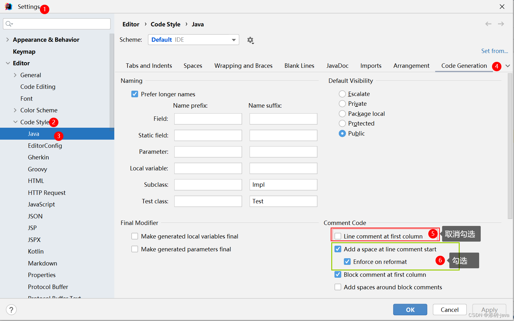

- [1. 基本](#1-基本)
- [2. 拷贝数组](#2-拷贝数组)
- [3. sort](#3-sort)
  - [3.1. 默认升序](#31-默认升序)
  - [3.2. 重载排序](#32-重载排序)
  - [3.3. 多重比较](#33-多重比较)

---

## 1. 基本
```java
import java.util.Arrays;
import java.util.Comparator;

public class Main {
    public static void main(String[] args) {
        // public static String toString(int[] a)
        // 把数组转换为字符串
        int[] arr = { 6, 1, 2, 3, 4, 5, 0 };
        System.out.println(Arrays.toString(arr));


        // 把数组转换为 List 集合
        // public static <T> List<T> asList(T... a) 
        List<Integer> list = Arrays.asList(1, 2, 3, 4, 5);
        System.out.println(list); // [1, 2, 3, 4, 5]

        
        /* --------------------------------------------------------------------------- */
        
        // public static int binarySearch(int[] a, int key)
        // 二分查找
        // 1. 前提：数组必须有序，而且是升序。
        // 2. 返回值：
        //      如果找到元素，返回索引
        //      如果没找到元素，返回 -(插入点) - 1
        //      插入点：应该插入的位置。减一是为了区分应该插入到0索引的位置与找到0索引的元素。
        Arrays.sort(arr);
        int index = Arrays.binarySearch(arr, 3);
        System.out.println(index);  // -3

        
        // public static int binarySearch(int[] a, int fromIndex, int toIndex, int key)
        // 经典左闭右开，不包括toIndex
        index = Arrays.binarySearch(arr, 4, 6, 3);
        System.out.println(index);  // -5

        /* --------------------------------------------------------------------------- */
        
        // public static int[] copyOf(int[] original, int newLength)
        // 把原数组的元素复制到新数组中
        // 1. 如果原数组为null，会抛出空指针异常
        // 2. 如果新数组长度 = 0，就是空数组
        // 3. 如果新数组长度 < 原数组长度，多出的元素会被舍弃
        // 4. 如果新数组长度 = 原数组长度，就是复制
        // 5. 如果新数组长度 > 原数组长度，多出的元素默认值为0
        int[] arr2 = null;
        // int[] newArr1 = Arrays.copyOf(arr2, 0);                // java.lang.NullPointerException
        int[] newArr2 = Arrays.copyOf(arr, 0);          // []
        int[] newArr3 = Arrays.copyOf(arr, 3);          // [0, 1, 2]
        int[] newArr4 = Arrays.copyOf(arr, arr.length);           // [0, 1, 2, 3, 4, 5, 6]
        int[] newArr5 = Arrays.copyOf(arr, 10);         // [0, 1, 2, 3, 4, 5, 6, 0, 0, 0]

        
        // public static int[] copyOfRange(int[] original, int from, int to)
        // 复制 [from, to) 之间的元素到新数组中
        int[] newArr6 = Arrays.copyOfRange(arr, 0, 3);    // [0, 1, 2]

        /* --------------------------------------------------------------------------- */

        // public static void fill(int[] a, int val)
        // 把数组中的元素都替换成指定的值
        Arrays.fill(arr, 3);
        
        // public static void fill(int[] a, int fromIndex, int toIndex, int val)
        // 把数组中指定的元素替换成指定的值
        Arrays.fill(arr, 0, 3, 3);

        /* --------------------------------------------------------------------------- */

        // public static boolean equals(int[] a, int[] a2)
        // 判断两个数组是否相等
        boolean flag = Arrays.equals(newArr3, newArr6);
        System.out.println(flag);   // true

        /* --------------------------------------------------------------------------- */

        // public static int hashCode(int[] a)
        // 返回指定数组的哈希值
        int hashCode = Arrays.hashCode(arr);
        System.out.println(hashCode);   // 199104450
    }
}
```

## 2. 拷贝数组


## 3. sort
### 3.1. 默认升序
```java
// public static void sort(int[] a)
// 对数组进行升序排序: 快速排序
// 是修改原数组的顺序，不是返回一个新数组。
Arrays.sort(arr);
System.out.println(Arrays.toString(arr));
```
### 3.2. 重载排序
```java
// 如果想要降序排序，需要重载。
// 1. 只能对引用类型进行降序排序，基本类型不行。
// 2. 降序排序的时候，需要自己写比较器。
Integer[] arr1 = { 6, 1, 2, 3, 4, 5, 0 };
// 重载后使用的是插入排序 + 二分查找。（通过打印compare中的o1和o2，确实是插入排序，但为什么怎么点进去注释写的是归并排序？）
// 默认把0索引的数据当做是有序的序列。1索引到最后认为是无序的序列。
// 遍历无序的序列得到里面的每一个元素，假设当前遍历得到的元素是A元素
// 把A往有序序列中进行插入，在插入的时候，是利用二分查找确定A元素的插入点。
// 拿着A元素，跟插入点的元素进行比较，比较的规则就是compare方法的方法体
Arrays.sort(arr1, new Comparator<Integer>() {
    // o1 是无序序列中要插入的元素，o2是有序序列中的元素
    // Returns:
    // 负数(-1, -2, -3等都行): 返回负数，说明o1 < o2, 则排o1o2
    // zero: 返回0，和正数一样，说明o1 = o2, 则排o2o1
    // 正数(1, 2, 3等都行): 返回正数，说明o1 > o2, 则排o2o1
    // 正常的升序排序，就是o1 - o2。o1 < o2，返回负数，o1排在o2前面；o1 == o2，返回0，o1排在o2后面；o1 > o2，返回正数，o1排在o2后面
    // 降序的话，就颠倒规则，o2 - o1。让 o1 < o2 返回正数，o1排在o2后面，o1 > o2 返回负数，o1排在o2前面，o1 == o2 返回0
    @Override
    public int compare(Integer o1, Integer o2) {
        // return o1 - o2;     // 升序
        System.out.println(o1 + " " + o2);
        // 1 6  o2 - o1 是正数，则 o1 > o2，o1排在o2后面
        // 2 1  o2 - o1 是负数，则 o1 < o2，o1排在o2前面
        // 2 1  但是为什么和1比较？以及重复比较了2次？
        // 2 6
        // 3 2
        // 3 6
        // 4 2
        // 4 3
        // 4 6
        // 5 3
        // 5 4
        // 5 6
        // 0 3
        // 0 1
        return o2 - o1;     // 降序
    }
});
System.out.println(Arrays.toString(arr1));
```
### 3.3. 多重比较
```java
import java.util.Arrays;
import java.util.Comparator;

public class Main {
    public static void main(String[] args) {
        Node [] nodes = new Node[3];
        nodes[0] = new Node(1, 3, "a");
        nodes[1] = new Node(1, 2, "b");
        nodes[2] = new Node(1, 2, "a");

        Arrays.sort(nodes, new Comparator<Node>() {
            @Override
            public int compare(Node o1, Node o2) {
                // 先按照x排序，再按照y排序，最后按照z排序
                double flag = o1.x - o2.x;
                flag = flag == 0 ? o1.y - o2.y : flag;
                flag = flag == 0 ? o1.z.compareTo(o2.z) : (int)flag;

                if (flag > 0) {
                    return 1;
                } else if (flag < 0) {
                    return -1;
                } else {
                    return 0;
                }
            }
        });

        System.out.println(Arrays.toString(nodes));
    }
}

class Node{
    int x;
    double y;
    String z;

    public Node(int x, double y, String z) {
        this.x = x;
        this.y = y;
        this.z = z;
    }

    @Override
    public String toString() {
        return "Node{" +
                "x=" + x +
                ", y=" + y +
                ", z='" + z + '\'' +
                '}';
    }
}
```