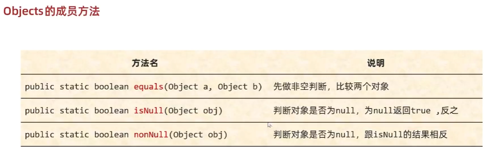
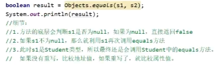

- [1. Object](#1-object)
  - [1.1. equals()](#11-equals)
  - [1.2. toString()](#12-tostring)
  - [1.3. clone()](#13-clone)
- [2. Objects](#2-objects)

---

## 1. Object

1. 所有类直接或间接地继承Object类
    
    

2. Object有5个虚方法，只要继承Object类就自动会获得这么5个虚方法:
   - `public int hashCode()`
   - `public boolean equals(Object obj)`
   - `public String toString()`
   - `protected Object clone()`
   - `protected void finalize()`: JDK9被弃用


### 1.1. equals()

```java
// 只是判断是不是同一个地址值
public boolean equals(Object obj) {
        return (this == obj);
}
```
IDEA自动重写


### 1.2. toString()


### 1.3. clone()


```java
// 证明浅克隆
public class Mytest {
    public static void main(String[] args) {
        Address address = new Address();
        address.setName("杭州");

        Person person1 = new Person();
        person1.setId(1);
        person1.setGender("男");
        person1.setAddress(address);

        Person person2 = person1.clone();
        // 1. 克隆的对象是一个新对象
        System.out.println(person1 == person2); // false
        // 2. 克隆的基本类型字段是值相等的
        System.out.println(person1.getId() == person2.getId()); // true
        // 3. 克隆的引用类型字段是同一个对象
        // 用引用对象的引用字段的内容、地址的来验证
        System.out.println(person1.getAddress() == person2.getAddress()); // true
        System.out.println(person1.getAddress().getName() == person2.getAddress().getName()); // true
        address.setName("北京");
        System.out.println(person2.getAddress().getName()); // 北京
        System.out.println(person1.getAddress().getName()); // 北京
        System.out.println(person1.getAddress().getName() == person2.getAddress().getName()); // true

        System.out.println(person1.getGender() == person2.getGender()); // true
        person1.setGender("女");
        System.out.println(person1.getGender() == person2.getGender()); // false
    }
}
 class Address{
    private String name;

    public void setName(String name) {
        this.name = name;
    }

    public String getName() {
        return name;
    }
}

 class Person implements Cloneable {
    private int id;
    private String gender;
    private Address address;
    
    public int getId() {
        return id;
    }

    public void setId(int id) {
        this.id = id;
    }

    public String getGender() {
        return gender;
    }

    public void setGender(String gender){
        this.gender = gender;
    }

    public Address getAddress() {
        return address;
    }

    public void setAddress(Address address) {
        this.address = address;
    }

    @Override
    public Person clone() {
        try {
            Person person = (Person) super.clone();
            return person;
        } catch (CloneNotSupportedException e) {
            throw new AssertionError();
        }
    }
}
```

## 2. Objects


比较对象会null异常。






