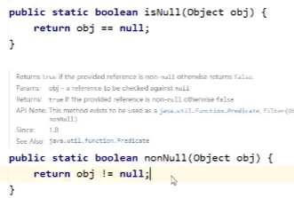

- [1. Object](#1-object)
- [为什么说是几乎所有对象实例都存在于堆中呢？](#为什么说是几乎所有对象实例都存在于堆中呢)
  - [1.1. equals()](#11-equals)
  - [1.2. toString()](#12-tostring)
  - [1.3. clone()](#13-clone)
- [2. Objects](#2-objects)

---

## 1. Object

1. 所有类直接或间接地继承Object类
    
    

2. Object有5个虚方法，只要继承Object类就自动会获得这么5个虚方法:
   - `public int hashCode()`
   - `public boolean equals(Object obj)`
   - `public String toString()`
   - `protected Object clone()`
   - `protected void finalize()`: JDK9被弃用

## 为什么说是几乎所有对象实例都存在于堆中呢？ 

这是因为 HotSpot 虚拟机引入了 JIT 优化之后，会对对象进行逃逸分析。

如果发现某一个对象并没有逃逸到方法外部，那么就可能通过标量替换来实现栈上分配，而避免堆上分配内存。

### 1.1. equals()

```java
// 只是判断是不是同一个地址值
public boolean equals(Object obj) {
        return (this == obj);
}
```
IDEA自动重写


### 1.2. toString()


### 1.3. clone()

浅克隆

## 2. Objects


比较对象会null异常。


