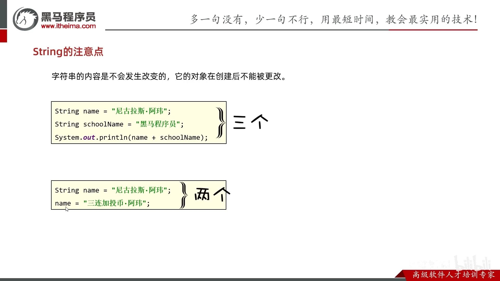
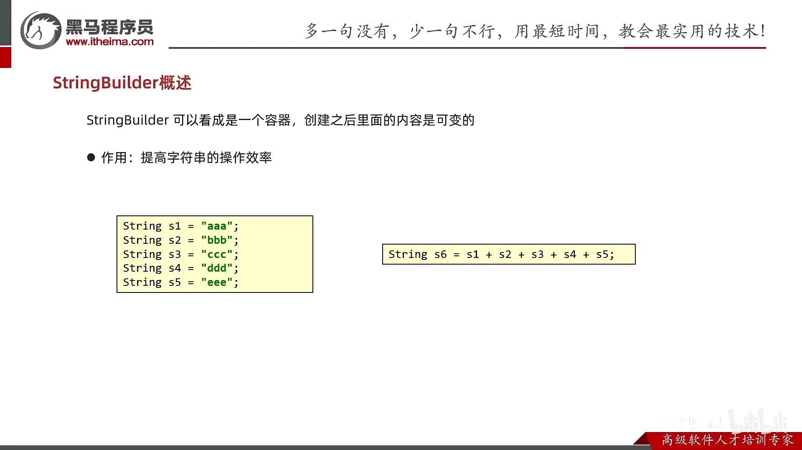
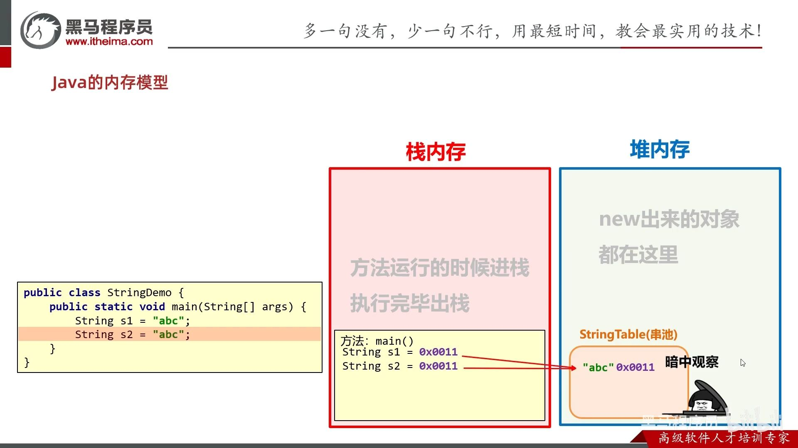
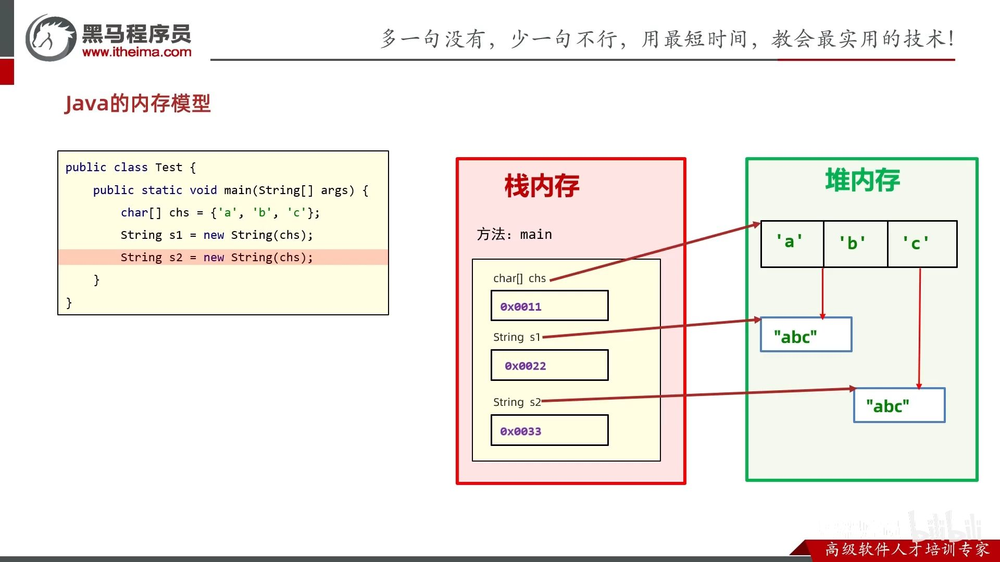
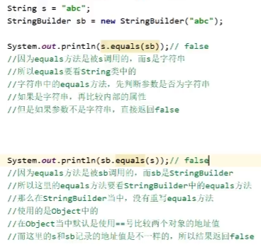

- [String](#string)
  - [创建String对象](#创建string对象)
  - [键入String](#键入string)
  - [比较String](#比较string)
  - [修改某个字符](#修改某个字符)
  - [子串 substring()方法](#子串-substring方法)
  - [找索引](#找索引)
  - [大小写](#大小写)
  - [分割](#分割)
- [StringBuilder: 快速拼接字符串。](#stringbuilder-快速拼接字符串)
  - [字符串拼接](#字符串拼接)
  - [手动StringBuilder提高字符串效率](#手动stringbuilder提高字符串效率)
  - [和String比较](#和string比较)
- [StringJoiner](#stringjoiner)
- [其他](#其他)
    - [int转String](#int转string)
    - [重复几次](#重复几次)

---
## String

- String 类在 java.lang 包下，所以使用的时候不需要导包
- 字符串不可变，它们的值在创建后不能被更改
- 虽然 String 的值是不可变的，但是它们可以被共享
- 字符串效果上相当于字符数组( char[] )，但是底层原理是字节数组( byte[] )

创建了几个字符串



s6额外产生了4个字符串



### 创建String对象


- 直接赋值
  
  `String s = "abc";`
- new出来的构造方法

  | 方法名                      | 说明                                      |
  | --------------------------- | ----------------------------------------- |
  | `public String()`           | 创建一个空白字符串对象`""`，不含有任何内容    |
  | `public String(String original)` | 根据传入的字符串，来创建字符串对象，`new String("ab")`      |
  | `public String(char[] chs)` | 根据字符数组的内容，来创建字符串对象      |
  | `public String(byte[] bys)` | 根据字节数组的内容，来创建字符串对象      |

char和byte数组还可以指定起始下标和个数。`new String(chs, 0, count)`

具体区别：
- 只有直接赋值的 `String a = "abc";`，JVM会在字符串常量池中创建String对象，字符串相同就复用，不创建新的。所以地址值相同，都指向字符串常量池。
- 而new的不在这里 `String a = new String(...);` 不复用，每次都会在堆上创建String对象，虽然内容相同，但是地址不同。





### 键入String

`sc.next()`, `sc.nextLine()`的内部源码是 `new String(xxx)`

```java
Scanner s = new Scanner(System.in);
String a = s.next();
String b = s.next();
System.out.println(a==b);   //false
```
```java
String c = s.nextLine();
String d = s.nextLine();
System.out.println(c==d);   //false
```
### 比较String

- `==`只能用于比较基本数据类型（比较值），不能比较引用数据类型（比较地址）。
- `equals`可以自定义成比较内容。

   
```java
String a = "abc";       // 变量a的存放的是字符串常量池的"abc"的地址
String b = "abc";
String c = new String("abc"); // 变量c的存放的是堆中"abc"的地址
String d = new String("abc");

/* 比较地址 */
// 串池复用而的地址都一样
System.out.println(a == b); // true
// 一个串池，一个new的堆上的，地址肯定不一样
System.out.println(a == c); // false
// new的不复用而地址不一样
System.out.println(c == d); // false

/* 比较内容 */
System.out.println(a.equals(b)); // true
System.out.println(a.equals(c)); // true
System.out.println(c.equals(d)); // true

```

```java
// public boolean equals(String s) 比较两个字符串内容是否相同、区分大小写
// public boolean equalsIgnoreCase(String s) 忽略大小写的比较
```

### 修改某个字符

获取摸个字符，Java的String没有索引`[]`，只有`.charAt()`方法。

```java
String str = "Hello World";
char c = str.charAt(0);
```

修改字符也不能通过索引，而是要转化为char字符数组。

```java
String str = "Hello World";
char[] c = str.toCharArray();
c[0] = 'b';
str = new String(c);   // bello World
```
### 子串 substring()方法

注意是小写 sub**s**tring.
```java
String substring(int beginIndex, int endIndex) 
[beginIndex, endIndex)，不允许负数-1之类的

String substring(int beginIndex) 
截取到末尾（包括）
```

```java
System.out.println("sdf".substring(0, 3));  // sdf
// System.out.println("sdf".substring(0, 4));  // 不允许超出的 endIndex

System.out.println("sdf".substring(3)); // 允许 beginIndex 是字符串长度，即刚好超出1个索引
// System.out.println("sdf".substring(4)); // 不允许超出更多的 beginIndex
```

### 找索引

```java
// indexOf: 找到第一个匹配的字符或字符串的位置，找不到返回-1
// lastIndexOf: 找到最后一个匹配的字符或字符串的位置，找不到返回-1
String a = "abcdabc";
int indexOf1 = a.indexOf('a');
int indexOf2 = a.indexOf("bc");
System.out.println(indexOf1);   // 0
System.out.println(indexOf2);   // 1
// 从索引1向右搜索
int indexOf3 = a.indexOf('e', 1);
int indexOf4 = a.indexOf("bc", 2);
System.out.println(indexOf3);   // -1
System.out.println(indexOf4);   // 5


int lastIndexOf1 = a.lastIndexOf('a');
int lastIndexOf2 = a.lastIndexOf("bc");
System.out.println(lastIndexOf1);   // 4
System.out.println(lastIndexOf2);   // 5
// 从索引1向左搜索
int lastIndexOf3 = a.lastIndexOf('a', 1);
int lastIndexOf4 = a.lastIndexOf("bc", 2);
System.out.println(lastIndexOf3);   // 0
System.out.println(lastIndexOf4);   // 1
```

### 大小写

**lower**

```java
String s = "Hello World";
String lower = s.toLowerCase();
String upper = s.toUpperCase();
```

### 分割

```java
String a = "Bob hit a ball, the hit BALL flew far after it was hit.";
String[] split = a.split("[^a-zA-Z0-9]+");
System.out.println(Arrays.toString(split));
// [Bob, hit, a, ball, the, hit, BALL, flew, far, after, it, was, hit
```

## StringBuilder: 快速拼接字符串。

不像String会产生中间无用的字符串，而是类型容器，拼接完了才产生字符串。

```java
// 1. 创建对象
StringBuilder sb = new StringBuilder();
// StringBuilder sb = new StringBuilder("Hello");

sb.append(123)      // 2. 追加  double, float, int, long, char, boolean
    .append("Hello")            // String, char[], StringBuffer    
    .reverse()              // 3. 反转
    .delete(5, 10)        // 4. 删除
    .insert(5, "World") // 5. 插入
    .replace(5, 10, "World")    // 6. 替换
    .setLength(0);      // 7. 清空

String s = sb.toString();    // 8. 转换为String。是new String

// 可以直接打印，因为StringBuilder重写了toString方法
System.out.println(sb);

int length = sb.length();    // 9. 获取长度
System.out.println(length);
```

### 字符串拼接


分为没有变量和有变量的拼接情况

1. 没有变量，会复用字符串常量池。

    `String s = "a" + "b" + "c";`

    触发字符串的优化机制，**编译**出class文件后直接就是`String s = "abc";`了。

2. 有变量时`s1 + "a"`。
   
    首先高低版本StringBuilder的toString()的结果都是**new String(...)**。

    其次，JDK8前后有一定的优化。
    
    JDK8前优化不行。同样是`+`字符串拼接，JVM都用StringBuilder比手动用StringBuilder慢，因为每次`+`拼接，都会创建两个新对象（新的StringBuilder对象和新的String对象）。具体是，`s1+"b"`, s1→new StringBuilder, add(s1).add("b")后再toString()得到new String对象。

    ```java
    String s1 = "a";
    String s2 = s1 + "b";   // 创建新的StringBuilder对象和新的String对象
    String s3 = s2 + "c";   // 又创建新的StringBuilder对象和新的String对象
    // 所以一共创建了四个新对象
    ```

    JDK8后， 编译器会预估最终字符串的长度（将各String对象的字符串长度相加），创建一个字符数组，最终将其变成new String对象。然而，预估也是需要时间。比如，左边只需要预估一次，而右边需要预估两次。
    ```java
    // 预估一次
    String s1 = "a";
    String s2 = "b";
    String s3 = "c";
    String s4 = s1 + s2 + s3;

    // 预估两次
    String s1 = "a";
    String s2 = s1 + "b";
    String s3 = s2 + "c";
    ```

面试题：
```java
String s1 = "abc";

// 无变量
String s2 = "a" + "b" + "c";
System.out.println(s1 == s2); // true

// 有变量
String s3 = "a";
String s4 = s3 + "bc";
System.out.println(s1 == s4); // false
```

```java
// final算常量
final String str1 = "str";  // 这里的str是常量池中的对象
final String str2 = "ing";
String c = "str" + "ing";// 常量池中的对象
String d = str1 + str2; // 复用
System.out.println(c == d);// true
```

```java
// 调用方法就不算常量了
public static void main(String[] args) {
    final String str1 = "str";  // 这里的str是常量池中的对象
    final String str2 = "ing";
    String c = "str" + getStr();// 常量池中的对象
    String d = str1 + str2;
    System.out.println(c == d);// true
}
public static String getStr() {
    return "ing";
}
```

### 手动StringBuilder提高字符串效率

1. 所有要拼接的内容都会往StringBuilder中放，`"a"`, `"b"`, `"c"`都是在字符串常量池中的，不会创建很多无用的空间，节约内存。
2. 不像默认字符串拼接每次都会创建新的StringBuilder，我们使用的都是同一个StringBuilder。

```java
StringBuilder sb = new StringBuilder();
sb.append("a").append("b").append("c");
String s = sb.toString();
```


### 和String比较



## StringJoiner

- JDK8特性。
- 简化元素分隔字符的代码。


```java
// 1. 创建对象
StringJoiner sj = new StringJoiner("--");   // 1--2--3
// StringJoiner sj2 = new StringJoiner(", ", "{", "}");  // {1, 2, 3}

// 2. 添加元素
sj.add("123")       // CharSequence类型
    .add("4")      // 不能是'4'
    .add(1 + "");       // 不能是1

// 3. 输出
String result = sj.toString();
System.out.println(result);

// 4. length
int length = sj.length();
```


## 其他

#### int转String

```java
String a = 0 + "";
```

#### 重复几次

JDK11引入

虽然没有`*`，但有`public String repeat(int count)`
```java
String a = " ".repeat(3);
```