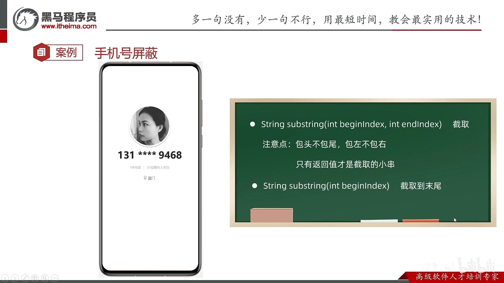
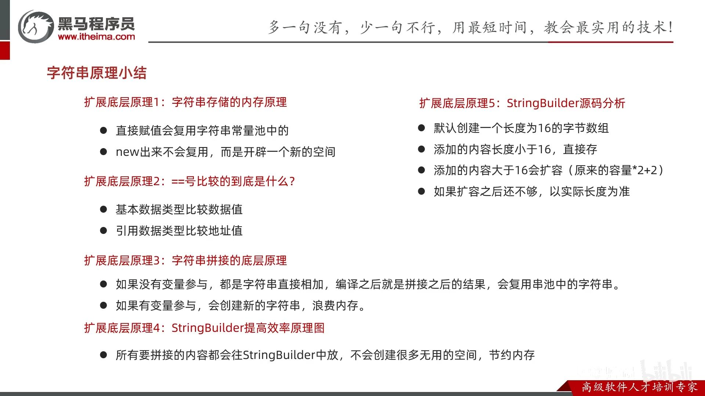
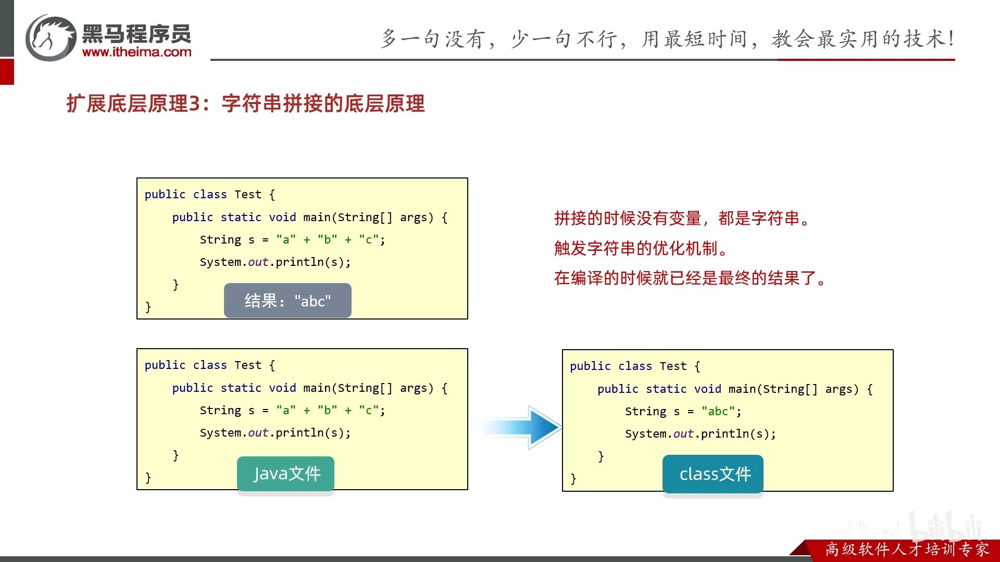
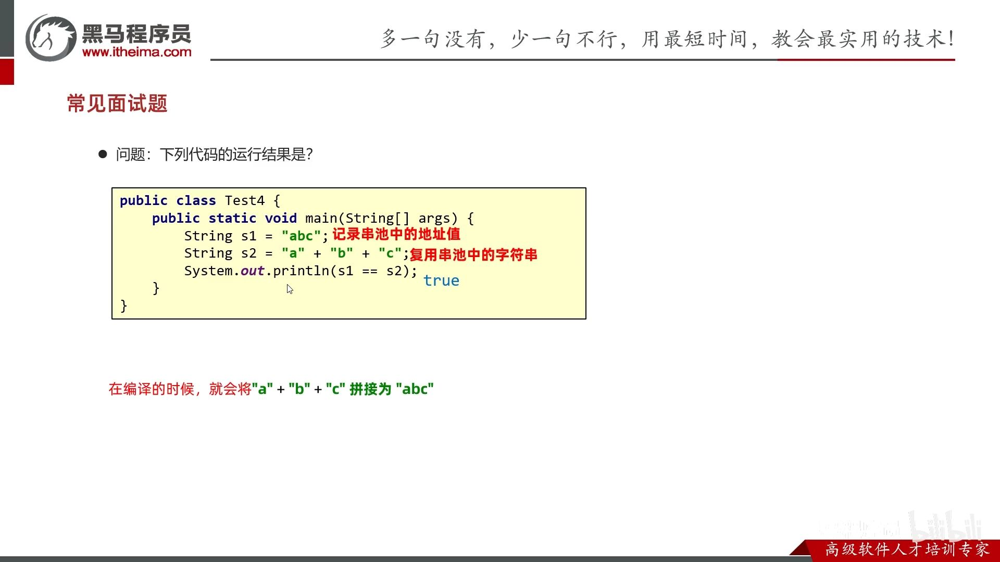
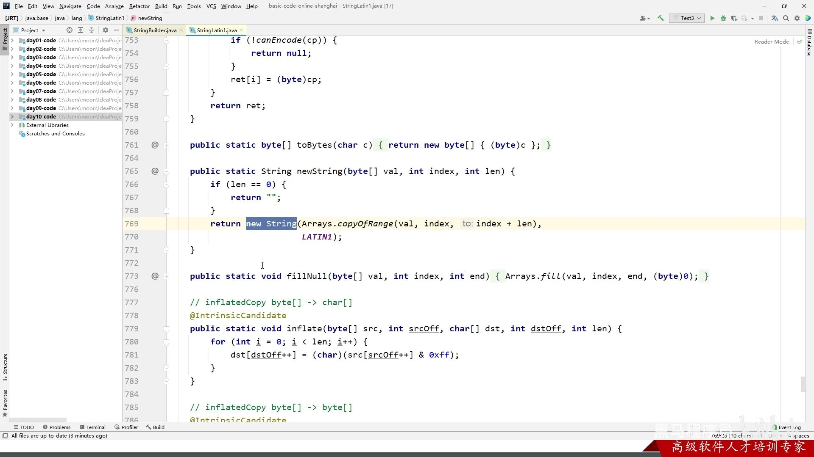
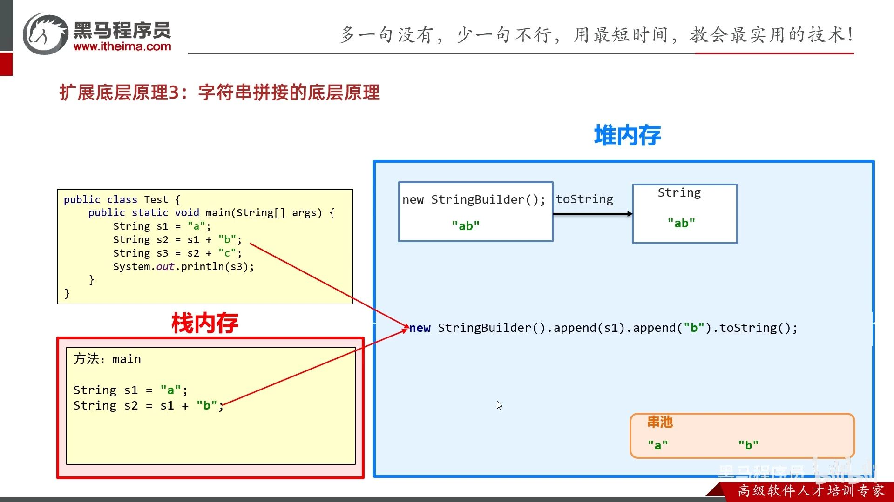
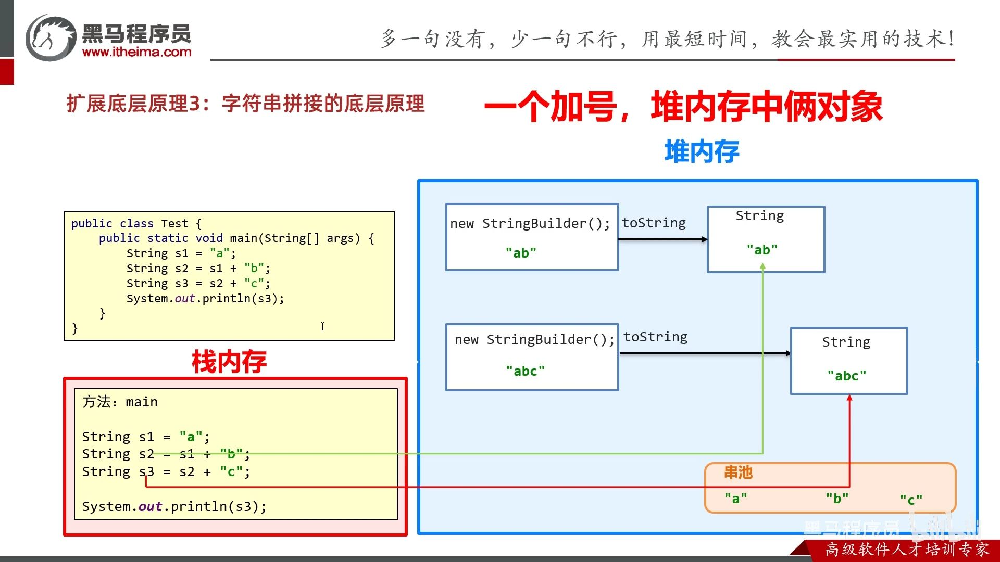
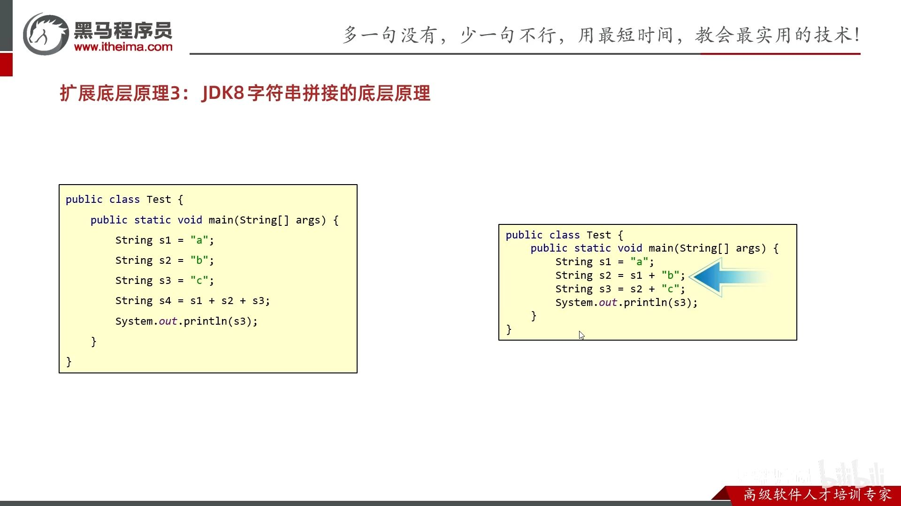
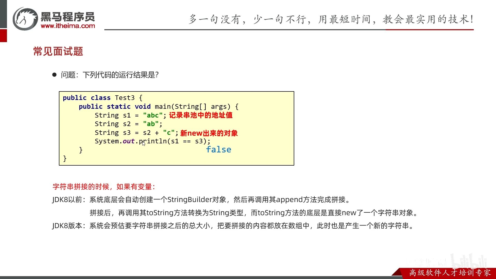

- [1. String](#1-string)
  - [1.1. 创建String对象](#11-创建string对象)
    - [1.1.1. 输入String](#111-输入string)
  - [1.2. 比较String](#12-比较string)
  - [1.3. 修改某个字符](#13-修改某个字符)
  - [1.4. 子串 subString()方法](#14-子串-substring方法)
- [2. StringBuilder: 快速拼接字符串。](#2-stringbuilder-快速拼接字符串)
    - [2.0.1. 和String比较](#201-和string比较)
- [2.1. StringJoiner](#21-stringjoiner)
  - [2.2. 总结](#22-总结)
  - [2.3. 其他](#23-其他)
    - [2.3.1. int转String](#231-int转string)

---
## 1. String

- String 类在 java.lang 包下，所以使用的时候不需要导包
- 字符串不可变，它们的值在创建后不能被更改
- 虽然 String 的值是不可变的，但是它们可以被共享
- 字符串效果上相当于字符数组( char[] )，但是底层原理是字节数组( byte[] )

创建了几个字符串


s6额外产生了4个字符串


### 1.1. 创建String对象


- 直接赋值
  
  `String s = "abc";`
- new出来的构造方法

  | 方法名                      | 说明                                      |
  | --------------------------- | ----------------------------------------- |
  | `public String()`           | 创建一个空白字符串对象`""`，不含有任何内容    |
  | `public String(char[] chs)` | 根据字符数组的内容，来创建字符串对象      |
  | `public String(byte[] bys)` | 根据字节数组的内容，来创建字符串对象      |
  | `public String(String original)` | 根据传入的字符串，来创建字符串对象，`new String("ab")`      |


具体区别：
- 只有直接赋值的 `String a = "abc";`，JVM会在字符串常量池中创建String对象，字符串相同就复用，不创建新的。所以地址值相同，都指向字符串常量池。
- 而new的不在这里 `String a = new String(...);` 不复用，每次都会在堆上创建String对象，虽然内容相同，但是地址不同。


#### 1.1.1. 输入String

`sc.next()`, `sc.nextLine()`的内部源码是 `new String(xxx)`

```java
Scanner s = new Scanner(System.in);
String a = s.next();
String b = s.next();
System.out.println(a==b);   //false
```
```java
String c = s.nextLine();
String d = s.nextLine();
System.out.println(c==d);   //false
```
### 1.2. 比较String

- `==`只能用于比较基本数据类型（比较值），不能比较引用数据类型（比较地址）。
- `equals`可以自定义成比较内容。

   
```java
String a = "abc";
String b = "abc";
String c = new String("abc");
String d = new String("abc");

/* 比较地址 */
// 串池复用而的地址都一样
System.out.println(a == b); // true
// 一个串池，一个new的堆上的，地址肯定不一样
System.out.println(a == c); // false
// new的不复用而地址不一样
System.out.println(c == d); // false

/* 比较内容 */
System.out.println(a.equals(b)); // true
System.out.println(a.equals(c)); // true
System.out.println(c.equals(d)); // true

```

```java
// public boolean equals(String s) 比较两个字符串内容是否相同、区分大小写
// public boolean equalsIgnoreCase(String s) 忽略大小写的比较
```

### 1.3. 修改某个字符

Java的String没有索引`[]`，只有`.charAt()`方法。

修改字符也不能通过索引，而是要转化为char字符数组。
### 1.4. 子串 subString()方法



```java
// 注意是小写 substring.
● String substring(int beginIndex) 截取到末尾（包括）
● String substring(int beginIndex, int endIndex) [beginIndex, endIndex)，不允许负数-1之类的
```
## 2. StringBuilder: 快速拼接字符串。

不像String会产生中间无用的字符串，而是类型容器，拼接完了才产生字符串。

```java
// 1. 创建对象
StringBuilder sb = new StringBuilder();
// StringBuilder sb = new StringBuilder("Hello");

sb.append(123)      // 2. 追加  double, float, int, long, char, boolean
    .append("Hello")            // String, char[], StringBuffer    
    .reverse()              // 3. 反转
    .delete(5, 10)        // 4. 删除
    .insert(5, "World") // 5. 插入
    .replace(5, 10, "World")    // 6. 替换
    .setLength(0);      // 7. 清空

String s = sb.toString();    // 8. 转换为String

// 可以直接打印，因为StringBuilder重写了toString方法
System.out.println(sb);

int length = sb.length();    // 9. 获取长度
System.out.println(length);
```

扩容原理：
- 默认创建一个长度为16的字节数组
- 添加的内容长度小于16，直接存
- 添加的内容大于16会扩容( 原来的容量*2+2)
- 如果扩容之后还不够，以实际长度为准

```java
// 默认容量为16
StringBuilder sb = new StringBuilder();
System.out.println(sb.capacity());  // 16

// 扩容为原来的2倍 + 2
sb.append("abcdefghijklmnopqrstuvwxyz");
System.out.println(sb.capacity());  // 34 = 16 * 2  + 2

// 如果扩容之后还不够，以实际长度为准
sb.append("abcdefghijklmnopqrstuvwxyzabcdefghijklmnopqrstuv");
System.out.println(sb.capacity());  // 74 > 70 = 34 * 2 + 2
```

[🚩字符串-12-字符串相关类的底层原理 P107 - 38:02](https://www.bilibili.com/video/BV17F411T7Ao?p=107&t=2282)

StringBuilder最大容量是int上限。

#### 2.0.1. 和String比较


## 2.1. StringJoiner

- JDK8特性。
- 简化元素分隔字符的代码。


```java
// 1. 创建对象
StringJoiner sj = new StringJoiner("--");   // 1--2--3
// StringJoiner sj2 = new StringJoiner(", ", "{", "}");  // {1, 2, 3}

// 2. 添加元素
sj.add("123")       // CharSequence类型
    .add("4")      // 不能是'4'
    .add(1 + "");       // 不能是1

// 3. 输出
String result = sj.toString();
System.out.println(result);

// 4. length
int length = sj.length();
```

### 2.2. 总结



字符串拼接的底层原理：分为没有变量和有变量的拼接情况

1. 没有变量：会复用串池

    

    面试题：

    


2. 有变量时，高低版本都是new String。通过StringBuilder。最终StringBuilder的toString()的结果是会new String()。

    

    但JDK8前，为什么默认`+`拼接同样用StringBuilder，但比手动用StringBuilder慢？因为每次`+`拼接，都会创建新的StringBuilder对象和中间String对象。

    具体是，`s1+"b"`, s1→StringBuilder, add()后再toString()得到String对象。

    


    

    JDK8后， 编译器会预估最终字符串的长度（将各String对象的字符串长度相加），创建一个字符数组，最终将其变成new String对象。

    然而，预估也是需要时间。比如，左边只需要预估一次，而右边需要预估两次。

    

    面试题：

    


### 2.3. 其他

#### 2.3.1. int转String

```java
String a = 0 + "";
```