- [1. String](#1-string)
  - [1.1. 创建String对象](#11-创建string对象)
  - [1.2. 比较String](#12-比较string)
  - [1.3. 输入String](#13-输入string)
  - [1.4. 修改](#14-修改)
  - [1.5. 子串 subString()方法](#15-子串-substring方法)
  - [1.6. StringBuilder: 快速拼接字符串。](#16-stringbuilder-快速拼接字符串)
    - [1.6.1. 和String比较](#161-和string比较)
  - [1.7. StringJoiner()：简化元素分隔字符的代码。](#17-stringjoiner简化元素分隔字符的代码)
  - [1.8. 总结](#18-总结)
  - [其他](#其他)
    - [int转String](#int转string)

---
## 1. String

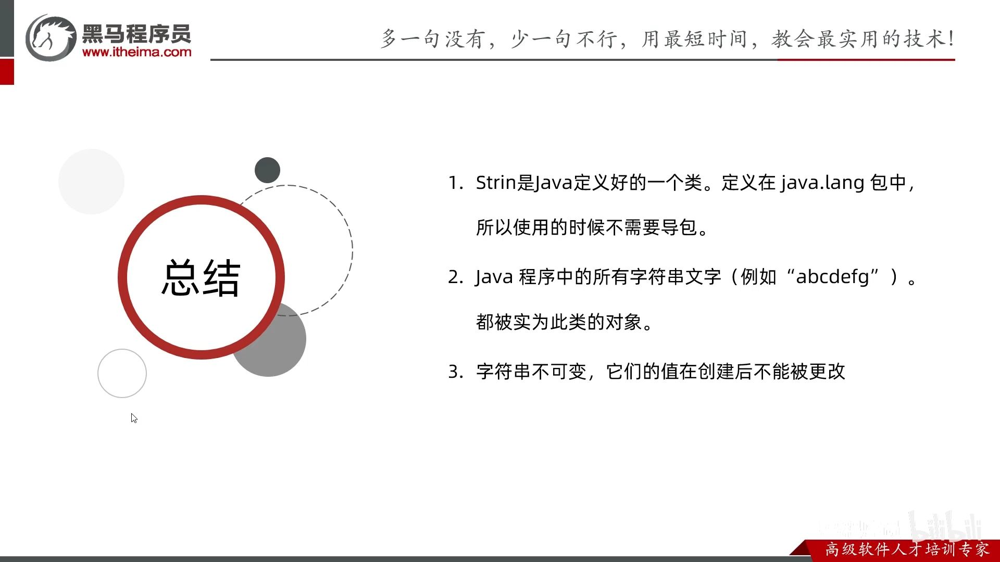

创建了几个字符串


s6额外产生了4个字符串


### 1.1. 创建String对象

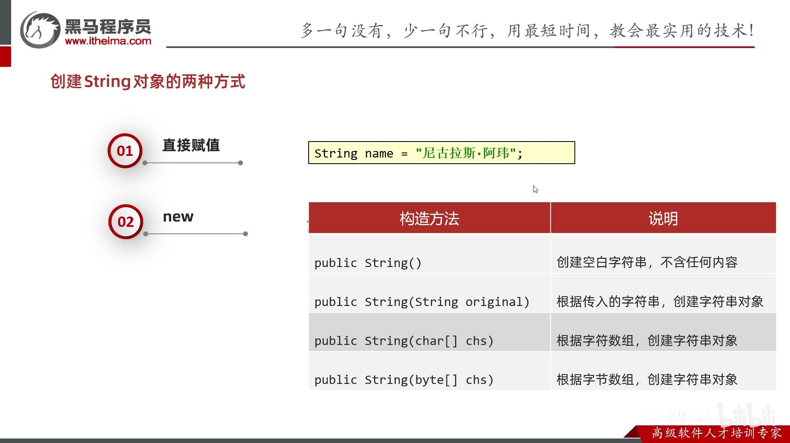

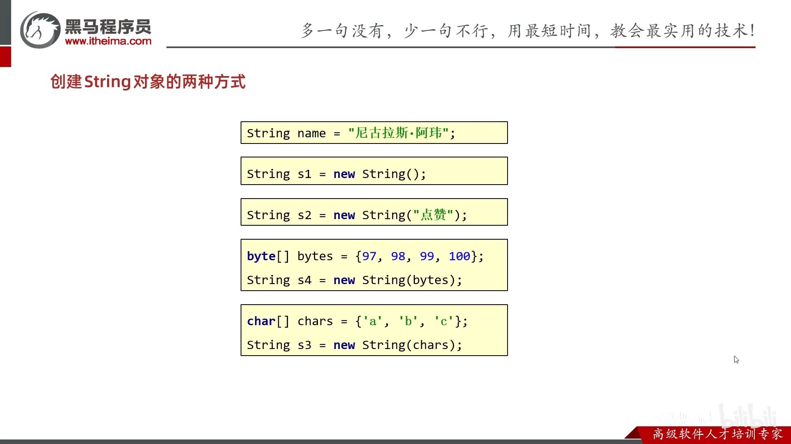

具体区别：在于串池（字符串常量池）StringTable，作用是复用。
- 只有直接赋值的才在这里 `String a = "abc";`，
- 而new的不在这里 `String a = new String("abc");`，不会复用。所以一般都直接赋值的方式。

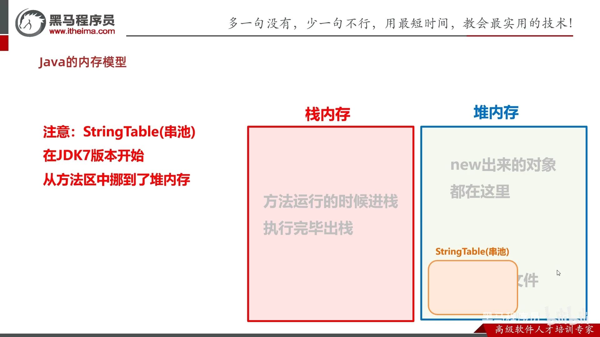


### 1.2. 比较String

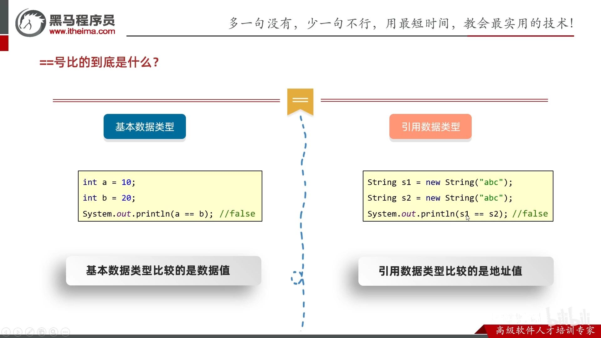

```java

String a = "abc";
String b = "abc";
String c = new String("abc");
String d = new String("abc");

/* 比较地址 */
// 串池复用而的地址都一样
System.out.println(a == b); // true
// 一个串池，一个new的，地址肯定不一样
System.out.println(a == c); // false
// new的不复用而地址不一样
System.out.println(c == d); // false

/* 比较内容 */
System.out.println(a.equals(b)); // true
System.out.println(a.equals(c)); // true
System.out.println(c.equals(d)); // true

```

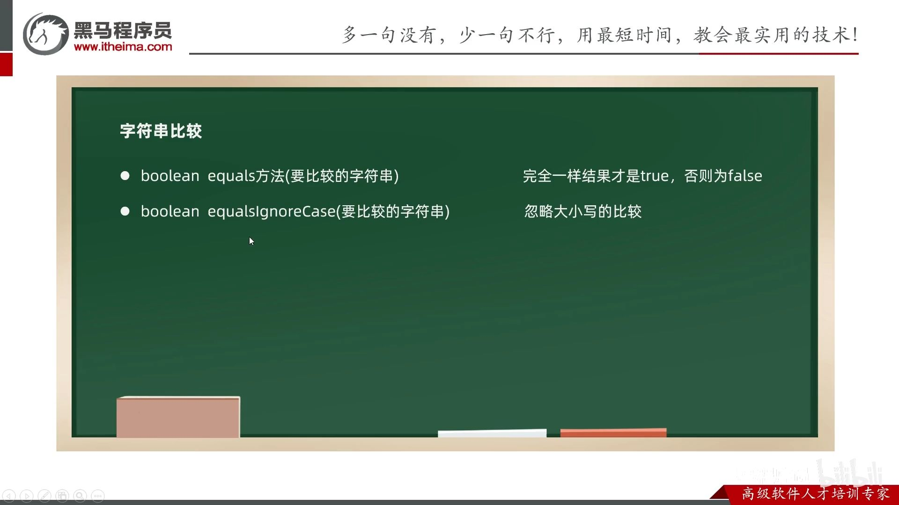

### 1.3. 输入String

`sc.next()`的内部源码是 `new String(xxx)`

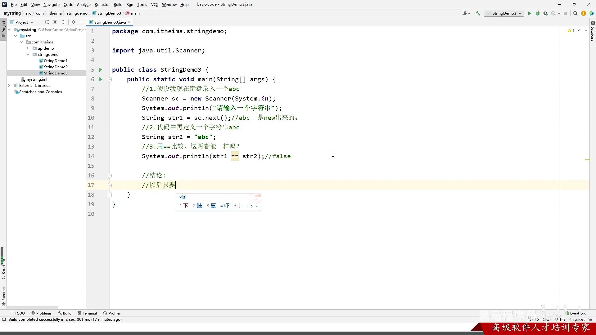

### 1.4. 修改

Java的String没有索引`[]`，只有`.charAt()`方法。

修改字符也不能通过索引，而是要转化为char字符数组。
### 1.5. 子串 subString()方法


### 1.6. StringBuilder: 快速拼接字符串。

不像String会产生中间无用的字符串，而是类型容器，拼接完了才产生字符串。

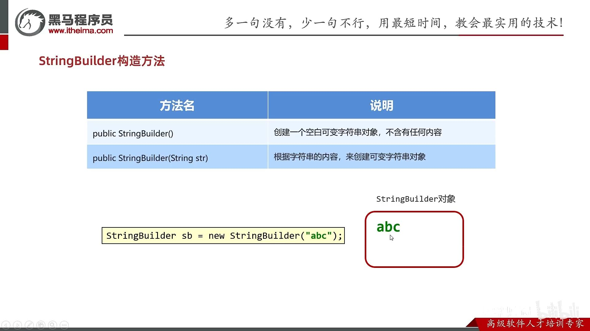

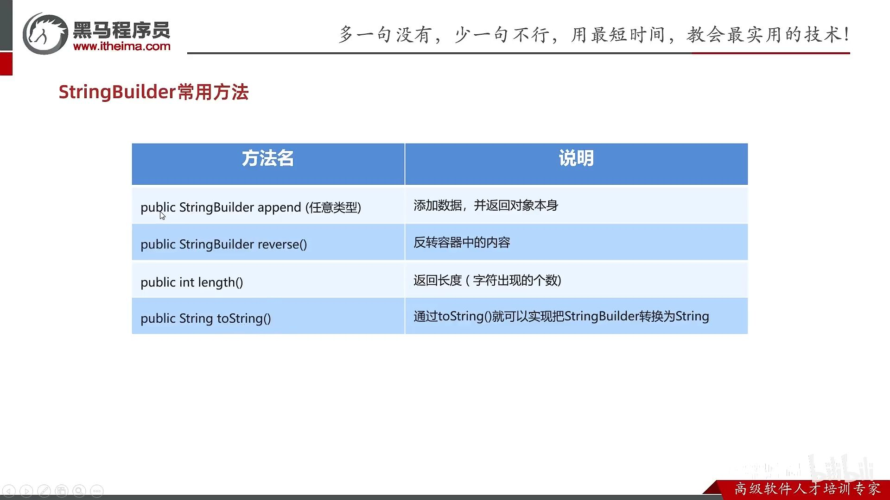


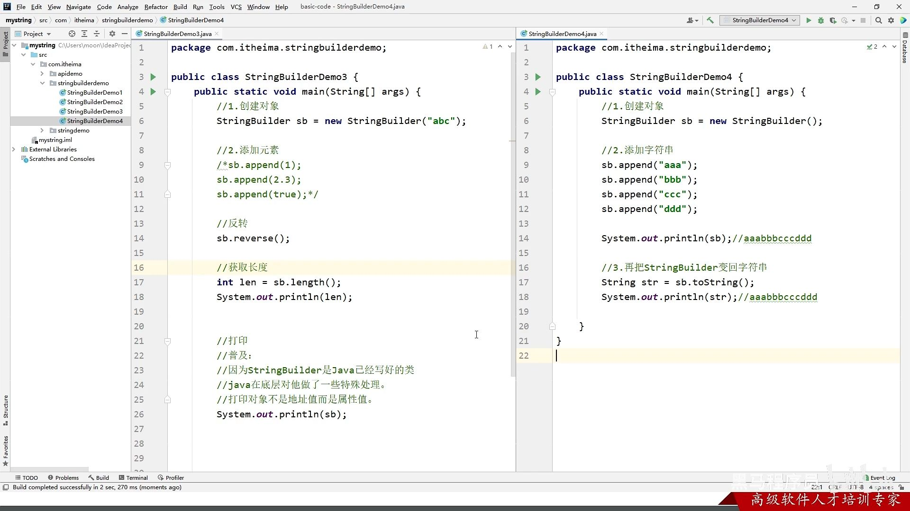

小技巧：链式编程，即连续append


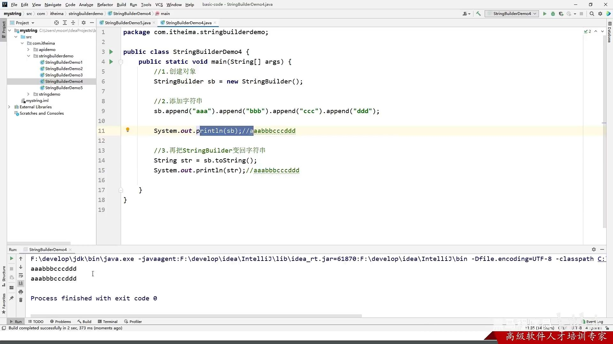


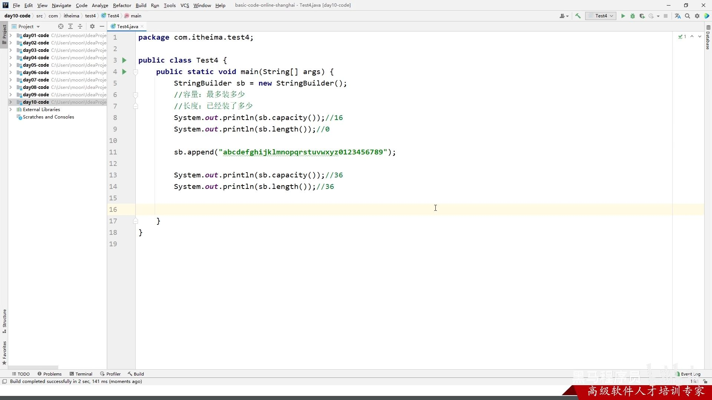

[🚩字符串-12-字符串相关类的底层原理 P107 - 38:02](https://www.bilibili.com/video/BV17F411T7Ao?p=107&t=2282)

StringBuilder最大容量是int上限。

#### 1.6.1. 和String比较


### 1.7. StringJoiner()：简化元素分隔字符的代码。

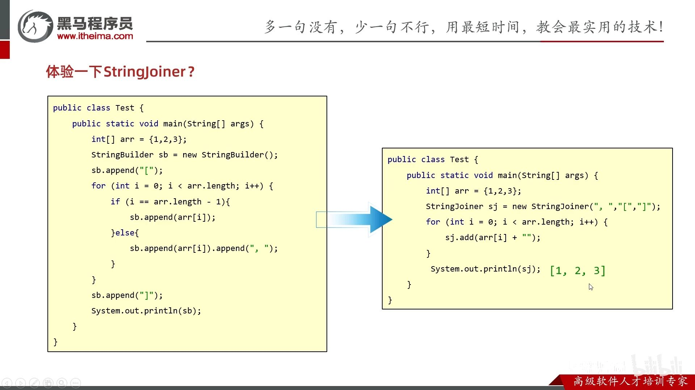

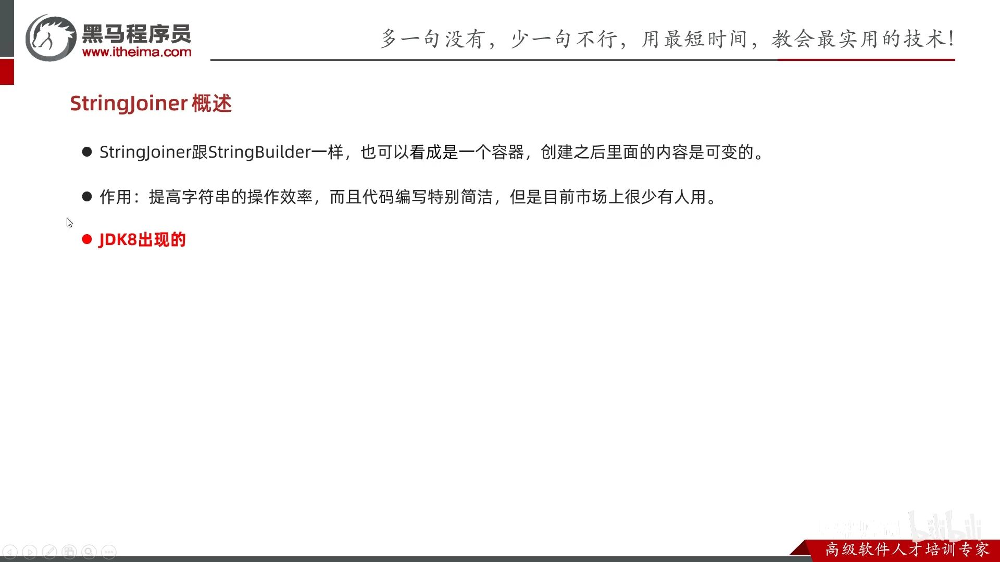


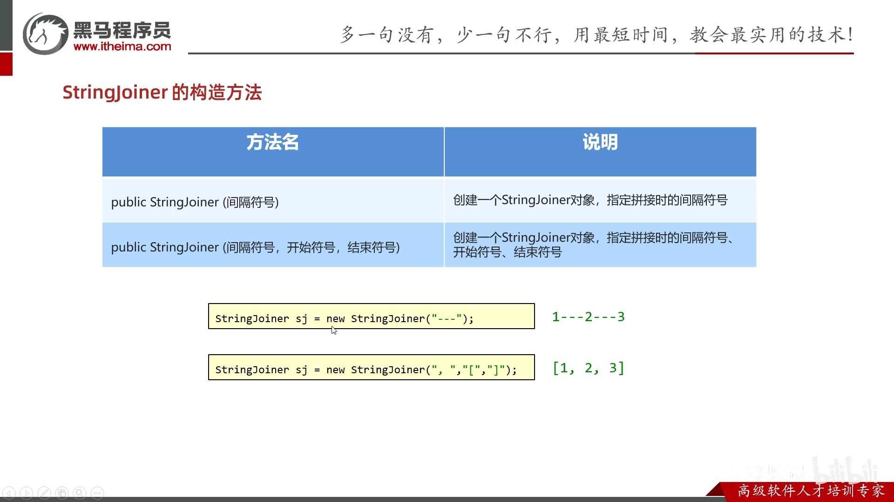

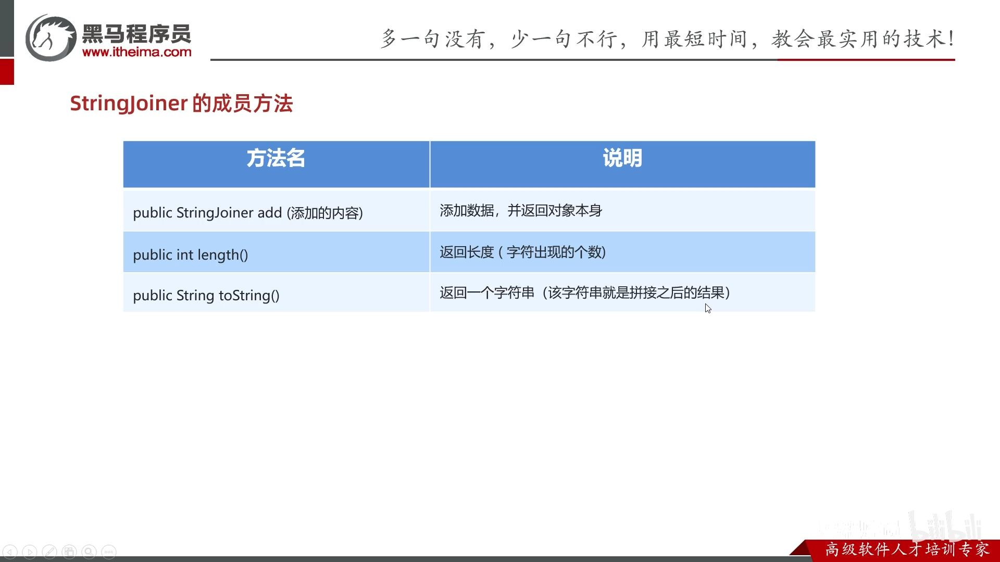

### 1.8. 总结


字符串拼接的底层原理：分为没有变量和有变量的拼接情况

1. 没有变量：会复用串池

    

    面试题：

    


2. 有变量时，高低版本都是new String。通过StringBuilder。最终StringBuilder的toString()的结果是会new String()。

    

    但JDK8前，为什么默认`+`拼接同样用StringBuilder，但比手动用StringBuilder慢？因为每次`+`拼接，都会创建新的StringBuilder对象和中间String对象。

    具体是，`s1+"b"`, s1→StringBuilder, add()后再toString()得到String对象。

    


    

    JDK8后， 编译器会预估最终字符串的长度（将各String对象的字符串长度相加），创建一个字符数组，最终将其变成new String对象。

    然而，预估也是需要时间。比如，左边只需要预估一次，而右边需要预估两次。

    

    面试题：

    


### 其他

#### int转String

```java
String a = 0 + "";
```