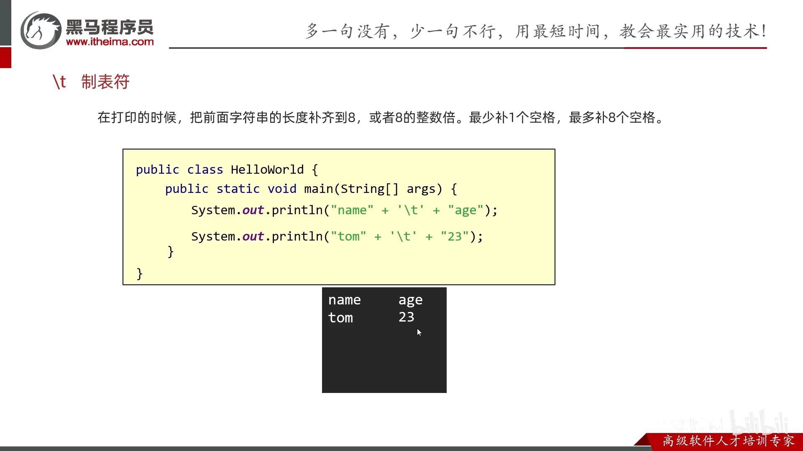

- [1. println, print, printf](#1-println-print-printf)
- [2. scan](#2-scan)
  - [2.1. 用法](#21-用法)
  - [2.2. 细节](#22-细节)
  - [2.3. 混用引起的后果](#23-混用引起的后果)
  - [2.4. 中文乱码](#24-中文乱码)


---

## 1. println, print, printf


```java
// 换行
System.out.println("Hello World!");

// 不换行
System.out.print("Hello World!");

// 不换行
System.out.printf("Hello %d %s", 123, "world");
```

## 2. scan

键盘录入分为两套：

- `next()`、`nextInt()`、`nextDouble()`这三个配套使用。

    在接收数据的时候，会遇到空格/回车/制表符，其中一个就会停止接收数据。

    如果用了这三个其中一个，就不要用nextLine()。

- `nextLine()`单独使用。
    
    在接收数据的时候，会遇到回车，就会停止接收数据。

    如果想要整数，那么先接收，再使用`Integer.parseInt()`进行类型转换。


```java
Scanner sc = new Scanner(System.in);
String s = sc.next();//键盘录入123
System.out.println("此时为字符串" + s);//此时123是字符串
int i = sc.nextInt();//键盘录入123
System.out.println("此时为整数：" + i);
```

```java
Scanner sc = new Scanner(System.in);
String s = sc.nextLine();//键盘录入123
System.out.println("此时为字符串" + s);//此时123是字符串
int i = Integer.parseInt(s);//想要整数再进行转换
System.out.println("此时为整数：" + i);
```

### 2.1. 用法

```java
/* next() */
// 录入的所有数据都会看做是字符串
Scanner sc = new Scanner(System.in);
String s = sc.next();
System.out.println(s);
// 键盘录入：a b
// 此时控制台打印a
// 表示next方法在接收数据的时候，遇到空格就停止了，后面的本次不接收。


/* nextInt() */
// 只能接受整数。
// ​键盘录入小数或者其他字母，就会报错。
int s = sc.nextInt();		//只能录入整数
System.out.println(s);
// 键盘录入：1 2
// 此时控制台打印1
// 表示nextInt方法在接收数据的时候，遇到空格就停止了，后面的本次不接收。


/* nextDouble() */
// 能接收整数和小数，但是都会看做小数返回。
// 录入字母会报错。
double d = sc.nextDouble();
System.out.println(d);
//键盘录入：1.1 2.2
//此时控制台打印1.1
//表示nextDouble方法在接收数据的时候，遇到空格就停止了，后面的本次不接收。


/* nextLine() */
String s = sc.nextLine();
System.out.println(s);
// 123 abc  
// 123 abc     
```
### 2.2. 细节

next()，nextInt()，nextDouble()在接收数据的时候
- 第一次遇到的**空格、回车、制表符**，会真正字符前的这些过滤掉。
- 第二次会遇到**空格、回车、制表符**其中一个就会停止接收数据。但是这些符号 + 后面的数据还在内存中并没有接收。如果后面还有其他键盘录入的方法，会自动将这些数据接收。

```java
Scanner sc = new Scanner(System.in);
String s1 = sc.next();
String s2 = sc.next();
System.out.println(s1);
System.out.println(s2);
// 此时值键盘录入：回车空格a制表符b
// 那么第一个next()过滤完后会接收a，a后面是空格，那么就停止，所以打印s1是a
// 但是空格+b还在内存中。
// 第二个next会去掉前面的空格，只接收b
// 所以第二个s2打印出来是b
/*

 a      b
a
b
*/
```

nextLine()方法是把一整行(**空格、制表符，没有回车**)全部接收完毕。

代码示例：

```java
Scanner sc = new Scanner(System.in);
String s = sc.nextLine();
System.out.println(s);
System.out.println(s.length());
System.out.println(s == "");
//键盘录入：制表符a b(注意a和b之间用空格隔开)
//那么nextLine不会过滤前面和后面的空格，会把这一整行数据全部接收完毕。
/*
        a b
        a b
*/
// 录入后不打字符就回车，是空行""，有换行效果只是因为println。
/*


0
true
*/
```

### 2.3. 混用引起的后果

上面说的两套键盘录入不能混用，如果混用会有严重的后果。

代码示例：

```java
Scanner sc = new Scanner(System.in);//①
int i = sc.nextInt();//②
String s = sc.nextLine();//③
System.out.println(i);//④
System.out.println(s);
/*
123 abc 
123
 abc
*/
/*
123回车
123

    */
```

当代码运行到第二行，会让我们键盘录入，此时录入123。

但是实际上我们录的是123+回车。

而nextInt是遇到空格，回车，制表符都会停止。

所以nextInt只能接受123，回车还在内存中没有被接收。

此时就被nextLine接收了。

所以，如果混用就会导致nextLine接收不到数据。

### 2.4. 中文乱码

windows键盘输入的字符编码是GBK，而java默认编码是utf-8。所以，需要设置`Scanner`的编码。

```java
import java.util.Scanner;

public class Client {
    public static void main(String[] args) {
        Scanner sc = new Scanner(System.in, "GBK");
        String s = sc.nextLine(); // 你好
        System.out.println("此时为字符串" + s); // 你好
    }
}
```