## BigInteger

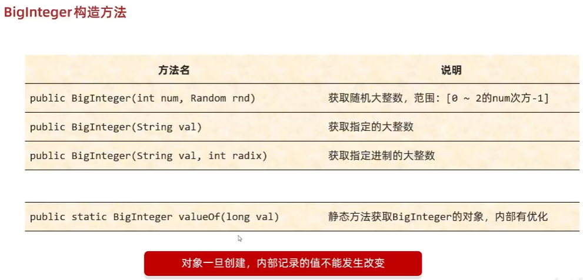

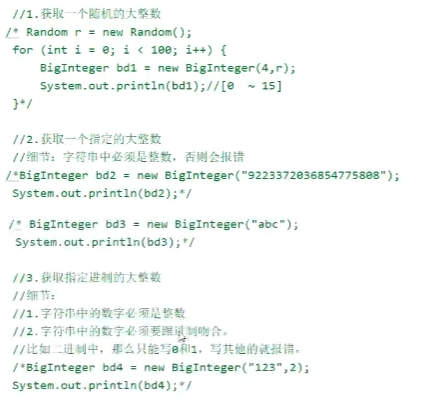

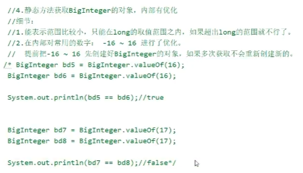

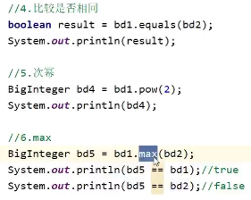

不会创建新的，而是返回比较大的。

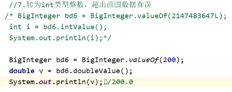

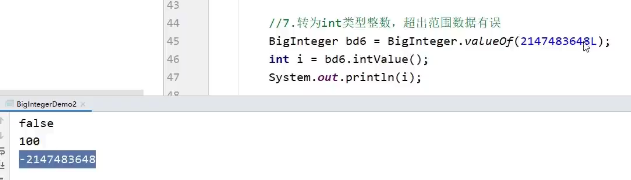

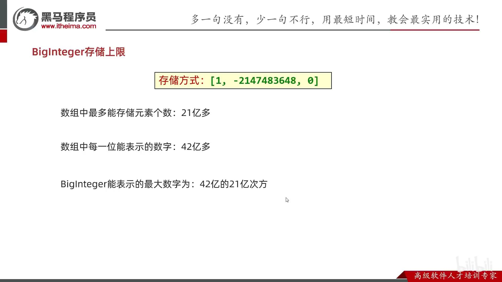

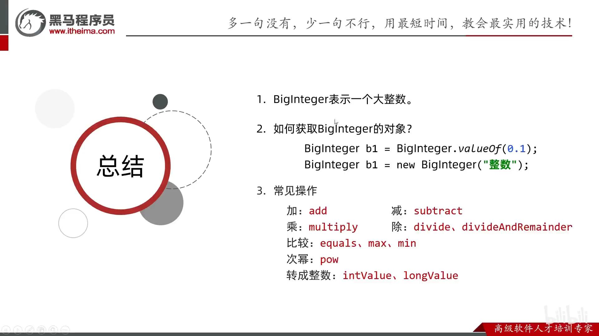

## BigDecimal
```java
BigDecimal a = new BigDecimal("1.0");
BigDecimal b = new BigDecimal("0.9");
BigDecimal c = new BigDecimal("0.8");

BigDecimal x = a.subtract(b);
BigDecimal y = b.subtract(c);

// 精准比较浮点数
System.out.println(x); /* 0.1 */
System.out.println(y); /* 0.1 */
System.out.println(Objects.equals(x, y)); /* true */
System.out.println(x == y); /* false */
```
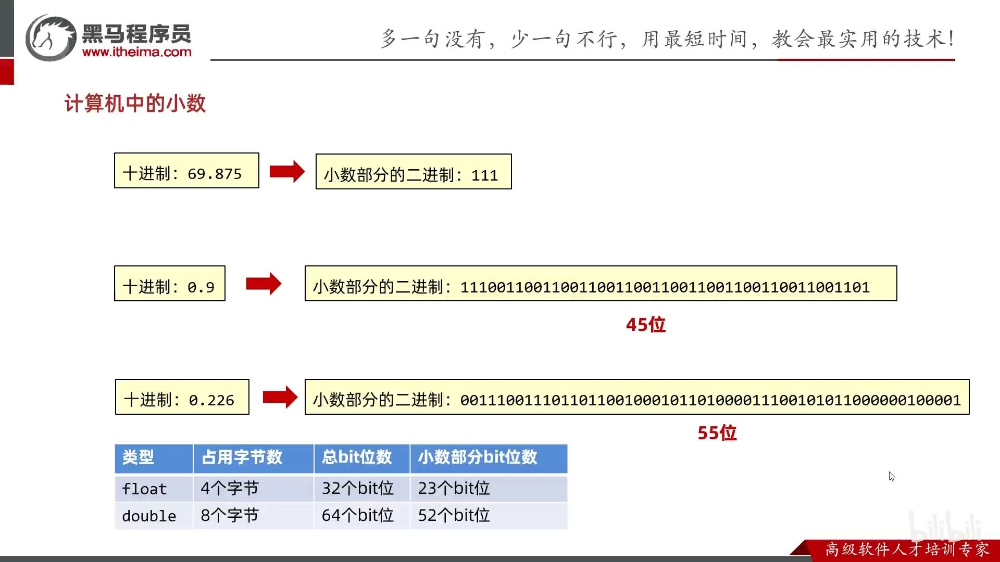

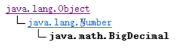

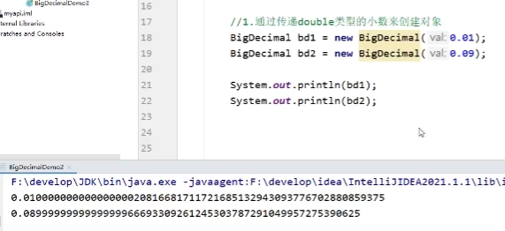

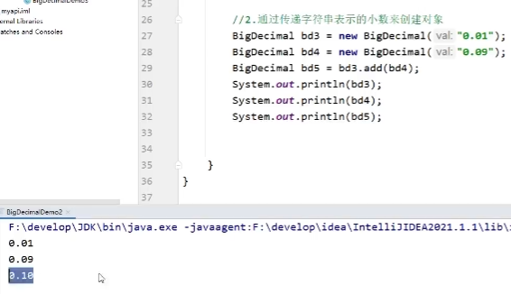

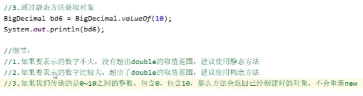

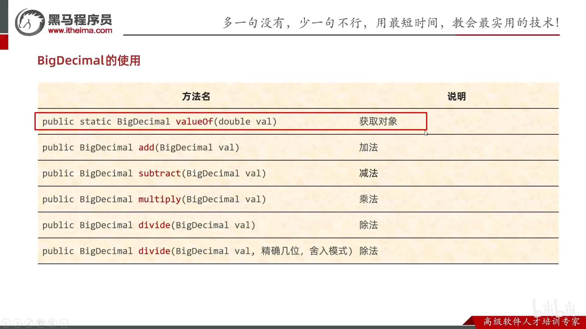

JDK9废弃

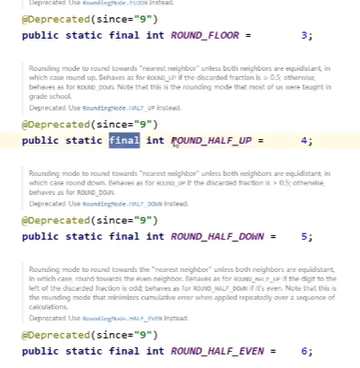

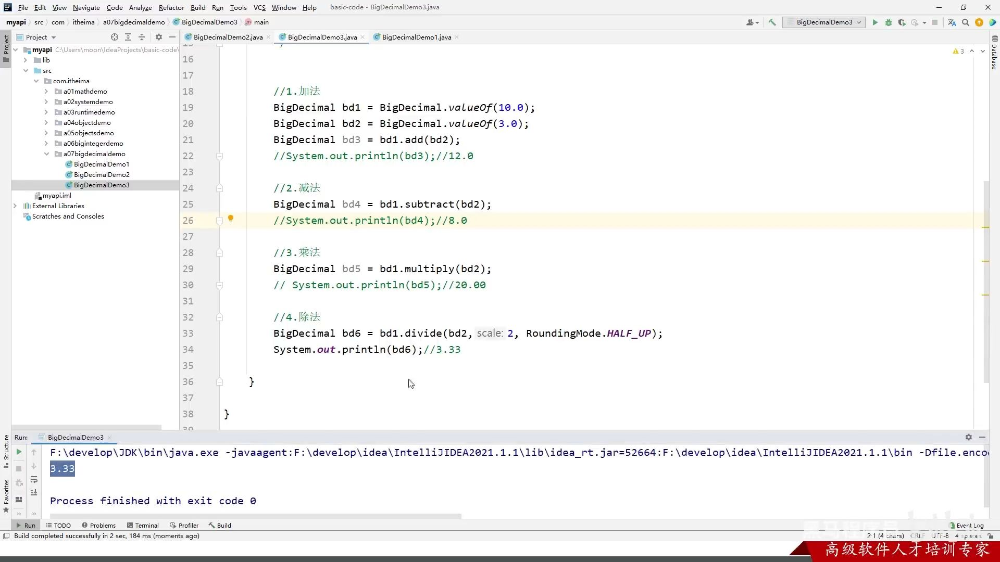

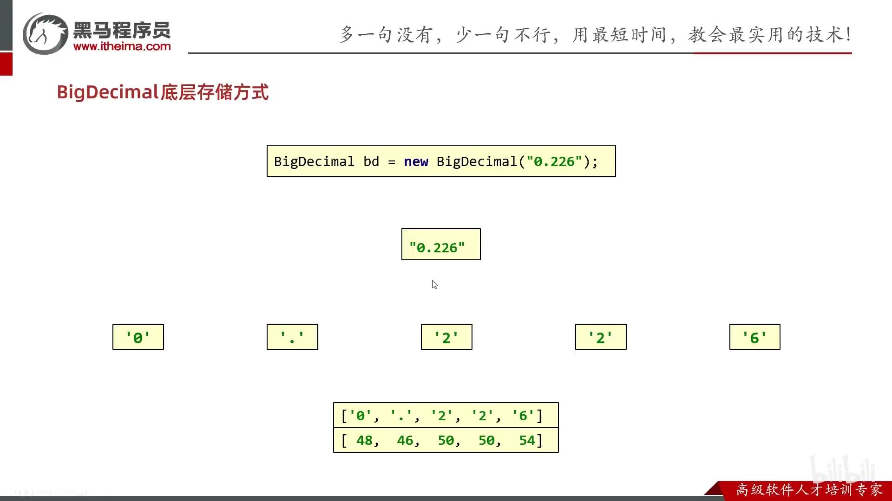

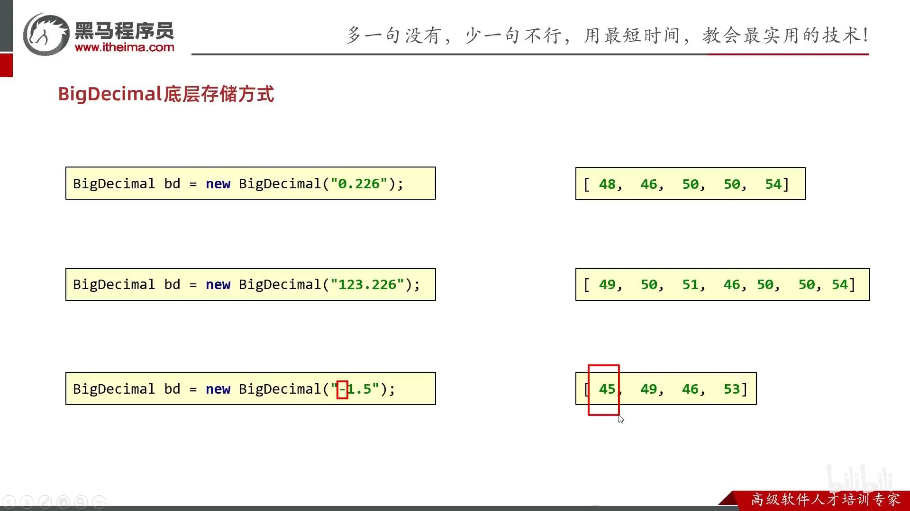

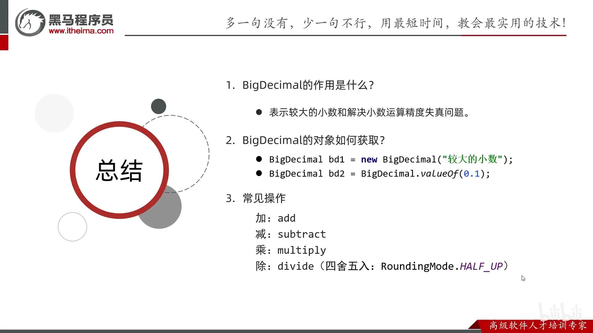