- [正则表达式](#正则表达式)
- [Pattern](#pattern)
  - [String中](#string中)
- [第三方包](#第三方包)

---
## 正则表达式

Java里的转义字符是 `\\`，故而 `\w` 是 `\\w`.

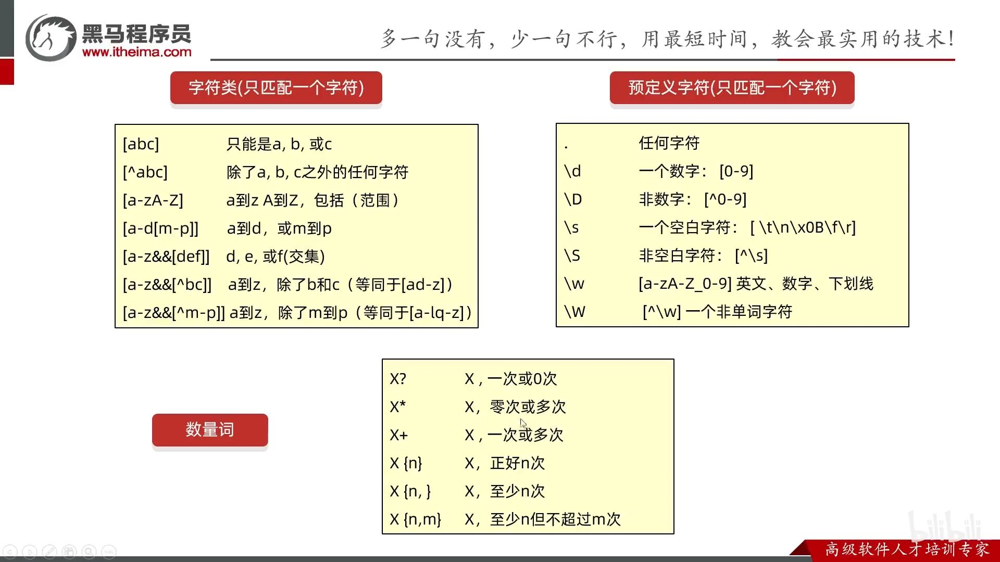

任意单词字符中去掉下划线。

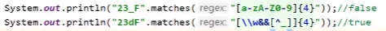

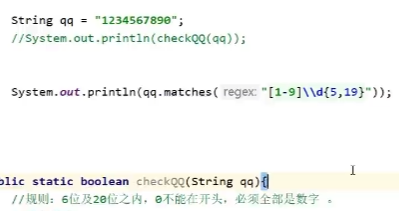


一组出现几次。

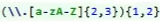

一组内的或者：00到23，分为00到19,20到23

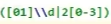

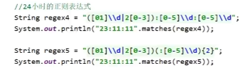

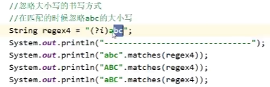

`(?i)`忽略后面的大小写

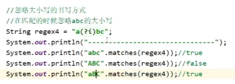

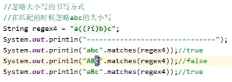

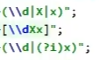

```java
// ()中没有-，0-9视为3个字符
String reg = "(0-9|x|X)";
System.out.println("1".matches(reg));       // false
System.out.println("0-9".matches(reg));     // true

// 单个字符的 \d
reg = "(\\d|x|X)";
System.out.println("1".matches(reg));       // true

// []才有-
reg = "[0-9xX]";
System.out.println("1".matches(reg));       // true
```

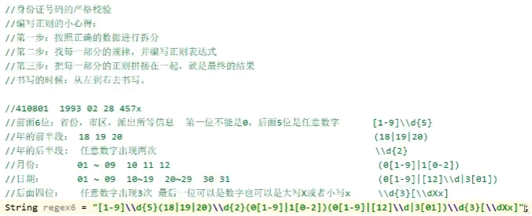

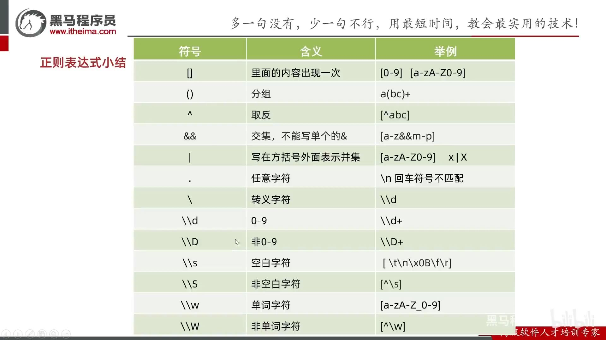

## Pattern

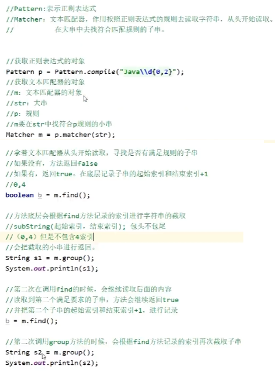

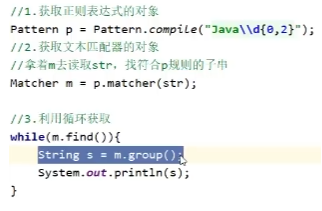

```java
Pattern p = Pattern.compile("(.{4})(，|。)");
// 你好，
String s = m.group(0); // 全要：你好，
String s = m.group(1); // 第一组：你好
String s = m.group(2); // 第二组：，
```

`?=`表示只要前面，`?:`表示都要，`?!`只要不符合条件的前面

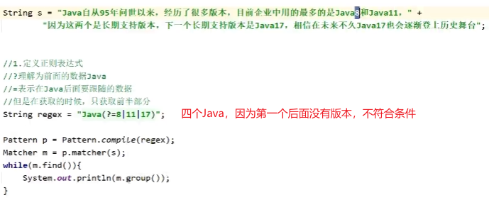


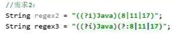

### String中

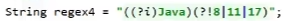


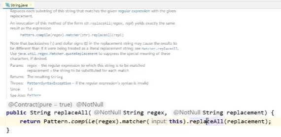

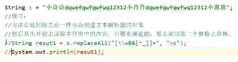

```java
String path = "D:\\aaa.txt";
String[] arr = path.split("\\.");
System.out.println(Arrays.toString(arr));   // [D:\aaa, txt]

// 没分隔，返回原字符串
String path2 = "D:\\aaa";
String[] arr2 = path2.split("\\.");
System.out.println(Arrays.toString(arr2));   // [D:\aaa]
```

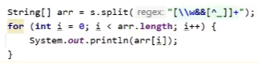

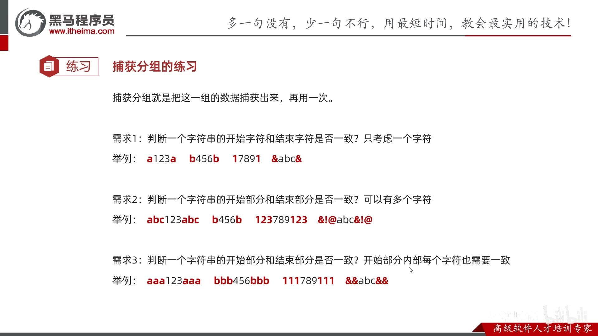

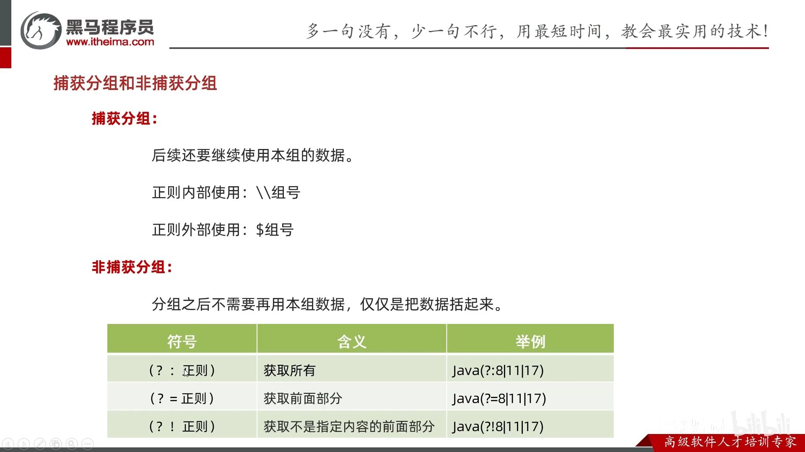

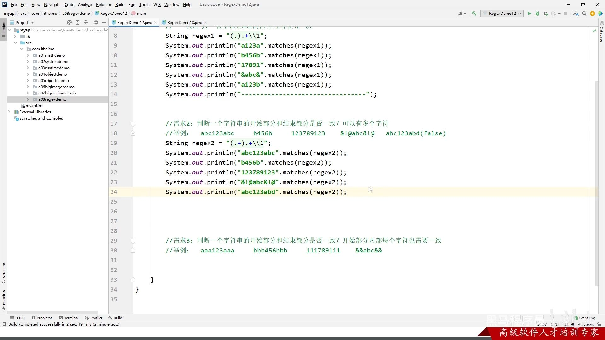

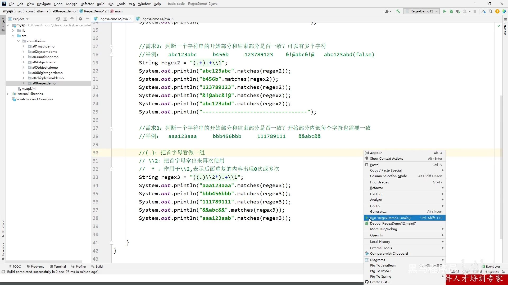

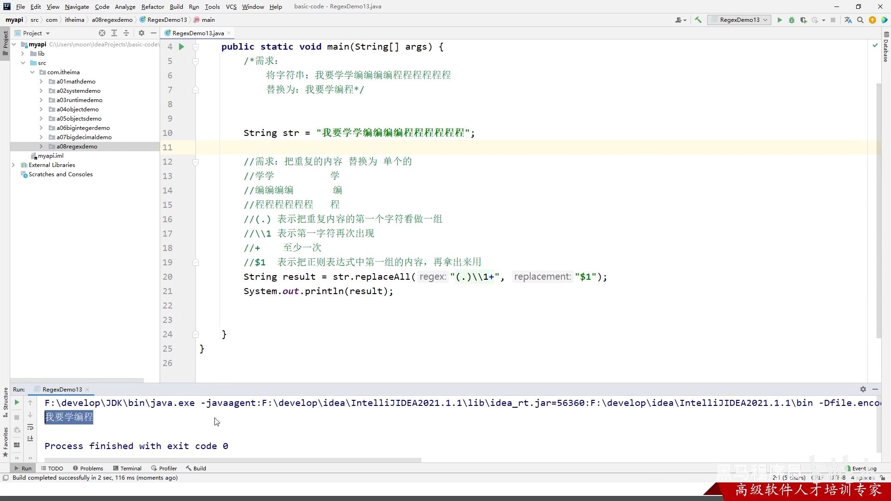

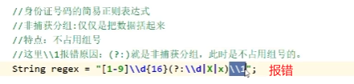

中文： `"[\\u4E00-\\u9FA5]`

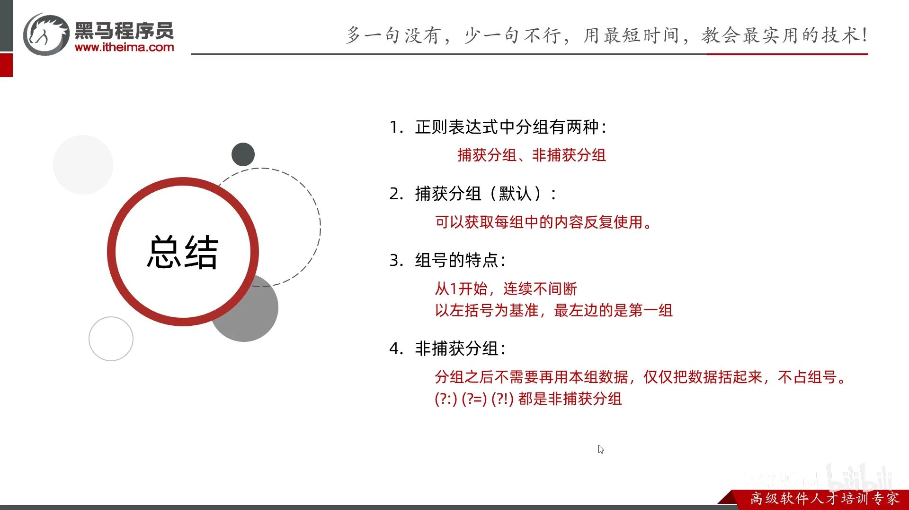

## 第三方包

```java
private static ArrayList<String> getData(String str, String regex,int index) {
    ArrayList<String> list = new ArrayList<>();
    Pattern pattern = Pattern.compile(regex);
    Matcher matcher = pattern.matcher(str);
    while (matcher.find()){
        list.add(matcher.group(index));
    }
    return list;
}

import cn.hutool.core.util.ReUtil;

List<String> boyNameTempList = ReUtil.findAll("([\\u4E00-\\u9FA5]{2})(、|。)", boyNameStr, 1);
```