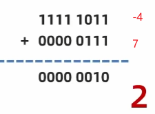
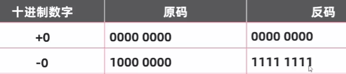
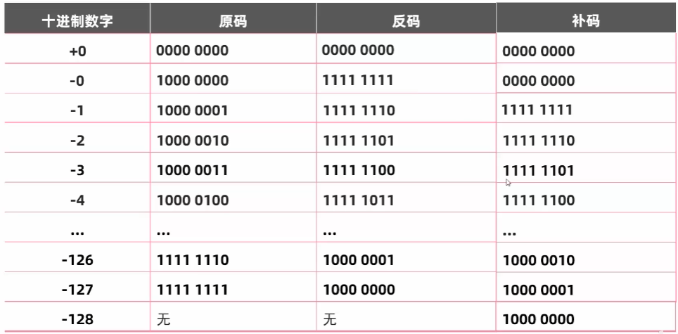
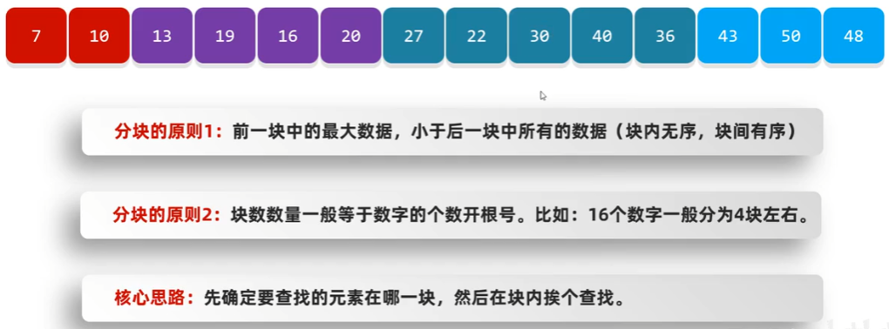
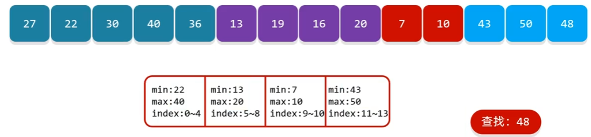
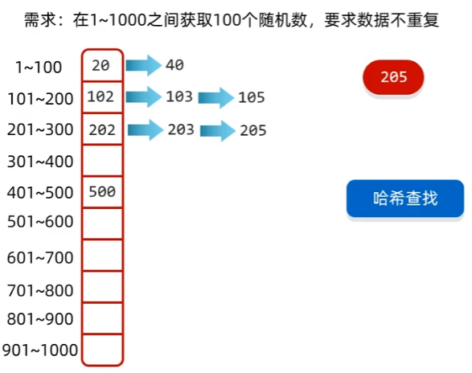
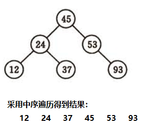

- [1. 常见的七种查找算法：](#1-常见的七种查找算法)
  - [1.1. 基本查找 / 顺序查找 / 线形查找](#11-基本查找--顺序查找--线形查找)
  - [1.2. 二分查找 / 折半查找](#12-二分查找--折半查找)
    - [1.2.1. 改进：插值查找](#121-改进插值查找)
    - [1.2.2. 改进：斐波那契查找](#122-改进斐波那契查找)
  - [1.3. 分块查找](#13-分块查找)
  - [1.4. 哈希查找](#14-哈希查找)
  - [1.5. 树表查找](#15-树表查找)


---
# 1. 常见的七种查找算法：


## 1.1. 基本查找 / 顺序查找 / 线形查找

​        说明：顺序查找适合于存储结构为数组或者链表。

**基本思想**：属于**无序查找**算法。从数据结构线的一端开始，顺序扫描，依次将遍历到的结点与要查找的值相比较，若相等则表示查找成功；若遍历结束仍没有找到相同的，表示查找失败。

示例代码：

```java
import java.util.ArrayList;

public class Main {
    public static void main(String[] args) {
        //从0索引开始挨个往后查找
        int[] arr = {131, 127, 147, 81, 103, 23, 7, 79};
        int number = 81;
        System.out.println(basicSearch(arr, number));
        for (int i : basicSearch2(arr, number)) {
            System.out.println(i);
        }
    }
    
    public static boolean basicSearch(int[] arr, int number){
        // 只要找到一个满足条件的，就返回true
        for (int i = 0; i < arr.length; i++) {
            if(arr[i] == number){
                return true;
            }
        }
        return false;
    }
    
    public static ArrayList<Integer> basicSearch2(int[] arr, int number){
        // 创建一个集合，用来存放所有满足条件的索引
        ArrayList<Integer> list = new ArrayList<Integer>();
        for (int i = 0; i < arr.length; i++) {
            if(arr[i] == number){
                list.add(i);
            }
        }
        return list;
    }
}
```

## 1.2. 二分查找 / 折半查找

说明：元素必须是**有序**的，从小到大，或者从大到小都是可以的。

如果是无序的，也可以先进行排序。但是排序之后，会改变原有数据的顺序，查找出来元素位置跟原来的元素可能是不一样的，所以排序之后再查找只能判断当前数据是否在容器当中，返回的索引无实际的意义。

mid=(low+high)/2, 或者 mid=low+1/2*(high-low);


　　**基本思想**：属于有序查找算法。用给定值先与中间结点比较。比较完之后有三种情况：

* 相等

  说明找到了

* 要查找的数据比中间节点小

  说明要查找的数字在中间节点左边

* 要查找的数据比中间节点大

  说明要查找的数字在中间节点右边

代码示例：

```java
package com.itheima.search;

public class A02_BinarySearchDemo1 {
    public static void main(String[] args) {
        //二分查找/折半查找
        int[] arr = {7, 23, 79, 81, 103, 127, 131, 147};
        System.out.println(binarySearch(arr, 150));
    }

    public static int binarySearch(int[] arr, int number){
        int min = 0;
        int max = arr.length - 1;

        while(true){
            // min，max包括首尾，所以等于不算异常，只有超出才是异常
            if(min > max){
                return -1;
            }
            // 找到min和max的中间位置，两个元素就偏左
            int mid = (min + max) / 2;
            if(arr[mid] > number){
                // number在mid的左边
                // min不变，max = mid - 1
                max = mid - 1;
            }else if(arr[mid] < number){
                // number在mid的右边
                // min = mid + 1，max不变
                min = mid + 1;
            }else{
                return mid;
            }
        }
    }
}
```


### 1.2.1. 改进：插值查找



`mid=low + (key-a[low])/(a[high]-a[low])*(high-low)`，

这样，让mid值的变化更靠近关键字key，这样也就间接地减少了比较次数。

也属于有序查找。

**细节：**对于表长较大，而关键字分布又比较均匀的查找表来说，插值查找算法的平均性能比折半查找要好的多。反之，数组中如果分布非常不均匀，那么插值查找未必是很合适的选择。


### 1.2.2. 改进：斐波那契查找
黄金分割。在数学中有一个非常有名的数学规律：斐波那契数列

运用到查找技术中：`(F[k-1]-1)+(1)+(F[k-2]-1) = (F[k]-1)`



也属于一种有序查找算法。

代码示例：

```java
public class FeiBoSearchDemo {
    public static int maxSize = 20;

    public static void main(String[] args) {
        int[] arr = {1, 8, 10, 89, 1000, 1234};
        System.out.println(search(arr, 1234));
    }

    public static int[] getFeiBo() {
        int[] arr = new int[maxSize];
        arr[0] = 1;
        arr[1] = 1;
        for (int i = 2; i < maxSize; i++) {
            arr[i] = arr[i - 1] + arr[i - 2];
        }
        return arr;
    }

    public static int search(int[] arr, int key) {
        int low = 0;
        int high = arr.length - 1;
        //表示斐波那契数分割数的下标值
        int index = 0;
        int mid = 0;
        //调用斐波那契数列
        int[] f = getFeiBo();
        //获取斐波那契分割数值的下标
        while (high > (f[index] - 1)) {
            index++;
        }
        //因为f[k]值可能大于a的长度，因此需要使用Arrays工具类，构造一个新法数组，并指向temp[],不足的部分会使用0补齐
        int[] temp = Arrays.copyOf(arr, f[index]);
        //实际需要使用arr数组的最后一个数来填充不足的部分
        for (int i = high + 1; i < temp.length; i++) {
            temp[i] = arr[high];
        }
        //使用while循环处理，找到key值
        while (low <= high) {
            mid = low + f[index - 1] - 1;
            if (key < temp[mid]) {//向数组的前面部分进行查找
                high = mid - 1;
                /*
                  对k--进行理解
                  1.全部元素=前面的元素+后面的元素
                  2.f[k]=k[k-1]+f[k-2]
                  因为前面有k-1个元素没所以可以继续分为f[k-1]=f[k-2]+f[k-3]
                  即在f[k-1]的前面继续查找k--
                  即下次循环,mid=f[k-1-1]-1
                 */
                index--;
            } else if (key > temp[mid]) {//向数组的后面的部分进行查找
                low = mid + 1;
                index -= 2;
            } else {//找到了
                //需要确定返回的是哪个下标
                if (mid <= high) {
                    return mid;
                } else {
                    return high;
                }
            }
        }
        return -1;
    }
}
```

## 1.3. 分块查找 

日常的数组，既不是绝对有序，也不是绝对无序，而是相对有序。

- 当数据表中的数据元素很多时，可以采用分块查找。
- 分块查找适用于数据较多，但是数据不会发生变化的情况，如果需要一边添加一边查找，建议使用哈希查找

分块查找的过程：
1. 需要把数据分成N多小块，块与块之间不能有数据重复的交集。
2. 给每一块创建对象单独存储到数组当中
3. 查找块，确定要查找的数据属于哪一块
4. 再单独遍历这一块数据即可

> 顺序的块间：只用记录最大值



```java
package com.itheima.search;

public class A03_BlockSearchDemo {
    public static void main(String[] args) {
        int[] arr = {16, 5, 9, 12, 21, 18,
                     32, 23, 37, 26, 45, 34,
                     50, 48, 61, 52, 73, 66};

        // 创建三个块的对象
        Block b1 = new Block(21,0,5);
        Block b2 = new Block(45,6,11);
        Block b3 = new Block(73,12,17);
        Block[] blockArr = {b1,b2,b3};

        int index = getIndex(blockArr, arr, 37);
        System.out.println(index);
    }

    private static int getIndex(Block[] blockArr, int[] arr, int number) {
        // 确定number是在那一块当中
        int indexBlock = findIndexBlock(blockArr, number);

        // -1表示超出了所有块的最大值，当然不在数组中
        if(indexBlock == -1){
            return -1;
        }

        // 获取这一块的起始索引和结束索引
        int startIndex = blockArr[indexBlock].getStartIndex();
        int endIndex = blockArr[indexBlock].getEndIndex();

        // 单独遍历这一块数据即可
        for (int i = startIndex; i <= endIndex; i++) {
            if(arr[i] == number){
                return i;
            }
        }
        // 太小了
        return -1;
    }


    public static int findIndexBlock(Block[] blockArr,int number){ //100
        // 遍历每块的最大值
        for (int i = 0; i < blockArr.length; i++) {
            if(number <= blockArr[i].getMax()){
                return i;
            }
        }
        return -1;
    }
}

class Block{
    private int max;//最大值
    private int startIndex;//起始索引
    private int endIndex;//结束索引


    public Block() {
    }

    public Block(int max, int startIndex, int endIndex) {
        this.max = max;
        this.startIndex = startIndex;
        this.endIndex = endIndex;
    }

    public int getMax() {
        return max;
    }

    public void setMax(int max) {
        this.max = max;
    }

    public int getStartIndex() {
        return startIndex;
    }

    public void setStartIndex(int startIndex) {
        this.startIndex = startIndex;
    }

    public int getEndIndex() {
        return endIndex;
    }

    public void setEndIndex(int endIndex) {
        this.endIndex = endIndex;
    }

    public String toString() {
        return "Block{max = " + max + ", startIndex = " + startIndex + ", endIndex = " + endIndex + "}";
    }
}
```

> 无序的块间：记录最大值和最小值。



多记录个最小值，确保各块的区间不重复就行。用每块的最大值和最小值，来确定在哪块。

## 1.4. 哈希查找



哈希查找是分块查找的进阶版，适用于数据一边添加一边查找的情况。

一般是数组 + 链表的结合体或者是数组+链表 + 红黑树的结合体

在课程中，为了让大家方便理解，所以规定：

- 数组的0索引处存储1~100
- 数组的1索引处存储101~200
- 数组的2索引处存储201~300
- 以此类推

但是实际上，我们一般不会采取这种方式，因为这种方式容易导致一块区域添加的元素过多，导致效率偏低。

更多的是先计算出当前数据的哈希值，用哈希值跟数组的长度进行计算，计算出应存入的位置，再挂在数组的后面形成链表，如果挂的元素太多而且数组长度过长，我们也会把链表转化为红黑树，进一步提高效率。

具体的过程，大家可以参见B站阿玮讲解课程：从入门到起飞。在集合章节详细讲解了哈希表的数据结构。全程采取动画形式讲解，让大家一目了然。

## 1.5. 树表查找 

本知识点涉及到数据结构：树。

建议先看一下后面阿玮讲解的数据结构，再回头理解。

基本思想：二叉查找树是先对待查找的数据进行生成树，确保树的左分支的值小于右分支的值，然后在就行和每个节点的父节点比较大小，查找最适合的范围。 这个算法的查找效率很高，但是如果使用这种查找方法要首先创建树。 

　　二叉查找树（BinarySearch Tree，也叫二叉搜索树，或称二叉排序树Binary Sort Tree），具有下列性质的二叉树：

　　1）若任意节点左子树上所有的数据，均小于本身；

　　2）若任意节点右子树上所有的数据，均大于本身；

　　二叉查找树性质：对二叉查找树进行中序遍历，即可得到有序的数列。

​        不同形态的二叉查找树如下图所示：

  


　　基于二叉查找树进行优化，进而可以得到其他的树表查找算法，如平衡树、红黑树等高效算法。

具体细节大家可以参见B站阿玮讲解课程：从入门到起飞。在集合章节详细讲解了树数据结构。全程采取动画形式讲解，让大家一目了然。

在此不多做阐述。

​	不管是二叉查找树，还是平衡二叉树，还是红黑树，查找的性能都比较高