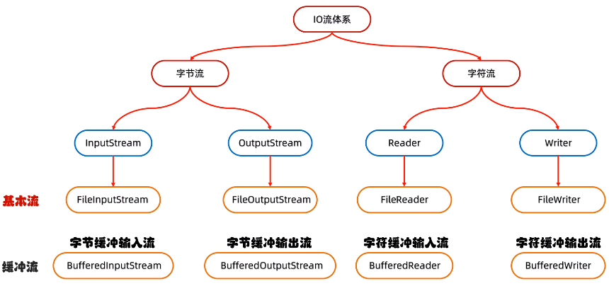
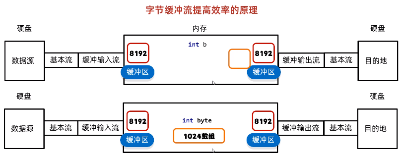
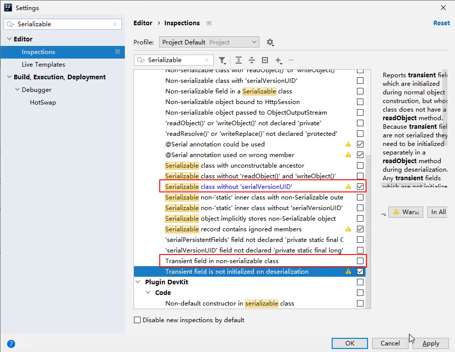
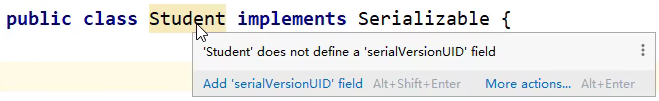

- [1. 分类](#1-分类)
- [2. 字节流](#2-字节流)
  - [2.1. FileOutputStream](#21-fileoutputstream)
  - [2.2. FileInputStream](#22-fileinputstream)
    - [2.2.1. 单个字节](#221-单个字节)
    - [2.2.2. 多个字节](#222-多个字节)
  - [2.3. try释放](#23-try释放)
- [3. 字符流](#3-字符流)
  - [3.1. FileReader](#31-filereader)
  - [3.2. FileWriter](#32-filewriter)
  - [3.3. 缓冲区](#33-缓冲区)
- [4. 缓冲流](#4-缓冲流)
  - [4.1. 字节缓冲流](#41-字节缓冲流)
  - [4.2. 字符缓冲流](#42-字符缓冲流)
- [5. 转换流](#5-转换流)
- [6. 序列化流](#6-序列化流)
- [7. 打印流](#7-打印流)
- [8. 压缩流](#8-压缩流)
- [9. demo](#9-demo)
  - [9.1. 拷贝文件夹](#91-拷贝文件夹)
  - [9.2. 字节的时间](#92-字节的时间)
  - [9.3. 文件原地修改](#93-文件原地修改)
  - [分块和合并](#分块和合并)
- [零拷贝](#零拷贝)
- [RandomAccessFile](#randomaccessfile)


---
## 1. 分类

- 基本流：
    
    
- 高级流：
    
    转换流、序列化流、

根据数据的流向分为：**输入流**和**输出流**。

* **输入流** ：把数据从`其他设备`上读取到`内存`中的流。 
* **输出流** ：把数据从`内存` 中写出到`其他设备`上的流。

格局数据的类型分为：**字节流**和**字符流**。

* **字节流** ：以字节为单位，读写数据的流。
* **字符流** ：以字符为单位，读写数据的流。

- 字节流
  - InputStream(抽象类)
  - OutputStream(抽象类)
- 字符流
  - Reader(抽象类)
  - Writer(抽象类)

```java
/* 抽象类
* 读单个，写单个，都是int: int read(), write(int b/c).
* 读写多个：一个是字节数组，另一个是字符数组
[ InputStream ]
    public abstract int read() throws IOException;
    
    public int read(byte[] b) throws IOException {
    public int read(byte[] b, int off, int len) throws IOException {

[ OutputStream ]
    public abstract void write(int b) throws IOException;

    public void write(byte[] b) throws IOException {
    public void write(byte[] b, int off, int len) throws IOException {

[ Reader ]
    public int read() throws IOException {
    
    public int read(char[] cbuf) throws IOException {
    public abstract int read(char[] cbuf, int off, int len) throws IOException;

[ Writer ]
    public void write(int c) throws IOException {
    
    public void write(char[] cbuf) throws IOException {
    public abstract void write(char[] cbuf, int off, int len) throws IOException;

    public void write(String str) throws IOException {
    public void write(String str, int off, int len) throws IOException {
*/
```
## 2. 字节流
### 2.1. FileOutputStream
创建对象
```java
public static void main(String[] args) throws IOException {
    // 1.创建对象
    // 细节1：参数是字符串表示的路径或者是File对象都是可以的
    // 细节2：如果文件不存在会创建一个新的文件，但是要保证父级路径是存在的。
    // 细节3：如果文件已经存在，则会清空文件
    // 细节4：续写 append=true，默认false. FileOutputStream("a.txt", true);
    FileOutputStream fos = new FileOutputStream("a.txt");

    // 2.写出数据
    // public void write(int b) throws IOException
    // 细节：write方法的参数是整数，但是实际上写到本地文件中的是整数在ASCII上对应的字符
    fos.write(57);
    fos.write(55);

    // 3.释放资源
    fos.close();
}
```
写数据
```java
/*
 * void write(int b) 一次写一个字节数据
 * void write(byte[] b) 一次写一个字节数组数据
 * void write(byte[] b, int off, int len) 一次写一个字节数组的部分数据
 * 可以String转byte数组：str.getBytes()
 */

FileOutputStream fos = new FileOutputStream("a.txt");
// 1. void write(int b)
fos.write(97); // a
fos.write(98); // b

// 2. void write(byte[] b)
byte[] bytes = { 97, 98, 99, 100, 101 };
fos.write(bytes); // a b c d e

// 3. void write(byte[] b, int off, int len)
String str = "abcde";
byte[] bytes1 = str.getBytes();
fos.write(bytes1, 1, 2); // b c
fos.close();
```
换行写
```java
/*
  换行写：换行符
      windows： \r\n
      Linux:    \n
      Mac:      \r
  细节：
      在windows操作系统当中，java对回车换行进行了优化。
      虽然完整的是\r\n，但是我们写其中一个\r或者\n，
      java也可以实现换行，因为java在底层会补全。
  建议：
      不要省略，还是写全了。
 */
String str = "123\r\n456";
byte[] bytes1 = str.getBytes();
fos.write(bytes1);
```

### 2.2. FileInputStream
#### 2.2.1. 单个字节
创建对象
```java
// 1.创建对象
// 细节1：如果文件不存在，就直接报错。
FileInputStream fis = new FileInputStream("b.txt");
// 2.读取数据
// 细节1：一次读一个字节，读出来的是数据在ASCII上对应的 int 数字
// 细节2：读到文件末尾了，read方法返回-1。
int b1 = fis.read();
System.out.println((char) b1);
// 3.释放资源
fis.close();
```
字节输入流循环读取
```java
FileInputStream fis = new FileInputStream("a.txt");
int b;
while ((b = fis.read()) != -1) {
    System.out.println((char) b);
}
fis.close();
```
#### 2.2.2. 多个字节

```java
FileInputStream fis = new FileInputStream("a.txt");   // abc

// public int read(byte[] buffer)  一次读取多个字节数据
// 返回值：实际读取到了多少个字节数据。读完则-1.
byte[] bytes = new byte[2];
int len1 = fis.read(bytes);
System.out.println(len1);   // 2
String str1 = new String(bytes, 0, len1);
System.out.println(str1);   // ab

int len2 = fis.read(bytes);
System.out.println(len2);   // 1
String str2 = new String(bytes, 0, len2);
System.out.println(str2);   // c

int len3 = fis.read(bytes);
System.out.println(len3);   // -1

fis.close();
```
字节输入流循环读取
```java
FileInputStream fis = new FileInputStream("a.txt");
int len;
byte[] bytes = new byte[1024 * 1024 * 5];
while((len = fis.read(bytes)) != -1){
    System.out.println(new String(bytes, 0, len));
}
fis.close();
```

### 2.3. try释放

```java
// finally 为了保证流对象一定会释放资源 close()
FileInputStream fis = null;     // 不赋值为null，就会报错未初始化。
FileOutputStream fos = null;
try {
    fis = new FileInputStream("D:\\itheima\\movie.mp4");
    fos = new FileOutputStream("copy.mp4");
    // 2.拷贝
    int len;
    byte[] bytes = new byte[1024 * 1024 * 5];
    while ((len = fis.read(bytes)) != -1) {
        fos.write(bytes, 0, len);
    }
} catch (IOException e) {
    // e.printStackTrace();
} finally {
    // 非null才有close()方法
    if (fos != null) {
        try {
            fos.close();
        } catch (IOException e) {
            e.printStackTrace();
        }
    }
    if (fis != null) {
        try {
            fis.close();
        } catch (IOException e) {
            e.printStackTrace();
        }
    }
}
```

JDK7: 自动释放特性，就不用finally手动释放了。

```java
/* JDK7
 * 注意：只有实现了AutoCloseable接口的类，才能在小括号中创建对象。
 * 
 * try(创建IO流对象1; 创建IO流对象2;){...}          // 最后一个分号有没有都行
 * catch(){...}
 * 
 * 可以只有try(流对象){...}
 */

try (FileInputStream fis = new FileInputStream("D:\\itheima\\movie.mp4");
      FileOutputStream fos = new FileOutputStream("copy.mp4");
    ) {
    int len;
    byte[] bytes = new byte[1024 * 1024 * 5];
    while ((len = fis.read(bytes)) != -1) {
        fos.write(bytes, 0, len);
    }
}
```
JDK9特性
```java
/*  JDK9特性：
 * 
 * 创建IO流对象1; 
 * 创建IO流对象2;
 * try(IO流对象1;IO流对象2;){        // 最后一个分号有没有都行
 * }catch(){
 * }
 */

FileInputStream fis = new FileInputStream("D:\\itheima\\movie.mp4");
FileOutputStream fos = new FileOutputStream("copy.mp4");

try (fis;fos) {
    int len;
    byte[] bytes = new byte[1024 * 1024 * 5];
    while ((len = fis.read(bytes)) != -1) {
        fos.write(bytes, 0, len);
    }
} catch (IOException e) {
    e.printStackTrace();
}
```

## 3. 字符流

[字符.md](./字符.md)

专门用于处理文本文件

### 3.1. FileReader
```java
/*
 * 第一步：创建对象
 * public FileReader(File file) 创建字符输入流关联本地文件
 * public FileReader(String pathname) 创建字符输入流关联本地文件
 * 
 * 第二步：读取数据
 * public int read() 读取数据，读到末尾返回-1
 * public int read(char[] buffer) 读取多个数据，读到末尾返回-1
 * 
 * 第三步：释放资源
 * public void close() 释放资源/关流
 */
FileReader fr = new FileReader("a.txt");


// int read（）细节：
// 如果遇到中文就会一次读取多个，GBK一次读两个字节，UTF-8一次读三个字节
// 1.read(): 字符流的底层也是字节流，默认也是一个字节一个字节的读取的, 如果遇到中文就会一次读取多个
// 2.在读取之后，方法的底层还会进行解码并转成十进制。
//      最终把这个十进制作为返回值
//      这个十进制的数据也表示在字符集上的数字
// 英文：文件里面二进制数据 0110 0001
//      read方法进行读取，解码并转成十进制97
// 中文：文件里面的二进制数据 11100110 10110001 10001001
//      read方法进行读取，解码并转成十进制27721

int ch;
while ((ch = fr.read()) != -1) {
    // 我想看到中文汉字，就是把这些十进制数据，再进行强转就可以了
    System.out.print((char) ch);
}
fr.close();
```

```java
char[] chars = new char[8];
int len;
// read(chars)：读取数据，解码，强转三步合并了，把强转之后的字符放到数组当中
while((len = fr.read(chars)) != -1){
    //把数组中的数据变成字符串再进行打印
    System.out.print(new String(chars, 0, len));
}
```

### 3.2. FileWriter

```java
/*
 * 第一步：创建对象
 * public FileWriter(File file) 创建字符输出流关联本地文件，存在则清空
 * public FileWriter(String pathname) 创建字符输出流关联本地文件，存在则清空
 * public FileWriter(File file, boolean append) 创建字符输出流关联本地文件，续写
 * public FileWriter(String pathname, boolean append) 创建字符输出流关联本地文件，续写
 * 
 * 第二步：读取数据
 * void write(int c) 写出一个字符
 * void write(char[] cbuf) 写出一个字符数组
 * void write(char[] cbuf, int off, int len) 写出字符数组的一部分
 * void write(String str) 写出一个字符串
 * void write(String str, int off, int len) 写出一个字符串的一部分
 * 
 * 第三步：释放资源
 * public void close() 释放资源/关流
 */
FileWriter fw = new FileWriter("a.txt", true);
fw.write(25105);    // utf-8的'我'

char[] chars = { 'a', 'b', 'c', '我' };
fw.write(chars);
fw.write(chars, 0, 3);

fw.write("你好威啊???");
fw.write("你好威啊???", 0, 4);

fw.close();
```

### 3.3. 缓冲区

> FileReader有缓冲区（FileInputStream没有）

1. 创建字符输入流对象 `new FileReader("b.txt")`
    
    底层: 关联文件，并创建缓冲区(长度为8192的字节数组)

2. 读取数据 `fr.read()`
    
    底层:
    1. 判断缓冲区中是否有数据可以读取
    2. 缓冲区没有数据: 
        
        从文件中获取数据→装到缓冲区中，每次尽可能装满缓冲区
        
        如果文件中也没有数据了，返回-1.

    3. 缓冲区有数据: 就从缓冲区中读取。


```java
FileReader fr = new FileReader("b.txt");
fr.read(); // 会把文件中的数据放到缓冲区当中

FileWriter fw = new FileWriter("b.txt"); // 清空文件

/*
 * 请问，如果我再次使用fr.read()进行读取，会读取到数据吗？
 * 
 * 正确答案：
 * 能，但是只能读取缓冲区中的数据，文件中剩余的数据无法再次读取
 */
int ch;
while ((ch = fr.read()) != -1) {
    System.out.println((char) ch);
}
fw.close();
fr.close();
```

> FileWriter有缓冲区（FileOutputStream没有）

1. 创建字符输出流对象 `new FileWriter("b.txt")`
    
    底层: 关联文件，并创建缓冲区(长度为8192的字节数组)

2. 刷缓冲区到硬盘
   1. 缓冲区写满了就刷入
   2. flush，立即刷
   3. close，先刷，再断开。

```java
FileWriter fw = new FileWriter("a.txt");

char[] chars = new char[8192];
fw.write(chars);    // 空

fw.write("a");  // nullx8192
fw.write("b");  // nullx8192

fw.flush();         // nullx8192 + ab

fw.write("c");  // nullx8192 + ab
fw.write("d");  // nullx8192 + ab

fw.close();         // nullx8192 + abcd

fw.write("e");  // 报错，流已经关闭了
```
## 4. 缓冲流

### 4.1. 字节缓冲流   

BufferedInputStream, BufferedOutputStream. 



```java
/*
 * 字节缓冲输入流的构造方法：
 * public BufferedInputStream(InputStream is)     // 默认缓冲区大小8192个字节
 * public BufferedInputStream(InputStream in, int size) 
 *
 * 字节缓冲输出流的构造方法：
 * public BufferedOutputStream(OutputStream os)   // 默认缓冲区大小8192个字节
 * public BufferedOutputStream(OutputStream os, int size)
 */

// 缓冲流套基本流
BufferedInputStream bis = new BufferedInputStream(new FileInputStream("a.txt"));
BufferedOutputStream bos = new BufferedOutputStream(new FileOutputStream("b.txt"));
// 如果要append，要在OutputStream中。
// BufferedOutputStream bos = new BufferedOutputStream(new FileOutputStream("b.txt", true));

// 1. 单个字节
int b;
while ((b = bis.read()) != -1) {
    bos.write(b);
}
// 2. 字节数组
byte[] bytes = new byte[1024];
int len;
while ((len = bis.read(bytes)) != -1) {
    bos.write(bytes, 0, len);
}
// 底层会帮我们关掉基本流，所以只需要关闭缓冲流
bos.close();
bis.close();
```

### 4.2. 字符缓冲流

对于字符流提升不明显，对于字符缓冲流而言关键点是两个特有的方法 `readLine()`, `newLine()`。

PS：字节流和字符流的缓冲区长度都是8192。具体是说，字节流是8192个字节数组，字符流是8192个字符数组(1char等于2byte，相当于16K字节大小)

```java
/*
 * 字符缓冲输入流：
 *      构造方法：public BufferedReader(Reader in)
 *               public BufferedReader(Reader in, int sz)       // 8192
 *      特有方法：public String readLine()      读一整行
 * 
 * 字符缓冲输出流
 *      构造方法：public BufferedWriter(Writer out)
 *               public BufferedWriter(Writer out, int sz)      // 8192
 *      特有方法：public void newLine()         跨平台的换行
 */
BufferedReader br = new BufferedReader(new FileReader("a.txt"));
BufferedWriter bw = new BufferedWriter(new FileWriter("b.txt", true));   // 同样的append

// readLine细节：
// 方法在读取的时候，一次读一整行，遇到回车换行结束。但是返回结果 line 不包含任何终止符.
// 如果已到达流末尾，则返回null
String line;
while (((line = br.readLine()) != null)) {
    bw.write(line);
    bw.newLine();   // 小问题：最后一行也会换行
}
bw.close();
br.close();
```

> FileInputStream可以通过InstreamReader转化

```java
BufferedReader br = new BufferedReader(new InputStreamReader(new FileInputStream("666.txt")));
String line = br.reandLine();
```
## 5. 转换流

高级流：字节流和字符流之间的桥

`InputStreamReader`传入字节流 `InputStream`，本身是继承字符流 `Reader`。
```java
/*
* 利用转换流按照指定字符编码读取
* public class InputStreamReader extends Reader
* public class OutputStreamWriter extends Writer
*/
InputStreamReader isr = new InputStreamReader(new FileInputStream("gbkfile.txt"), "GBK");
int ch;
while ((ch = isr.read()) != -1) {
    System.out.print((char) ch);
}
isr.close();

OutputStreamWriter osw = new OutputStreamWriter(new FileOutputStream("b.txt"), "GBK");
osw.write("你好你好");
osw.close();

/*
* JDK11：这种方式被淘汰了，被 FileReader 所取代。
* FileReader 继承 InputStreamReader
*/
FileReader fr = new FileReader("gbkfile.txt", Charset.forName("GBK"));
int ch2;
while ((ch2 = fr.read()) != -1) {
    System.out.print((char) ch2);
}
fr.close();

FileWriter fw = new FileWriter("c.txt", Charset.forName("GBK"));
fw.write("你好你好");
fw.close();
```
```java
/*
* 利用字节流读取文件中的数据，每次读一整行，而且不能出现乱码
* 
* 1.字节流在读取中文的时候，是会出现乱码的，但是字符流可以搞定
* 2.字节流里面是没有读一整行的方法的，只有字符缓冲流才能搞定
*/
BufferedReader br = new BufferedReader(new InputStreamReader(new FileInputStream("myio\\a.txt")));
String line;
while ((line = br.readLine()) != null) {
    System.out.println(line);
}
br.close();
```

## 6. 序列化流
- 使用序列化流将对象写到文件时，需要让Javabean类实现`Serializable`接口。否则，会出现`NotSerializableException`异常
- 序列化流写到文件中的数据是不能修改的，一旦修改就无法再次读回来了。
- 序列化对象后，修改了Javabean类，需要给Javabean类添加serialVersionUID (序列号），否则再次反序列化会抛出InvalidClassException异常。
- 如果一个对象中的某个成员变量的值不想被序列化，那么给该成员变量加`transient`关键字修饰，该关键字标记的成员变量不参与序列化过程

```java
import java.io.FileInputStream;
import java.io.FileOutputStream;
import java.io.IOException;
import java.io.ObjectInputStream;
import java.io.ObjectOutputStream;
import java.io.Serializable;

public class ObjectStreamDemo1 {
    public static void main(String[] args) throws IOException, ClassNotFoundException {
        /*
        * 需求：
        * 利用序列化流/对象操作输出流，把一个对象写到本地文件中
        * 
        * 构造方法：
        * public ObjectOutputStream(OutputStream out) 把基本流变成高级流
        * 
        * 成员方法：
        * public final void writeObject(Object obj) 把对象序列化（写出）到文件中去
        * 
        */
        Student stu = new Student("zhangsan", 23);

        ObjectOutputStream oos = new ObjectOutputStream(new FileOutputStream("myio\\a.txt"));
        oos.writeObject(stu);
        oos.close();

        /*
        * 需求：
        * 利用反序列化流/对象操作输入流，把文件中中的对象读到程序当中
        * 
        * 构造方法：
        * public ObjectInputStream(InputStream out) 把基本流变成高级流
        * 
        * 成员方法：
        * public Object readObject() 把序列化到本地文件中的对象，读取到程序中来
        */
        ObjectInputStream ois = new ObjectInputStream(new FileInputStream("myio\\a.txt"));
        Student o = (Student) ois.readObject();
        ois.close();
    }
}

/*
 * Serializable接口里面是没有抽象方法，标记型接口
 * 一旦实现了这个接口，那么就表示当前的Student类可以被序列化
 */
class Student implements Serializable {
    private String name;
    private int age;

    public Student() {
    }

    public Student(String name, int age) {
        this.name = name;
        this.age = age;
    }

    public String getName() {
        return name;
    }

    public void setName(String name) {
        this.name = name;
    }

    public int getAge() {
        return age;
    }

    public void setAge(int age) {
        this.age = age;
    }

    public String toString() {
        return "Student{name = " + name + ", age = " + age + "}";
    }
}
```
当JavaBean类发生改变，以及不序列化的内容

```java
package com.itheima.myobjectstream;

import java.io.FileInputStream;
import java.io.FileOutputStream;
import java.io.IOException;
import java.io.ObjectInputStream;
import java.io.ObjectOutputStream;
import java.io.Serializable;

public class ObjectStreamDemo1 {
    public static void main(String[] args) throws IOException, ClassNotFoundException {
        Student stu = new Student("zhangsan", 23, "beijing");

        ObjectOutputStream oos = new ObjectOutputStream(new FileOutputStream("a.txt"));
        oos.writeObject(stu);
        oos.close();

        ObjectInputStream ois = new ObjectInputStream(new FileInputStream("a.txt"));
        Student o = (Student) ois.readObject();
        System.out.println(o.toString());
        // 不会序列化address，因为address是transient修饰的
        // Student{name = zhangsan, age = 23, address = null}
        ois.close();
    }
}

class Student implements Serializable {
    // private static final long serialVersionUID，修饰符和变量名都是固定格式
    private static final long serialVersionUID = 1L;
    private String name;
    private int age;
    // 不被序列化
    private transient String address;

    public Student() {
    }

    public Student(String name, int age, String address) {
        this.name = name;
        this.age = age;
        this.address = address;
    }

    public String getName() {
        return name;
    }

    public void setName(String name) {
        this.name = name;
    }

    public int getAge() {
        return age;
    }

    public void setAge(int age) {
        this.age = age;
    }

    public String getAddress() {
        return address;
    }

    public void setAddress(String address) {
        this.address = address;
    }

    public String toString() {
        return "Student{name = " + name + ", age = " + age + ", address = " + address + "}";
    }
}
```
IDEA自动添加序列号




多个对象：使用容器写入读出。

```java
// 因为读空了，并不返回null，而是直接报错
// 所以要使用容器写入读出
Student o = (Student) ois.readObject();     // stu1
Student o = (Student) ois.readObject();     // stu2
Student o = (Student) ois.readObject();     // error
```

```java
Student stu = new Student("zhangsan", 23, "beijing");
Student stu2 = new Student("lisi", 24, "shanghai");
Student stu3 = new Student("wangwu", 25, "guangzhou");
ArrayList<Student> list = new ArrayList<Student>();
list.add(stu);
list.add(stu2);
list.add(stu3);

ObjectOutputStream oos = new ObjectOutputStream(new FileOutputStream("a.txt"));
oos.writeObject(list);
oos.close();

ObjectInputStream ois = new ObjectInputStream(new FileInputStream("a.txt"));
ArrayList<Student> list2 = (ArrayList<Student>) ois.readObject();
for (Student s : list2) {
    System.out.println(s);
}
ois.close();
```

## 7. 打印流

只有写，没有读。

```java
/*
* 字节打印流：
* 构造方法：
*  字节输出流
*      public PrintStream(OutputStream)
*      public PrintStream(OutputStreamout, boolean autoFlush) 自动刷新
*      public PrintStream(OutputStream out, boolean autoFlush, String encoding) 指定字符编码且自动刷新
*  文件名
*      public PrintStream(String fileName) 默认字符编码
*      public PrintStream(String fileName, Charset charset) 指定字符编码
*      public PrintStream(String fileName, String csn) 指定字符编码
*  文件对象
*      public PrintStream(File file) 默认字符编码
*      public PrintStream(File file, String csn) 指定字符编码
*      public PrintStream(File file, Charset charset) 指定字符编码
* 
* 成员方法：
* public void write(int b) 常规方法：规则跟之前一样，将指定的字节写出
* public void println(Xxx xx) 特有方法：打印任意数据，自动刷新，自动换行
* public void print(Xxx xx) 特有方法：打印任意数据，不换行
* public void printf(String format, Object... args) 特有方法：带有占位符的打印语句，不换行
*/

// 自动刷新开不开无所谓，因为字节流不需要缓冲区
PrintStream ps = new PrintStream(new FileOutputStream("a.txt"), true, Charset.forName("UTF-8"));
ps.write(97);  // a
ps.print(true); // true
ps.println(97); // 97 + 换行
ps.println();   // 换行
ps.printf("%s爱上了%s", "阿珍", "阿强");    // 阿珍爱上了阿强
```
```java
PrintStream ps = new PrintStream("a.txt");

// % n表示换行
ps.printf("我叫%s %n", "阿玮");
ps.printf("%s喜欢%s %n", "阿珍", "阿强");
ps.printf("字母H的大写：%c %n", 'H');
ps.printf("8>3的结果是：%b %n", 8 > 3);
ps.printf("100的一半是：%d %n", 100 / 2);
ps.printf("100的16进制数是：%x %n", 100);
ps.printf("100的8进制数是：%o %n", 100);
ps.printf("50元的书打8.5折扣是：%f元%n", 50 * 0.85);
ps.printf("计算的结果转16进制：%a %n", 50 * 0.85);
ps.printf("计算的结果转科学计数法表示：%e %n", 50 * 0.85);
ps.printf("计算的结果转成指数和浮点数，结果的长度较短的是：%g %n", 50 * 0.85);
ps.printf("带有百分号的符号表示法，以百分之85为例：%d%% %n", 85);
ps.println("---------------------");

double num1 = 1.0;
ps.printf("num: %.4g %n", num1);
ps.printf("num: %.5g %n", num1);
ps.printf("num: %.6g %n", num1);

float num2 = 1.0F;
ps.printf("num: %.4f %n", num2);
ps.printf("num: %.5f %n", num2);
ps.printf("num: %.6f %n", num2);
ps.println("---------------------");

ps.printf("数字前面带有0的表示方式：%03d %n", 7);
ps.printf("数字前面带有0的表示方式：%04d %n", 7);
ps.printf("数字前面带有空格的表示方式：% 8d %n", 7);
ps.printf("整数分组的效果是：%,d %n", 9989997);
ps.println("---------------------");

// 最终结果是10位，小数点后面是5位，不够在前面补空格，补满10位
// 如果实际数字小数点后面过长，但是只规定两位，会四舍五入
// 如果整数部分过长，超出规定的总长度，会以实际为准
ps.printf("一本书的价格是：%2.5f元%n", 49.8);
ps.printf("%(f%n", -76.04);

// %f，默认小数点后面7位，
// <，表示采取跟前面一样的内容
ps.printf("%f和%3.2f %n", 86.04, 1.789651);
ps.printf("%f和%<3.2f %n", 86.04, 1.789651);
ps.println("---------------------");

Date date = new Date();
// %t 表示时间，但是不能单独出现，要指定时间的格式
// %tc 周二 12月 06 22:08:40 CST 2022
// %tD 斜线隔开
// %tF 冒号隔开（12小时制）
// %tr 冒号隔开（24小时制）
// %tT 冒号隔开（24小时制，带时分秒）
ps.printf("全部日期和时间信息：%tc %n", date);
ps.printf("月/日/年格式：%tD %n", date);
ps.printf("年-月-日格式：%tF %n", date);
ps.printf("HH:MM:SS PM格式(12时制)：%tr %n", date);
ps.printf("HH:MM格式(24时制)：%tR %n", date);
ps.printf("HH:MM:SS格式(24时制)：%tT %n", date);

System.out.println("---------------------");
ps.printf("星期的简称：%ta %n", date);
ps.printf("星期的全称：%tA %n", date);
ps.printf("英文月份简称：%tb %n", date);
ps.printf("英文月份全称：%tB %n", date);
ps.printf("年的前两位数字(不足两位前面补0)：%tC %n", date);
ps.printf("年的后两位数字(不足两位前面补0)：%ty %n", date);
ps.printf("一年中的第几天：%tj %n", date);
ps.printf("两位数字的月份(不足两位前面补0)：%tm %n", date);
ps.printf("两位数字的日(不足两位前面补0)：%td %n", date);
ps.printf("月份的日(前面不补0)：%te  %n", date);

System.out.println("---------------------");
ps.printf("两位数字24时制的小时(不足2位前面补0):%tH %n", date);
ps.printf("两位数字12时制的小时(不足2位前面补0):%tI %n", date);
ps.printf("两位数字24时制的小时(前面不补0):%tk %n", date);
ps.printf("两位数字12时制的小时(前面不补0):%tl %n", date);
ps.printf("两位数字的分钟(不足2位前面补0):%tM %n", date);
ps.printf("两位数字的秒(不足2位前面补0):%tS %n", date);
ps.printf("三位数字的毫秒(不足3位前面补0):%tL %n", date);
ps.printf("九位数字的毫秒数(不足9位前面补0):%tN %n", date);
ps.printf("小写字母的上午或下午标记(英)：%tp %n", date);
ps.printf("小写字母的上午或下午标记(中)：%tp %n", date);
ps.printf("相对于GMT的偏移量:%tz %n", date);
ps.printf("时区缩写字符串:%tZ%n", date);
ps.printf("1970-1-1 00:00:00 到现在所经过的秒数：%ts %n", date);
ps.printf("1970-1-1 00:00:00 到现在所经过的毫秒数：%tQ %n", date);

ps.close();
```

```java
/*
* 字符打印流：
* 构造方法：
*  字节输出流
*      public PrintWriter(OutputStream out)
*      public PrintWriter(OutputStream out, boolean autoFlush) 自动刷新
*      public PrintWriter(OutputStream out, boolean autoFlush, String encoding) 指定字符编码且自动刷新
*      public PrintWriter(OutputStream out, boolean autoFlush, Charset charset) 指定字符编码且自动刷新
*  字符输出流
*      public PrintWriter(Write out) 
*      public PrintWriter(String fileName, Charset charset) 指定字符编码
*      public PrintWriter(Writer out, boolean autoFlush) 自动刷新
*      public PrintWriter(Write out, boolean autoFlush, String encoding) 指定字符编码且自动刷新
*  文件名
*      public PrintWriter(String fileName) 默认字符编码
*      public PrintWriter(String fileName, Charset charset) 指定字符编码
*      public PrintWriter(String fileName, String csn) 指定字符编码
*  文件对象
*      public PrintWriter(File file) 默认字符编码
*      public PrintWriter(File file, String csn) 指定字符编码
*      public PrintWriter(File file, Charset charset) 指定字符编码
* 成员方法：
* public void write(int b) 常规方法：规则跟之前一样，将指定的字节写出
* public void println(Xxx xx) 特有方法：打印任意数据，自动刷新，自动换行
* public void print(Xxx xx) 特有方法：打印任意数据，不换行
* public void printf(String format, Object... args) 特有方法：带有占位符的打印语句，不换行
*/

PrintWriter pw = new PrintWriter(new FileWriter("myio\\a.txt"), true);

pw.println("今天你终于叫我名字了，虽然叫错了，但是没关系，我马上改");
pw.print("你好你好");
pw.printf("%s爱上了%s", "阿珍", "阿强");
pw.close();
```

```java
/*
* 打印流的应用场景
*/

// 获取打印流的对象，`System.out` 打印流在虚拟机启动的时候，由虚拟机创建，默认指向控制台

PrintStream ps = System.out;
ps.println("123");

System.out.println("123"); // 同样的效果

// `System.out`是 特殊的打印流，系统中的标准输出流,是不能关闭，在系统中是唯一的。
ps.close();

ps.println("你好你好");     // 不显示
System.out.println("456");  // 不显示
```

## 8. 压缩流

解压
```java
import java.io.File;
import java.io.FileInputStream;
import java.io.FileOutputStream;
import java.io.IOException;
import java.util.zip.ZipEntry;
import java.util.zip.ZipInputStream;

public class ZipStreamDemo1 {
    public static void main(String[] args) throws IOException {

        /*
         * 压缩包内是以层次目录的形式存放的，所以要先获取到压缩包里面的每一个zipentry对象
         * 
         * public ZipInputStream(InputStream in)
         * 构造方法：创建一个新的输入流，用于从指定的输入流中读取ZIP文件条目。
         * 
         * public ZipEntry getNextEntry()
         * 获取下一个ZipEntry对象，表示压缩包中的局部路径（一个文件或者文件夹）。读取完毕返回null
         * 
         * public int read()
         * public int read(byte[] b, int off, int len)
         * 读取当前获取的ZipEntry对象
         * 
         * public void closeEntry()
         * 读完后关闭当前的ZipEntry对象。
         * 
         * public void close()
         * 作用：关闭输入流
         */

        File src = new File("D:\\aaa.zip");
        File dest = new File("D:\\");
        unzip(src, dest);

    }

    public static void unzip(File src, File dest) throws IOException {
        // src: 创建一个File表示要解压的压缩包
        // dest: 创建一个File表示解压的目的地

        ZipInputStream zip = new ZipInputStream(new FileInputStream(src));
        ZipEntry entry;
        while ((entry = zip.getNextEntry()) != null) {
            if (entry.isDirectory()) {
                File file = new File(dest, entry.toString());
                file.mkdirs();
            } else {
                // 文件：需要读取到压缩包中的文件，并把他存放到目的地dest文件夹中（按照层级目录进行存放）
                FileOutputStream fos = new FileOutputStream(new File(dest, entry.toString()));
                int b;
                while ((b = zip.read()) != -1) {
                    fos.write(b);
                }
                fos.close();
                zip.closeEntry();
            }
        }
        zip.close();
    }
}
```
压缩

```java
import java.io.File;
import java.io.FileInputStream;
import java.io.FileOutputStream;
import java.io.IOException;
import java.util.zip.ZipEntry;
import java.util.zip.ZipOutputStream;

public class ZipStreamDemo3 {
    public static void main(String[] args) throws IOException {

        /*
         * public ZipOutputStream(OutputStream out)
         * 构造方法：创建一个新的输出流，用于写入ZIP文件。
         * 
         * public ZipEntry(String name)
         * 参数：路径表示压缩包里的局部路径，不要以/开头
         * 
         * public void write(int b)
         * public void write(byte[] b, int off, int len)
         * 作用：将指定的字节写入当前ZIP条目数据。
         * 
         * public void closeEntry()
         * 
         * public void close()
         */

        // File
        File src = new File("a.txt");
        File dest = new File("D:\\a.zip");
        zipOneFile(src, dest);

        // Directory
        File src2 = new File("D:\\aaa");
        File dest2 = new File("D:\\aaa.zip");
        ZipOutputStream zos = new ZipOutputStream(new FileOutputStream(dest2));
        zipDirectory(src2, zos, null);
        zos.close();
    }

    public static void zipOneFile(File src, File dest) throws IOException {
        ZipOutputStream zos = new ZipOutputStream(new FileOutputStream(dest));
        ZipEntry entry = new ZipEntry("aaa\\bbb\\a.txt"); // a.zip里是aaa/bbb/a.txt
        zos.putNextEntry(entry);
        FileInputStream fis = new FileInputStream(src);
        int b;
        while ((b = fis.read()) != -1) {
            zos.write(b);
        }
        fis.close();
        zos.closeEntry();
        zos.close();
    }

    /*
     * 作用：获取src里面的每一个文件，变成ZipEntry对象，放入到压缩包当中
     * 参数一：数据源
     * 参数二：压缩流
     * 参数三：压缩包内部的路径
     */
    public static void zipDirectory(File src, ZipOutputStream zos, File dirname) throws IOException {
        File[] files = src.listFiles();
        for (File file : files) {
            if (file.isFile()) {
                ZipEntry entry = null;
                if (dirname == null) {
                    entry = new ZipEntry(file.getName());
                } else {
                    entry = new ZipEntry(new File(dirname, file.getName()).toString());
                }
                zos.putNextEntry(entry);
                FileInputStream fis = new FileInputStream(file);
                int b;
                while ((b = fis.read()) != -1) {
                    zos.write(b);
                }
                fis.close();
                zos.closeEntry();
            } else {
                if (dirname == null) {
                    zipDirectory(file, zos, new File(file.getName()));
                } else {
                    zipDirectory(file, zos, new File(dirname, file.getName()));
                }
            }
        }
    }
}
```

## 9. demo

### 9.1. 拷贝文件夹

```java
public static void main(String[] args) throws IOException {
    // 1.创建对象表示数据源
    File src = new File("D:\\aaa\\src");
    // 2.创建对象表示目的地
    File dest = new File("D:\\aaa\\dest");

    // 3.调用方法开始拷贝
    copydir(src, dest);
}

/*
 * 作用：拷贝文件夹
 * 参数一：数据源
 * 参数二：目的地
 *
 */
private static void copydir(File src, File dest) throws IOException {
    dest.mkdirs();
    // 递归
    // 1.进入数据源
    File[] files = src.listFiles();
    // 2.遍历数组
    for (File file : files) {
        if (file.isFile()) {
            // 3.判断文件，拷贝
            FileInputStream fis = new FileInputStream(file);
            FileOutputStream fos = new FileOutputStream(new File(dest, file.getName()));
            byte[] bytes = new byte[1024];
            int len;
            while ((len = fis.read(bytes)) != -1) {
                fos.write(bytes, 0, len);
            }
            fos.close();
            fis.close();
        } else {
            // 4.判断文件夹，递归
            copydir(file, new File(dest, file.getName()));
        }
    }
}
```
### 9.2. 字节的时间

字节缓冲流：节省在于硬盘和内存之间的IO由缓冲流的缓冲区完成，而内存中从输入到输出具体是单个字节还是字节数组则节省效果不大（内存中非常快）。

那么按道理，对于大文件，应该缓冲比不缓冲快。

但实际却不一样，缓冲作用很小，字节数组反而很有用。

```java

import java.io.*;

public class Test05 {
    public static void main(String[] args) throws IOException {
        /*
         * 四种方式拷贝文件，并统计各自用时
         */

        long start = System.currentTimeMillis();
        // method1();
        // method2(); //16.253秒
        // method3(); //95.466秒
        // method4(); //17.686秒
        long end = System.currentTimeMillis();
        System.out.println((end - start) / 1000.0 + "秒");

    }

    // 字节流的基本流：一次读写一个字节4,588,568,576 字节
    public static void method1() throws IOException {
        FileInputStream fis = new FileInputStream("E:\\aaa\\CentOS-7-x86_64-DVD-1810.iso");
        FileOutputStream fos = new FileOutputStream("myio\\copy.iso");
        int b;
        while ((b = fis.read()) != -1) {
            fos.write(b);
        }
        // 释放资源
        // 规则：先开的最后关闭
        fos.close();
        fis.close();
    }

    // 字节流的基本流：一次读写一个字节数组
    public static void method2() throws IOException {
        FileInputStream fis = new FileInputStream("E:\\aaa\\CentOS-7-x86_64-DVD-1810.iso");
        FileOutputStream fos = new FileOutputStream("myio\\copy.iso");
        byte[] bytes = new byte[8192];
        int len;
        while ((len = fis.read(bytes)) != -1) {
            fos.write(bytes, 0, len);
        }
        fos.close();
        fis.close();
    }

    // 字节流的基本流：一次读写一个字节
    public static void method3() throws IOException {
        BufferedInputStream bis = new BufferedInputStream(new FileInputStream("E:\\aaa\\CentOS-7-x86_64-DVD-1810.iso"));
        BufferedOutputStream bos = new BufferedOutputStream(new FileOutputStream("myio\\copy.iso"));
        int b;
        while ((b = bis.read()) != -1) {
            bos.write(b);
        }
        bos.close();
        bis.close();
    }

    // 字节流的基本流：一次读写一个字节数组
    public static void method4() throws IOException {
        BufferedInputStream bis = new BufferedInputStream(new FileInputStream("E:\\aaa\\CentOS-7-x86_64-DVD-1810.iso"));
        BufferedOutputStream bos = new BufferedOutputStream(new FileOutputStream("myio\\copy.iso"));
        byte[] bytes = new byte[8192];
        int len;
        while ((len = bis.read(bytes)) != -1) {
            bos.write(bytes, 0, len);
        }
        bos.close();
        bis.close();
    }
}
```

### 9.3. 文件原地修改

错误写法：被清空而读不出。
```java
BufferedReader br = new BufferedReader(new FileReader("count.txt"));    // 0
BufferedWriter bw = new BufferedWriter(new FileWriter("count.txt"));    // 清空了
String line = br.readLine();    // null
System.out.println(line);       // null
br.close();

// 报错
int count = Integer.parseInt(line);
count++;
bw.write(count + "");
bw.close();
```
同一个文件的读写，要分开写。
```java
// 1.把文件中的数字读取到内存中
// 原则：
// IO：随用随创建
// 什么时候不用什么时候关闭
BufferedReader br = new BufferedReader(new FileReader("count.txt"));    // 0
String line = br.readLine();
System.out.println(line);       // 0
br.close();

// 把当前自增之后的count写出到文件当中
int count = Integer.parseInt(line);
count++;
BufferedWriter bw = new BufferedWriter(new FileWriter("count.txt"));
bw.write(count + "");
bw.close();
```
### 分块和合并

```java
@Test
public void testChunk() throws IOException {
    // 源文件
    File sourceFile = new File("D:\\BaiduNetdiskDownload\\星际牛仔1998\\星际牛仔1.mp4");
    // 块文件路径
    String chunkPath = "D:\\BaiduNetdiskDownload\\星际牛仔1998\\chunk\\";
    File chunkFolder = new File(chunkPath);
    if (!chunkFolder.exists()) {
        chunkFolder.mkdirs();
    }
    // 分块大小
    long chunkSize = 1024 * 1024 * 5;
    // 计算块数，向上取整
    long chunkNum = (long) Math.ceil(sourceFile.length() * 1.0 / chunkSize);
    // 缓冲区大小
    byte[] buffer = new byte[1024];
    // 使用RandomAccessFile访问文件
    RandomAccessFile raf_read = new RandomAccessFile(sourceFile, "r");
    // 遍历分块，依次向每一个分块写入数据
    for (int i = 0; i < chunkNum; i++) {
        // 创建分块文件，默认文件名 path + i，例如chunk\1  chunk\2
        File file = new File(chunkPath + i);
        if (file.exists()){
            file.delete();
        }
        boolean newFile = file.createNewFile();
        if (newFile) {
            int len;
            RandomAccessFile raf_write = new RandomAccessFile(file, "rw");
            // 向分块文件写入数据
            while ((len = raf_read.read(buffer)) != -1) {
                raf_write.write(buffer, 0, len);
                // 写满就停，写下一块
                if (file.length() >= chunkSize)
                    break;
            }
            raf_write.close();
        }
    }
    raf_read.close();
    System.out.println("写入分块完毕");
}

@Test
public void testMerge() throws IOException {
    // 块文件目录
    File chunkFolder = new File("D:\\BaiduNetdiskDownload\\星际牛仔1998\\chunk\\");
    // 源文件
    File sourceFile = new File("D:\\BaiduNetdiskDownload\\星际牛仔1998\\星际牛仔1.mp4");
    // 合并文件
    File mergeFile = new File("D:\\BaiduNetdiskDownload\\星际牛仔1998\\星际牛仔1-1.mp4");
    mergeFile.createNewFile();

    // 用于写文件
    RandomAccessFile raf_write = new RandomAccessFile(mergeFile, "rw");
    // 缓冲区
    byte[] buffer = new byte[1024];
    // 文件名升序排序
    File[] files = chunkFolder.listFiles();
    List<File> fileList = Arrays.asList(files);
    Collections.sort(fileList, Comparator.comparingInt(o -> Integer.parseInt(o.getName())));
    // 合并文件
    for (File chunkFile : fileList) {
        RandomAccessFile raf_read = new RandomAccessFile(chunkFile, "r");
        int len;
        while ((len = raf_read.read(buffer)) != -1) {
            raf_write.write(buffer, 0, len);
        }
        raf_read.close();
    }
    raf_write.close();


    // 判断合并后的文件是否与源文件相同
    FileInputStream fileInputStream = new FileInputStream(sourceFile);
    FileInputStream mergeFileStream = new FileInputStream(mergeFile);
    //取出原始文件的md5
    String originalMd5 = DigestUtils.md5Hex(fileInputStream);
    //取出合并文件的md5进行比较
    String mergeFileMd5 = DigestUtils.md5Hex(mergeFileStream);
    if (originalMd5.equals(mergeFileMd5)) {
        System.out.println("合并文件成功");
    } else {
        System.out.println("合并文件失败");
    }
}
```
## 零拷贝

举例：

需求，在本地电脑中的一个较大的文件（超过100m）从一个磁盘挪到另外一个磁盘


代码如下：

```java
/**
 * 演示 ByteBuffer 作用
 */
public class Demo1_9 {
    static final String FROM = "E:\\编程资料\\第三方教学视频\\youtube\\Getting Started with Spring Boot-sbPSjI4tt10.mp4";
    static final String TO = "E:\\a.mp4";
    static final int _1Mb = 1024 * 1024;

    public static void main(String[] args) {
        io(); // io 用时：1535.586957 1766.963399 1359.240226
        directBuffer(); // directBuffer 用时：479.295165 702.291454 562.56592
    }

    private static void directBuffer() {
        long start = System.nanoTime();
        try (FileChannel from = new FileInputStream(FROM).getChannel();
             FileChannel to = new FileOutputStream(TO).getChannel();
        ) {
            ByteBuffer bb = ByteBuffer.allocateDirect(_1Mb);
            while (true) {
                int len = from.read(bb);
                if (len == -1) {
                    break;
                }
                bb.flip();
                to.write(bb);
                bb.clear();
            }
        } catch (IOException e) {
            e.printStackTrace();
        }
        long end = System.nanoTime();
        System.out.println("directBuffer 用时：" + (end - start) / 1000_000.0);
    }

    private static void io() {
        long start = System.nanoTime();
        try (FileInputStream from = new FileInputStream(FROM);
             FileOutputStream to = new FileOutputStream(TO);
        ) {
            byte[] buf = new byte[_1Mb];
            while (true) {
                int len = from.read(buf);
                if (len == -1) {
                    break;
                }
                to.write(buf, 0, len);
            }
        } catch (IOException e) {
            e.printStackTrace();
        }
        long end = System.nanoTime();
        System.out.println("io 用时：" + (end - start) / 1000_000.0);
    }
}
```

传统的IO：内核缓冲区读取硬盘，内核缓冲区拷贝到用户的Java在堆上的缓存区。


NIO：利用直接内存，不需要在堆中开辟空间进行数据的拷贝。内核缓冲区读取硬盘，jvm可以直接读取内核缓冲区，从而使数据读写传输更快。

## RandomAccessFile

