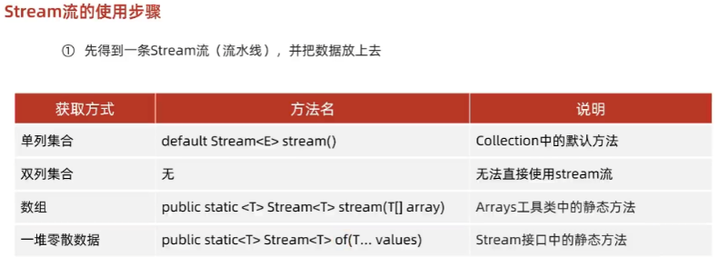
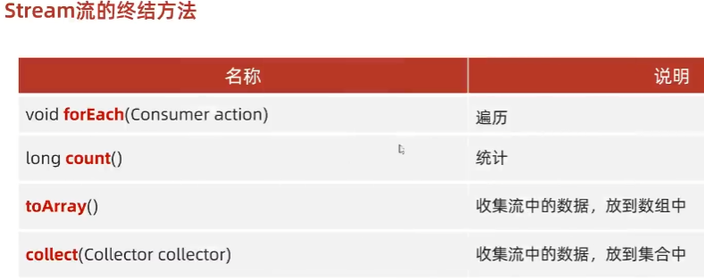

- [1. 意义](#1-意义)
- [2. 获取流](#2-获取流)
- [3. 中间方法](#3-中间方法)
- [4. 终结方法](#4-终结方法)


---

Stream流的三类方法：
- 获取Stream流: 创建一条流水线，并把数据放到流水线上准备进行操作
- 中间方法
  - 流水线上的操作
  - 一次操作完毕之后,还可以继续进行其他操作
- 终结方法
  - 一个Stream流只能有一个终结方法
  - 是流水线上的最后一个操作


返回值：
- 中间方法调用后返回的是流对象
- 之所以称之终结方法，是因为这些方法不会再返回流对象

## 1. 意义
结合了Lambda表达式，简化集合、数组的操作.

省略集合处理中的中间集合产物.

```java
/*
* 创建集合添加元素，完成以下需求：
* 1.把所有以“张”开头的元素存储到新集合中
* 2.把“张”开头的，长度为3的元素再存储到新集合中
* 3.遍历打印最终结果
*/
ArrayList<String> list1 = new ArrayList<>();
Collections.addAll(list1, "a", "b", "c", "d", "e");

// 1.把所有以“张”开头的元素存储到新集合中
ArrayList<String> list2 = new ArrayList<>();
for (String name : list1) {
    if (name.startsWith("张")) {
        list2.add(name);
    }
}
// 2.把“张”开头的，长度为3的元素再存储到新集合中
ArrayList<String> list3 = new ArrayList<>();
for (String name : list2) {
    if (name.length() == 3) {
        list3.add(name);
    }
}

// 3.遍历打印最终结果
for (String name : list3) {
    System.out.println(name);
}

// 使用Stream流
list1.stream()
        .filter(name -> name.startsWith("张"))
        .filter(name -> name.length() == 3)
        .forEach(name -> System.out.println(name));
```

## 2. 获取流




```java
/* Collection体系的集合可以使用默认方法stream()生成流 */ 
List<String> list = new ArrayList<String>();
Stream<String> listStream = list.stream();

Set<String> set = new HashSet<String>();
Stream<String> setStream = set.stream();


/* Map体系的集合间接的生成流 */ 
Map<String, Integer> map = new HashMap<String, Integer>();
// 第一种：获取键、值的流
Stream<String> keyStream = map.keySet().stream();
Stream<Integer> valueStream = map.values().stream();
// 第二种：获取键值对的流
Stream<Map.Entry<String, Integer>> entryStream = map.entrySet().stream();


/* 数组可以通过Arrays中的静态方法stream生成流 */ 
String[] strArray = { "hello", "world", "java" };
Stream<String> strArrayStream = Arrays.stream(strArray);


/* 同种数据类型的多个数据可以通过Stream接口的静态方法of(T... values) */ 
Stream<Integer> intStream = Stream.of(10, 20, 30);
intStream.forEach(s-> System.out.println(s)); // 10 20 30
Stream<String> strArrayStream2 = Stream.of("hello", "world", "java");
// 细节：
//      方法的形参是一个可变参数，可以传递一堆零散的数据，也可以传递数组
//      但是数组必须是引用数据类型的，如果传递基本数据类型，是会把整个数组当做一个元素，放到Stream当中。
int[] arr1 = {1,2,3,4,5,6,7,8,9,10};
Stream.of(arr1).forEach(s-> System.out.println(s));//[I@41629346
```
## 3. 中间方法


1. 中间方法，返回新的Stream流，原来的Stream流只能使用一次，建议使用链式编程
2. 修改Stream流中的数据，不会影响原来集合或者数组中的数据
```java
/*
 * 1. 筛选 filter
 *      Stream<T> filter(Predicate<? super T> predicate);
 * 2. 截取 limit
 *      Stream<T> limit(long maxSize);
 * 3. 跳过 skip
 *      Stream<T> skip(long n);
 * 4. 去重 distinct
 *      Stream<T> distinct();
 * 5. 映射 map
 *      <R> Stream<R> map(Function<? super T, ? extends R> mapper);
 * 6. 组合 concat
 *      static <T> Stream<T> concat(Stream<? extends T> a, Stream<? extends T> b);
 * 7. 排序 sorted
 *      Stream<T> sorted();
 *      Stream<T> sorted(Comparator<? super T> comparator);
 */
ArrayList<String> list = new ArrayList<>();
Collections.addAll(list, "张无忌", "周芷若", "赵敏", "张强", "张三丰", "张翠山", "张良", "王二麻子", "谢广坤");

System.out.println("================filter=================");
list.stream().filter(new Predicate<String>() {
    @Override
    public boolean test(String s) {
        // 如果返回值为true，表示当前数据留下
        // 如果返回值为false，表示当前数据舍弃不要
        return s.startsWith("张");
    }
}).forEach(s -> System.out.println(s));

list.stream()
        .filter(s -> s.startsWith("张"))
        .forEach(s -> System.out.println(s));


System.out.println("================limit=================");
// 只取前面3个元素："张无忌", "周芷若", "赵敏", "张强", "张三丰", "张翠山", "张良", "王二麻子", "谢广坤"
list.stream().limit(3).forEach(s -> System.out.println(s));     // "张无忌", "周芷若", "赵敏",


System.out.println("=================skip================");
// 跳过前面4个元素
list.stream().skip(4) .forEach(s -> System.out.println(s));     // "张三丰", "张翠山", "张良", "王二麻子", "谢广坤"


System.out.println("=================distinct================");
// 去除重复元素：底层是使用HashSet实现的（需要重写hashCode和equals方法）
list.stream().distinct().forEach(s -> System.out.println(s));


System.out.println("=================map================");
list.stream().map(new Function<String, Integer>() {
    @Override
    public Integer apply(String s) {
        return (int) s.charAt(0);
    }
}).forEach(s -> System.out.println(s));

list.stream()
        .map(s -> (int) s.charAt(0))
        .forEach(s -> System.out.println(s));


System.out.println("=================concat================");
Stream<String> stream1 = Stream.of("张无忌", "周芷若", "赵敏");
Stream<String> stream2 = Stream.of("张强", "张三丰", "张翠山", "张良", "王二麻子", "谢广坤");
Stream.concat(stream1, stream2).forEach(s -> System.out.println(s));


System.out.println("================sorted=================");
list.stream().sorted().forEach(s -> System.out.println(s));
list.stream().sorted((s1,s2)->s2.compareTo(s1)).forEach(s -> System.out.println(s));

// 只能使用一次
Stream<String> stream = list.stream();
Stream<String> stream2 = stream.filter(s -> s.startsWith("张"));
Stream<String> stream3 = stream.skip(1);        // error， stream已经被steam2使用了一次，不能再使用了。建议使用链式编程
```

## 4. 终结方法



```java
ArrayList<String> list = new ArrayList<>();
Collections.addAll(list, "张无忌-男-15", "张无忌-男-15", "周芷若-女-14");

System.out.println("=================forEach 遍历================");
// Consumer的泛型：表示流中数据的类型
// accept方法的形参s：依次表示流里面的每一个数据
list.stream().forEach(new Consumer<String>() {
    @Override
    public void accept(String s) {
        System.out.println(s);
    }
});
list.stream().forEach(s -> System.out.println(s));


System.out.println("=================count 统计个数================");
long count = list.stream().count();
System.out.println(count);


System.out.println("=================toArray 收集================");
// 任意类型的数组
Object[] arr1 = list.stream().toArray();
System.out.println(Arrays.toString(arr1));

// IntFunction的泛型：具体类型的数组
// toArray方法的参数的作用：负责创建一个指定类型的数组
// toArray方法的底层，会依次得到流里面的每一个数据，并把数据放到数组当中
// toArray方法的返回值：是一个装着流里面所有数据的数组
String[] arr = list.stream().toArray(new IntFunction<String[]>() {
    // apply的形参:流中数据的个数，要跟数组的长度保持一致
    // apply的返回值：具体类型的数组
    // 方法体：就是创建数组
    @Override
    public String[] apply(int value) {
        return new String[value];
    }
});
System.out.println(Arrays.toString(arr));

String[] arr2 = list.stream().toArray(String[]::new);


System.out.println("=================collect 收集================");
// 收集List集合当中
List<String> newList1 = list.stream()
        .filter(s -> "男".equals(s.split("-")[1]))
        .collect(Collectors.toList());
System.out.println(newList1);       // [张无忌-男-15, 张无忌-男-15]

// 收集Set集合当中：重复会被去掉
Set<String> newList2 = list.stream()
        .filter(s -> "男".equals(s.split("-")[1]))
        .collect(Collectors.toSet());
System.out.println(newList2);       // [张无忌-男-15]

// 收集Map集合当中：不能重复，key重复会报错
list.remove("张无忌-男-15");
Map<String, Integer> map = list.stream()
        .filter(s -> "男".equals(s.split("-")[1]))
        /*
            * toMap : 参数一表示键的生成规则
            * 参数二表示值的生成规则
            *
            * 参数一：
            * Function泛型一：表示流中每一个数据的类型
            * 泛型二：表示Map集合中键的数据类型
            *
            * 方法apply
            * 形参：依次表示流里面的每一个数据
            * 方法体：生成键的代码
            * 返回值：已经生成的键
            *
            *
            * 参数二：
            * Function泛型一：表示流中每一个数据的类型
            * 泛型二：表示Map集合中值的数据类型
            *
            * 方法apply
            * 形参：依次表示流里面的每一个数据
            * 方法体：生成值的代码
            * 返回值：已经生成的值
            */
        .collect(Collectors.toMap(
                new Function<String, String>() {
                    @Override
                    public String apply(String s) {
                        // 张无忌-男-15
                        return s.split("-")[0];
                    }
                },
                new Function<String, Integer>() {
                    @Override
                    public Integer apply(String s) {
                        return Integer.parseInt(s.split("-")[2]);
                    }
                }));
System.out.println(map);        // {张无忌=15}

Map<String, Integer> map2 = list.stream()
        .filter(s -> "男".equals(s.split("-")[1]))
        .collect(Collectors.toMap(
                s -> s.split("-")[0],
                s -> Integer.parseInt(s.split("-")[2])));
```