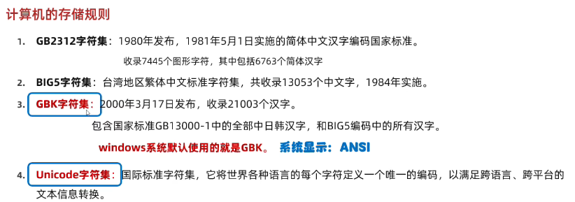
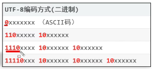

## ASCII

不能表示中文。

- ASCII编码：前面补0，补齐8位。

    `a`→查询ASCII码表→`97`→`110 0001`→`0110 0001`

- ASCII解码：直接转化为10进制。

    `0110 0001`→`97`→查询ASCII码表→`a`。

## GBK

GBK（国`G`标`B`扩展`K`）



英文：完全兼容ASCII码，用一个字节表示。

中文：**两个字节**。高位字节二进制以`1`开头。

- `汉`→查询GBK→`47802`→`10111010 10111010`
- `10111010 10111010`→`47802`
- PS：不用补0，因为总体编码范围为 8140-FEFE 之间，首字节在 81-FE 之间，尾字节在 40-FE 之间，不再规定低位字节大于 127，剔除 XX7F 一条线。。

## Unicode

Unicode字符集，UTF-8/16/32编码方式。

- UTF-8 和 UTF-16 是变长编码：UTF-8 需要最少一个字节（1~4），UTF-16 最少两个字节（2~4）
- UTF-32 是定长编码：UTF-32 固定四个字节。


> UTF-8

- ASCII 用 1个字节；**中文用 3个字节**。（叙利亚文等2个字节，其他语言等4个字节）
- 

例如：
- `汉`→查询Unicode→`27721`→`01101100 01001001`→UTF-8编码(`[1110]0110 [10]110001 [10]001001`)→`11100110 10110001 10001001`

```java
/* 
 * Java默认方式:utf-8
 * 
 * Java中编码的方法
 * public byte[] getBytes() 使用默认方式进行编码
 * public byte[] getBytes(String charsetName) 使用指定方式进行编码
 * 
 * Java中解码的方法
 * String(byte[] bytes) 使用默认方式进行解码
 * String(byte[] bytes, String charsetName) 使用指定方式进行解码
 */

// 1.编码
String str = "ai你哟";
byte[] bytes1 = str.getBytes();     // utf-8
System.out.println(Arrays.toString(bytes1));    // [97, 105, -28, -67, -96, -27, -109, -97]

byte[] bytes2 = str.getBytes("GBK");
System.out.println(Arrays.toString(bytes2));    // [97, 105, -60, -29, -45, -76]

// 2.解码
String str2 = new String(bytes1);   // utf-8
System.out.println(str2);   // ai你哟

String str3 = new String(bytes2, "GBK");
System.out.println(str3);   // ai你哟
```