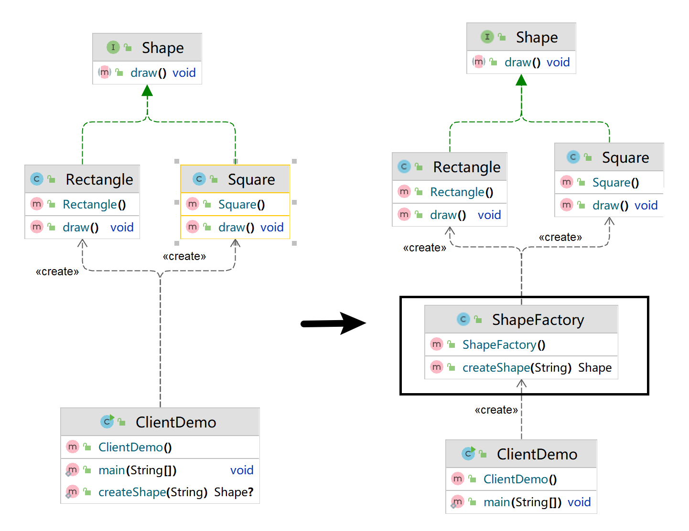
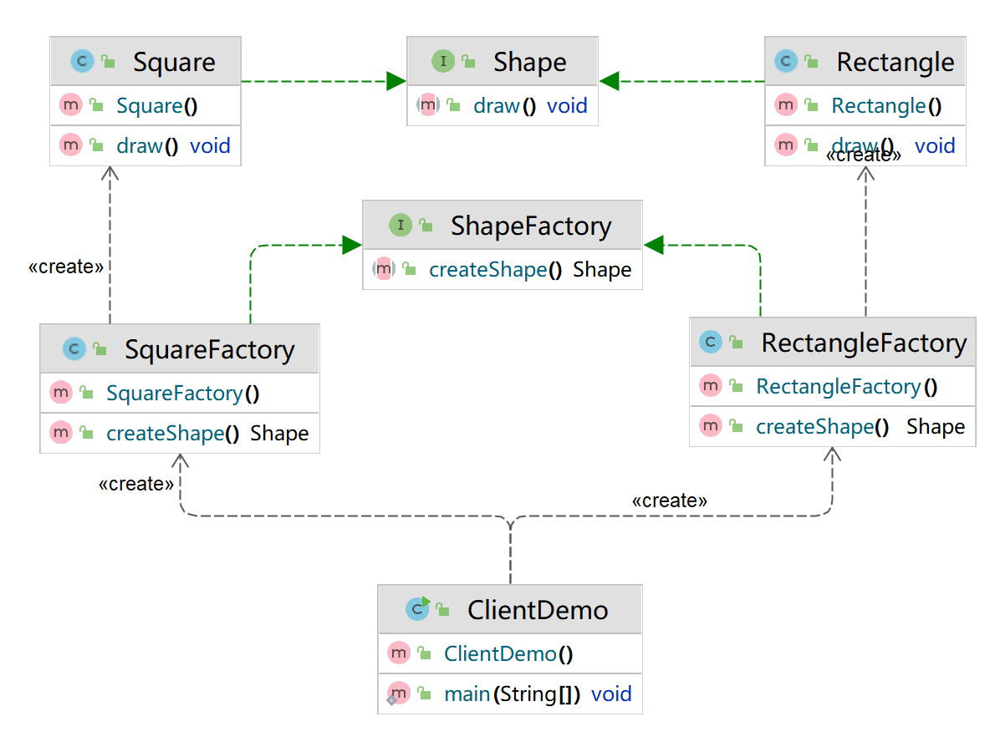
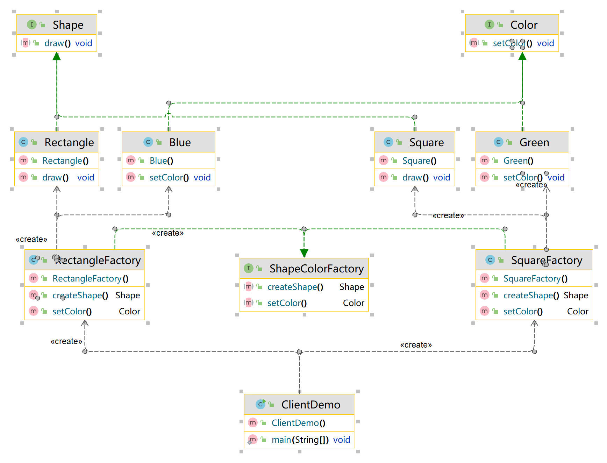
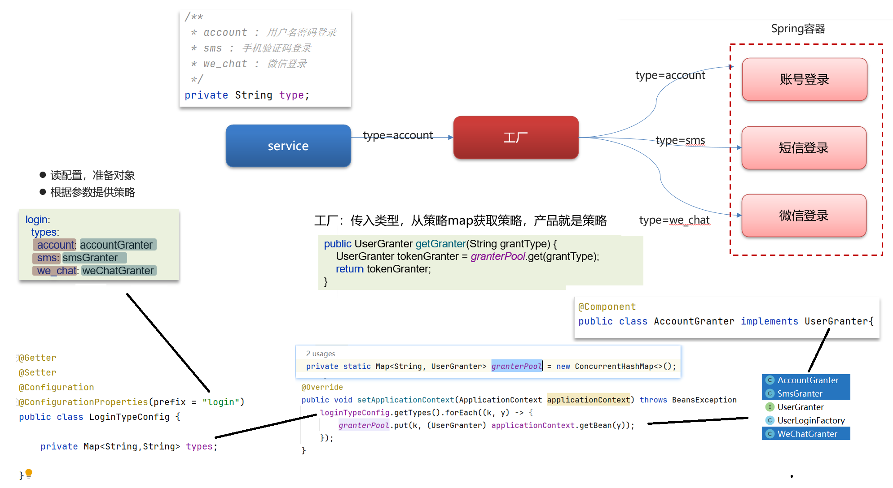

- [1. 工厂模式](#1-工厂模式)
  - [1.1. 简单工厂](#11-简单工厂)
  - [1.2. 工厂方法](#12-工厂方法)
  - [1.3. 抽象工厂](#13-抽象工厂)
- [2. 策略模式](#2-策略模式)
  - [使用Map取消 Context 类](#使用map取消-context-类)
  - [springboot注入map](#springboot注入map)
  - [策略枚举解决策略类膨胀](#策略枚举解决策略类膨胀)
- [工厂模式+策略模式](#工厂模式策略模式)


---

工厂模式和策略模式，**都是多态**（接口或者抽象类）

> 开闭原则：**对扩展开放，对修改关闭**。在程序需要进行拓展的时候，不能去修改原有的代码（易于维护），热插拔（扩展性）。

## 1. 工厂模式

分为三种：简单工厂、工厂方法（单数）、抽象工厂（复数）

### 1.1. 简单工厂

抽象产品类、具体产品类、简单工厂
- 抽象产品（抽象类、接口）和具体产品（多态实现）。
- 客户知道产品类型名string就行，把类型名传递给工厂。
- 工厂内根据产品类型名来new对应的具体产品，返回抽象产品类型（多态）。

意义：添加新产品时，客户不需要修改客户端的代码，只需要开发者修改工厂的代码，客户传递给工厂新的产品类型名。

缺点：不满足开闭原则。



[不用工厂的写法](../../../codes/design_mode/src/main/java/factory/ordinary/ClientDemo.java) v.s. [简单工厂](../../../codes/design_mode/src/main/java/factory/easy_factory/ClientDemo.java)

### 1.2. 工厂方法

抽象产品类、具体产品类、抽象工厂类、具体工厂类
- 每个具体产品对应一个具体工厂，这个工厂只负责生产这个产品。
- 具体工厂实现抽象工厂接口，里面有公共的生产方法，返回抽象产品类型。
- 客户使用不同的工厂，调用公共的生产方法。

意义：新增产品，不像简单工厂一样需要修改工厂的代码，只需告知客户使用新的具体工厂。满足开闭原则



[工厂方法](../../../codes/design_mode/src/main/java/factory/factory_method/ClientDemo.java)
### 1.3. 抽象工厂


抽象产品类、具体产品类、抽象工厂类、具体工厂类
- 一个具体工厂可以生产一组产品。

增加工厂时，创建产品就行；增加产品时，需要修改多个工厂。

PS：没有什么特殊的，就是在工厂方法的基础上，增多了具体工厂对应的产品，或者说是合并了具体产品对应的具体工厂。




[抽象工厂](../../../codes/design_mode/src/main/java/factory/abstract_factory/ClientDemo.java)
## 2. 策略模式

抽象策略和具体策略（封装了不同算法）

上下文对象，持有一个具体策略对象，执行其策略的算法。

客户创建具体策略实例，传给上下文对象，调用其执行策略方法。

优点：
- 策略类之间可以自由切换
- 易于扩展
- 避免使用多重条件选择语句（if else），充分体现面向对象设计思想。

缺点：
- 客户端必须知道所有的策略类，并自行决定使用哪一个策略类。
- 策略模式将造成产生很多策略类

[策略模式](../../../codes/design_mode/src/main/java/strategy/ClientDemo.java)

只要代码中有冗长的 if-else 或 switch 分支判断都可以采用策略模式优化
- 订单的支付策略（支付宝、微信、银行卡…）
- 解析不同类型excel（xls格式、xlsx格式）
- 打折促销（满300元9折、满500元8折、满1000元7折…）
- 物流运费阶梯计算（5kg以下、5-10kg、10-20kg、20kg以上）


### 使用Map取消 Context 类

我们可以将策略实现类放进 Map 中，根据 key 去选择具体的策略，就不必事先定义 Context 类。

```java
public static void main(String[] args) {
    Map<String, PaymentStrategy> map=new HashMap<>();
    map.put("CREDIT_CARD", new CreditCardPayment());
    map.put("WECHAT_PAY",new WeChatPay());

    map.get("CREDIT_CARD").pay(100.0);
    map.get("WECHAT_PAY").pay(200.0);
}    
```

### springboot注入map

```java
public interface Test {
    void print(String name);
}

@Service("testA")
@Slf4j
public class TestA implements Test{
    @Override
    public void print(String name) {
        log.info("实现类A"+name);
    }
}


@Service("testB")
@Slf4j
public class TestB implements Test{
    @Override
    public void print(String name) {
        log.info("实现类B"+name);
    }
}
```
使用的时候 `@Autowired` 或者 `@Resource` 即可，SpringBoot会帮我们把实现类自动注入注入Map。
```java
@Resource
private Map<String, Test> map;

Test test = map.get("testA");
test.print("hello world");
```

### 策略枚举解决策略类膨胀

```java
@Slf4j
public enum PaymentStrategyEnum {
    CREDIT_CARD {
        @Override
        public void pay(double amount) {
            log.info("使用信用卡支付：" + amount);
            // 具体的支付逻辑
        }
    },
    WECHAT_PAY {
        @Override
        public void pay(double amount) {
            log.info("使用微信支付：" + amount);
            // 具体的支付逻辑
        }
        
    };

    public abstract void pay(double amount);
}
```

```java
// 使用示例
public static void main(String[] args) {
    Map<String, PaymentStrategyEnum> map=new HashMap<>();
    map.put("CREDIT_CARD",  PaymentStrategyEnum.CREDIT_CARD);
    map.put("WECHAT_PAY", PaymentStrategyEnum.WECHAT_PAY);

    map.get("CREDIT_CARD").pay(100.0);
    map.get("WECHAT_PAY").pay(200.0);
}
```
注意：它受枚举类型的限制，每个枚举项都是 public、final、static 的，扩展性受到了一定的约束，因此在系统开发中，策略枚举一般担当不经常发生变化的角色。


## 工厂模式+策略模式

1. config配置文件读取yaml文件中的配置。
2. 工厂类中，根据config配置参数生成策略map，策略是通过ApplicationContext注入的bean对象。
3. 最终，工厂类根据传入的前端参数类型，返回策略。上层调用策略的login()方法。

