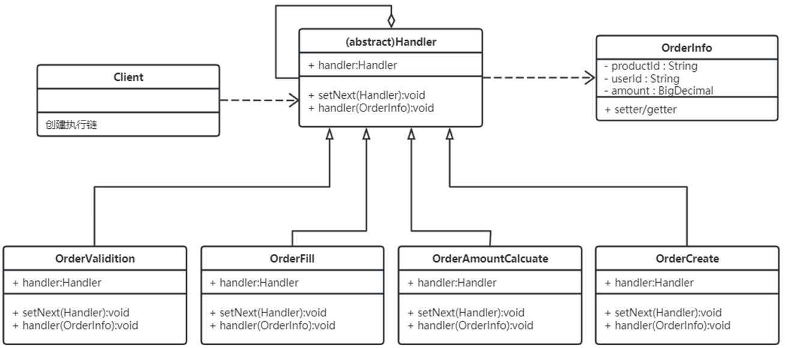
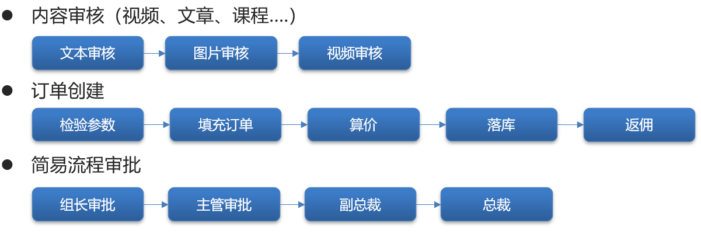

## 责任链设计模式
- 抽象处理者（Handler）角色：定义一个处理请求的接口，包含抽象处理方法和一个后继连接。
- 具体处理者（Concrete Handler）角色：实现抽象处理者的处理方法，判断能否处理本次请求，如果可以处理请求则处理，否则将该请求转给它的后继者。
- 客户类（Client）角色：创建处理链，并向链头的具体处理者对象提交请求，它不关心处理细节和请求的传递过程。

[责任链设计模式](../../../codes/design_mode/src/main/java/chain/ClientDemo.java)

优点：
- 降低了对象之间的耦合度
- 增强了系统的可扩展性
- 增强了给对象指派职责的灵活性
- 责任链简化了对象之间的连接
- 责任分担

缺点：
- 长的责任链，请求的处理可能涉及多个处理对象，系统性能将受到一定影响。
- 增加了客户端的复杂性，可能会由于职责链的错误设置而导致系统出错，如可能会造成循环调用。

