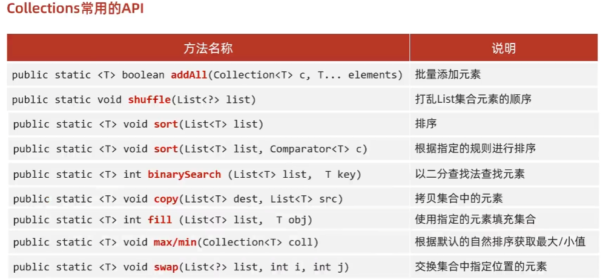

- [快速构建](#快速构建)
  - [空](#空)
  - [singleton](#singleton)
- [其他](#其他)

---

## 快速构建
### 空
```java
List<Object> emptyList = Collections.emptyList();
Set<Object> emptySet = Collections.emptySet();
Map<Object, Object> emptyMap = Collections.emptyMap();
```
### singleton

Set特殊一点
```java
List<Object> singletonList = Collections.singletonList(user);
Set<Object> set = Collections.singleton(user);
Map<Object, Object> singletonMap = Collections.singletonMap(user);
```

## 其他
仅限单列集合。



```java
ArrayList<Integer> list1 = new ArrayList<>();
System.out.println("-------------addAll 批量添加元素--------------------------");
Collections.addAll(list1, 10, 1, 2, 4, 8, 5, 9, 6, 7, 3);

System.out.println("-------------shuffle--------------------------");
Collections.shuffle(list1);

System.out.println("-------------sort--------------------------");
// 默认升序。需要重写Comparable接口compareTo方法。Integer已经实现
Collections.sort(list1);
// Collections.sort(list1, (o1, o2) -> o2 - o1); // 降序

System.out.println("-------------reverse--------------------------");
Collections.reverse(list1);
System.out.println(list1);  // [10, 9, 8, 7, 6, 5, 4, 3, 2, 1]

System.out.println("-------------binarySearch--------------------------");
// 需要元素有序
ArrayList<Integer> list2 = new ArrayList<>();
Collections.addAll(list2, 1, 2, 3, 4, 5, 6, 7, 8, 9, 10);
System.out.println(Collections.binarySearch(list2, 9)); // 8
System.out.println(Collections.binarySearch(list2, 1)); // 0
System.out.println(Collections.binarySearch(list2, 20));    // -11

System.out.println("-------------copy--------------------------");
ArrayList<Integer> src = new ArrayList<>();
ArrayList<Integer> dest = new ArrayList<>();
Collections.addAll(src, 1, 2, 3, 4, 5, 6, 7, 8, 9, 10);
Collections.addAll(dest, 0, 0, 0, 0, 0, 0, 0, 0, 0, 0, 0, 0, 0, 0, 0);
// dest <- src
// 会覆盖原来的元素
// 注意点：如果list3的长度 > list4的长度，方法会报错
Collections.copy(dest, src);
System.out.println(src);    // [1, 2, 3, 4, 5, 6, 7, 8, 9, 10]
System.out.println(dest);   // [1, 2, 3, 4, 5, 6, 7, 8, 9, 10, 0, 0, 0, 0, 0]

System.out.println("-------------fill--------------------------");
ArrayList<Integer> list5 = new ArrayList<>();
Collections.addAll(list5, 1, 2, 3, 4, 5, 6, 7, 8, 9, 10);
// 把集合中现有的所有数据，都修改为指定数据
Collections.fill(list5, 100);
System.out.println(list5);  // [100, 100, 100, 100, 100, 100, 100, 100, 100, 100]

System.out.println("-------------max/min--------------------------");
ArrayList<Integer> list6 = new ArrayList<>();
Collections.addAll(list6, 1, 2, 3, 4, 5, 6, 7, 8, 9, 10);
// 求最大值或者最小值
System.out.println(Collections.max(list6));   // 10
System.out.println(Collections.min(list6));  // 1

ArrayList<String> list7 = new ArrayList<>();
Collections.addAll(list7, "a", "aa", "aaa", "aaaa");
System.out.println(Collections.max(list7, (o1, o2) -> o1.length() - o2.length()));    // 最长的字符串;

System.out.println("-------------swap--------------------------");
ArrayList<Integer> list8 = new ArrayList<>();
Collections.addAll(list8, 1, 2, 3);
Collections.swap(list8, 0, 2);
System.out.println(list8);  // [3, 2, 1]
```
