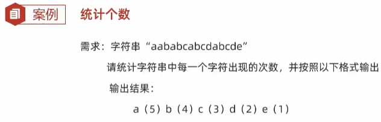

- [1. HashTable](#1-hashtable)
- [2. Map接口](#2-map接口)
  - [2.1. 遍历](#21-遍历)
- [3. ConcurrentHashMap](#3-concurrenthashmap)
- [4. LinkedHashMap](#4-linkedhashmap)
- [5. TreeMap](#5-treemap)
  - [5.1. 底层](#51-底层)


---
## 1. HashTable

## 2. Map接口

- 添加/更新：put(k,v)
- 删除：remove(k)
- 获取：get(k), getOrDefault(k, v)
- 其他：clear(), containsKey(k), containsValue(v), isEmpty(), size()


```java
Map<String, String> map = new HashMap<>();

// 1. 添加元素
// put方法的细节：
// 添加/覆盖
// 在添加数据的时候，如果键不存在，那么直接把键值对对象添加到map集合当中，方法返回null
// 在添加数据的时候，如果键是存在的，那么会把原有的键值对对象覆盖，会把被覆盖的值进行返回。
map.put("郭靖", "黄蓉");
map.put("韦小宝", "沐剑屏");
System.out.println(map.put("尹志平", "小龙女"));  // null
System.out.println(map.put("韦小宝", "双儿")); // 沐剑屏

// 2. 删除
String result = map.remove("郭靖");
System.out.println(result); // 黄蓉

// 3. 清空
map.clear();

// 4. 判断是否包含键
boolean keyResult = map.containsKey("郭靖");
System.out.println(keyResult);  // false

// 5. 判断是否包含值
boolean valueResult = map.containsValue("小龙女2");
System.out.println(valueResult);    // false

// 6. 判断是否为空
System.out.println(map.isEmpty());

// 7. 获取集合的长度
int size = map.size();
System.out.println(size);

// 打印集合
System.out.println(map);

// get会返回null，还得if(null)再处理。
System.out.println(map.get("郭靖"));    // 黄蓉
System.out.println(map.get("张无忌"));  // null
System.out.println(map.getOrDefault("张", "三"));  // 三


/*
Integer v = map.get("a");
if(v == null)   map.put("a", 1);
*/
// 创建或更新一个键值对
Integer i1 = map.compute("a", (k,v)-> v == null ? 1 : v + 1);    
Integer i2 = map.compute("a", (k, v) -> v == null ? 1 : v + 1);
System.out.println(i1 + " " + i2 + " " + map);    // 1 2 {a=2}

// 只创建，不更新
i1 = map.computeIfAbsent("b", k -> 1);   // 创建
i2 = map.computeIfAbsent("b", k -> 2);   // 不会执行
System.out.println(i1 + " " + i2 + " " + map);    // 1 1 {a=2, b=1}

// 只更新，不创建
i1 = map.computeIfPresent("b", (k,v) -> v + 1);   // 更新
i2 = map.computeIfPresent("c", (k,v) -> v + 1);   // 不会执行
System.out.println(i1 + " " + i2 + " " + map);    // 2 null {a=2, b=2}
```


| 方法名                              | 说明           |
| -------------------------------- | ------------ |
| `Set<K> keySet()`                | 获取所有键的集合     |
| `Collection<V> values()`         | 获取所有值的集合     |
| `Set<Map.Entry<K,V>> entrySet()` | 获取所有键值对对象的集合 |

```java
// Set<K> keySet():获取所有键的集合
Set<String> keySet = map.keySet();
for (String key : keySet) {
    System.out.println(key);
}

// Collection<V> values():获取所有值的集合
Collection<String> values = map.values();
for (String value : values) {
    System.out.println(value);
}
```
### 2.1. 遍历
- map直接lambda遍历
- keySet 键找值：遍历key的Set结合
- entry 键值对：遍历Entry的Set结合

```java
Map<String, String> map = new HashMap<String, String>();
map.put("郭靖", "黄蓉");
map.put("韦小宝", "沐剑屏");
map.put("尹志平", "小龙女");

// BiConsumer: 底层就是利用 entrySet() 进行遍历
map.forEach((k, v) -> System.out.println(k + " " + v));

/* 2. keySet 键找值 */
Set<String> keySet = map.keySet();
for(String key: keySet){
    System.out.println(key + " " + map.get(key));
}

Set<Map.Entry<String, String>> entrySet = map.entrySet();
for(Map.Entry<String, String> entry: entrySet){
    System.out.println(entry.getKey() + " " + entry.getValue());
}

// 迭代器
Iterator<String> it = keySet.iterator();
while (it.hasNext()) {
    String key = it.next();
    String value = map.get(key);
    System.out.println(key + "," + value);
}
// lambda
keySet.forEach(new Consumer<String>() {
    @Override
    public void accept(String key) {
        String value = map.get(key);
        System.out.println(key + "," + value);
    }
});

// 迭代器
Iterator<Map.Entry<String, String>> it2 = entrySet.iterator();
while (it2.hasNext()) {
    Map.Entry<String, String> entry = it2.next();
    String key = entry.getKey();
    String value = entry.getValue();
    System.out.println(key + "," + value);
}
// lambda
entrySet.forEach(new Consumer<Map.Entry<String, String>>() {
    @Override
    public void accept(Map.Entry<String, String> entry) {
        String key = entry.getKey();
        String value = entry.getValue();
        System.out.println(key + "," + value);
    }
});
```

## 3. ConcurrentHashMap


## 4. LinkedHashMap
由键决定：**有序（存取顺序）**、不重复、无索引。
    
底层数据：哈希表 + 双链表。

## 5. TreeMap

- TreeMap底层是红黑树结构
- 依赖自然排序或者比较器排序，**对键进行排序**
- 如果键存储的是自定义对象，需要实现Comparable接口或者在创建TreeMap对象时候给出比较器排序规则



### 5.1. 底层

```java
1.TreeMap中每一个节点的内部属性
    K key;					// 键
    V value;				// 值
    Entry<K,V> left;		// 左子节点
    Entry<K,V> right;		// 右子节点
    Entry<K,V> parent;		// 父节点
    boolean color;			// 节点的颜色


2.TreeMap类中中要知道的一些成员变量
    // 比较器对象
    private final Comparator<? super K> comparator;

	// 根节点
    private transient Entry<K,V> root;

	// 集合的长度
    private transient int size = 0;


3.空参构造
	// 空参构造就是没有传递比较器对象
	 public TreeMap() {
        comparator = null;
    }
	
	
4.带参构造
	// 带参构造就是传递了比较器对象。
	public TreeMap(Comparator<? super K> comparator) {
        this.comparator = comparator;
    }
	
	
5.添加元素
	public V put(K key, V value) {
        return put(key, value, true);
    }

    // 参数一：键
    // 参数二：值
    // 参数三：当键重复的时候，是否需要覆盖值
    //         true：覆盖
    //         false：不覆盖
	private V put(K key, V value, boolean replaceOld) {
		// 获取根节点的地址值，赋值给局部变量t
        Entry<K,V> t = root;
		// 判断根节点是否为null
		// 如果为null，表示当前是第一次添加，会把当前要添加的元素，当做根节点
		// 如果不为null，表示当前不是第一次添加，跳过这个判断继续执行下面的代码
        if (t == null) {
			// 方法的底层，会创建一个Entry对象，把他当做根节点
            addEntryToEmptyMap(key, value);
			// 表示此时没有覆盖任何的元素
            return null;
        }
		// 表示两个元素的键比较之后的结果
        int cmp;
		// 表示当前要添加节点的父节点
        Entry<K,V> parent;
		
		// 表示当前的比较规则
		// 如果我们是采取默认的自然排序，那么此时comparator记录的是null，cpr记录的也是null
		// 如果我们是采取比较器排序方式，那么此时comparator记录的是就是比较器
        Comparator<? super K> cpr = comparator;

		// 表示判断当前是否有比较器对象
		// 如果传递了比较器对象，就执行if里面的代码，此时以比较器的规则为准
		// 如果没有传递比较器对象，就执行else里面的代码，此时以自然排序的规则为准
        if (cpr != null) {
            do {
                parent = t;
                cmp = cpr.compare(key, t.key);
                if (cmp < 0)
                    t = t.left;
                else if (cmp > 0)
                    t = t.right;
                else {
                    V oldValue = t.value;
                    if (replaceOld || oldValue == null) {
                        t.value = value;
                    }
                    return oldValue;
                }
            } while (t != null);
        } else {
			// 把键进行强转，强转成Comparable类型的
			// 要求：键必须要实现Comparable接口，如果没有实现这个接口
			// 此时在强转的时候，就会报错。
            Comparable<? super K> k = (Comparable<? super K>) key;
            do {
				// 把根节点当做当前节点的父节点
                parent = t;
				// 调用compareTo方法，比较根节点和当前要添加节点的大小关系
                cmp = k.compareTo(t.key);
				
                if (cmp < 0)
					// 如果比较的结果为负数
					// 那么继续到根节点的左边去找
                    t = t.left;
                else if (cmp > 0)
					// 如果比较的结果为正数
					// 那么继续到根节点的右边去找
                    t = t.right;
                else {
					// 如果比较的结果为0，会覆盖
                    V oldValue = t.value;
                    if (replaceOld || oldValue == null) {
                        t.value = value;
                    }
                    return oldValue;
                }
            } while (t != null);
        }
		// 就会把当前节点按照指定的规则进行添加
        addEntry(key, value, parent, cmp < 0);
        return null;
    }	
	
	
	
	private void addEntry(K key, V value, Entry<K, V> parent, boolean addToLeft) {
        Entry<K,V> e = new Entry<>(key, value, parent);
        if (addToLeft)
            parent.left = e;
        else
            parent.right = e;
		// 添加完毕之后，需要按照红黑树的规则进行调整
        fixAfterInsertion(e);
        size++;
        modCount++;
    }
	
	
	private void fixAfterInsertion(Entry<K,V> x) {
		// 默认添加红色的节点
        x.color = RED;

		// 按照红黑规则进行调整
		
		// parentOf: 获取x的父节点
		// parentOf(parentOf(x)): 获取x的爷爷节点
		// leftOf: 获取左子节点

        // 非根、父红色
        while (x != null && x != root && x.parent.color == RED) {
			// 判断当前节点的父节点是爷爷节点的左子节点还是右子节点
			// 目的：为了获取当前节点的叔叔节点
            if (parentOf(x) == leftOf(parentOf(parentOf(x)))) {
				/* 表示当前节点的父节点是爷爷节点的左子节点 */

				// 用rightOf获取到当前节点的叔叔节点
                Entry<K,V> y = rightOf(parentOf(parentOf(x)));
                if (colorOf(y) == RED) {
					// 对应红黑规则1：叔叔红色
					
					// 把父节点设置为黑色
                    setColor(parentOf(x), BLACK);
					// 把叔叔节点设置为黑色
                    setColor(y, BLACK);
					// 把爷爷节点设置为红色
                    setColor(parentOf(parentOf(x)), RED);
					// 把爷爷节点设置为当前节点
                    x = parentOf(parentOf(x));
                } else {
					/* 叔叔节点为黑色的处理方案 */
					
					// 对应红黑规则2：叔叔黑色，当前节点是父的右孩子
                    if (x == rightOf(parentOf(x))) {
						// 把父作为当前节点
                        x = parentOf(x);
						// 左旋
                        rotateLeft(x);
                    }

					// 对应红黑规则3：叔叔黑色，当前节点是父的左孩子
                    // 将“父”设为“黑色"
                    setColor(parentOf(x), BLACK);
                    // 将“祖父”变为“红色"
                    setColor(parentOf(parentOf(x)), RED);
                    // 以祖父为支点进行右旋
                    rotateRight(parentOf(parentOf(x)));
                }
            } else {
				/* 表示当前节点的父节点是爷爷节点的右子节点 */

				// 用leftOf获取到当前节点的叔叔节点
                Entry<K,V> y = leftOf(parentOf(parentOf(x)));
                if (colorOf(y) == RED) {
                    setColor(parentOf(x), BLACK);
                    setColor(y, BLACK);
                    setColor(parentOf(parentOf(x)), RED);
                    x = parentOf(parentOf(x));
                } else {
                    if (x == leftOf(parentOf(x))) {
                        x = parentOf(x);
                        rotateRight(x);
                    }
                    setColor(parentOf(x), BLACK);
                    setColor(parentOf(parentOf(x)), RED);
                    rotateLeft(parentOf(parentOf(x)));
                }
            }
        }
		
		// 把根节点设置为黑色
        root.color = BLACK;
    }
```

6. 思考问题：

- 6.1 TreeMap添加元素的时候，键是否需要重写hashCode和equals方法？

    不需要重写的。
    
    红黑树又不是哈希表，所以不要哈希值。


- 6.2 HashMap是哈希表结构的，JDK8开始由数组，链表，红黑树组成的。既然有红黑树，HashMap的键是否需要实现Compareable接口或者传递比较器对象呢？
    
    不需要的。
    
    因为在HashMap的底层，默认是利用哈希值的大小关系来创建红黑树的

- 6.3 TreeMap和HashMap谁的效率更高？
    
    如果是最坏情况，添加了8个元素，这8个元素形成了链表，此时TreeMap的效率要更高
但是这种情况出现的几率非常的少。
    
    一般而言，还是HashMap的效率要更高。

- 6.4 你觉得在Map集合中，java会提供一个如果键重复了，不会覆盖的put方法呢？

    就是putIfAbsent，但不重要。

- 6.5 三种双列集合，以后如何选择？HashMap LinkedHashMap TreeMap
	
	默认：HashMap（效率最高）
	
    保证存取有序：LinkedHashMap
	
    排序：TreeMap
