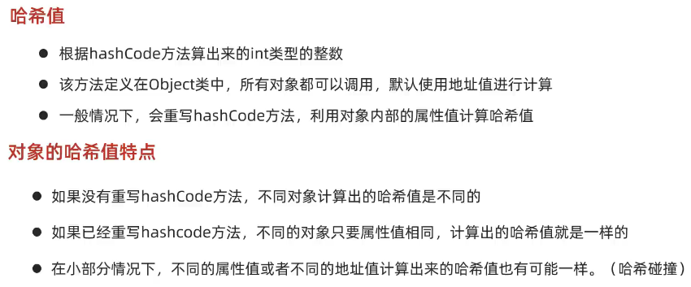
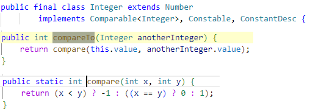

- [1. Set接口](#1-set接口)
- [2. HashSet](#2-hashset)
  - [2.1. 哈希值](#21-哈希值)
  - [2.2. 哈希表](#22-哈希表)
- [3. LinkedHashSet](#3-linkedhashset)
- [4. TreeSet](#4-treeset)
  - [4.1. 自定义比较](#41-自定义比较)
    - [4.1.1. 默认排序](#411-默认排序)
    - [4.1.2. 比较器排序](#412-比较器排序)

---

## 1. Set接口

与Collection的API一致
- 添加：add(e)
- 删除：remove(e)
- 其他：clear(), contains(e), isEmpty(), size()


```java
Set<String> s = new HashSet<>();

// 1. 添加元素
// 如果当前元素是第一次添加，那么可以添加成功，返回true
// 如果当前元素是第二次添加，那么添加失败，返回false
System.out.println(s.add("张三")); // true
System.out.println(s.add("李四")); // true
System.out.println(s.add("王五")); // true
System.out.println(s.add("张三")); // false

// 2. 打印集合: 无序
System.out.println(s);// [李四, 张三, 王五]

// 3. 遍历
// 迭代器遍历
Iterator<String> it = s.iterator();
while (it.hasNext()) {
    String str = it.next();
    System.out.println(str);
}

// 增强for
for (String str : s) {
    System.out.println(str);
}

// Lambda表达式
s.forEach(str -> System.out.println(str));
```
## 2. HashSet

### 2.1. 哈希值



```java
Student s1 = new Student("zhangsan", 23);
Student s2 = new Student("zhangsan", 23);

// 1. 如果没有重写hashCode方法，不同对象计算出的哈希值是不同的
// 2. 如果已经重写hashcode方法，不同的对象只要属性值相同，计算出的哈希值就是一样的
System.out.println(s1.hashCode());// -1461067292
System.out.println(s2.hashCode());// -1461067292

// 3. 在小部分情况下，不同的属性值或者不同的地址值计算出来的哈希值也有可能一样(哈希碰撞)
// String类已经重写了hashCode方法，不同的字符串，只要内容一样，计算出的哈希值就是一样的
System.out.println("abc".hashCode());// 96354
System.out.println("acD".hashCode());// 96354
```
### 2.2. 哈希表


```java
import java.util.HashSet;

public class A02_HashSetDemo1 {
    public static void main(String[] args) {
        HashSet<Student> hs = new HashSet<Student>();

        // 创建学生对象
        Student s1 = new Student("林青霞", 30);
        Student s2 = new Student("张曼玉", 35);
        Student s3 = new Student("王祖贤", 33);

        hs.add(s1);
        hs.add(s2);
        hs.add(s3);

        // 遍历集合(增强for)
        for (Student s : hs) {
            System.out.println(s);
        }
        // Student{name='王祖贤', age=33}
        // Student{name='张曼玉', age=35}
        // Student{name='林青霞', age=30}
    }
}

class Student {
    private String name;
    private int age;

    public Student(String name, int age) {
        this.name = name;
        this.age = age;
    }

    @Override
    public boolean equals(Object o) {
        if (this == o)
            return true;
        if (o == null || getClass() != o.getClass())
            return false;

        Student student = (Student) o;

        if (age != student.age)
            return false;
        return name != null ? name.equals(student.name) : student.name == null;
    }

    @Override
    public int hashCode() {
        int result = name != null ? name.hashCode() : 0;
        result = 31 * result + age;
        return result;
    }

    @Override
    public String toString() {
        return "Student{" +
                "name='" + name + '\'' +
                ", age=" + age +
                '}';
    }
}
```

## 3. LinkedHashSet


```java
import java.util.LinkedHashSet;

public class A02_HashSetDemo1 {
    public static void main(String[] args) {
        LinkedHashSet<Student> hs = new LinkedHashSet<Student>();

        Student s1 = new Student("林青霞", 30);
        Student s2 = new Student("张曼玉", 35);
        Student s3 = new Student("王祖贤", 33);

        hs.add(s1);
        hs.add(s2);
        hs.add(s3);

        // 存取顺序
        System.out.println(hs);   
        // [Student{name='林青霞', age=30}, Student{name='张曼玉', age=35}, Student{name='王祖贤', age=33}]
    }
}
```

## 4. TreeSet


因为Integer等已经实现了接口 `Comparable`



```java
TreeSet<Integer> ts = new TreeSet<>();

// 1.添加元素
ts.add(4);
ts.add(5);
ts.add(1);
ts.add(3);
ts.add(2);

// 2.打印集合：排序
System.out.println(ts);     // [1, 2, 3, 4, 5]

// 3.遍历集合（三种遍历）
// 迭代器
Iterator<Integer> it = ts.iterator();
while(it.hasNext()){
    int i = it.next();
    System.out.println(i);
}
// 增强for
for (int t : ts) {
    System.out.println(t);
}
// lambda
ts.forEach( i-> System.out.println(i));
```

### 4.1. 自定义比较

自定义类必须按照以下任一种方式来实现比较，不然 TreeSet 添加元素报错 `ClassCastException`。

#### 4.1.1. 默认排序

实现Comparable接口，重写`compareTo`方法

```java
import java.util.TreeSet;

public class A02_TreeSet {
    public static void main(String[] args) {
        TreeSet<Student> ts = new TreeSet<Student>();

        // 创建学生对象
        Student s1 = new Student("aaa", 30);
        Student s2 = new Student("bbb", 35);
        Student s3 = new Student("ccc", 33);

        ts.add(s1);
        ts.add(s2);
        ts.add(s3);

        // 遍历集合(增强for)
        for (Student s : ts) {
            System.out.println(s);
        }
        // Student{name='aaa', age=30}
        // Student{name='ccc', age=33}
        // Student{name='bbb', age=35
    }
}

class Student implements Comparable<Student>{
    private String name;
    private int age;

    public Student() {}

    public Student(String name, int age) {
        this.name = name;
        this.age = age;
    }

    public String getName() {return name;}

    public void setName(String name) {this.name = name;}

    public int getAge() {return age;}

    public void setAge(int age) {this.age = age;}

    @Override
    public boolean equals(Object o) {
        if (this == o)
            return true;
        if (o == null || getClass() != o.getClass())
            return false;

        Student student = (Student) o;

        if (age != student.age)
            return false;
        return name != null ? name.equals(student.name) : student.name == null;
    }

    @Override
    public int hashCode() {
        int result = name != null ? name.hashCode() : 0;
        result = 31 * result + age;
        return result;
    }

    // this: 要添加的元素
    // s: 已存在于红黑树中的元素
    // 返回值：
    //      0 表示要添加的元素重复，不添加；
    //      正数 表示要添加的元素大于s，添加到右子树；
    //      负数 表示要添加的元素小于s，添加到左子树
    @Override
    public int compareTo(Student s) {
        System.out.println(this + "..." + s);
        // 按照年龄从小到大排序
        int num = this.getAge() - s.getAge();
        // 年龄相同，按照姓名的字母顺序排序
        int num2 = num == 0 ? this.getName().compareTo(s.getName()) : num;
        return num2;
        // Student{name='aaa', age=30}...Student{name='aaa', age=30}
        // Student{name='bbb', age=35}...Student{name='aaa', age=30}
        // Student{name='ccc', age=33}...Student{name='aaa', age=30}
        // Student{name='ccc', age=33}...Student{name='bbb', age=35}
    }
}
```

#### 4.1.2. 比较器排序

TresSet构造传递比较器，重写`compare`方法。

PS：当默认排序和比较器排序同时存在时，以比较器排序为准。

```java
// o1:表示当前要添加的元素
// o2：表示已经在红黑树存在的元素
// 返回值规则跟之前是一样的
// FunctionalInterface。可以简化为lambda
TreeSet<String> ts = new TreeSet<>(new Comparator<String>() {
    @Override
    public int compare(String o1, String o2) {
        // 按照字符串的长度升序排序
        int num = o1.length() - o2.length();
        // 长度相同，按照字母顺序排序
        int num2 = num == 0 ? o1.compareTo(o2) : num;
        return num2;
    }
});

ts.add("c");
ts.add("ab");
ts.add("df");
ts.add("qwer");

System.out.println(ts);     // [c, ab, df, qwer]
```

```java
public class A02_TreeSet {
    public static void main(String[] args) {
        TreeSet<Student> ts = new TreeSet<Student>(new Comparator<Student>() {
            @Override
            public int compare(Student s1, Student s2) {
                int num = s2.getAge() - s1.getAge();
                int num2 = num == 0 ? s1.getName().compareTo(s2.getName()) : num;
                return num2;
            }
        });

        // 创建学生对象
        Student s1 = new Student("aaa", 30);
        Student s2 = new Student("bbb", 35);
        Student s3 = new Student("ccc", 33);

        ts.add(s1);
        ts.add(s2);
        ts.add(s3);

        // 遍历集合(增强for)
        for (Student s : ts) {
            System.out.println(s);
        }
        // Student{name='aaa', age=30}
        // Student{name='ccc', age=33}
        // Student{name='bbb', age=35
    }
}
```
