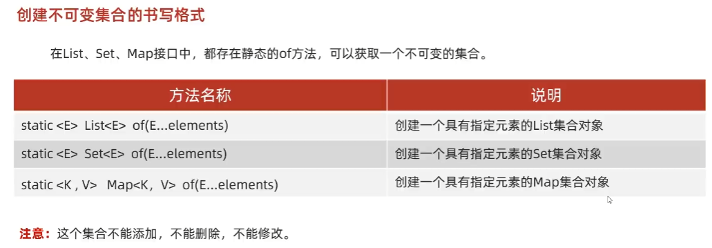

## 11. 不可变集合


### 11.1. list
```java
// 一旦创建完毕之后，是无法进行修改的，在下面的代码中，只能进行查询操作
List<String> list = List.of("张三", "李四", "王五", "赵六");

System.out.println(list.get(0));
// list.remove("李四");
// list.add("aaa");
// list.set(0, "aaa");
```
### 11.2. set
```java
Set<String> set = Set.of("张三", "李四", "王五", "赵六");
for (String s : set) {
    System.out.println(s);
}
//set.remove("王五");


// 细节：当我们要获取一个不可变的Set集合时，里面的参数一定要保证唯一性
Set<String> set2 = Set.of("张三", "张三", "李四", "王五", "赵六");  // error
```
### 11.3. map
`Map.of()`方法，参数是有上限的，最多只能传递20个参数、即10个键值对键值。为什么不能用可变参数？因为可变参数不能写两个，`K...keys, V...values`报错。
```java
/* 10个键值对键值对个数小于等于10 */

// 一个key接着一个value
// 键是不能重复的
Map<String, String> map = Map.of("张三", "南京", "王五", "上海",
        "赵六", "广州", "孙七", "深圳", "周八", "杭州",
        "吴九", "宁波", "郑十", "苏州", "刘一", "无锡",
        "陈二", "嘉兴");

Set<String> keys = map.keySet();
for (String key : keys) {
    String value = map.get(key);
    System.out.println(key + "=" + value);
}
```
键值对的数量超过10个的。
```java
/* 键值对的数量超过10个 */
HashMap<String, String> hm = new HashMap<>();
hm.put("张三", "南京");
hm.put("李四", "北京");
hm.put("王五", "上海");
hm.put("赵六", "北京");
hm.put("孙七", "深圳");
hm.put("周八", "杭州");
hm.put("吴九", "宁波");
hm.put("郑十", "苏州");
hm.put("刘一", "无锡");
hm.put("陈二", "嘉兴");
hm.put("aaa", "111");

// 1. 底层写法：
// ①map的每个键值对Entry放入到Entry数组中
// ②使用Map.ofEntries()方法输入可变参数的Entry，转换为不可变的Map集合
Set<Map.Entry<String, String>> entries = hm.entrySet();
// toArray方法在底层会比较集合的长度跟数组的长度两者的大小
//      如果集合的长度 > 数组的长度 ：数据在数组中放不下，此时会根据实际数据的数，重新创建数组
//      如果集合的长度 <= 数组的长度：数据在数组中放的下，此时不会创建新的数，而是直接用
//      所以直接创建一个0大小的数组就行
Map.Entry[] arr1 = new Map.Entry[0];
Map.Entry[] arr2 = entries.toArray(arr1);
// 不可变的map集合
Map<String, String> map = Map.ofEntries(arr2);
System.out.println(map.get("aaa"));

// 2. 将上述代码简化为一行
Map<String, String> map2 = Map.ofEntries(hm.entrySet().toArray(new
Map.Entry[0]));
System.out.println(map2.get("aaa"));

// 3. JDK10特性：使用 Map封装上述代码的函数 Map.copyOf()
Map<String, String> map3 = Map.copyOf(hm);
System.out.println(map2.get("aaa"));
```