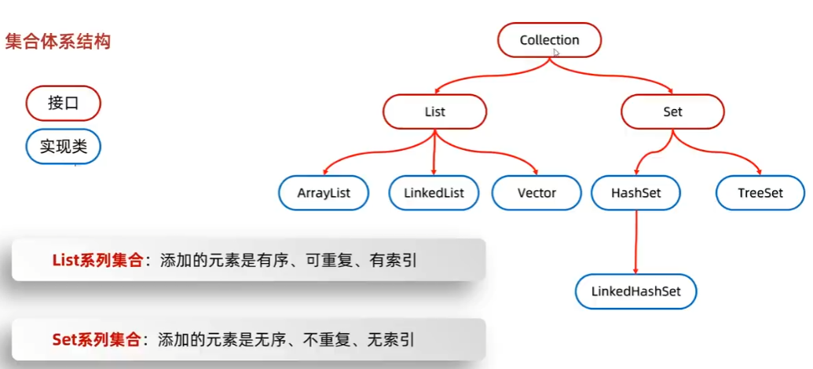
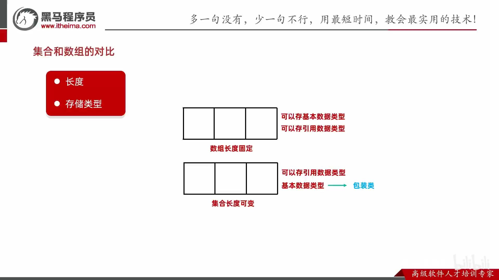
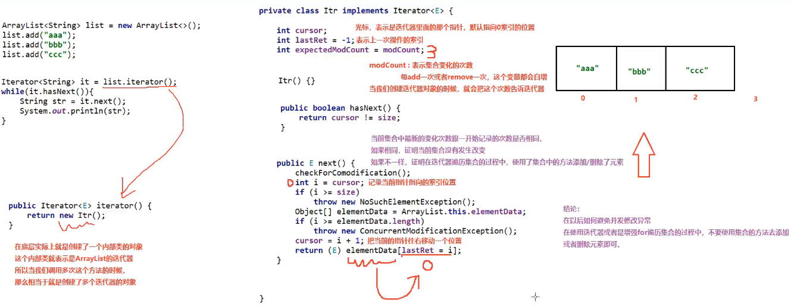
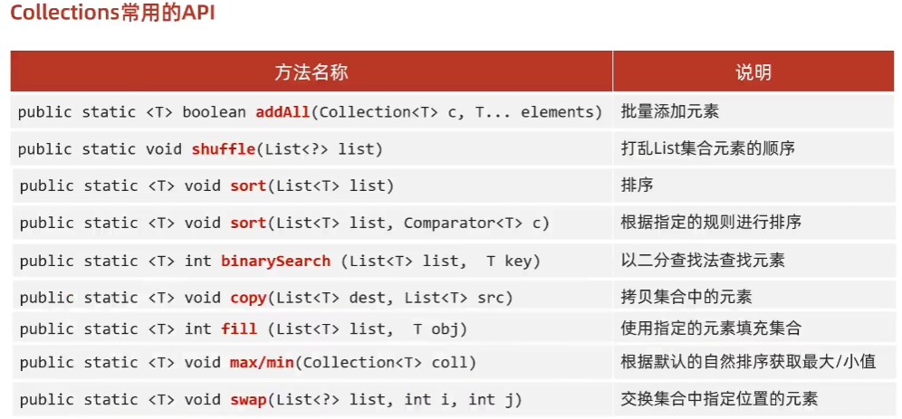

- [1. 集合](#1-集合)
  - [1.1. 集合体系](#11-集合体系)
- [2. 集合和数组的区别](#2-集合和数组的区别)
- [3. 集合可以加入null吗](#3-集合可以加入null吗)
- [4. Collection接口](#4-collection接口)
  - [4.1. 遍历](#41-遍历)
    - [4.1.1. 迭代器遍历](#411-迭代器遍历)
      - [4.1.1.1. 迭代器](#4111-迭代器)
    - [4.1.2. 增强for遍历](#412-增强for遍历)
    - [4.1.3. Lambda表达式遍历](#413-lambda表达式遍历)
- [5. Collections工具类](#5-collections工具类)


---

## 1. 集合
### 1.1. 集合体系



- 有序: 存和取的元素顺序一致
- 可重复: 存储的元索可以重复
- 有索引: 可以通过索引操作元素


List接口：
- ArrayList：底层是数组结构实现，查询快、增删慢
- LinkedLis：底层是链表结构实现，查询慢、增删快
- Vector：已淘汰

Set接口：
- HashSet：无序
- LinkedHashSet：有序（存取顺序）
- TreeSet：可排序

使用：
- 如果想要集合中的元素可重复
    - 用的最多：ArrayList集合, 基于数组的。
    - 当前的增删操作明显多于查询：用LinkedList集合, 基于链表的。
- 如果想对集合中的元素去重
    - 用的最多：用HashSet集合, 基于哈希表的。
    - 保证存取顺序：用LinkedHashSet集合，基于哈希表和双链表,效率低于HashSet。
    - 想对集合中的元素进行排序：用TreeSet集合，基于红黑树。后续也可以用List集合实现排序。

## 2. 集合和数组的区别




## 3. 集合可以加入null吗

可以加入null，同一个正常元素
```java
List<Integer> list = new ArrayList<>();
list.add(null);
System.out.println(list.contains(null));    // true


Set<String> set = new HashSet<>();
System.out.println(set.add(null));  // true
System.out.println(set.add(null));  // false
System.out.println(set.contains(null));  // true


Map<Integer, String> h = new HashMap<>();
// 不仅可以存入null和null
h.put(null, null);
System.out.println(h.containsKey(null)); // true
System.out.println(h.containsValue(null)); // true
System.out.println(h.get(null)); // null
System.out.println(h.getOrDefault(null, "yes")); // null
System.out.println(h.size()); // 1
// 还可以更新null的value
h.put(null, "a");
System.out.println(h.get(null)); // a
```

## 4. Collection接口

Collection是单列集合的顶层接口，所有方法被List和Set共享。

- 添加：add(e)
- 删除：remove(e)
- 其他：clear(), contains(e), isEmpty(), size()


```java
/* 添加 */
ArrayList<Integer> list = new ArrayList<>();
list.add(1);        // add，而不是append


/* 大小 */
int size = list.size();     // 集合是method

int[] a = {1,2,3};
int length = a.length;      // 数组是attribute

// contains加s
```
```java
/* 创建集合的对象的类型 */
// 限定集合中存储数据的类型
// ArrayList<String> list = new ArrayList<String>();
ArrayList<String> list = new ArrayList<>();     // 简写不用再写类型
list.add("abc");

// 任意类型
ArrayList list = new ArrayList();
list.add(123);  // add(Object e)
list.add("abc");


/* 多重形式 */
// 不要在声明时指定具体的实现类
List<Integer> result1 = new ArrayList<>();
List<List<Integer>> result2 = new ArrayList<>();

// 可能会导致错误的声明方式
List<Integer> result3 = new ArrayList<Integer>();
List<List<Integer>> result4 = new ArrayList<List<Integer>>();
// List<List<Integer>> error1 = new ArrayList<ArrayList<Integer>>();
// List<List<Integer>> error2 = new ArrayList<Integer>();
```


```java
import java.util.ArrayList;
import java.util.Collection;

public class A01_CollectionDemo1 {
    public static void main(String[] args) {
        // Collection是一个接口, 只能创建他实现类的对象。
        Collection<String> coll = new ArrayList<>();

        // 1. 添加元素: 将指定的元素添加到此集合的尾部
        // 细节1：如果我们要往List系列集合中添加数据，那么方法永远返回true，因为List系列的是允许元素重复的。
        // 细节2：如果我们要往Set系列集合中添加数据。因为Set系列的集合不允许重复。
        //   如果当前要添加元素不存在，方法返回true，表示添加成功。
        //   如果当前要添加的元素已经存在，方法返回false，表示添加失败。
        boolean result = coll.add("aaa");
        System.out.println(result);     //true

        // 2. 删除
        // 细节1：因为Collection里面定义的是共性的方法，所以此时不能通过索引进行删除。只能通过元素的对象进行删除。
        // 细节2：方法会有一个布尔类型的返回值，删除成功返回true，删除失败返回false
        // 如果要删除的元素不存在，就会删除失败。
        boolean result3 = coll.remove("aaa");
        System.out.println(result3);    //true

        // 3.清空
        coll.clear();

        // 4. 打印
        // JDK7: 打印对象不是地址值，而是集合中存储数据内容
        // 如果是基本数据类型和String，那ok
        // 如果是自定义类型，那需要重写toString()
        System.out.println(coll);

        // 5. 判断元素是否包含
        // 细节：底层是遍历各元素，依赖equals方法进行判断是否存在的。
        // 所以，如果集合中存储的是自定义对象，那么在javabean类中，一定要重写这个类的equals方法。
        System.out.println(coll.contains("bbb"));

        // 6. 判断集合是否为空
        System.out.println(coll.isEmpty()); 

        // 7. 获取集合的长度
        System.out.println(coll.size());
    }
}
```

### 4.1. 遍历

PS：不用普通的for索引遍历，因为Set没有索引。

Collection系列集合三种通用的遍历方式：
1. 迭代器遍历
2. 增强for遍历
3. lambda表达式遍历

如果需要删除元素，用迭代器遍历；如果只是遍历，用后两个。

#### 4.1.1. 迭代器遍历

迭代器遍历相关的四个方法：
- `Iterator<E> iterator()`：返回容器对象的迭代器对象，默认指向当前集合的0索引
- `boolean hasNext()`：判断当前指针位置是否有元素，有返回true，没有返回false
- `E next()`：获取当前指向的元素**并移动指针**
- `void remove()`: 删除当前`next()`已获取的元素（而不是指针指向的元素）

```java
Collection<String> coll = new ArrayList<>();
coll.add("aaa");
coll.add("bbb");
coll.add("ccc");
coll.add("ddd");

Iterator<String> it = coll.iterator();
while (it.hasNext()) {
    String str = it.next();
    System.out.println(str);

    if (str.equals("ccc")) {
        it.remove();
        
        // 不能使用集合的方法
        // coll.remove("aaa");
        // java.util.ConcurrentModificationException
    }
}
System.out.println(coll);

String str = it.next();     // java.util.NoSuchElementException
```

细节注意点:
- 遍历完后，报错NoSuchElementException
- 迭代器遍历完毕, 指针不会复位。所以我们要继续第二次遍历集合，只能再次获取一个新的迭代器对象。
- 迭代器遍历时，不能用集合的方法进行增加或者删除。
    
    删除可以用迭代器的remove方法来删除。

    添加还是不行。


##### 4.1.1.1. 迭代器


#### 4.1.2. 增强for遍历

JDK5特性，内部原理就是一个迭代器。

单列集合和数组才能用。

```java
Collection<String> coll = new ArrayList<>();
coll.add("aaa");
coll.add("bbb");
coll.add("ccc");

// 用一个第三方变量，在循环的过程中依次表示集合中的每一个数据
for(String s : coll){
    System.out.println(s);
    // 修改增强for中的变量，不会影响原本的元素
    s = "ddd";
}
System.out.println(coll);   // [aaa, bbb, ccc]
```
#### 4.1.3. Lambda表达式遍历

JDK8特性

同样不能修改。
```java
Collection<String> coll = new ArrayList<>();
coll.add("aaa");
coll.add("bbb");
coll.add("ccc");

// 1.利用匿名内部类的形式
// 底层原理：
// 遍历集合，依次把得到的每一个元素，传递给下面的accept方法
coll.forEach(new Consumer<String>() {
    // s依次表示集合中的每一个数据
    @Override
    public void accept(String s) {
        System.out.println(s);
    }
});

// 2.利用Lambda表达式的形式
coll.forEach(s -> System.out.println(s));
```


## 5. Collections工具类

仅限单列集合。



```java
import java.util.ArrayList;
import java.util.Collections;
import java.util.Comparator;

public class CollectionsDemo2 {
    public static void main(String[] args) {
        System.out.println("-------------sort默认规则--------------------------");
        ArrayList<Integer> list1 = new ArrayList<>();
        //addAll  批量添加元素
        Collections.addAll(list1, 10, 1, 2, 4, 8, 5, 9, 6, 7, 3);

        //shuffle 打乱
        Collections.shuffle(list1);

        // 默认规则，需要重写Comparable接口compareTo方法。Integer已经实现，按照从小打大的顺序排列
        // 如果是自定义对象，需要自己指定规则
        Collections.sort(list1);
        System.out.println(list1);

        Collections.sort(list1, new Comparator<Integer>() {
            @Override
            public int compare(Integer o1, Integer o2) {
                return o2 - o1;
            }
        });
        System.out.println(list1);

        Collections.sort(list1, (o1, o2) -> o2 - o1);
        System.out.println(list1);

        System.out.println("-------------binarySearch--------------------------");
        // 需要元素有序
        ArrayList<Integer> list2 = new ArrayList<>();
        Collections.addAll(list2, 1, 2, 3, 4, 5, 6, 7, 8, 9, 10);
        System.out.println(Collections.binarySearch(list2, 9)); // 8
        System.out.println(Collections.binarySearch(list2, 1)); // 0
        System.out.println(Collections.binarySearch(list2, 20));    // -11

        System.out.println("-------------copy--------------------------");
        ArrayList<Integer> list3 = new ArrayList<>();
        ArrayList<Integer> list4 = new ArrayList<>();
        Collections.addAll(list3, 1, 2, 3, 4, 5, 6, 7, 8, 9, 10);
        Collections.addAll(list4, 0, 0, 0, 0, 0, 0, 0, 0, 0, 0, 0, 0, 0, 0, 0);
        // dest <- src
        // 会覆盖原来的元素
        // 注意点：如果list3的长度 > list4的长度，方法会报错
        Collections.copy(list4, list3);
        System.out.println(list3);
        System.out.println(list4);

        System.out.println("-------------fill--------------------------");
        ArrayList<Integer> list5 = new ArrayList<>();
        Collections.addAll(list5, 1, 2, 3, 4, 5, 6, 7, 8, 9, 10);
        // 把集合中现有的所有数据，都修改为指定数据
        Collections.fill(list5, 100);
        System.out.println(list5);

        System.out.println("-------------max/min--------------------------");
        ArrayList<Integer> list6 = new ArrayList<>();
        Collections.addAll(list6, 1, 2, 3, 4, 5, 6, 7, 8, 9, 10);
        // 求最大值或者最小值
        System.out.println(Collections.max(list6));
        System.out.println(Collections.min(list6));

        System.out.println("-------------max/min指定规则--------------------------");
        ArrayList<String> list7 = new ArrayList<>();
        Collections.addAll(list7, "a", "aa", "aaa", "aaaa");
        // String中默认是按照字母的abcdefg顺序进行排列的
        // 现在我要求最长的字符串
        // 默认的规则无法满足，可以自己指定规则
        // 求指定规则的最大值或者最小值
        System.out.println(Collections.max(list7, new Comparator<String>() {
            @Override
            public int compare(String o1, String o2) {
                return o1.length() - o2.length();
            }
        }));

        System.out.println("-------------swap--------------------------");
        ArrayList<Integer> list8 = new ArrayList<>();
        Collections.addAll(list8, 1, 2, 3);
        Collections.swap(list8, 0, 2);
        System.out.println(list8);

    }
}
```
