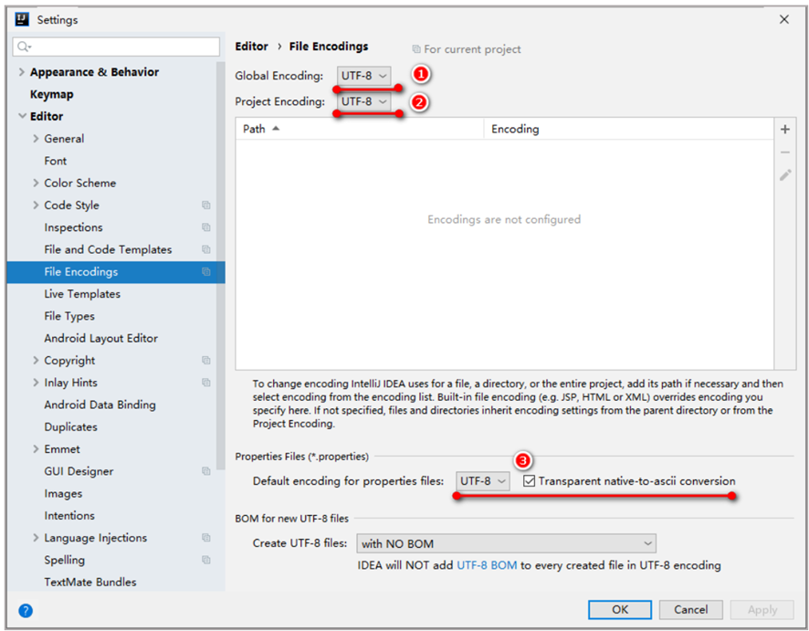

- [1. 集合](#1-集合)
  - [1.1. 集合体系](#11-集合体系)
  - [1.2. 包装类](#12-包装类)
- [2. Collection接口](#2-collection接口)
  - [2.1. 遍历](#21-遍历)
    - [2.1.1. 迭代器遍历](#211-迭代器遍历)
      - [2.1.1.1. 迭代器](#2111-迭代器)
    - [2.1.2. 增强for遍历](#212-增强for遍历)
    - [2.1.3. Lambda表达式遍历](#213-lambda表达式遍历)
- [3. List接口](#3-list接口)
  - [3.1. 遍历](#31-遍历)
- [4. ArrayList类](#4-arraylist类)
- [5. LinkedList类](#5-linkedlist类)
- [6. Set接口](#6-set接口)
- [7. HashSet](#7-hashset)
  - [7.1. 哈希值](#71-哈希值)
  - [7.2. 哈希表](#72-哈希表)
- [8. LinkedHashSet](#8-linkedhashset)
- [9. TreeSet](#9-treeset)
  - [9.1. 自定义比较](#91-自定义比较)
    - [9.1.1. 默认排序](#911-默认排序)
    - [9.1.2. 比较器排序](#912-比较器排序)
- [10. Collections工具类](#10-collections工具类)


---

## 1. 集合
### 1.1. 集合体系


- 有序: 存和取的元素顺序一致
- 可重复: 存储的元索可以重复
- 有索引: 可以通过索引操作元素


List接口：
- ArrayList：底层是数组结构实现，查询快、增删慢
- LinkedLis：底层是链表结构实现，查询慢、增删快
- Vector：已淘汰

Set接口：
- HashSet：无序
- LinkedHashSet：有序（存取顺序）
- TreeSet：可排序

使用：
- 如果想要集合中的元素可重复
    - 用的最多：ArrayList集合, 基于数组的。
    - 当前的增删操作明显多于查询：用LinkedList集合, 基于链表的。
- 如果想对集合中的元素去重
    - 用的最多：用HashSet集合, 基于哈希表的。
    - 保证存取顺序：用LinkedHashSet集合，基于哈希表和双链表,效率低于HashSet。
    - 想对集合中的元素进行排序：用TreeSet集合，基于红黑树。后续也可以用List集合实现排序。


### 1.2. 包装类

包装类：基本数据类型对应的引用类型。


理由：Object多态和集合需要


## 2. Collection接口

Collection是单列集合的顶层接口，所有方法被List和Set共享。


```java
/* 创建集合的对象 */

// 1. 限定集合中存储数据的类型
// ArrayList<String> list = new ArrayList<String>();
ArrayList<String> list = new ArrayList<>();     // 简写不用再写类型
list.add("abc");

// 2.任意类型
ArrayList list = new ArrayList();
list.add(123);  // add(Object e)
list.add("abc");
```


```java
import java.util.ArrayList;
import java.util.Collection;

public class A01_CollectionDemo1 {
    public static void main(String[] args) {
        // Collection是一个接口, 只能创建他实现类的对象。
        Collection<String> coll = new ArrayList<>();

        // 1. 添加元素: 将指定的元素添加到此集合的尾部
        // 细节1：如果我们要往List系列集合中添加数据，那么方法永远返回true，因为List系列的是允许元素重复的。
        // 细节2：如果我们要往Set系列集合中添加数据。因为Set系列的集合不允许重复。
        //   如果当前要添加元素不存在，方法返回true，表示添加成功。
        //   如果当前要添加的元素已经存在，方法返回false，表示添加失败。
        boolean result = coll.add("aaa");
        System.out.println(result);     //true

        // 2. 删除
        // 细节1：因为Collection里面定义的是共性的方法，所以此时不能通过索引进行删除。只能通过元素的对象进行删除。
        // 细节2：方法会有一个布尔类型的返回值，删除成功返回true，删除失败返回false
        // 如果要删除的元素不存在，就会删除失败。
        boolean result3 = coll.remove("aaa");
        System.out.println(result3);    //true

        // 3.清空
        coll.clear();

        // 4. 打印
        // JDK7: 打印对象不是地址值，而是集合中存储数据内容
        // 如果是基本数据类型和String，那ok
        // 如果是自定义类型，那需要重写toString()
        System.out.println(coll);

        // 5. 判断元素是否包含
        // 细节：底层是遍历各元素，依赖equals方法进行判断是否存在的。
        // 所以，如果集合中存储的是自定义对象，那么在javabean类中，一定要重写这个类的equals方法。
        System.out.println(coll.contains("bbb"));

        // 6. 判断集合是否为空
        System.out.println(coll.isEmpty()); 

        // 7. 获取集合的长度
        System.out.println(coll.size());
    }
}
```

### 2.1. 遍历

PS：不用普通的for索引遍历，因为Set没有索引。

Collection系列集合三种通用的遍历方式：
1. 迭代器遍历
2. 增强for遍历
3. lambda表达式遍历

如果需要删除元素，用迭代器遍历；如果只是遍历，用后两个。

#### 2.1.1. 迭代器遍历

迭代器遍历相关的四个方法：
- `Iterator<E> iterator()`：返回容器对象的迭代器对象，默认指向当前集合的0索引
- `boolean hasNext()`：判断当前指针位置是否有元素，有返回true，没有返回false
- `E next()`：获取当前指向的元素**并移动指针**
- `void remove()`: 删除当前`next()`已获取的元素（而不是指针指向的元素）

```java
Collection<String> coll = new ArrayList<>();
coll.add("aaa");
coll.add("bbb");
coll.add("ccc");
coll.add("ddd");

Iterator<String> it = coll.iterator();
while (it.hasNext()) {
    String str = it.next();
    System.out.println(str);

    if (str.equals("ccc")) {
        it.remove();
        
        // 不能使用集合的方法
        // coll.remove("aaa");
        // java.util.ConcurrentModificationException
    }
}
System.out.println(coll);

String str = it.next();     // java.util.NoSuchElementException
```

细节注意点:
- 遍历完后，报错NoSuchElementException
- 迭代器遍历完毕, 指针不会复位。所以我们要继续第二次遍历集合，只能再次获取一个新的迭代器对象。
- 迭代器遍历时，不能用集合的方法进行增加或者删除。
    
    删除可以用迭代器的remove方法来删除。

    添加还是不行。


##### 2.1.1.1. 迭代器


#### 2.1.2. 增强for遍历

JDK5特性，内部原理就是一个迭代器。

单列集合和数组才能用。

```java
Collection<String> coll = new ArrayList<>();
coll.add("aaa");
coll.add("bbb");
coll.add("ccc");

// 用一个第三方变量，在循环的过程中依次表示集合中的每一个数据
for(String s : coll){
    System.out.println(s);
    // 修改增强for中的变量，不会影响原本的元素
    s = "ddd";
}
System.out.println(coll);   // [aaa, bbb, ccc]
```
#### 2.1.3. Lambda表达式遍历

JDK8特性

同样不能修改。
```java
Collection<String> coll = new ArrayList<>();
coll.add("aaa");
coll.add("bbb");
coll.add("ccc");

// 1.利用匿名内部类的形式
// 底层原理：
// 遍历集合，依次把得到的每一个元素，传递给下面的accept方法
coll.forEach(new Consumer<String>() {
    // s依次表示集合中的每一个数据
    @Override
    public void accept(String s) {
        System.out.println(s);
    }
});

// 2.利用Lambda表达式的形式
coll.forEach(s -> System.out.println(s));
```

## 3. List接口



```java
// 1.添加元素
// boolean Collection.add(E e)  将指定的元素添加到此集合的尾部
list.add("aaa");
list.add("ccc");
// void List.add(int index, E element)  将指定的元素插入此列表中的指定位置
// 细节：原来索引上的元素会依次往后移
list.add(1, "bbb");


// 2.删除元素
// boolean Collection.remove(Object o)  删除指定的元素，返回删除是否成功
boolean remove1 = list.remove("ccc");
System.out.println(remove1); //true
// E List.remove(int index)   删除指定索引处的元素，返回被删除的元素
String remove = list.remove(0);
System.out.println(remove); //aaa


// 3.修改元素
// E List.set(int index,E element)  修改指定索引处的元素，返回被修改的元素原本的值
String result = list.set(0, "QQQ");
System.out.println(result);

// 4. 获取元素
// E List.get(int index)  返回指定索引处的元素
String s = list.get(0);
System.out.println(s);
```

> `list.remove(1)` 删除的是1这个元素。还是1索引上的元素 ? 

删除的是1索引。因为在调用方法的时候。如果方法出现了重载现象优先调用实参跟形参类型一致的那个方法。`1` 是 `int`

```java
// boolean Collection.remove(Object o)
// E List.remove(int index)

// 此时 remove 方法是不会自动装箱的。所以对应int index
list.remove(1);

// 手动装箱。所以对应 Object o
Integer i = Integer.valueOf(1);
list.remove(i);
```

### 3.1. 遍历
List系列集合的五种遍历方式：
1. 迭代器：删除
2. 增强for：仅仅遍历
3. Lambda表达式：仅仅遍历
4. 普通for循环：操作索引
5. 列表迭代器：添加和删除

```java
List<String> list = new ArrayList<>();
list.add("aaa");
list.add("bbb");
list.add("ccc");

// 1.迭代器
Iterator<String> it = list.iterator();
while (it.hasNext()) {
    String str = it.next();
    System.out.println(str);
}

// 2.增强for
for (String s : list) {
    System.out.println(s);
}

// 3.Lambda表达式
list.forEach(s -> System.out.println(s));

// 4.普通for循环
// size方法跟get方法还有循环结合的方式，利用索引获取到集合中的每一个元素
for (int i = 0; i < list.size(); i++) {
    // i:依次表示集合中的每一个索引
    String s = list.get(i);
    System.out.println(s);
}

// 5.列表迭代器
// 获取一个列表迭代器的对象，里面的指针默认也是指向0索引的
// 额外添加了一个方法：在遍历的过程中，可以添加元素
ListIterator<String> list_it = list.listIterator();
while (list_it.hasNext()) {
    String str = list_it.next();
    if ("aaa".equals(str)) {
        // 删除当前已获取的元素（而不是指针指向的元素）
        list_it.remove();
    }
    if ("bbb".equals(str)) {
        // 在指针指向的位置添加元素（当前元素的后面）
        list_it.add("qqq");
    }
}
```

## 4. ArrayList类

|特有| 方法名                                | 说明                                   |
|:---: |------------------------------------- | -------------------------------------- |
| |public boolean add(要添加的元素)      | 将指定的元素追加到此集合的末尾         |
| |public boolean remove(要删除的元素)   | 删除指定元素,返回值表示是否删除成功    |
| 特有|public E  remove(int   index)         | 删除指定索引处的元素，返回被删除的元素 |
| 特有| public E   set(int index,E   element) | 修改指定索引处的元素，返回被修改的元素 |
| 特有| public E   get(int   index)           | 返回指定索引处的元素                   |
| |public int   size()                   | 返回集合中的元素的个数                 |

底层数据结构是数组。

数组名字：elementDate，定义变量size。


## 5. LinkedList类

底层数据结构是双链表。

查询慢,增删快,但是如果操作的是首尾元素，速度极快，所以多了很多首尾操作的特有API。


用的双链表是不带哨兵的形式。


## 6. Set接口

Set集合的方法上基本上与Collection的API一致


```java
Set<String> s = new HashSet<>();

// 1. 添加元素
// 如果当前元素是第一次添加，那么可以添加成功，返回true
// 如果当前元素是第二次添加，那么添加失败，返回false
System.out.println(s.add("张三")); // true
System.out.println(s.add("李四")); // true
System.out.println(s.add("王五")); // true
System.out.println(s.add("张三")); // false

// 2. 打印集合: 无序
System.out.println(s);// [李四, 张三, 王五]

// 3. 遍历
// 迭代器遍历
Iterator<String> it = s.iterator();
while (it.hasNext()) {
    String str = it.next();
    System.out.println(str);
}

// 增强for
for (String str : s) {
    System.out.println(str);
}

// Lambda表达式
s.forEach(str -> System.out.println(str));
```

## 7. HashSet

### 7.1. 哈希值


```java
Student s1 = new Student("zhangsan", 23);
Student s2 = new Student("zhangsan", 23);

// 1. 如果没有重写hashCode方法，不同对象计算出的哈希值是不同的
// 2. 如果已经重写hashcode方法，不同的对象只要属性值相同，计算出的哈希值就是一样的
System.out.println(s1.hashCode());// -1461067292
System.out.println(s2.hashCode());// -1461067292

// 3. 在小部分情况下，不同的属性值或者不同的地址值计算出来的哈希值也有可能一样(哈希碰撞)
// String类已经重写了hashCode方法，不同的字符串，只要内容一样，计算出的哈希值就是一样的
System.out.println("abc".hashCode());// 96354
System.out.println("acD".hashCode());// 96354
```
### 7.2. 哈希表


```java
import java.util.HashSet;

public class A02_HashSetDemo1 {
    public static void main(String[] args) {
        HashSet<Student> hs = new HashSet<Student>();

        // 创建学生对象
        Student s1 = new Student("林青霞", 30);
        Student s2 = new Student("张曼玉", 35);
        Student s3 = new Student("王祖贤", 33);

        hs.add(s1);
        hs.add(s2);
        hs.add(s3);

        // 遍历集合(增强for)
        for (Student s : hs) {
            System.out.println(s);
        }
        // Student{name='王祖贤', age=33}
        // Student{name='张曼玉', age=35}
        // Student{name='林青霞', age=30}
    }
}

class Student {
    private String name;
    private int age;

    public Student(String name, int age) {
        this.name = name;
        this.age = age;
    }

    @Override
    public boolean equals(Object o) {
        if (this == o)
            return true;
        if (o == null || getClass() != o.getClass())
            return false;

        Student student = (Student) o;

        if (age != student.age)
            return false;
        return name != null ? name.equals(student.name) : student.name == null;
    }

    @Override
    public int hashCode() {
        int result = name != null ? name.hashCode() : 0;
        result = 31 * result + age;
        return result;
    }

    @Override
    public String toString() {
        return "Student{" +
                "name='" + name + '\'' +
                ", age=" + age +
                '}';
    }
}
```

## 8. LinkedHashSet


```java
import java.util.LinkedHashSet;

public class A02_HashSetDemo1 {
    public static void main(String[] args) {
        LinkedHashSet<Student> hs = new LinkedHashSet<Student>();

        Student s1 = new Student("林青霞", 30);
        Student s2 = new Student("张曼玉", 35);
        Student s3 = new Student("王祖贤", 33);

        hs.add(s1);
        hs.add(s2);
        hs.add(s3);

        // 存取顺序
        System.out.println(hs);   
        // [Student{name='林青霞', age=30}, Student{name='张曼玉', age=35}, Student{name='王祖贤', age=33}]
    }
}
```

## 9. TreeSet


因为Integer等已经实现了接口 `Comparable`


```java
TreeSet<Integer> ts = new TreeSet<>();

// 1.添加元素
ts.add(4);
ts.add(5);
ts.add(1);
ts.add(3);
ts.add(2);

// 2.打印集合：排序
System.out.println(ts);     // [1, 2, 3, 4, 5]

// 3.遍历集合（三种遍历）
// 迭代器
Iterator<Integer> it = ts.iterator();
while(it.hasNext()){
    int i = it.next();
    System.out.println(i);
}
// 增强for
for (int t : ts) {
    System.out.println(t);
}
// lambda
ts.forEach( i-> System.out.println(i));
```

### 9.1. 自定义比较

自定义类必须按照以下任一种方式来实现比较，不然 TreeSet 添加元素报错 `ClassCastException`。

#### 9.1.1. 默认排序

实现Comparable接口，重写`compareTo`方法

```java
import java.util.TreeSet;

public class A02_TreeSet {
    public static void main(String[] args) {
        TreeSet<Student> ts = new TreeSet<Student>();

        // 创建学生对象
        Student s1 = new Student("aaa", 30);
        Student s2 = new Student("bbb", 35);
        Student s3 = new Student("ccc", 33);

        ts.add(s1);
        ts.add(s2);
        ts.add(s3);

        // 遍历集合(增强for)
        for (Student s : ts) {
            System.out.println(s);
        }
        // Student{name='aaa', age=30}
        // Student{name='ccc', age=33}
        // Student{name='bbb', age=35
    }
}

class Student implements Comparable<Student>{
    private String name;
    private int age;

    public Student() {}

    public Student(String name, int age) {
        this.name = name;
        this.age = age;
    }

    public String getName() {return name;}

    public void setName(String name) {this.name = name;}

    public int getAge() {return age;}

    public void setAge(int age) {this.age = age;}

    @Override
    public boolean equals(Object o) {
        if (this == o)
            return true;
        if (o == null || getClass() != o.getClass())
            return false;

        Student student = (Student) o;

        if (age != student.age)
            return false;
        return name != null ? name.equals(student.name) : student.name == null;
    }

    @Override
    public int hashCode() {
        int result = name != null ? name.hashCode() : 0;
        result = 31 * result + age;
        return result;
    }

    // this: 要添加的元素
    // s: 已存在于红黑树中的元素
    // 返回值：
    //      0 表示要添加的元素重复，不添加；
    //      正数 表示要添加的元素大于s，添加到右子树；
    //      负数 表示要添加的元素小于s，添加到左子树
    @Override
    public int compareTo(Student s) {
        System.out.println(this + "..." + s);
        // 按照年龄从小到大排序
        int num = this.getAge() - s.getAge();
        // 年龄相同，按照姓名的字母顺序排序
        int num2 = num == 0 ? this.getName().compareTo(s.getName()) : num;
        return num2;
        // Student{name='aaa', age=30}...Student{name='aaa', age=30}
        // Student{name='bbb', age=35}...Student{name='aaa', age=30}
        // Student{name='ccc', age=33}...Student{name='aaa', age=30}
        // Student{name='ccc', age=33}...Student{name='bbb', age=35}
    }
}
```

#### 9.1.2. 比较器排序

TresSet构造传递比较器，重写`compare`方法。

PS：当默认排序和比较器排序同时存在时，以比较器排序为准。

```java
// o1:表示当前要添加的元素
// o2：表示已经在红黑树存在的元素
// 返回值规则跟之前是一样的
// FunctionalInterface。可以简化为lambda
TreeSet<String> ts = new TreeSet<>(new Comparator<String>() {
    @Override
    public int compare(String o1, String o2) {
        // 按照字符串的长度升序排序
        int num = o1.length() - o2.length();
        // 长度相同，按照字母顺序排序
        int num2 = num == 0 ? o1.compareTo(o2) : num;
        return num2;
    }
});

ts.add("c");
ts.add("ab");
ts.add("df");
ts.add("qwer");

System.out.println(ts);     // [c, ab, df, qwer]
```

```java
public class A02_TreeSet {
    public static void main(String[] args) {
        TreeSet<Student> ts = new TreeSet<Student>(new Comparator<Student>() {
            @Override
            public int compare(Student s1, Student s2) {
                int num = s2.getAge() - s1.getAge();
                int num2 = num == 0 ? s1.getName().compareTo(s2.getName()) : num;
                return num2;
            }
        });

        // 创建学生对象
        Student s1 = new Student("aaa", 30);
        Student s2 = new Student("bbb", 35);
        Student s3 = new Student("ccc", 33);

        ts.add(s1);
        ts.add(s2);
        ts.add(s3);

        // 遍历集合(增强for)
        for (Student s : ts) {
            System.out.println(s);
        }
        // Student{name='aaa', age=30}
        // Student{name='ccc', age=33}
        // Student{name='bbb', age=35
    }
}
```

## 10. Collections工具类

仅限单列集合。


```java
import java.util.ArrayList;
import java.util.Collections;
import java.util.Comparator;

public class CollectionsDemo2 {
    public static void main(String[] args) {
        System.out.println("-------------sort默认规则--------------------------");
        ArrayList<Integer> list1 = new ArrayList<>();
        //addAll  批量添加元素
        Collections.addAll(list1, 10, 1, 2, 4, 8, 5, 9, 6, 7, 3);

        //shuffle 打乱
        Collections.shuffle(list1);

        // 默认规则，需要重写Comparable接口compareTo方法。Integer已经实现，按照从小打大的顺序排列
        // 如果是自定义对象，需要自己指定规则
        Collections.sort(list1);
        System.out.println(list1);

        Collections.sort(list1, new Comparator<Integer>() {
            @Override
            public int compare(Integer o1, Integer o2) {
                return o2 - o1;
            }
        });
        System.out.println(list1);

        Collections.sort(list1, (o1, o2) -> o2 - o1);
        System.out.println(list1);

        System.out.println("-------------binarySearch--------------------------");
        // 需要元素有序
        ArrayList<Integer> list2 = new ArrayList<>();
        Collections.addAll(list2, 1, 2, 3, 4, 5, 6, 7, 8, 9, 10);
        System.out.println(Collections.binarySearch(list2, 9)); // 8
        System.out.println(Collections.binarySearch(list2, 1)); // 0
        System.out.println(Collections.binarySearch(list2, 20));    // -11

        System.out.println("-------------copy--------------------------");
        ArrayList<Integer> list3 = new ArrayList<>();
        ArrayList<Integer> list4 = new ArrayList<>();
        Collections.addAll(list3, 1, 2, 3, 4, 5, 6, 7, 8, 9, 10);
        Collections.addAll(list4, 0, 0, 0, 0, 0, 0, 0, 0, 0, 0, 0, 0, 0, 0, 0);
        // dest <- src
        // 会覆盖原来的元素
        // 注意点：如果list3的长度 > list4的长度，方法会报错
        Collections.copy(list4, list3);
        System.out.println(list3);
        System.out.println(list4);

        System.out.println("-------------fill--------------------------");
        ArrayList<Integer> list5 = new ArrayList<>();
        Collections.addAll(list5, 1, 2, 3, 4, 5, 6, 7, 8, 9, 10);
        // 把集合中现有的所有数据，都修改为指定数据
        Collections.fill(list5, 100);
        System.out.println(list5);

        System.out.println("-------------max/min--------------------------");
        ArrayList<Integer> list6 = new ArrayList<>();
        Collections.addAll(list6, 1, 2, 3, 4, 5, 6, 7, 8, 9, 10);
        // 求最大值或者最小值
        System.out.println(Collections.max(list6));
        System.out.println(Collections.min(list6));

        System.out.println("-------------max/min指定规则--------------------------");
        ArrayList<String> list7 = new ArrayList<>();
        Collections.addAll(list7, "a", "aa", "aaa", "aaaa");
        // String中默认是按照字母的abcdefg顺序进行排列的
        // 现在我要求最长的字符串
        // 默认的规则无法满足，可以自己指定规则
        // 求指定规则的最大值或者最小值
        System.out.println(Collections.max(list7, new Comparator<String>() {
            @Override
            public int compare(String o1, String o2) {
                return o1.length() - o2.length();
            }
        }));

        System.out.println("-------------swap--------------------------");
        ArrayList<Integer> list8 = new ArrayList<>();
        Collections.addAll(list8, 1, 2, 3);
        Collections.swap(list8, 0, 2);
        System.out.println(list8);

    }
}
```
