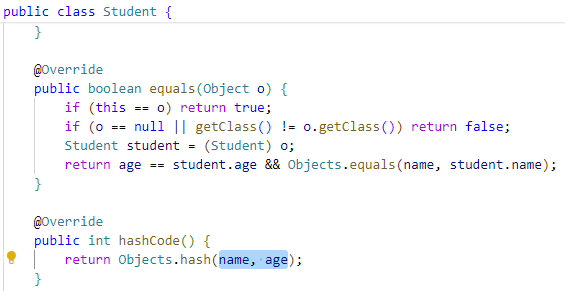
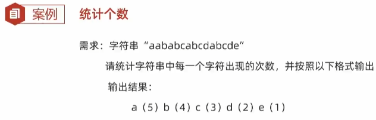

- [1. Map接口](#1-map接口)
  - [1.1. 遍历](#11-遍历)
- [2. HashMap集合](#2-hashmap集合)
  - [2.1. 底层](#21-底层)
- [3. LinkedHashMap](#3-linkedhashmap)
- [4. TreeMap](#4-treemap)
  - [4.1. 底层](#41-底层)
- [5. HashTable](#5-hashtable)


---
## 1. Map接口

- 添加/更新：put(k,v)
- 删除：remove(k)
- 获取：get(k)
- 其他：clear(), containsKey(k), containsValue(v), isEmpty(), size()


```java
Map<String, String> map = new HashMap<>();

// 1. 添加元素
// put方法的细节：
// 添加/覆盖
// 在添加数据的时候，如果键不存在，那么直接把键值对对象添加到map集合当中，方法返回null
// 在添加数据的时候，如果键是存在的，那么会把原有的键值对对象覆盖，会把被覆盖的值进行返回。
map.put("郭靖", "黄蓉");
map.put("韦小宝", "沐剑屏");
map.put("尹志平", "小龙女");
String value2 = map.put("韦小宝", "双儿");
System.out.println(value2); // 沐剑屏

// 2. 删除
String result = map.remove("郭靖");
System.out.println(result); // 黄蓉

// 3. 清空
map.clear();

// 4. 判断是否包含键
boolean keyResult = map.containsKey("郭靖");
System.out.println(keyResult);  // false

// 5. 判断是否包含值
boolean valueResult = map.containsValue("小龙女2");
System.out.println(valueResult);    // false

// 6. 判断是否为空
System.out.println(map.isEmpty());

// 7. 获取集合的长度
int size = map.size();
System.out.println(size);

// 打印集合
System.out.println(map);
```

| 方法名                              | 说明           |
| -------------------------------- | ------------ |
| `V get(Object key)`              | 根据键获取值       |
| `Set<K> keySet()`                | 获取所有键的集合     |
| `Collection<V> values()`         | 获取所有值的集合     |
| `Set<Map.Entry<K,V>> entrySet()` | 获取所有键值对对象的集合 |

```java
// V get(Object key):根据键获取值
System.out.println(map.get("郭靖"));    // 黄蓉
System.out.println(map.get("张无忌"));  // null

// Set<K> keySet():获取所有键的集合
Set<String> keySet = map.keySet();
for (String key : keySet) {
    System.out.println(key);
}

// Collection<V> values():获取所有值的集合
Collection<String> values = map.values();
for (String value : values) {
    System.out.println(value);
}
```
> key和value都可以是null

```java
HashMap<Integer, String> h = new HashMap<>();
// 不仅可以存入null和null
h.put(null, null);
System.out.println(h.get(null)); // null
System.out.println(h.size()); // 1
// 还可以更新null的value
h.put(null, "a");
System.out.println(h.get(null)); // a
System.out.println(h.size()); // 1
```
### 1.1. 遍历
- map直接lambda遍历
- keySet 键找值：遍历key的Set结合
- entry 键值对：遍历Entry的Set结合

```java
Map<String, String> map = new HashMap<String, String>();
map.put("郭靖", "黄蓉");
map.put("韦小宝", "沐剑屏");
map.put("尹志平", "小龙女");

/* 1. map直接遍历 */
// lambda
// 底层：
//  forEach其实就是利用 entrySet() 进行遍历，对每一个键和值，再调用accept方法
map.forEach(new BiConsumer<String, String>() {
    @Override
    public void accept(String key, String value) {
        System.out.println(key + "," + value);
    }
});

/* 2. keySet 键找值 */
Set<String> keySet = map.keySet();
// 增强for
for (String key : keySet) {
    String value = map.get(key);
    System.out.println(key + "," + value);
}
// 迭代器
Iterator<String> it = keySet.iterator();
while (it.hasNext()) {
    String key = it.next();
    String value = map.get(key);
    System.out.println(key + "," + value);
}
// lambda
keySet.forEach(new Consumer<String>() {
    @Override
    public void accept(String key) {
        String value = map.get(key);
        System.out.println(key + "," + value);
    }
});

/* 3. entrySet 键值对对象找键和值 */
Set<Map.Entry<String, String>> entrySet = map.entrySet();
// 增强for
for (Map.Entry<String, String> entry : entrySet) {
    String key = entry.getKey();
    String value = entry.getValue();
    System.out.println(key + "," + value);
}
// 迭代器
Iterator<Map.Entry<String, String>> it2 = entrySet.iterator();
while (it2.hasNext()) {
    Map.Entry<String, String> entry = it2.next();
    String key = entry.getKey();
    String value = entry.getValue();
    System.out.println(key + "," + value);
}
// lambda
entrySet.forEach(new Consumer<Map.Entry<String, String>>() {
    @Override
    public void accept(Map.Entry<String, String> entry) {
        String key = entry.getKey();
        String value = entry.getValue();
        System.out.println(key + "," + value);
    }
});
```

## 2. HashMap集合

HashMap底层是哈希表结构的


注意：
- 依赖hashCode方法和equals方法保证**键的唯一**
- 如果键要存储的是自定义对象，需要重写hashCode和equals方法


### 2.1. 底层

```java
/*
- Node<K,V>[] table 哈希表结构中数组的名字
- DEFAULT_INITIAL_CAPACITY： 数组默认长度16
- DEFAULT_LOAD_FACTOR： 默认加载因子0.75


HashMap里面每一个对象包含以下内容：
1.1 链表中的键值对对象
    int hash;         //键的哈希值
    final K key;      //键
    V value;          //值
    Node<K,V> next;   //下一个节点的地址值
            
            
1.2 红黑树中的键值对对象
    int hash;         		//键的哈希值
    final K key;      		//键
    V value;         	 	//值
    TreeNode<K,V> parent;  	//父节点的地址值
    TreeNode<K,V> left;		//左子节点的地址值
    TreeNode<K,V> right;	//右子节点的地址值
    boolean red;			//节点的颜色
*/

HashMap<String,Integer> hm = new HashMap<>(); // 还没有创建数组
hm.put("aaa" , 111); // put时才创建数组
hm.put("bbb" , 222);
hm.put("ccc" , 333);
hm.put("ccc" , 444);

/*
* 添加元素的时候至少考虑三种情况：
* 1. 数组位置为null
* 2. 数组位置不为null，键不重复，挂在下面形成链表或者红黑树
* 3. 数组位置不为null，键重复，元素覆盖
*/

// 参数一：键
// 参数二：值
// 返回值：被覆盖元素的值，如果没有覆盖，返回null
public V put(K key, V value) {
    return putVal(hash(key), key, value, false, true);
}

// 利用键计算出对应的哈希值 hashCode，再把哈希值进行一些额外的处理
// 简单理解：返回值就是返回键的哈希值
static final int hash(Object key) {
    int h;
    return (key == null) ? 0 : (h = key.hashCode()) ^ (h >>> 16);
}

// 参数一：键的哈希值
// 参数二：键
// 参数三：值
// 参数四：如果键重复了是否保留
//      true，表示老元素的值保留，不会覆盖
//      false，表示老元素的值不保留，会进行覆盖
// 参数五：是否需要扩容
final V putVal(int hash, K key, V value, boolean onlyIfAbsent, boolean evict) {
    // 定义一个局部变量，用来记录哈希表中数组的地址值。
    // 意义是不用每次都去堆中取，在栈中处理，效率更高
    Node<K, V>[] tab;
    // 把 HashMap 中数组的地址值，赋值给局部变量tab
    tab = table;

    // 临时的第三方变量，用来记录键值对对象的地址值
    Node<K, V> p;

    // 表示当前数组的长度
    int n;
    n = tab.length;

    // 表示索引
    int i;


    if (tab == null || n == 0) {
        // resize 方法的作用：
        // 1.如果当前是第一次添加数据，底层会创建一个默认长度为16，加载因子为0.75的数组
        // 2.如果不是第一次添加数据，会看数组中的元素是否达到了扩容的条件
        //      如果没有达到扩容条件，底层不会做任何操作
        //      如果达到了扩容条件，底层会把数组扩容为原先的两倍，并把数据全部转移到新的哈希表中
        tab = resize();
        // 表示把当前数组的长度赋值给n
        n = tab.length;
    }

    // 获取当前键值对对象在数组中应存入的位置：拿着数组的长度跟键的哈希值进行计算
    i = (n - 1) & hash;
    // 获取数组中对应元素的数据
    p = tab[i];

    // 情况一：数组位置为null
    if (p == null) {
        // 底层会创建一个键值对对象，直接放到数组当中
        tab[i] = newNode(hash, key, value, null);
    } else {
        Node<K, V> e;
        K k;

        // ① 键的hash值相同：数组中键值对的哈希值与当前要添加键值对的哈希值相同
        // ② 键相同：考虑到hash值相同，但是键不同的情况，所以比较键是否相同（基本数据类型直接比较，引用数据类型调用equals方法）
        if (p.hash == hash && ((k = p.key) == key || (key != null && key.equals(k)))) {
            e = p;
        } else if (p instanceof TreeNode) {
            // 情况二：数组位置不为null，键不重复，红黑树
            // 判断数组中获取出来的键值对是不是红黑树中的节点
            // 如果是，则调用方法putTreeVal，把当前的节点按照红黑树的规则添加到树当中。
            // 树中重复返回非null，不重复返回null
            e = ((TreeNode<K, V>) p).putTreeVal(this, tab, hash, key, value);
        } else {
            // 情况二和三：数组位置不为null，链表
            for (int binCount = 0;; ++binCount) {
                // 情况二：数组位置不为null，键不重复，红黑树
                // 进入if，表示 e 为 null，键不重复，创建一个新的节点
                if ((e = p.next) == null) {
                    // 此时就会创建一个新的节点，挂在下面形成链表
                    p.next = newNode(hash, key, value, null);
                    // 判断当前链表长度是否超过8，如果超过8，就会调用方法treeifyBin
                    // treeifyBin方法的底层还会继续判断
                    //      判断数组的长度是否大于等于64
                    //      如果同时满足这两个条件，就会把这个链表转成红黑树
                    if (binCount >= TREEIFY_THRESHOLD - 1)
                        treeifyBin(tab, hash);
                    break;
                }
                // 情况三：数组位置不为null，键重复，元素覆盖
                // e：链表中键重复的键和hash值相同的键值对对象
                // 直接break，e 不为 null
                if (e.hash == hash && ((k = e.key) == key || (key != null && key.equals(k)))) {
                    break;
                }
                // 更新p的值，继续遍历链表
                p = e;
            }
        }

        // 情况三：元素覆盖，数组中键值对的个数不变，返回被覆盖元素的值
        // 如果e为null，表示当前不需要覆盖任何元素
        // 如果e不为null，表示当前的键是一样的，值会被覆盖
        if (e != null) {
            V oldValue = e.value;
            if (!onlyIfAbsent || oldValue == null) {
                e.value = value;
            }
            afterNodeAccess(e);
            // 返回被覆盖元素的值
            return oldValue;
        }
    }

    // 情况一和二：数组中键值对的个数加1
    // threshold：记录的就是数组的长度 * 0.75，哈希表的扩容时机 16 * 0.75 = 12
    if (++size > threshold) {
        resize();
    }

    // 表示当前没有覆盖任何元素，返回null
    return null;
}
```

## 3. LinkedHashMap
由键决定：**有序（存取顺序）**、不重复、无索引。
    
底层数据：哈希表 + 双链表。

## 4. TreeMap

- TreeMap底层是红黑树结构
- 依赖自然排序或者比较器排序，**对键进行排序**
- 如果键存储的是自定义对象，需要实现Comparable接口或者在创建TreeMap对象时候给出比较器排序规则



### 4.1. 底层

```java
1.TreeMap中每一个节点的内部属性
    K key;					// 键
    V value;				// 值
    Entry<K,V> left;		// 左子节点
    Entry<K,V> right;		// 右子节点
    Entry<K,V> parent;		// 父节点
    boolean color;			// 节点的颜色


2.TreeMap类中中要知道的一些成员变量
    // 比较器对象
    private final Comparator<? super K> comparator;

	// 根节点
    private transient Entry<K,V> root;

	// 集合的长度
    private transient int size = 0;


3.空参构造
	// 空参构造就是没有传递比较器对象
	 public TreeMap() {
        comparator = null;
    }
	
	
4.带参构造
	// 带参构造就是传递了比较器对象。
	public TreeMap(Comparator<? super K> comparator) {
        this.comparator = comparator;
    }
	
	
5.添加元素
	public V put(K key, V value) {
        return put(key, value, true);
    }

    // 参数一：键
    // 参数二：值
    // 参数三：当键重复的时候，是否需要覆盖值
    //         true：覆盖
    //         false：不覆盖
	private V put(K key, V value, boolean replaceOld) {
		// 获取根节点的地址值，赋值给局部变量t
        Entry<K,V> t = root;
		// 判断根节点是否为null
		// 如果为null，表示当前是第一次添加，会把当前要添加的元素，当做根节点
		// 如果不为null，表示当前不是第一次添加，跳过这个判断继续执行下面的代码
        if (t == null) {
			// 方法的底层，会创建一个Entry对象，把他当做根节点
            addEntryToEmptyMap(key, value);
			// 表示此时没有覆盖任何的元素
            return null;
        }
		// 表示两个元素的键比较之后的结果
        int cmp;
		// 表示当前要添加节点的父节点
        Entry<K,V> parent;
		
		// 表示当前的比较规则
		// 如果我们是采取默认的自然排序，那么此时comparator记录的是null，cpr记录的也是null
		// 如果我们是采取比较器排序方式，那么此时comparator记录的是就是比较器
        Comparator<? super K> cpr = comparator;

		// 表示判断当前是否有比较器对象
		// 如果传递了比较器对象，就执行if里面的代码，此时以比较器的规则为准
		// 如果没有传递比较器对象，就执行else里面的代码，此时以自然排序的规则为准
        if (cpr != null) {
            do {
                parent = t;
                cmp = cpr.compare(key, t.key);
                if (cmp < 0)
                    t = t.left;
                else if (cmp > 0)
                    t = t.right;
                else {
                    V oldValue = t.value;
                    if (replaceOld || oldValue == null) {
                        t.value = value;
                    }
                    return oldValue;
                }
            } while (t != null);
        } else {
			// 把键进行强转，强转成Comparable类型的
			// 要求：键必须要实现Comparable接口，如果没有实现这个接口
			// 此时在强转的时候，就会报错。
            Comparable<? super K> k = (Comparable<? super K>) key;
            do {
				// 把根节点当做当前节点的父节点
                parent = t;
				// 调用compareTo方法，比较根节点和当前要添加节点的大小关系
                cmp = k.compareTo(t.key);
				
                if (cmp < 0)
					// 如果比较的结果为负数
					// 那么继续到根节点的左边去找
                    t = t.left;
                else if (cmp > 0)
					// 如果比较的结果为正数
					// 那么继续到根节点的右边去找
                    t = t.right;
                else {
					// 如果比较的结果为0，会覆盖
                    V oldValue = t.value;
                    if (replaceOld || oldValue == null) {
                        t.value = value;
                    }
                    return oldValue;
                }
            } while (t != null);
        }
		// 就会把当前节点按照指定的规则进行添加
        addEntry(key, value, parent, cmp < 0);
        return null;
    }	
	
	
	
	private void addEntry(K key, V value, Entry<K, V> parent, boolean addToLeft) {
        Entry<K,V> e = new Entry<>(key, value, parent);
        if (addToLeft)
            parent.left = e;
        else
            parent.right = e;
		// 添加完毕之后，需要按照红黑树的规则进行调整
        fixAfterInsertion(e);
        size++;
        modCount++;
    }
	
	
	private void fixAfterInsertion(Entry<K,V> x) {
		// 默认添加红色的节点
        x.color = RED;

		// 按照红黑规则进行调整
		
		// parentOf: 获取x的父节点
		// parentOf(parentOf(x)): 获取x的爷爷节点
		// leftOf: 获取左子节点

        // 非根、父红色
        while (x != null && x != root && x.parent.color == RED) {
			// 判断当前节点的父节点是爷爷节点的左子节点还是右子节点
			// 目的：为了获取当前节点的叔叔节点
            if (parentOf(x) == leftOf(parentOf(parentOf(x)))) {
				/* 表示当前节点的父节点是爷爷节点的左子节点 */

				// 用rightOf获取到当前节点的叔叔节点
                Entry<K,V> y = rightOf(parentOf(parentOf(x)));
                if (colorOf(y) == RED) {
					// 对应红黑规则1：叔叔红色
					
					// 把父节点设置为黑色
                    setColor(parentOf(x), BLACK);
					// 把叔叔节点设置为黑色
                    setColor(y, BLACK);
					// 把爷爷节点设置为红色
                    setColor(parentOf(parentOf(x)), RED);
					// 把爷爷节点设置为当前节点
                    x = parentOf(parentOf(x));
                } else {
					/* 叔叔节点为黑色的处理方案 */
					
					// 对应红黑规则2：叔叔黑色，当前节点是父的右孩子
                    if (x == rightOf(parentOf(x))) {
						// 把父作为当前节点
                        x = parentOf(x);
						// 左旋
                        rotateLeft(x);
                    }

					// 对应红黑规则3：叔叔黑色，当前节点是父的左孩子
                    // 将“父”设为“黑色"
                    setColor(parentOf(x), BLACK);
                    // 将“祖父”变为“红色"
                    setColor(parentOf(parentOf(x)), RED);
                    // 以祖父为支点进行右旋
                    rotateRight(parentOf(parentOf(x)));
                }
            } else {
				/* 表示当前节点的父节点是爷爷节点的右子节点 */

				// 用leftOf获取到当前节点的叔叔节点
                Entry<K,V> y = leftOf(parentOf(parentOf(x)));
                if (colorOf(y) == RED) {
                    setColor(parentOf(x), BLACK);
                    setColor(y, BLACK);
                    setColor(parentOf(parentOf(x)), RED);
                    x = parentOf(parentOf(x));
                } else {
                    if (x == leftOf(parentOf(x))) {
                        x = parentOf(x);
                        rotateRight(x);
                    }
                    setColor(parentOf(x), BLACK);
                    setColor(parentOf(parentOf(x)), RED);
                    rotateLeft(parentOf(parentOf(x)));
                }
            }
        }
		
		// 把根节点设置为黑色
        root.color = BLACK;
    }
```

6. 思考问题：

- 6.1 TreeMap添加元素的时候，键是否需要重写hashCode和equals方法？

    不需要重写的。
    
    红黑树又不是哈希表，所以不要哈希值。


- 6.2 HashMap是哈希表结构的，JDK8开始由数组，链表，红黑树组成的。既然有红黑树，HashMap的键是否需要实现Compareable接口或者传递比较器对象呢？
    
    不需要的。
    
    因为在HashMap的底层，默认是利用哈希值的大小关系来创建红黑树的

- 6.3 TreeMap和HashMap谁的效率更高？
    
    如果是最坏情况，添加了8个元素，这8个元素形成了链表，此时TreeMap的效率要更高
但是这种情况出现的几率非常的少。
    
    一般而言，还是HashMap的效率要更高。

- 6.4 你觉得在Map集合中，java会提供一个如果键重复了，不会覆盖的put方法呢？

    就是putIfAbsent，但不重要。

- 6.5 三种双列集合，以后如何选择？HashMap LinkedHashMap TreeMap
	
	默认：HashMap（效率最高）
	
    保证存取有序：LinkedHashMap
	
    排序：TreeMap
## 5. HashTable