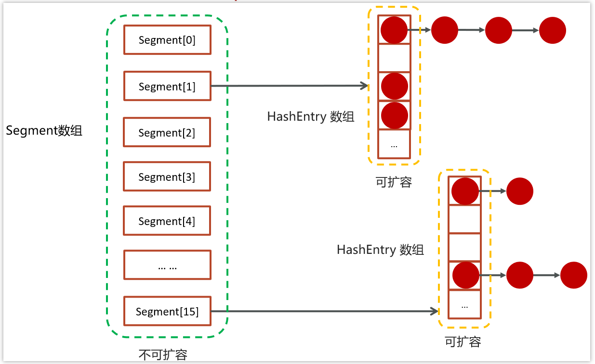
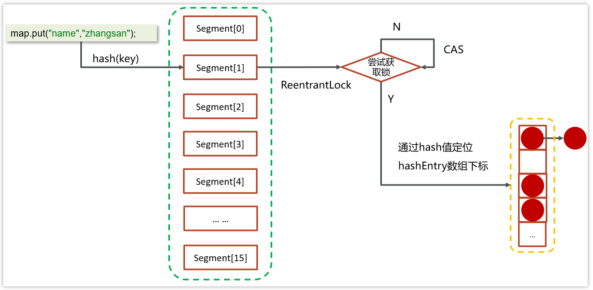
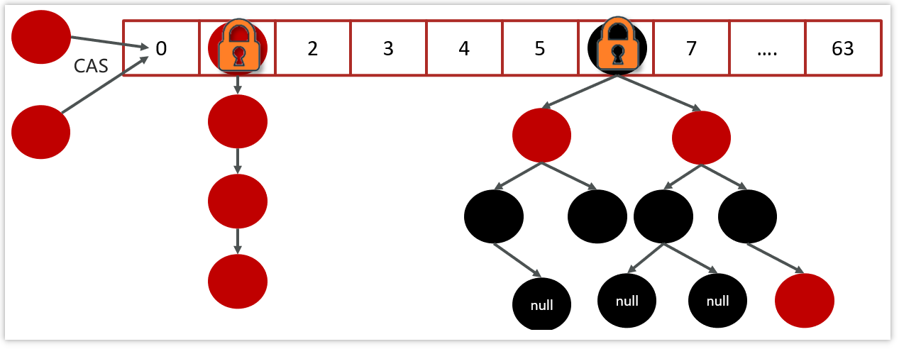
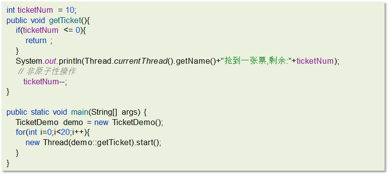
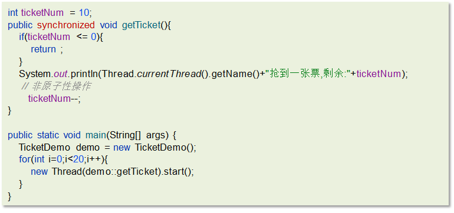
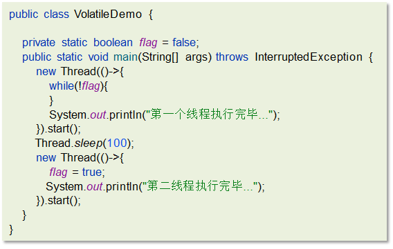
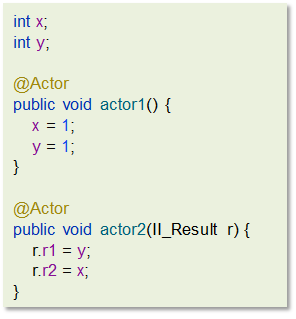

- [1. JDK1.7 中concurrentHashMap](#1-jdk17-中concurrenthashmap)
- [2. （2） JDK1.8中concurrentHashMap](#2-2-jdk18中concurrenthashmap)
  - [2.1. 2.11 导致并发程序出现问题的根本原因是什么](#21-211-导致并发程序出现问题的根本原因是什么)
- [3. （1）原子性](#3-1原子性)
- [4. （3）内存可见性](#4-3内存可见性)
- [5. （3）有序性](#5-3有序性)

---

ConcurrentHashMap 是一种**线程安全**的高效Map集合

底层数据结构：

- JDK1.7：分段的数组+链表实现

- JDK1.8：和HashMap1.8的结构一样，数组+链表/红黑树。

## 1. JDK1.7 中concurrentHashMap

数据结构

>- 提供了一个segment数组，在初始化ConcurrentHashMap 的时候可以指定数组的长度，默认是16，一旦初始化之后中间不可扩容
>- 在每个segment中都可以挂一个HashEntry数组，数组里面可以存储具体的元素，HashEntry数组是可以扩容的
>- 在HashEntry存储的数组中存储的元素，如果发生冲突，则可以挂单向链表

存储流程

- 先去计算key的hash值，然后确定segment数组下标
- 再通过hash值确定hashEntry数组中的下标存储数据
- 在进行操作数据的之前，会先判断当前segment对应下标位置是否有线程进行操作，为了线程安全使用的是ReentrantLock进行加锁，如果获取锁是被会使用cas自旋锁进行尝试

## 2. （2） JDK1.8中concurrentHashMap

在JDK1.8中，放弃了Segment臃肿的设计，数据结构跟HashMap的数据结构是一样的：数组+红黑树+链表

采用 CAS + Synchronized来保证并发安全进行实现

- CAS控制数组节点的添加

- synchronized只锁定当前链表或红黑二叉树的首节点，只要hash不冲突，就不会产生并发的问题 , 效率得到提升

### 2.1. 2.11 导致并发程序出现问题的根本原因是什么

>难易程度：☆☆☆
>
>出现频率：☆☆☆

Java并发编程三大特性

- 原子性

- 可见性

- 有序性

## 3. （1）原子性

一个线程在CPU中操作不可暂停，也不可中断，要不执行完成，要不不执行

比如，如下代码能保证原子性吗？

以上代码会出现超卖或者是一张票卖给同一个人，执行并不是原子性的

解决方案：

1.synchronized：同步加锁

2.JUC里面的lock：加锁

## 4. （3）内存可见性

内存可见性：让一个线程对共享变量的修改对另一个线程可见

比如，以下代码不能保证内存可见性

解决方案：

- synchronized

- volatile（推荐）

- LOCK

## 5. （3）有序性

指令重排：处理器为了提高程序运行效率，可能会对输入代码进行优化，它不保证程序中各个语句的执行先后顺序同代码中的顺序一致，但是它会保证程序最终执行结果和代码顺序执行的结果是一致的

还是之前的例子，如下代码：

解决方案：

- volatile