- [1. 红黑树](#1-红黑树)
    - [1.0.1. 散列表](#101-散列表)
      - [1.0.1.1. 散列表（Hash Table）概述](#1011-散列表hash-table概述)
      - [1.0.1.2. 散列函数和散列冲突](#1012-散列函数和散列冲突)
      - [1.0.1.3. 散列冲突-链表法（拉链）](#1013-散列冲突-链表法拉链)
      - [1.0.1.4. 时间复杂度-散列表](#1014-时间复杂度-散列表)
  - [1.1. hashMap常见属性](#11-hashmap常见属性)
  - [1.2. HashMap的实现原理？](#12-hashmap的实现原理)
  - [1.3. HashMap的jdk1.7和jdk1.8有什么区别](#13-hashmap的jdk17和jdk18有什么区别)
  - [1.4. HashMap的put方法的具体流程吗？](#14-hashmap的put方法的具体流程吗)
  - [1.5. 讲一讲HashMap的扩容机制吗？](#15-讲一讲hashmap的扩容机制吗)
  - [1.6. 通过hash计算后找到数组的下标，是如何找到的呢，你了解hashMap的寻址算法吗？](#16-通过hash计算后找到数组的下标是如何找到的呢你了解hashmap的寻址算法吗)
  - [1.7. 为何HashMap的数组长度一定是2的次幂？](#17-为何hashmap的数组长度一定是2的次幂)
  - [1.8. 为何HashMap的数组长度一定是2的次幂？](#18-为何hashmap的数组长度一定是2的次幂)
  - [1.9. hashmap在1.7情况下的多线程死循环问题吗？](#19-hashmap在17情况下的多线程死循环问题吗)
  - [1.10. hashmap是线程安全的吗？想要使用线程安全的map该怎么做呢？](#110-hashmap是线程安全的吗想要使用线程安全的map该怎么做呢)
  - [1.11. HashSet与HashMap的区别？](#111-hashset与hashmap的区别)
  - [1.12. HashTable与HashMap的区别](#112-hashtable与hashmap的区别)

---
# 1. 红黑树

性质1：节点要么是**红色**,要么是**黑色**

性质2：根节点是**黑色**

性质3：叶子节点都是黑色的空节点

性质4：红黑树中红色节点的子节点都是黑色

性质5：从任一节点到叶子节点的所有路径都包含相同数目的黑色节点

**在添加或删除节点的时候，如果不符合这些性质会发生旋转，以达到所有的性质，保证红黑树的平衡**

（3）红黑树的复杂度

增删查的时间复杂度都为O(log n)

- 添加：
  - 添加先要从根节点开始找到元素添加的位置，时间复杂度O(log n)
  - 添加完成后涉及到复杂度为O(1)的旋转调整操作
  - 故整体复杂度为：O(log n)

- 删除：
  - 首先从根节点开始找到被删除元素的位置，时间复杂度O(log n)
  - 删除完成后涉及到复杂度为O(1)的旋转调整操作
  - 故整体复杂度为：O(log n)

### 1.0.1. 散列表

在HashMap中的最重要的一个数据结构就是散列表，在散列表中又使用到了红黑树和链表

#### 1.0.1.1. 散列表（Hash Table）概述

根据键（Key）直接访问在内存存储位置值（Value）的数据结构

将键(key)映射为数组下标，通过散列函数 hashValue = hash(key)

#### 1.0.1.2. 散列函数和散列冲突

散列函数的基本要求：

- 散列函数计算得到的散列值必须是大于等于0的正整数，因为hashValue需要作为数组的下标。

- 如果key1==key2，那么经过hash后得到的哈希值也必相同即：hash(key1) == hash(key2）

散列冲突(或者哈希冲突，哈希碰撞，**就是指多个key映射到同一个数组下标位置**)


#### 1.0.1.3. 散列冲突-链表法（拉链）

在散列表中，数组的每个下标位置我们可以称之为桶（bucket）或者槽（slot），每个桶(槽)会对应一条链表，所有散列值相同的元素我们都放到相同槽位对应的链表中。

#### 1.0.1.4. 时间复杂度-散列表

1，插入操作，通过散列函数计算出对应的散列槽位，将其插入到对应链表中即可，插入的时间复杂度是 O(1)

2，当查找、删除一个元素时，我们同样通过散列函数计算出对应的槽，然后遍历链表查找或者删除

- 平均情况下基于链表法解决冲突时查询的时间复杂度是O(1)

- 散列表可能会退化为链表,查询的时间复杂度就从 O(1) 退化为 O(n)

- 将链表法中的链表改造为其他高效的动态数据结构，比如红黑树，查询的时间复杂度是 O(logn)

将链表法中的链表改造红黑树还有一个非常重要的原因，可以防止DDos攻击

## 1.1. hashMap常见属性

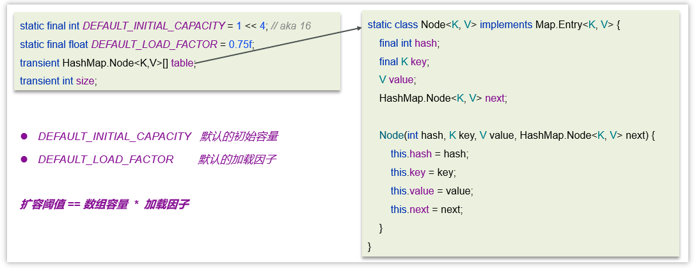

## 1.2. HashMap的实现原理？


1，底层使用hash表数据结构，即数组+（链表 | 红黑树）

2，添加数据时，计算key的值确定元素在数组中的下标。key相同则替换，不同则存入链表或红黑树中

3，获取数据通过key的hash计算数组下标获取元素


## 1.3. HashMap的jdk1.7和jdk1.8有什么区别

JDK1.8之前采用的拉链法，数组+链表，链表是头插法

JDK1.8之后采用数组+链表+红黑树，链表长度大于8且数组长度大于64则会从链表转化为红黑树

- 链表是尾插法
- 在解决哈希冲突时有了较大的变化，当**链表长度大于8并且数组长度达到64**时，将链表转化为红黑树，以减少搜索时间。
- 扩容 resize时，红黑树拆分成的树的结点数小于等于临界值6个，则退化成链表
## 1.4. HashMap的put方法的具体流程吗？

1. 判断键值对数组table是否为空或为null，否则执行resize()进行扩容（初始化）

2. 根据键值key计算hash值得到数组索引

3. 判断table[i]==null，是null则直接新建节点添加

4. 如果table[i]==null , 非null

   4.1 判断table[i]的首个元素是否和key一样，如果相同直接覆盖value

   4.2 判断table[i] 是否为treeNode，即table[i] 是否是红黑树，如果是红黑树，则直接在树中插入键值对

   4.3 遍历table[i]，链表的尾部插入数据。然后判断链表长度是否大于8，大于8的话把链表转换为红黑树，在红黑树中执行插入操作，遍历过程中若发现key已经存在直接覆盖value

5. 插入成功后，判断实际存在的键值对数量size是否超多了最大容量threshold（数组长度*0.75），如果超过，进行扩容。


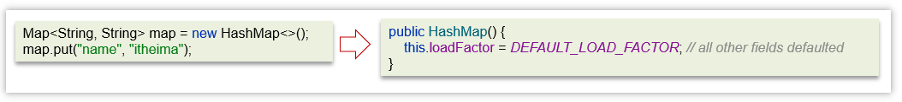

- HashMap是懒惰加载，在创建对象时并没有初始化数组

- 在无参的构造函数中，设置了默认的加载因子是0.75

添加数据流程图

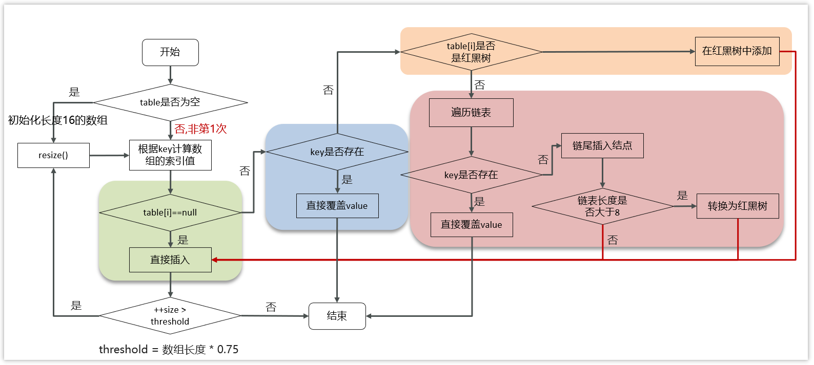

具体的源码：

```java
public V put(K key, V value) {
    return putVal(hash(key), key, value, false, true);
}

final V putVal(int hash, K key, V value, boolean onlyIfAbsent,
                   boolean evict) {
    Node<K,V>[] tab; Node<K,V> p; int n, i;
    //判断数组是否未初始化
    if ((tab = table) == null || (n = tab.length) == 0)
        //如果未初始化，调用resize方法 进行初始化
        n = (tab = resize()).length;
    //通过 & 运算求出该数据（key）的数组下标并判断该下标位置是否有数据
    if ((p = tab[i = (n - 1) & hash]) == null)
        //如果没有，直接将数据放在该下标位置
        tab[i] = newNode(hash, key, value, null);
    //该数组下标有数据的情况
    else {
        Node<K,V> e; K k;
        //判断该位置数据的key和新来的数据是否一样
        if (p.hash == hash &&
            ((k = p.key) == key || (key != null && key.equals(k))))
            //如果一样，证明为修改操作，该节点的数据赋值给e,后边会用到
            e = p;
        //判断是不是红黑树
        else if (p instanceof TreeNode)
            //如果是红黑树的话，进行红黑树的操作
            e = ((TreeNode<K,V>)p).putTreeVal(this, tab, hash, key, value);
        //新数据和当前数组既不相同，也不是红黑树节点，证明是链表
        else {
            //遍历链表
            for (int binCount = 0; ; ++binCount) {
                //判断next节点，如果为空的话，证明遍历到链表尾部了
                if ((e = p.next) == null) {
                    //把新值放入链表尾部
                    p.next = newNode(hash, key, value, null);
                    //因为新插入了一条数据，所以判断链表长度是不是大于等于8
                    if (binCount >= TREEIFY_THRESHOLD - 1) // -1 for 1st
                        //如果是，进行转换红黑树操作
                        treeifyBin(tab, hash);
                    break;
                }
                //判断链表当中有数据相同的值，如果一样，证明为修改操作
                if (e.hash == hash &&
                    ((k = e.key) == key || (key != null && key.equals(k))))
                    break;
                //把下一个节点赋值为当前节点
                p = e;
            }
        }
        //判断e是否为空（e值为修改操作存放原数据的变量）
        if (e != null) { // existing mapping for key
            //不为空的话证明是修改操作，取出老值
            V oldValue = e.value;
            //一定会执行  onlyIfAbsent传进来的是false
            if (!onlyIfAbsent || oldValue == null)
                //将新值赋值当前节点
                e.value = value;
            afterNodeAccess(e);
            //返回老值
            return oldValue;
        }
    }
    //计数器，计算当前节点的修改次数
    ++modCount;
    //当前数组中的数据数量如果大于扩容阈值
    if (++size > threshold)
        //进行扩容操作
        resize();
    //空方法
    afterNodeInsertion(evict);
    //添加操作时 返回空值
    return null;
}
```


## 1.5. 讲一讲HashMap的扩容机制吗？

- 在添加元素或初始化的时候需要调用resize方法进行扩容，第一次添加数据初始化数组长度为16，以后每次每次扩容都是达到了扩容阈值（数组长度 * 0.75）

- 每次扩容的时候，都是扩容之前容量的2倍； 

- 扩容之后，会新创建一个数组，需要把老数组中的数据挪动到新的数组中
  - 没有hash冲突的节点，则直接使用 e.hash & (newCap - 1) 计算新数组的索引位置
  - 如果是红黑树，走红黑树的添加
  - 如果是链表，则需要遍历链表，可能需要拆分链表，判断(e.hash & oldCap)是否为0，该元素的位置要么停留在原始位置，要么移动到原始位置+增加的数组大小这个位置上

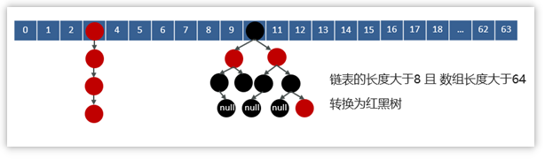

扩容的流程：

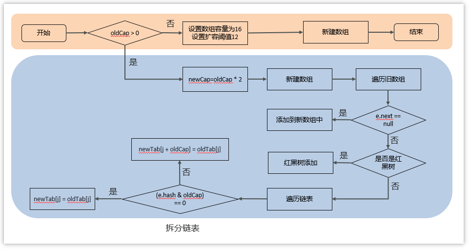

源码：

```java
//扩容、初始化数组
final Node<K,V>[] resize() {
        Node<K,V>[] oldTab = table;
    	//如果当前数组为null的时候，把oldCap老数组容量设置为0
        int oldCap = (oldTab == null) ? 0 : oldTab.length;
        //老的扩容阈值
    	int oldThr = threshold;
        int newCap, newThr = 0;
        //判断数组容量是否大于0，大于0说明数组已经初始化
    	if (oldCap > 0) {
            //判断当前数组长度是否大于最大数组长度
            if (oldCap >= MAXIMUM_CAPACITY) {
                //如果是，将扩容阈值直接设置为int类型的最大数值并直接返回
                threshold = Integer.MAX_VALUE;
                return oldTab;
            }
            //如果在最大长度范围内，则需要扩容  OldCap << 1等价于oldCap*2
            //运算过后判断是不是最大值并且oldCap需要大于16
            else if ((newCap = oldCap << 1) < MAXIMUM_CAPACITY &&
                     oldCap >= DEFAULT_INITIAL_CAPACITY)
                newThr = oldThr << 1; // double threshold  等价于oldThr*2
        }
    	//如果oldCap<0，但是已经初始化了，像把元素删除完之后的情况，那么它的临界值肯定还存在，       			如果是首次初始化，它的临界值则为0
        else if (oldThr > 0) // initial capacity was placed in threshold
            newCap = oldThr;
        //数组未初始化的情况，将阈值和扩容因子都设置为默认值
    	else {               // zero initial threshold signifies using defaults
            newCap = DEFAULT_INITIAL_CAPACITY;
            newThr = (int)(DEFAULT_LOAD_FACTOR * DEFAULT_INITIAL_CAPACITY);
        }
    	//初始化容量小于16的时候，扩容阈值是没有赋值的
        if (newThr == 0) {
            //创建阈值
            float ft = (float)newCap * loadFactor;
            //判断新容量和新阈值是否大于最大容量
            newThr = (newCap < MAXIMUM_CAPACITY && ft < (float)MAXIMUM_CAPACITY ?
                      (int)ft : Integer.MAX_VALUE);
        }
    	//计算出来的阈值赋值
        threshold = newThr;
        @SuppressWarnings({"rawtypes","unchecked"})
        //根据上边计算得出的容量 创建新的数组       
    	Node<K,V>[] newTab = (Node<K,V>[])new Node[newCap];
    	//赋值
    	table = newTab;
    	//扩容操作，判断不为空证明不是初始化数组
        if (oldTab != null) {
            //遍历数组
            for (int j = 0; j < oldCap; ++j) {
                Node<K,V> e;
                //判断当前下标为j的数组如果不为空的话赋值个e，进行下一步操作
                if ((e = oldTab[j]) != null) {
                    //将数组位置置空
                    oldTab[j] = null;
                    //判断是否有下个节点
                    if (e.next == null)
                        //如果没有，就重新计算在新数组中的下标并放进去
                        newTab[e.hash & (newCap - 1)] = e;
                   	//有下个节点的情况，并且判断是否已经树化
                    else if (e instanceof TreeNode)
                        //进行红黑树的操作
                        ((TreeNode<K,V>)e).split(this, newTab, j, oldCap);
                    //有下个节点的情况，并且没有树化（链表形式）
                    else {
                        //比如老数组容量是16，那下标就为0-15
                        //扩容操作*2，容量就变为32，下标为0-31
                        //低位：0-15，高位16-31
                        //定义了四个变量
                        //        低位头          低位尾
                        Node<K,V> loHead = null, loTail = null;
                        //        高位头		   高位尾
                        Node<K,V> hiHead = null, hiTail = null;
                        //下个节点
                        Node<K,V> next;
                        //循环遍历
                        do {
                            //取出next节点
                            next = e.next;
                            //通过 与操作 计算得出结果为0
                            if ((e.hash & oldCap) == 0) {
                                //如果低位尾为null，证明当前数组位置为空，没有任何数据
                                if (loTail == null)
                                    //将e值放入低位头
                                    loHead = e;
                                //低位尾不为null，证明已经有数据了
                                else
                                    //将数据放入next节点
                                    loTail.next = e;
                                //记录低位尾数据
                                loTail = e;
                            }
                            //通过 与操作 计算得出结果不为0
                            else {
                                 //如果高位尾为null，证明当前数组位置为空，没有任何数据
                                if (hiTail == null)
                                    //将e值放入高位头
                                    hiHead = e;
                                //高位尾不为null，证明已经有数据了
                                else
                                    //将数据放入next节点
                                    hiTail.next = e;
                               //记录高位尾数据
                               	hiTail = e;
                            }
                            
                        } 
                        //如果e不为空，证明没有到链表尾部，继续执行循环
                        while ((e = next) != null);
                        //低位尾如果记录的有数据，是链表
                        if (loTail != null) {
                            //将下一个元素置空
                            loTail.next = null;
                            //将低位头放入新数组的原下标位置
                            newTab[j] = loHead;
                        }
                        //高位尾如果记录的有数据，是链表
                        if (hiTail != null) {
                            //将下一个元素置空
                            hiTail.next = null;
                            //将高位头放入新数组的(原下标+原数组容量)位置
                            newTab[j + oldCap] = hiHead;
                        }
                    }
                }
            }
        }
    	//返回新的数组对象
        return newTab;
    }
```
## 1.6. 通过hash计算后找到数组的下标，是如何找到的呢，你了解hashMap的寻址算法吗？
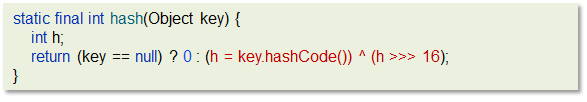

- key是null，hash值就是0
- 非null。首先计算出key的hashCode值， 然后通过这个hash值**右移16位按位异或**，得到最后的hash值。主要作用就是使原来的hash值更加均匀，减少hash冲突


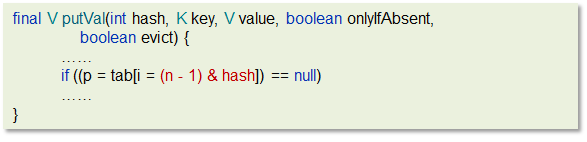

在putValue的方法中，计算数组下标，没有直接采用取模的方式，而是使用了`hash &(数组长度-1)`。

## 1.7. 为何HashMap的数组长度一定是2的次幂？

1.  计算索引时效率更高：如果是 2 的 n 次幂可以使用位与运算代替取模`hash &(数组长度-1)`

2.  扩容时重新计算索引效率更高： hash & oldCap == 0 的元素留在原来位置 ，否则新位置 = 旧位置 + oldCap

## 1.8. 为何HashMap的数组长度一定是2的次幂？
- 计算索引时效率更高：如果是 2 的 n 次幂可以使用位与运算代替取模
- 扩容时重新计算索引效率更高：在进行扩容是会进行判断 hash值按位与运算旧数组长租是否 == 0。如果等于0，则把元素留在原来位置 ，否则新位置是等于旧位置的下标+旧数组长度


## 1.9. hashmap在1.7情况下的多线程死循环问题吗？

jdk7的的数据结构是：数组+链表。在数组进行扩容的时候，因为链表是**头插法**，在进行数据迁移的过程中，有可能导致死循环

比如说，现在有两个线程

线程一：**读取**到当前的hashmap数据，数据中一个链表，在准备扩容时，线程二介入

线程二也读取hashmap，直接进行扩容。因为是头插法，链表的顺序会进行颠倒过来。比如原来的顺序是AB，扩容后的顺序是BA，线程二执行结束。

当线程一再继续执行的时候就会出现死循环的问题。

线程一先将A移入新的链表，再将B插入到链头，由于另外一个线程的原因，B的next指向了A，所以B->A->B,形成循环。

所以，JDK 8 将扩容算法做了调整，不再将元素加入链表头（而是保持与扩容前一样的顺序），**尾插法**，就避免了jdk7中死循环的问题。


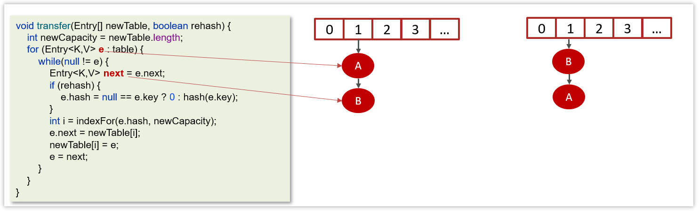

- 变量e指向的是需要迁移的对象

- 变量next指向的是下一个需要迁移的对象

- Jdk1.7中的链表采用的头插法

- 在数据迁移的过程中并没有新的对象产生，只是改变了对象的引用


产生死循环的过程：

线程1和线程2的变量e和next都引用了这个两个节点

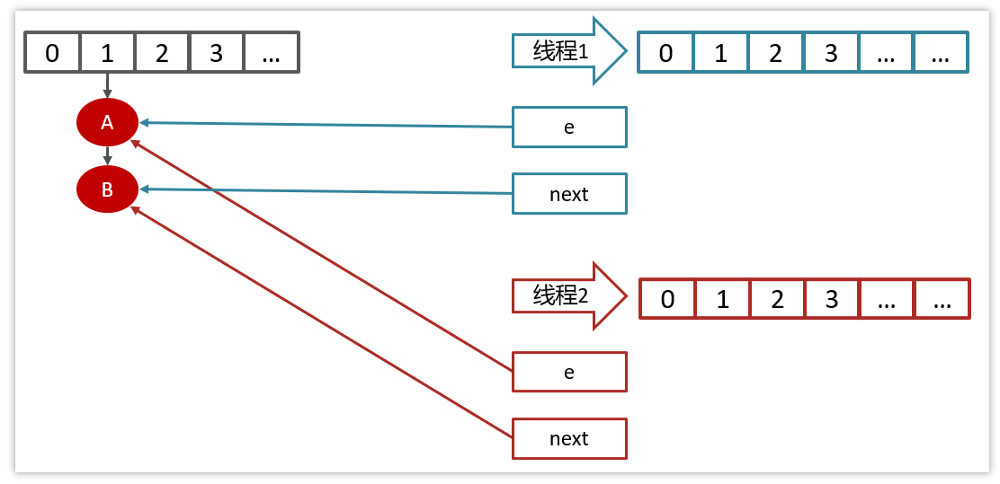

线程2扩容后，由于头插法，链表顺序颠倒，但是线程1的临时变量e和next还引用了这两个节点

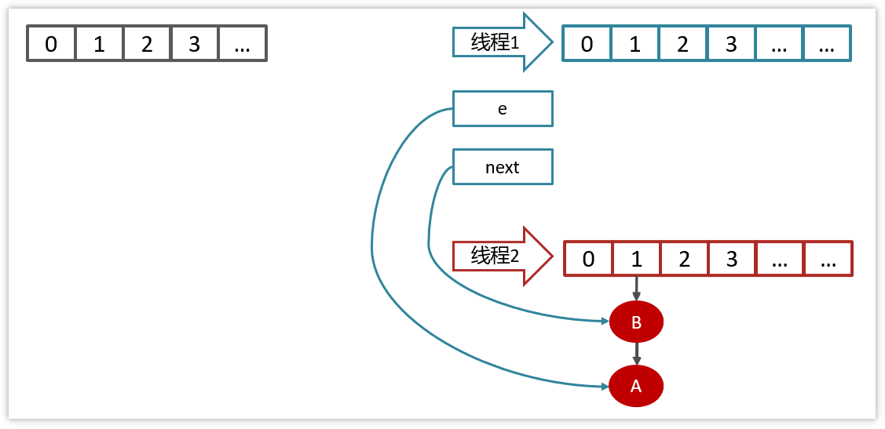

第一次循环

由于线程2迁移的时候，已经把B的next执行了A

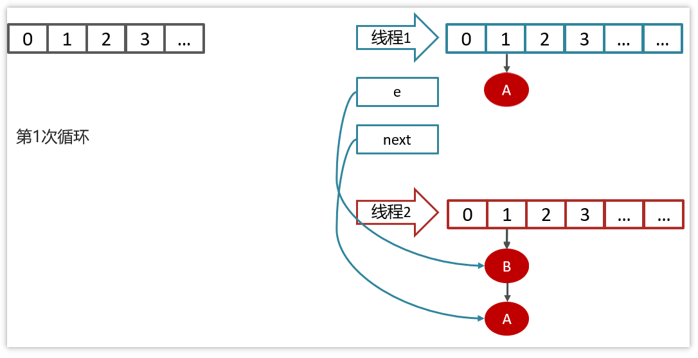

第二次循环

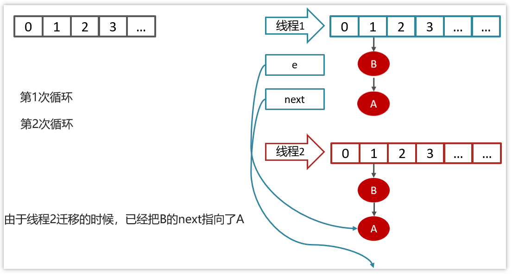

第三次循环

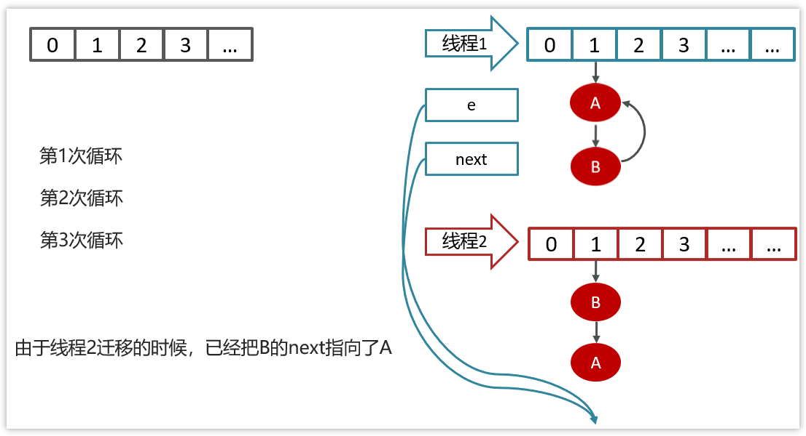

## 1.10. hashmap是线程安全的吗？想要使用线程安全的map该怎么做呢？

不是线程安全的

可以采用ConcurrentHashMap进行使用，它是一个线程安全的HashMap

## 1.11. HashSet与HashMap的区别？

HashSet实现了Set接口, 仅存储对象; HashMap实现了 Map接口, 存储的是键值对.

HashSet底层其实是用HashMap实现存储的。

- 依靠HashMap来存储元素值，(利用hashMap的key键进行存储)，而value值默认为Object对象. 
- HashSet也不允许出现重复值，判断标准和HashMap断标准相同，两个元素的hashCode相等并且通过equals()方法返回true.

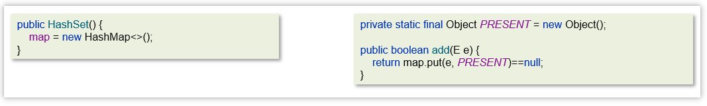


## 1.12. HashTable与HashMap的区别

| **区别**       | **HashTable**                  | **HashMap**      |
| -------------- | ------------------------------ | ---------------- |
| 数据结构       | 数组+链表                      | 数组+链表+红黑树 |
| 是否可以为null | Key和value都不能为null         | 可以为null       |
| hash算法       | key的hashCode()                | 二次hash         |
| 扩容方式       | 当前容量翻倍 +1                | 当前容量翻倍     |
| 线程安全       | 同步(synchronized)的，线程安全 | 非线程安全       |

在实际开中不建议使用HashTable，在多线程环境下可以使用ConcurrentHashMap类