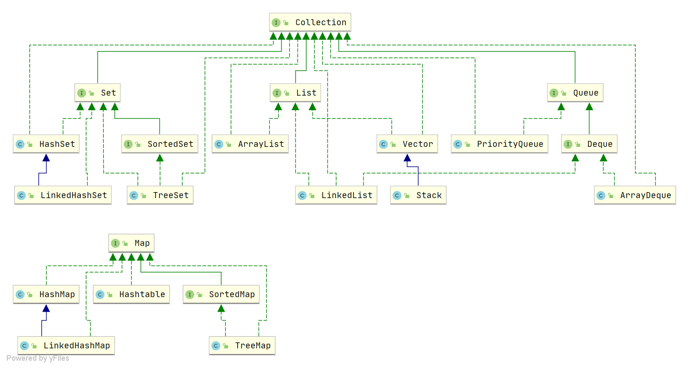

---

## Java 集合

Java 集合，也叫作容器。

主要是由两大接口派生而来：一个是 Collection接口，主要用于存放单一元素；另一个是 Map 接口，主要用于存放键值对。

对于Collection 接口，下面又有三个主要的子接口：List、Set 和 Queue。

## 说说 List, Set, Queue, Map 四个接口的区别？

-   `List`(顺序): 存储的元素是有序的、可重复的。
-   `Set`(不重复): 存储的元素不可重复的。
-   `Queue`(队列): 按队列规则来确定先后顺序，存储的元素是有序的、可重复的。
-   `Map`(键值对): 使用键值对（key-value）存储，key 是无序的、不可重复的，value 是无序的、可重复的，每个键最多映射到一个值。
-   

## List集合有哪些实现类
## ArrayList底层实现机制，有哪些特性，线程是否安全，初始化大小，

## HashSet、HashMap、HashTable
HashSet内部就是调用HashMap

HashMap 1.8 头插→尾插。头插在多线程会死循环。
HashTable 头插，

## HashMap的key的hash值计算，与HashTable的区别

HashMap的key的hash值：`key.hashCode()`高低位相互异或（无符号右移16位后再与自身异或，高位和0异或还是自身）。基于容量是2^n的前提，因为容量是2^n时，数字对容量取余时，低位容易冲突，所以加入高位的信息。

HashMap容量是2^n，按位与来取槽；HashTable初始容量是质数11，只能取余操作来取槽。前者取按位与运算快的优点，分散性不好。后者，取余运算慢，但分散性好。

## HashMap万级数据的链表长度为6，那为什么还要转化红黑树

转化红黑树：兜底策略。正常情况下分散均匀，链表长度小；但恶意攻击数据，让链表异常增长。