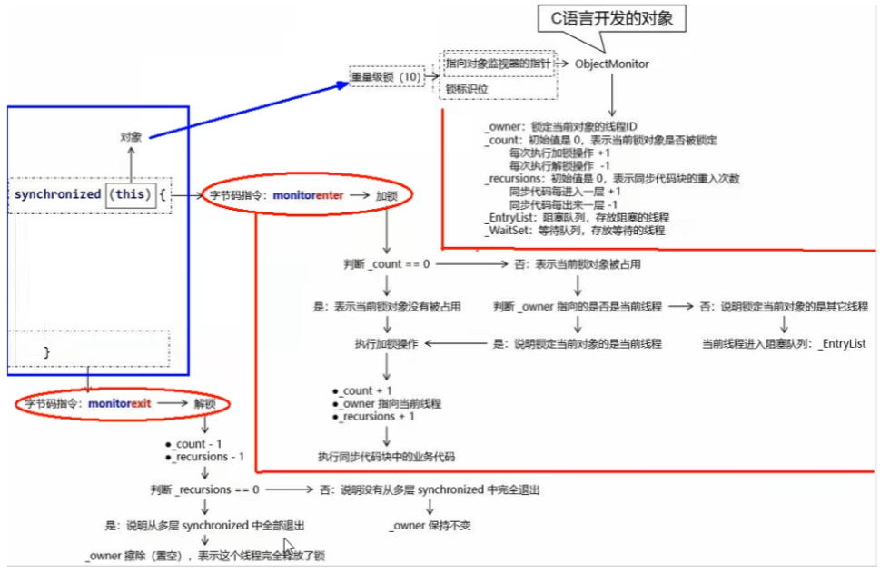

## 介绍下公平锁和非公平锁

- 公平锁：按照多个线程的申请锁的顺序来获取锁。
- 非公平锁：不按照申请锁的顺序，有可能后申请的线程比先申请的线程优先获取锁。在高并发环境下，有可能造成优先级反转、饥饿的状态

PS：默认非公平锁、适用场景

## 为什么会有公平锁/非公平锁的设计？为什么默认非公平锁

- 线程切换有开销。
    
    采用公平锁自然会在多个不同的线程之间切换，而采用非公平锁，很可能是同一个线程释放锁再获取锁，从而减少了线程切换的开销。

- 充分地利用CPU的时间片

    同时，恢复挂起的线程到真正锁的获取存在时间差，非公平锁能更充分地利用CPU的时间片，尽量减少CPU空间状态时间。

## 什么时候用公平？什么时候用非公平？

- 为了更高的吞吐量，选择非公平锁。因为节省了很多线程切换的时间，吞吐量自然就上去了
- 为了防止优先级反转、饥饿，选择公平锁。

## 可重入锁是什么

同一线程在外层获取到锁后，在内层仍然可以获取锁，并不会因为外层获取而不释放锁而陷入死锁。可重复、可递归调用

同一线程中的多个流程可以获取同一把锁，持有这把同步锁可以再次进入，自己可以获取自己的内部锁。

## 有哪些可重入锁

- 隐式锁：synchronized修饰的方法或者代码块
- 显式锁（即Lock）：ReentrantLock

## 可重入锁的重入原理

每个锁对象`ObjectMonitor`拥有一个指向该锁的线程的指针`_owner`、一个锁计数器`_count`、一个锁重入次数`_recursions`。

当执行monitorenter加锁指令时，根据**锁计数器**判断锁对象是否被线程占用。
- 如果锁计数器为0，则直接占用，JVM会将锁对象的持有线程设为当前线程，执行加锁操作（计数器+1，锁重入次数+1）.
- 如果锁计数器不为0，那么就要判断持有线程是不是当前线程。如果是，执行加锁操作；如果不是，那么将当前线程放入阻塞队列，等待至锁被释放。
  
当执行monitorexit解锁指令时，执行解锁操作（锁计数器-1、锁重入次数-1），并根据锁重入次数判断当前线程是否被释放：
- 如果锁重入次数为0，则说明从多层重入中全部退出，置空`_onwer`，释放锁。
- 如果锁重入次数不为0，则说明还处于多层重入中，继续持有锁对象。

synchronized锁会自动获取释放锁，而ReentrantLock锁则需要注意释放`lock.unlock()`，否则其他线程无法获取到该锁。

PS：为什么需要一个锁计数器`_count`、一个锁重入次数`_recursions`？ReentrantLock锁则需要注意释放`lock.unlock()`，否则锁重入次数不为0，还是锁的计数器不为0？

## 死锁

死锁是指两个或两个以上的线程在执行过程中，因抢夺资源而造成的一种**互相等待**的现象，若无外力干涉，则它们无法再继续推进下去。

产生原因：
- 系统资源不足
- 进程运行推进顺序不合适 
- 系统资源分配不当

怎么排查：
- jstack: `jps -l`获进程号，`jstack 进程号`
- jconsole

## 乐观锁和悲观锁之间的区别

## 乐观锁和悲观锁的适用场景

乐观锁读多，悲观锁写多

## JMM
JMM（Java内存模型Java Memory Model）本身是一种抽象概念，描述的是一组约定或规范，通过这组规范定义了程序中（尤其是多线程）各个变量的读写访问方式、决定一个线程对共享变量的写入、如何变成对另一个线程可见。

1. JMM规定了所有的共享变量都存储在主内存中。
2. 每个线程都有自己的工作内存，保存了该线程使用到的变量的主内存副本拷贝。
3. 线程对变量的所有操作（读取、赋值等）都必须在线程自己的工作内存中进行，而不能够直接写入主内存中的变量
4. 不同线程之间也无法直接访问对方工作内存中的变量，线程间变量值的传递均需要通过主内存来完成

## JVM的作用
- 通过JMM来实现线程和主内存之间的抽象关系
- 屏蔽各个硬件平台和操作系统的内存访问差异，来实现让Java程序再各种平台下都能达到一致性的内存访问效果。
## JMM规范下三大特性

原子性、可见性和有序性。

- 原子性：指一个操作是不可被打断的，即多线程环境下，操作不能被其他线程干扰
- 可见性：当一个线程修改了某一个共享变量的值，其他线程是否能够立即知道该变更。
- 有序性（禁重排）：为了提升性能，**编译器和处理器**通常会对指令序列进行重新排序。重排序后的指令不能改变原有的串行语义。不存在数据依赖关系，可以重排序；存在数据依赖关系，禁止重排序。
## volatile

volatile实现了JMM中的可见性和有序性，但无法保证原子性（还需要锁）。

volatile的写内存语义是写完后立即刷新回主内存，读的内存语义是直接从主内存中读取。

可见性和有序性是通过内存屏障保证。

## 内存屏障

写、内存屏障、读：
- 内存屏障之前的所有写操作都要回写到主内存
- 内存屏障之后的所有读操作都能获得内存屏障之前的所有写操作的最新结果（实现了可见性）

不允许把内存屏障之后的指令重排序到内存屏障之前

读屏障(Load Memory Barrier)：（约束将来）读屏障之后的读操作，会让工作内存或CPU高速缓存当中的缓存数据失效，需要重新回到主内存中获取最新数据。这样保证读屏障后面的读操作一定能够读取到最新的数据。

写屏障（Store Barrier）：（约束过去）写屏障之前的写操作，将所有在缓冲中的数据刷回到主内存中。